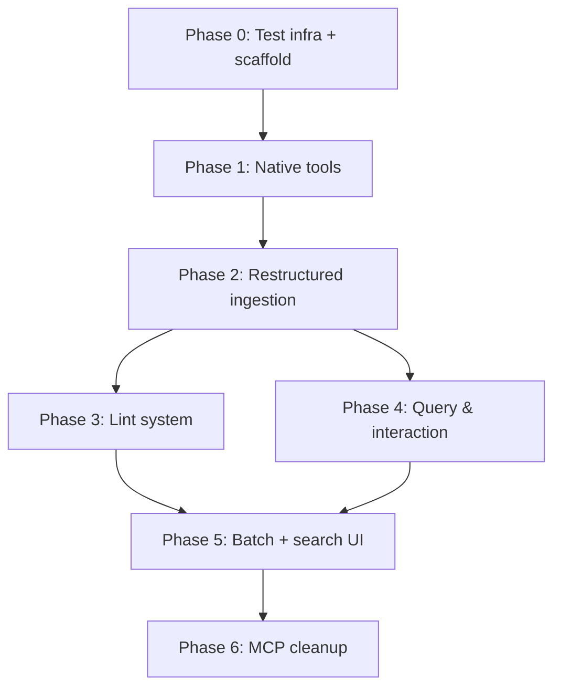

# Implementation Plan: Programmatic Wiki Maintenance

> **Decisions locked in:** Sync core (sqlite3), mock LLM for tests, defer MCP deletion, fresh wiki structure, separate git repo for WIKI_PATH, latest PydanticAI.

---

## Phase 0: Test Infrastructure & Module Scaffold

### 0.1 — Create `FakeLLMClient` and test workspace fixture

**Create:** `tests/helpers/fake_llm.py`
- A `FakeLLMClient` class with a `.chat.completions.create()` method matching the OpenAI interface
- Returns deterministic canned markdown responses (a summary and a list of concepts as JSON)
- Configurable: can set what concepts/summary it returns per test

**Create:** `tests/helpers/workspace.py`
- A `tmp_workspace(tmp_path)` pytest fixture that:
  - Creates the full directory tree: `sources/`, `wiki/summaries/`, `wiki/concepts/`, `wiki/schema.md`, `wiki/index.md`, `wiki/overview.md`, `wiki/log.md`
  - Initializes the DB via `open_db()`
  - Inserts a workspace row
  - Returns a `WorkspaceFixture` dataclass with `workspace: Path`, `db_path: str`, `llm: FakeLLMClient`

**Create:** `tests/conftest_new.py` (or update `conftest.py`)
- Wire up `sys.path` for `api_new/` only (drop old `api/` path)
- Register the fixtures

**Test:** `pytest tests/helpers/test_fixtures.py`
- Assert fixture creates all expected directories and files
- Assert `open_db()` succeeds and workspace row exists

---

### 0.2 — Create native tools module structure

**Create directory:** `api_new/domain/tools/`
```
api_new/domain/tools/
├── __init__.py
├── db.py          # open_db, get_connection, shared DB helpers
├── wiki_fs.py     # read_page, create_page, append_to_page, delete_page (filesystem + DB)
├── search.py      # search_chunks (FTS5), search_wiki_pages
└── references.py  # update_references, get_backlinks, find_orphans, find_uncited
```

**`db.py`**: Extract `open_db()` from `pipeline.py` into this shared module. Both `pipeline.py` and the tools import from here. Add a `get_connection(db_path) -> sqlite3.Connection` context manager.

**Test:** `pytest tests/unit/test_db.py`
- `open_db()` creates DB, applies schema, migration is idempotent
- `get_connection()` context manager opens and closes cleanly

---

## Phase 1: Native Tools (Dev Plan Step 1)

### 1.1 — `wiki_fs.create_page()`

**Create:** `api_new/domain/tools/wiki_fs.py`

```python
def create_page(
    db_path: str, workspace: Path,
    dir_path: str,       # e.g. "/wiki/summaries/" or "/wiki/concepts/"
    slug: str,           # e.g. "q2-report" or "federal-reserve"
    title: str,
    content: str,
    tags: list[str],
    overwrite: bool = False,
) -> dict:
    """Create a wiki page on disk + in DB. Returns {"id": ..., "path": ...}."""
```

Logic (migrated from `mcp/tools/write.py` `WriteHandler.create`, converted to sync `sqlite3`):
- Write `{workspace}/{dir_path}/{slug}.md` to disk
- Parse YAML frontmatter for date/metadata
- INSERT or UPDATE in `documents` table
- Return doc dict

**Test:** `tests/unit/test_wiki_fs.py::test_create_page`
- Create a page, assert file exists on disk, assert DB row with correct `source_kind='wiki'`
- Attempt duplicate without `overwrite=True` → error
- Duplicate with `overwrite=True` → success, version incremented

---

### 1.2 — `wiki_fs.read_page()` and `wiki_fs.append_to_page()`

```python
def read_page(db_path: str, workspace: Path, dir_path: str, slug: str) -> str | None:
    """Read a wiki page from disk. Returns markdown content or None."""

def append_to_page(db_path: str, workspace: Path, dir_path: str, slug: str, content: str) -> bool:
    """Append content to an existing wiki page (disk + DB)."""
```

**Test:** `tests/unit/test_wiki_fs.py::test_read_and_append`
- Create page → read it → append → read again → verify content includes appended text
- Read non-existent page → returns None

---

### 1.3 — `search.search_chunks()` (sync FTS5)

**Create:** `api_new/domain/tools/search.py`

```python
def search_chunks(
    db_path: str, query: str, limit: int = 10,
    scope: str = "all",  # "all" | "wiki" | "sources"
) -> list[dict]:
    """FTS5 full-text search. Returns list of {content, page, filename, score, ...}."""
```

Migrated from `mcp/tools/search.py` `SearchHandler.search_chunks` + `mcp/vaultfs/sqlite.py` `search_chunks`, but sync.

**Test:** `tests/unit/test_search.py`
- Ingest a test doc (insert chunks manually into DB), search for a known term → results returned
- Search with `scope="wiki"` → only wiki chunks
- Search for nonexistent term → empty list

---

### 1.4 — `references.py` (sync citation graph)

**Create:** `api_new/domain/tools/references.py`

```python
def update_references(db_path: str, document_id: str, content: str, doc_path: str) -> None:
    """Parse citations/wikilinks from content, rebuild reference edges."""

def get_backlinks(db_path: str, doc_id: str) -> list[dict]:
def get_forward_refs(db_path: str, doc_id: str) -> list[dict]:
def find_orphan_pages(db_path: str) -> list[dict]:
def find_uncited_sources(db_path: str) -> list[dict]:
def find_stale_pages(db_path: str) -> list[dict]:
```

Migrated from `mcp/tools/references.py` + `mcp/vaultfs/sqlite.py`, converted to sync.

**Test:** `tests/unit/test_references.py`
- Create two wiki pages where page A cites source X → verify `document_references` edge exists
- Create orphan page (no links) → `find_orphan_pages()` returns it
- `find_uncited_sources()` returns sources not cited by any wiki page

---

### 1.5 — `wiki/schema.md` initial draft

**Create:** Template file at `api_new/domain/tools/templates/schema_template.md`

Content (I'll draft this — conventions derived from codebase):
- Slug naming rules
- YAML frontmatter schema for concept pages
- Page structure templates (summary vs concept)
- Ingest/query/lint workflow descriptions
- Cross-reference conventions

The pipeline will copy this to `WIKI_PATH/wiki/schema.md` on first init if it doesn't exist.

**Test:** `tests/unit/test_schema.py`
- Init a fresh workspace → `wiki/schema.md` exists with expected sections
- Init again → file not overwritten

---

### 1.6 — Verification: full round-trip

**Test:** `tests/integration/test_native_tools_roundtrip.py`
- Using `FakeLLMClient` + `tmp_workspace`:
  1. `create_page()` a summary page
  2. `create_page()` a concept page
  3. `search_chunks()` finds content from both
  4. `append_to_page()` to the concept page
  5. `read_page()` returns updated content
  6. `update_references()` creates citation edges
  7. `get_backlinks()` returns expected results

This test serves as the **regression baseline** for all subsequent phases.

---

## Phase 2: Restructured Ingestion Pipeline (Dev Plan Steps 2–4)

### 2.1 — Restructure wiki output paths

**Modify:** `api_new/domain/ingestion/pipeline.py`

Change wiki page output from `wiki/{slug}.md` to `wiki/summaries/{slug}.md`:
- Update `wiki_relative` from `f"wiki/{slug}.md"` to `f"wiki/summaries/{slug}.md"`
- Update `wiki_dir` from `workspace / "wiki"` to `workspace / "wiki" / "summaries"`
- Ensure `wiki/summaries/` is created in `ingest_file()`

**Test:** `tests/integration/test_pipeline_restructured.py`
- Ingest a test PDF → verify file lands at `wiki/summaries/{slug}.md` (not `wiki/{slug}.md`)
- Verify DB `relative_path` matches the new path
- Verify DB `path` is `wiki/summaries/`

---

### 2.2 — Programmatic logging (`log.md`)

**Modify:** `api_new/domain/ingestion/pipeline.py`

After successful ingestion (line ~283), call:
```python
from domain.tools.wiki_fs import append_to_page
append_to_page(db_path, workspace, "/wiki/", "log",
    f"## [{datetime.now().strftime('%Y-%m-%d %H:%M')}] Ingested | {file_path.name}")
```

Ensure `wiki/log.md` is initialized with a header on first workspace setup.

**Test:** `tests/integration/test_logging.py`
- Ingest a document → read `wiki/log.md` → contains `## [date] Ingested | filename.pdf`
- Ingest a second document → log has two entries (append, not overwrite)
- Verify entries are parseable with `grep "^## \[" log.md`

---

### 2.3 — `index.md` maintenance (structured catalog)

**Create:** `api_new/domain/ingestion/index_manager.py`

```python
def update_index(db_path: str, workspace: Path,
                 new_page_path: str, one_line_summary: str, category: str) -> None:
    """Add/update an entry in wiki/index.md under the appropriate category heading."""
```

This is **deterministic** (no LLM). It reads `index.md`, finds the `## Summaries` or `## Concepts` section, adds/updates a line like:
```
- [Q2 Report](summaries/q2-report.md) — Financial results for Q2 2024 (2 sources, added 2026-05-18)
```

**Modify:** `pipeline.py` — call `update_index()` after writing the summary page.

**Test:** `tests/unit/test_index_manager.py`
- Start with empty index → add summary entry → verify section and link
- Add concept entry → verify it goes under `## Concepts`
- Update existing entry → verify it's replaced, not duplicated

---

### 2.4 — `overview.md` maintenance (narrative synthesis)

**Add to:** `api_new/domain/ingestion/wiki_generator.py`

```python
def update_overview(
    current_overview: str, new_summary: str,
    all_concept_names: list[str],
    client, model: str,
) -> str:
    """LLM rewrites the narrative overview incorporating the new knowledge."""
```

**Modify:** `pipeline.py` — after writing summary + updating index, call `update_overview()` and write result to `wiki/overview.md`.

**Test:** `tests/integration/test_overview.py`
- Ingest doc about "Quantum Computing" (FakeLLM returns a summary mentioning it)
- FakeLLM's overview rewrite includes "Quantum Computing"
- Verify `wiki/overview.md` contains the term

---

### 2.5 — PydanticAI structured extraction (JSON entity extraction)

**Modify:** `api_new/domain/ingestion/wiki_generator.py`

Replace the single-pass `build_wiki_page()` with a two-phase approach:

```python
@dataclass
class ExtractedConcept:
    name: str
    category: str  # "entity" | "instrument" | "theme"
    insight: str   # The specific new insight from this document

@dataclass
class ExtractionResult:
    document_summary: str
    concepts: list[ExtractedConcept]

def extract_structured(doc_meta: dict, page_contents: list, client, model: str) -> ExtractionResult:
    """Phase 1: Extract summary + concepts as structured JSON."""

def build_summary_page(doc_meta: dict, extraction: ExtractionResult) -> str:
    """Phase 2: Build the summary markdown page."""

def build_concept_page(concept: ExtractedConcept, existing_content: str | None, client, model: str) -> str:
    """Phase 3: Build or update a concept page with YAML frontmatter."""
```

Use PydanticAI `Agent` with `result_type=ExtractionResult` for structured output.

**Test:** `tests/unit/test_structured_extraction.py`
- FakeLLM returns valid JSON matching `ExtractionResult` schema
- `build_summary_page()` produces markdown with correct sections
- `build_concept_page()` with `existing_content=None` → new page with YAML frontmatter
- `build_concept_page()` with existing content → merged page

---

### 2.6 — Concept synthesis in the pipeline

**Modify:** `pipeline.py`

Replace the current "Step 6: Generate wiki page" block with:
1. Call `extract_structured()` → get `ExtractionResult`
2. Call `build_summary_page()` → write to `wiki/summaries/{slug}.md`
3. For each concept in `extraction.concepts`:
   - Check if `wiki/concepts/{concept-slug}.md` exists
   - If no: `build_concept_page(concept, None, ...)` → create
   - If yes: `read_page()` → `build_concept_page(concept, existing, ...)` → overwrite
   - Call `update_references()` for the new concept page
4. Call `update_index()` for summary + each new/updated concept
5. Call `update_overview()`
6. Append to `log.md`

**Test:** `tests/integration/test_concept_synthesis.py`
- Ingest "Doc A" referencing "Federal Reserve" → `wiki/concepts/federal-reserve.md` created with YAML frontmatter
- Ingest "Doc B" also referencing "Federal Reserve" → concept page updated, cites both sources
- `document_references` in DB reflects both sources
- `index.md` has entries for both the summary and concept pages

---

### 2.7 — Git auto-commit

**Create:** `api_new/domain/tools/git_ops.py`

```python
def init_wiki_repo(workspace: Path) -> None:
    """Initialize WIKI_PATH as a git repo if not already. Create .gitignore."""

def auto_commit(workspace: Path, message: str) -> None:
    """Stage all wiki/ changes and commit with the given message."""
```

Uses `subprocess.run(["git", ...])`. The `.gitignore` excludes `.llmwiki/` (DB + cache).

**Modify:** `pipeline.py` — call `auto_commit()` at the end of `ingest_file()`.

**Test:** `tests/unit/test_git_ops.py`
- `init_wiki_repo()` on fresh dir → `.git/` exists, `.gitignore` has correct entries
- `init_wiki_repo()` on existing repo → no error (idempotent)
- Create a file → `auto_commit()` → `git log` shows the commit

---

### 2.8 — Phase 2 regression test

**Test:** `tests/integration/test_full_ingest_pipeline.py`

Full end-to-end with FakeLLM:
1. Ingest a PDF → verify:
   - `wiki/summaries/{slug}.md` exists with correct content
   - `wiki/concepts/*.md` pages created for each extracted concept
   - `wiki/index.md` updated with all new pages
   - `wiki/overview.md` updated
   - `wiki/log.md` has entry
   - `document_references` edges exist
   - Git commit exists
2. Ingest a second PDF with overlapping concepts → verify concept pages updated (not duplicated)
3. All Phase 1 tests still pass (regression)

---

## Phase 3: Lint System (Dev Plan Step 5)

### 3.1 — Lint framework + orphan check

**Create:** `api_new/domain/lint/`
```
api_new/domain/lint/
├── __init__.py
├── runner.py       # lint_wiki() orchestrator
├── checks.py       # Individual check functions
└── report.py       # LintReport dataclass
```

```python
@dataclass
class LintIssue:
    check: str          # "orphan" | "contradiction" | "stale" | "missing_xref" | "missing_concept" | "data_gap"
    severity: str       # "warning" | "error" | "info"
    page: str           # affected page path
    description: str
    suggestion: str

@dataclass
class LintReport:
    issues: list[LintIssue]
    checked_at: str

def lint_wiki(db_path: str, workspace: Path, client, model: str) -> LintReport:
    """Run all lint checks and return a structured report."""
```

**Orphan check** (`checks.py`):
- Query all concept pages from DB
- For each, check `document_references` for inbound links
- If zero inbound links → `LintIssue(check="orphan", ...)`

**Test:** `tests/unit/test_lint_orphan.py`
- Create 3 concept pages, only 2 have inbound refs → lint returns 1 orphan issue

---

### 3.2 — Staleness check

**Add to:** `checks.py`

- For each concept page, find its cited sources via `document_references`
- Compare the `updated_at` of cited sources vs. the concept page's `updated_at`
- If newest source is significantly newer → stale

**Test:** `tests/unit/test_lint_stale.py`
- Create concept citing source A (old). Add source B (new) covering same topic but not cited → flagged as stale

---

### 3.3 — Missing cross-references

**Add to:** `checks.py`

- For each pair of concept pages, check if they share any cited sources
- If they share sources but don't link to each other → missing cross-reference

**Test:** `tests/unit/test_lint_missing_xref.py`
- Concepts A and B both cite source X but don't link to each other → flagged

---

### 3.4 — Mentioned-but-missing concepts

**Add to:** `checks.py`

- Scan all concept page content for `[[...]]` wikilinks or markdown links to `concepts/*.md`
- Check if the target file exists
- If not → missing concept

**Test:** `tests/unit/test_lint_missing_concept.py`
- Concept page mentions `[Quantitative Easing](quantitative-easing.md)` but file doesn't exist → flagged

---

### 3.5 — Contradiction sweep + data gaps

**Add to:** `checks.py`

Both require LLM calls:
- **Contradictions**: Feed pairs of related concept pages to LLM, ask if they contain conflicting claims
- **Data gaps**: Ask LLM to identify areas lacking depth and suggest sources

**Test:** `tests/unit/test_lint_contradictions.py`
- FakeLLM configured to detect a planted contradiction → lint report contains it

---

### 3.6 — Lint UI integration + log

**Modify:** `marimo_new/ingest_app.py`
- Add a "🩺 Run Lint" button
- Display `LintReport` as a formatted table/list

**Modify:** `pipeline.py`
- Optionally run lint at the end of ingestion (configurable)
- Append lint summary to `log.md`

**Test:** `tests/integration/test_lint_full.py`
- Set up a wiki with known issues (orphan, stale, missing concept, missing xref)
- Run `lint_wiki()` → all issues detected
- Verify lint results logged to `log.md`

---

## Phase 4: Query & Interaction (Dev Plan Step 6)

### 4.1 — Add `read_wiki_page` tool for PydanticAI agent

**Create:** `api_new/domain/chat/wiki_tools.py`

```python
def read_wiki_page(ctx: RunContext[str], path: str) -> str:
    """Read a wiki page by path. Sync — PydanticAI wraps it."""

def search_wiki_fts(ctx: RunContext[str], query: str, limit: int = 10) -> str:
    """FTS5 search scoped to wiki pages only."""
```

**Modify:** `api_new/domain/chat/agent.py`
- Add `read_wiki_page` and `search_wiki_fts` as tools alongside existing `search_source_chunks`

---

### 4.2 — Agent decision tree (wiki-first routing)

**Modify:** `api_new/domain/chat/config.py`

Update `_DEFAULT_SYSTEM_PROMPT` to enforce the routing logic:
1. Read `wiki/index.md` first
2. Read relevant concept pages
3. Only fall back to `search_source_chunks` if wiki doesn't have the answer
4. Diverse outputs (tables, Marp-compatible slides)

**Test:** `tests/integration/test_agent_routing.py`
- Ask a question that a concept page answers → agent calls `read_wiki_page`, NOT `search_source_chunks`
- Ask a granular question → agent falls back to `search_source_chunks`
- (Uses FakeLLM that simulates tool calls)

---

### 4.3 — Interaction capture ("File to Wiki")

**Modify:** `api_new/domain/chat/agent.py`

Add a `file_to_wiki` tool:
```python
def file_to_wiki(ctx: RunContext[str], title: str, content: str, category: str) -> str:
    """Save a chat synthesis as a new concept page or append to existing."""
```

**Test:** `tests/integration/test_interaction_capture.py`
- Agent generates a comparison table → calls `file_to_wiki` → new concept page exists

---

## Phase 5: Batch Ingestion & Search UI (Dev Plan Steps 7–8)

### 5.1 — Batch ingestion wrapper

**Create:** `api_new/domain/ingestion/batch.py`

```python
def batch_ingest(
    files: list[Path], db_path: str, workspace: Path,
    client, model: str, progress_cb = None,
) -> list[IngestResult]:
    """Process files sequentially, defer overview/lint to end."""
```

- Calls `ingest_file()` for each file (concept pages compound)
- Single `update_overview()` at the end
- Single `lint_wiki()` at the end
- Single batch entry in `log.md`
- Single `auto_commit()`

**Modify:** `marimo_new/ingest_app.py`
- Multi-file upload already exists → wire "Ingest" button to `batch_ingest()` when multiple files

**Test:** `tests/integration/test_batch_ingest.py`
- Batch ingest 3 documents → `log.md` has single batch entry, `overview.md` rewritten once, lint ran once, single git commit

---

### 5.2 — Wiki search UI

**Modify:** `marimo_new/ingest_app.py` (or create `marimo_new/wiki_browser.py`)

Add a new section:
- `mo.ui.text(label="🔍 Search wiki")` + `mo.ui.button("Search")`
- Calls `search_chunks(db_path, query, scope="wiki")`
- Displays results as expandable cards with snippets

**Test:** `tests/e2e/test_search_ui.py` (lightweight — just check the widget renders)
- Or manual verification since it's UI-only

---

## Phase 6: Cleanup (Deferred MCP Deletion)

### 6.1 — Verify no remaining dependencies on `mcp/`

**Run:** `grep -r "from mcp" api_new/ marimo_new/` → should return nothing
**Run:** `grep -r "import mcp" api_new/ marimo_new/` → should return nothing

### 6.2 — Delete MCP and old test infrastructure

- Delete `mcp/` directory
- Delete `tests/conftest.py` (old Postgres/Supabase config)
- Delete `tests/unit/`, `tests/integration/`, `tests/fixtures/` if they contain only old MCP tests
- Keep `tests/e2e/` (Playwright UI tests — adapt paths if needed)
- Update `pyproject.toml` to remove `aiosqlite` dependency (no longer needed)

**Test:** Full regression — run entire test suite to verify nothing broke.

---

## Execution Order & Dependencies



## Test Count Summary

| Phase | Unit Tests | Integration Tests | Total |
|-------|-----------|------------------|-------|
| 0 | 1 | 0 | 1 |
| 1 | 5 | 1 | 6 |
| 2 | 3 | 4 | 7 |
| 3 | 5 | 1 | 6 |
| 4 | 0 | 3 | 3 |
| 5 | 0 | 2 | 2 |
| 6 | 0 | 1 (regression) | 1 |
| **Total** | **14** | **12** | **26** |

All tests use `FakeLLMClient` — no API costs, runs in seconds.
Existing E2E Playwright tests are preserved as smoke tests.
