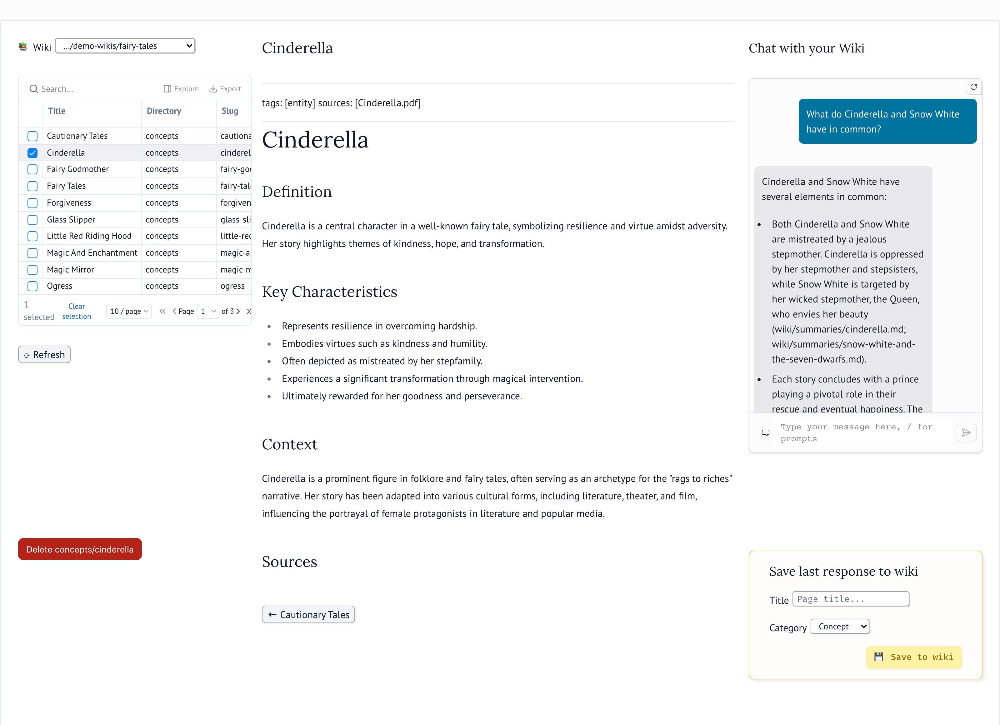

# LLM Wiki

[](https://github.com/Clod/llmwiki-marimo/actions/workflows/test.yml)


[](https://github.com/astral-sh/ruff)

[English](README.md) · **Español**

Una wiki personal y *local-first* que ingiere tus documentos, construye una base de conocimiento estructurada y te permite leerla y conversar con ella — todo en tu máquina, sin necesidad de la nube.

Inspirada en [la idea de la «LLM Wiki» de Karpathy](https://x.com/karpathy/status/2039805659525644595).
La extracción de PDF y algunas piezas de bajo nivel de la ingesta están adaptadas de [la LLM Wiki de código abierto de Lucas Astorian](https://github.com/lucasastorian/llmwiki)
(Apache-2.0); el resto es una construcción *local-first* independiente sobre Marimo + SQLite. Ver [`NOTICE`](NOTICE).



*La app de lectura sobre la wiki de ejemplo incluida — navegación, una página de concepto generada y una respuesta de chat donde cada hecho cita su página de origen. Debajo del chat: el formulario **Save to wiki**, el paso con humano en el bucle que convierte una buena respuesta en una página permanente.*

▶ **[Mira la demo de 1 minuto](https://youtu.be/qXaPycsGXHw)** — un PDF ingerido en una wiki nueva (páginas de concepto, resumen, auto-reparación del lint), y luego una respuesta de chat donde cada hecho cita su fuente.

---

## Aspectos destacados

**Una LLM-wiki agéntica y autónoma.** La mayoría de las versiones de la idea de
Karpathy apuntan un agente *externo* — Claude Desktop, Cursor, un cliente MCP — a
un *vault* de Obsidian. Esta trae su propio agente integrado: la ingesta, la
recuperación agéntica (el asistente de chat decide cuándo leer una página vs.
buscar), el auto-mantenimiento y una interfaz de lectura son una sola app, sin
ningún agente externo ni *host* de plugins que cablear. El compromiso es honesto
— no es un plugin de Obsidian, así que no hay vista de grafo ni ecosistema de
plugins (ver [Limitaciones](#limitaciones-y-objetivos-excluidos)).

**Ingeniería de IA / LLM**

- **RAG con prioridad a la wiki** — lee primero una enciclopedia curada e interconectada (`index.md` → FTS5 de la wiki → fragmentos de las fuentes en bruto como último recurso), de modo que el conocimiento se compila una vez y se acumula, en lugar de re-recuperarse en cada consulta.
- **Idioma por wiki (en/es, extensible)** — define `[wiki] language` en `wiki_config.toml` y toda la wiki — páginas generadas, encabezados de sección *y* respuestas del chat — se produce en ese idioma, **sin importar el idioma de los documentos de origen**. Ejecuta una wiki en inglés y otra en español en paralelo; agregar un tercer idioma es una sola entrada `Locale`.
- **Paquete de evaluación con LLM-como-juez** — un comando reúne las preguntas, las propias respuestas del modelo, la evidencia citada y los pares página-fuente vs. página-generada contra una rúbrica *congelada* de 1–5, para puntuar la calidad del chat **y** de la ingesta (y comparar modelos).
- **Comprobación de idoneidad del modelo** — un PASS/FAIL de un solo comando sobre si un modelo dado supera el umbral de rechazo fuera del corpus, citas y síntesis citada.
- **Prompting basado en evidencia** — el prompt de sistema por defecto incluye un ejemplo resuelto y completamente citado, porque las pruebas demostraron que eso es lo que hizo falta para una citación fiable entre documentos.
- **Wiki que se auto-mantiene** — seis comprobaciones de lint (contradicciones, páginas obsoletas, huérfanas, conceptos faltantes, referencias cruzadas faltantes, vacíos de datos) con auto-reparación de las seguras.
- **Agnóstica del proveedor, con modelo dividido** — cualquier endpoint compatible con OpenAI; usa un modelo local barato para el chat y uno más potente para la ingesta, solo con `.env`.

**Calidad de ingeniería**

- **414 pruebas en tres capas, ≈1:1 prueba-a-código** (6.7k LOC de pruebas vs. 6.1k LOC en el núcleo agnóstico del framework, `base/`) — pruebas unitarias deterministas con LLM falso (sin claves, sin red); una regresión de *caracterización* sobre un corpus dorado congelado que vuelve a comprobar la columna vertebral de la ingesta real sin volver a llamar al modelo; y E2E con Playwright sobre las apps en vivo.
- **Núcleo agnóstico del framework** — toda la lógica vive en `base/domain/{ingestion,chat,eval,lint,repair,tools}`; Marimo es solo la UI en los bordes, así que el motor se ejercita con pruebas unitarias sin navegador.
- **UI maleable** — como la interfaz son notebooks de marimo, el diseño de tres paneles de la app de lectura es simplemente un archivo de grilla ([`marimo/layouts/read_app.grid.json`](marimo/layouts/read_app.grid.json)): abre la app con `marimo edit` y arrastra, redimensiona o reorganiza los paneles según tu flujo, gusto o monitor — sin tocar código de frontend.
- **Consciente de la seguridad** — un guardia contra *path-traversal* en el lector de páginas invocable por el LLM, un modelo de amenazas explícito de inyección de prompts y un [`SECURITY.md`](SECURITY.md) documentado.
- **Local-first y privada** — corre íntegramente en el dispositivo; cada wiki es su propio repositorio git solo-local (historial de versiones gratis); los archivos de origen nunca se modifican y nada se sube a ningún lado.
- **Consciente de la escala** — la re-ingesta omite archivos sin cambios por hash de contenido, el lint compara solo pares de páginas que comparten una fuente (no N²), y la síntesis del *overview* es incremental.
- **Reproducible y limpia** — `uv.lock` fijado para instalaciones deterministas, cero advertencias de `ruff` y sin deuda de `TODO`/`FIXME` en el código.

**Transparencia y documentación**

- **Grafo de citas en SQLite** — cada arista página→fuente y página→página se registra y se reconstruye de forma determinista, así que la procedencia es consultable.
- **Trazado opcional** (`WIKI_TRACE=1`) — emite una traza JSONL del flujo completo LLM + datos por cada ingesta, visualizable en una app de informe de trazas dedicada.
- **Documentada de punta a punta** — un manual del programador de 72 KB, un diccionario de datos de SQLite, un plan UAT de tres partes y una matriz honesta de alineación con Karpathy que califica lo hecho, lo parcial y lo diferido.

---

## ¿En qué se diferencia de RAG / NotebookLM?

El RAG clásico (y herramientas como NotebookLM o la subida de archivos a ChatGPT)  
re-descubre el conocimiento desde cero en cada pregunta: recupera fragmentos en  
tiempo de consulta y sintetiza una respuesta que se desvanece en el historial del  
chat. Nada se acumula.

LLM Wiki **compila el conocimiento una vez y lo mantiene actualizado**. Cada fuente  
ingerida se lee, se resume y se integra en un conjunto persistente e interconectado  
de páginas markdown — las referencias cruzadas, las contradicciones y la síntesis ya  
están escritas antes de que preguntes nada. La wiki es un artefacto que se acumula y  
se enriquece con cada documento; el agente de chat lee primero esas páginas curadas y  
solo recurre a los fragmentos en bruto cuando hace falta.

> Archivador (SQLite + FTS5) vs. enciclopedia (markdown legible por humanos) —  
> este proyecto mantiene ambos, y la enciclopedia es el punto.

---

## Qué hace

1. **Ingerir** — suelta PDFs o DOCXs en la app de ingesta (esto solo los guarda en `sources/`), luego haz clic en **Ingest** para ejecutar el pipeline. Extrae el texto página por página, lo fragmenta con solapamiento, ejecuta extracción estructurada de conceptos y crea / actualiza páginas de resumen + concepto más el catálogo, el *overview* y la cronología — luego toma una instantánea del resultado en el propio repositorio git de la wiki (opcional; ver [Qué queda en disco](#qué-queda-en-disco)).
2. **Leer** — navega las páginas generadas de la wiki en una interfaz limpia de 3 columnas. Navegación, visor de contenido y chat de IA, todo en uno.
3. **Conversar** — haz preguntas sobre tus documentos. Un agente PydanticAI lee primero las páginas curadas de la wiki y recurre al FTS5 de las fuentes en bruto solo cuando hace falta. Transmite respuestas con citas.
4. **Mantener** — ejecuta el lint para detectar huérfanas, páginas obsoletas, referencias cruzadas faltantes y conceptos faltantes; ejecuta la reparación para arreglar automáticamente las seguras.

> **Para desarrolladores:** la referencia canónica es  
> [`docs/programmer_manual.md`](docs/programmer_manual.md) — flujos de trabajo, prompts,  
> puntos de entrada, brechas y la hoja de ruta de trabajo pendiente. Las notas de diseño  
> anteriores están en [`docs/archive/`](docs/archive/).

---

## Qué queda en disco

```
YOUR_WIKI_PATH/
├── sources/                 # Archivos subidos (creado por la app de ingesta)
│   ├── paper.pdf
│   └── report.docx
├── wiki/                    # Generado por el LLM — tú lo lees, la wiki lo escribe
│   ├── index.md             # Catálogo de todas las páginas
│   ├── overview.md          # Síntesis narrativa (reescrita en cada ingesta)
│   ├── log.md               # Cronología de solo-anexado
│   ├── summaries/           # Una por documento de origen
│   │   ├── paper.md
│   │   └── report.md
│   └── concepts/            # Centradas en temas, multi-fuente
│       └── interest-rates.md
├── wiki_config.toml         # Opcional: personaliza el comportamiento del asistente
└── .llmwiki/
    ├── index.db             # SQLite: documentos, fragmentos, índice FTS5, grafo de citas
    └── cache/               # Caché de extracción (reconstruible)
```

Los archivos de origen nunca se modifican. Borra `.llmwiki/` cuando quieras — la re-ingesta lo reconstruye.

Tu **espacio de trabajo `WIKI_PATH` es su propio repositorio git** (un repo separado del de
este proyecto). Cada ingesta hace *commit* del `wiki/` generado como una instantánea
etiquetada (`ingest: paper.pdf`), dándote historial de versiones de la base de
conocimiento gratis. Solo añade al *stage* `wiki/` y el `.gitignore` que crea — nunca tus
`sources/` ni la base de datos — y usa una identidad git local
`LLM Wiki <llmwiki@local>`, así que tu configuración git global queda intacta.
Define `WIKI_AUTOCOMMIT=0` en `.env` para desactivar esto y gestionar tú mismo el git de
la wiki (entonces LLM Wiki no ejecuta ningún `git init` ni *commit*).

**El repo de la wiki es solo-local — nada se sube a ningún lado.** No tiene remoto y se
queda íntegramente en tu máquina; LLM Wiki solo hace *commit* localmente, nunca hace
*push*. Eso es deliberado: tus fuentes y el conocimiento derivado de ellas son privados
por defecto. Si *quieres* respaldar la wiki o sincronizarla entre máquinas, agrega tu
propio remoto — y usa un repositorio **privado**, ya que contiene tu conocimiento
personal:

```bash
cd "$WIKI_PATH"                                       # tu carpeta de wiki
git remote add origin git@github.com:you/my-wiki.git # un repo PRIVADO que te pertenece
git push -u origin HEAD
```

A partir de ahí, el *push* queda en tus manos (`git push` cuando quieras, o monta tu
propia automatización) — el trabajo de la app termina en el *commit* local.

> Cada wiki es un repositorio **separado** de este proyecto y de tus otras wikis.
> Así que una wiki que respaldes en GitHub es su propio repo privado — no una carpeta
> dentro de `llmwiki-marimo`, y nada sobre tus documentos llega jamás al repo público
> del proyecto.

---

## Estructura del proyecto

```
base/                   # Pipeline de ingesta + agente de chat (Python autocontenido)
├── config.py              # pydantic-settings — lee .env
└── domain/
    ├── ingestion/         # PDF/DOCX → texto → fragmentos → páginas de resumen + concepto
    ├── chat/              # Agente PydanticAI + herramientas de wiki/fuente/guardado
    ├── eval/              # UAT semi-automatizado: arma un paquete de evaluación listo para el juez
    ├── lint/              # Comprobaciones de salud de la wiki
    ├── repair/            # Auto-arreglos para problemas de lint seguros
    ├── tools/             # CRUD nativo: wiki_fs, search, references, deletion, git_ops, db
    └── wiki_registry.py   # Selector multi-wiki: descubrimiento + lista de recientes + higiene de rutas

marimo/                # Apps de notebook de Marimo
├── ingest_app.py          # UI de subida → ingesta → generación de la wiki
├── read_app.py            # Visor de solo lectura + chat (grilla de 3 columnas)
└── trace_report_app.py    # Visor de trazas de ingesta (ejecuciones con WIKI_TRACE=1)

database/
└── sqlite_schema.sql      # Esquema canónico de la BD

docs/
├── programmer_manual.md   # Referencia canónica para desarrolladores
└── archive/               # Documentos de diseño superados (históricos)

tests/
├── unit/                  # 389 pruebas unitarias (FakeLLM, sin red)
├── regression/            # 16 pruebas congeladas de corpus dorado (ingesta real, sin modelo en vivo)
├── e2e/                   # 9 pruebas E2E con Playwright (app de ingesta + lectura)
└── fixtures/              # PDFs de prueba + config de wiki + corpus dorado
```

---

## Requisitos previos

- **Python 3.12+** y **[uv](https://docs.astral.sh/uv/)**
- Una **API de LLM compatible con OpenAI** (OpenRouter, Ollama, LM Studio, etc.)
- **LibreOffice** — solo necesario para la ingesta de DOCX:
    - macOS: `brew install --cask libreoffice`
    - Debian/Ubuntu: `sudo apt install libreoffice` (Fedora: `sudo dnf install libreoffice`)
    - Windows: `winget install TheDocumentFoundation.LibreOffice`
- **git** — *opcional*; impulsa el auto-commit del historial de versiones de la wiki. La mayoría de los sistemas ya lo tienen; si falta, las instantáneas se omiten (con una advertencia) y la ingesta sigue funcionando — o define `WIKI_AUTOCOMMIT=0` para no usarlo.

---

## Inicio rápido

### 1. Clonar e instalar

```bash
git clone https://github.com/Clod/llmwiki-marimo.git
cd llmwiki-marimo
uv sync
```

### 2. Configurar

Copia `.env.example` a `.env` y complétalo:

```env
WIKI_PATH=/ruta/a/tu/wiki             # la wiki que se abre al iniciar (la predeterminada)

# Funciona cualquier endpoint compatible con OpenAI. Ejemplo: Ollama (local, gratis).
LLM_BASE_URL=http://localhost:11434/v1
LLM_API_KEY=ollama                    # cualquier cadena no vacía para Ollama
LLM_MODEL=llama3.2
```

`WIKI_PATH` es solo la opción **predeterminada** — ambas apps tienen un selector de  
wiki (arriba a la izquierda) para que cambies entre varias wikis en tiempo de ejecución  
sin editar `.env`. Lista las wikis descubiertas junto a `WIKI_PATH` más una lista de  
recientes, y puedes abrir cualquier otra carpeta por ruta. Define  
`WIKI_HOME=/ruta/a/wikis` para apuntar el descubrimiento a una carpeta específica en  
lugar del directorio padre de `WIKI_PATH`.

Ver [Proveedores de LLM](#proveedores-de-llm) para la configuración de Ollama y LM Studio.

### 3. Ingerir documentos

```bash
uv run marimo run marimo/ingest_app.py --no-sandbox --port 2718
```

Abre [http://localhost:2718](http://localhost:2718), suelta tus PDFs o DOCXs, haz clic en **Ingest**.

### 4. Leer y conversar

```bash
uv run marimo run marimo/read_app.py --no-sandbox --port 2720
```

Abre [http://localhost:2720](http://localhost:2720). Selecciona una página a la izquierda, léela en el centro, conversa a la derecha.

> Usar puertos distintos (2718 para ingesta, 2720 para lectura) te permite correr ambas  
> apps a la vez sin colisión — de lo contrario marimo usa 2718 por defecto en ambas.

---

## Proveedores de LLM

El stack usa la API compatible con OpenAI en todas partes. Cambia de proveedor modificando solo `.env` — sin cambios de código.

**Ollama (local, gratis):**

```env
LLM_BASE_URL=http://localhost:11434/v1
LLM_API_KEY=ollama
LLM_MODEL=llama3.2
```

**LM Studio (local, gratis):**

```env
LLM_BASE_URL=http://localhost:1234/v1
LLM_API_KEY=lm-studio
LLM_MODEL=local-model-name
```

**OpenRouter (nube, modelos alojados):**

```env
LLM_BASE_URL=https://openrouter.ai/api/v1
LLM_API_KEY=sk-or-...
LLM_MODEL=anthropic/claude-haiku-4-5
```

**Configuración dividida** — usa un modelo barato/local para el chat pero uno más potente para la generación de la wiki:

```env
LLM_BASE_URL=http://localhost:11434/v1   # el chat usa esto
LLM_API_KEY=ollama
LLM_MODEL=llama3.2

WIKI_LLM_BASE_URL=https://openrouter.ai/api/v1   # la ingesta usa esto
WIKI_LLM_API_KEY=sk-or-...
WIKI_LLM_MODEL=anthropic/claude-haiku-4-5
```

Si `WIKI_LLM_*` están vacíos, la ingesta recurre a `LLM_*`.

> **No uses un modelo demasiado pequeño para la ingesta.** El resumen, la extracción
> de conceptos y la comprobación de contradicciones se apoyan en el razonamiento del
> modelo, así que un modelo de poca potencia para *tus* documentos produce resúmenes
> pobres, citas débiles o páginas alucinadas. Qué cuenta como «demasiado pequeño»
> depende de tu corpus y tus estándares — júzgalo por las páginas que realmente produce.
> Si la calidad de la wiki decepciona, sube el modelo de `WIKI_LLM_*` (ingesta) antes de
> culpar al pipeline; la configuración dividida de arriba te permite hacerlo manteniendo
> el chat en un modelo local más pequeño.

> **El fundamento y las citas del chat también escalan con el modelo de chat.** El prompt
> por defecto del agente de chat es estricto — *responde solo desde tu wiki, y cita cada
> hecho* — pero un prompt es solo una petición; el modelo tiene que ser capaz de honrarla.
> Un ejemplo concreto de las pruebas en OpenRouter, mismo proveedor, misma wiki, con el
> prompt estricto por defecto:
>
> | Pregunta | `openai/gpt-4o-mini` | `openai/gpt-4o` |
> | --- | --- | --- |
> | «¿Cuál es la capital de Francia?» (fuera del corpus) | a veces responde «París» | se rehúsa — está fuera de la wiki |
> | «¿Quién es Cenicienta?» (un solo hecho) | responde, pero cita el PDF en bruto o nada | cita la página curada de la wiki |
> | «¿Qué tienen en común Cenicienta y Blancanieves?» (síntesis) | omite las citas | cita cada punto a sus páginas de origen |
>
> La **síntesis** entre documentos es el caso más exigente — un modelo más débil abandona
> primero las citas ahí. Lograr que se cite de forma fiable requirió *tanto* un modelo
> capaz *como* un ejemplo resuelto de una comparación completamente citada, por eso ese
> ejemplo ahora está integrado en el prompt por defecto. Si las respuestas del chat llegan
> sin citas o se salen de tus documentos, sube el modelo de chat (`LLM_MODEL`) antes de
> suponer que el agente está roto. Puedes mantener un modelo barato para la ingesta y uno
> más potente para el chat (o viceversa) con la configuración dividida de arriba.
>
> **¿No estás seguro de si un modelo supera el umbral?** Ejecuta `uv run python scripts/eval_chat_model.py`
> — le hace a la wiki de ejemplo incluida unas preguntas fijas y da un PASS/FAIL sobre
> exactamente estos comportamientos (rechazo fuera del corpus, citas, síntesis citada). Ver
> [`docs/uat_test_plan.md`](docs/uat_test_plan.md) Parte C.

---

## Personalizar el asistente de chat

Crea `wiki_config.toml` en tu `WIKI_PATH`:

```toml
[assistant]
system_prompt = """
Eres un asistente personal de wiki de inversiones.
Responde primero desde la wiki curada: lee wiki/index.md, luego search_wiki_fts;
recurre a search_source_chunks solo cuando las páginas de la wiki carezcan del detalle.
Cita el nombre del documento y la página para hechos específicos.
"""

suggested_prompts = [
    "Resume mi cartera de inversiones",
    "¿Cuáles son los principales riesgos?",
    "¿Qué instrumentos ofrecen los mayores rendimientos?",
]
```

Copia `wiki_config.example.toml` desde la raíz del proyecto como punto de partida. Si el archivo está ausente, se usan valores por defecto genéricos.

### Idioma de contenido de la wiki

Agrega una sección `[wiki]` para generar toda la wiki — páginas, encabezados y etiquetas
estructurales, y respuestas del chat — en un idioma dado, **sin importar el idioma de los
documentos de origen**:

```toml
[wiki]
language = "es"   # "en" (predeterminado) | "es"; extensible — agrega un Locale en base/domain/i18n.py
```

El idioma es una propiedad *por wiki*, así que puedes mantener una wiki en inglés y una en
español en paralelo. Defínelo **antes de la primera ingesta**; un valor ausente o
desconocido recae en inglés. Ver [`docs/programmer_manual.md`](docs/programmer_manual.md) §8.

---

## Formatos de documento

| Formato | Parser             | Notas                              |
| ------- | ------------------ | ---------------------------------- |
| PDF     | opendataloader-pdf | Los PDFs con mucho texto funcionan bien |
| DOCX    | LibreOffice → PDF  | Requiere LibreOffice instalado     |

**Solo PDFs basados en texto.** Los PDFs escaneados / solo-imagen aún no pasan por OCR —  
se ingieren como texto vacío o ininteligible. El OCR para PDFs escaneados está en la hoja  
de ruta (ver [`docs/programmer_manual.md`](docs/programmer_manual.md) §12).

---

## Pruebas

Tres capas, la más rápida primero.

**1. Puerta de regresión rápida** — determinista, sin claves de LLM ni apps en ejecución,
termina en cerca de un minuto. Ejecútala después de cualquier cambio:

```bash
uv run pytest tests/unit tests/regression -q
```

Verifica los invariantes estructurales (integridad de la BD, alineación de FTS, cascada de
borrado, mecánica de guardado, lógica del lint, instantáneas git) sobre pruebas unitarias
con LLM falso más un **«corpus dorado» de ingesta real congelado** — así la columna
vertebral se comprueba contra una ingesta real sin volver a llamar al modelo.

**2. Extremo a extremo (Playwright)** — maneja las apps reales de marimo:

```bash
uv run playwright install chromium                            # una vez
HEADLESS=1 uv run pytest tests/e2e/test_ingest_app.py -v -s   # pipeline de ingesta
HEADLESS=1 uv run pytest tests/e2e/test_read_app.py  -v -s    # app de lectura (usa el workspace del paso 1)
```

**3. Aceptación y comprobación del modelo (manual)** — la pasada de juicio humano para lo
que las aserciones no pueden calificar. El plan completo es **[`docs/uat_test_plan.md`](docs/uat_test_plan.md)**,
una prueba de aceptación de usuario en tres partes:

- **Parte A** — la puerta automatizada de arriba.
- **Parte B** — una lista de verificación manual: ¿el chat se mantiene fundamentado y cita
  las fuentes? ¿las páginas generadas se leen como entradas reales? ¿los hallazgos del lint
  tienen sentido?
- **Parte C** — *¿el modelo que elegiste es lo bastante bueno?* Una comprobación de un solo
  comando del modelo de chat (no se necesitan documentos — usa la wiki de ejemplo incluida):

  ```bash
  uv run python scripts/eval_chat_model.py    # PASS/FAIL para el modelo de chat (LLM_MODEL)
  ```

Los PDFs de prueba viven en `tests/fixtures/pdfs/`; el workspace E2E está en .gitignore y se
reconstruye en cada ejecución de ingesta. Usa las skills `/test-ingest`, `/test-read` y
`/test-all` en Claude Code para auto-pruebas.

### Automatizar lo no-testeable: el paquete de evaluación

Algunos comportamientos simplemente no se pueden probar con regresión — no hay una
«respuesta correcta» determinista para *¿está bien fundamentada esta respuesta de chat?* o
*¿es fiel esta página generada a su fuente?* La salida varía con el modelo e incluso entre
ejecuciones. La solución es **mover el juicio a un LLM, pero manteniéndolo barato y
resistente al sesgo**: generar un único **paquete de evaluación** markdown autocontenido y
pegarlo en uno — o varios — modelos de chat capaces (una pestaña gratis de Gemini / ChatGPT
/ Claude) para puntuar contra una rúbrica fija de 1–5.

```bash
uv run python scripts/build_eval_packet.py                 # wiki de ejemplo de referencia
uv run python scripts/build_eval_packet.py --wiki PATH      # una wiki existente
uv run python scripts/build_eval_packet.py --skip-ingestion # solo chat (barato)
```

El paquete reúne todo lo que un juez necesita — las preguntas, las propias respuestas del
modelo, las páginas citadas y (por fuente) el texto original junto a las páginas que generó
el motor — más la rúbrica y una hoja de puntuación en blanco. Cubre la **calidad del chat** y
la **calidad de la ingesta**, registra los dos modelos que midió y un hash del corpus para que
los paquetes sean comparables, y se escribe en un `eval_reports/` en .gitignore. La generación
está automatizada; el juicio se mantiene con humano en el bucle (pégalo a tantos jueces como
quieras y promedia), así que también sirve para comparar los modelos que usa tu motor de wiki.
Detalles en [`docs/programmer_manual.md`](docs/programmer_manual.md) §9.

---

## Rendimiento a escala

Para una wiki de tamaño personal (de decenas a pocos cientos de documentos) el pipeline se
mantiene cómodo — nada aquí crece de forma cuadrática con la cantidad de documentos:

- **La ingesta es incremental.** Los archivos sin cambios se omiten por hash de contenido,
  así que re-escanear una carpeta `sources/` grande solo re-procesa lo que realmente cambió.
- **El lint no compara cada página contra todas las demás.** Las comprobaciones de referencia
  cruzada y de contradicción solo miran *pares de páginas de concepto que citan una fuente
  común*, así que su costo escala con cuán interconectada temáticamente esté tu wiki — no con
  la cantidad bruta de documentos. Las páginas no relacionadas nunca se comparan.
- **La síntesis del overview es incremental.** Cada ingesta integra el nuevo documento en el
  overview existente en vez de releer todo el corpus.

El único costo que *puede* crecer es la comprobación de lint de **contradicción**: hace una
llamada al LLM por cada par de páginas que comparten fuente, así que una sola fuente citada por
muchas páginas de concepto puede volver lenta esa comprobación (opcional). Reporta el progreso y
nunca bloquea la ingesta — todo lo demás se mantiene aproximadamente lineal.

---

## Limitaciones y objetivos excluidos

Esto es una prueba de concepto funcional del patrón LLM-Wiki, no un producto terminado. El bucle  
central — ingerir → construir/mantener la wiki → leer → conversar con citas → lint → reparar —  
está completamente implementado. Algunas ideas del concepto original se **difieren  
deliberadamente** para la PoC:

- **Sin búsqueda web.** El agente de chat responde solo desde *tu* corpus local curado — nunca  
sale a la web, y no hay un bucle automático web→wiki. Para traer una fuente externa, obtenla tú  
mismo (p. ej. guarda el artículo como PDF) y luego **ingiérelo manualmente** — soltar un archivo  
en `sources/` no hace nada por sí solo. Abre la app de ingesta y o bien (a) arrastra el archivo  
a la caja de subida y haz clic en **⚙️ Ingest uploaded file(s)**, o (b) ponlo en  
`WIKI_PATH/sources/` y haz clic en **🔄 Scan sources/ for changes**, que detecta e ingiere lo  
nuevo o modificado. Trata un documento de origen no confiable como tratarías código no confiable:  
su texto llega al agente de chat, que puede escribir páginas de wiki — ver [`SECURITY.md`](SECURITY.md).
- **Sin manejo de imágenes / visión.** Ingesta solo de texto — las imágenes incrustadas en un  
documento se omiten, no se describen ni resumen.
- **Solo PDFs basados en texto.** Aún sin OCR, así que un PDF escaneado / solo-imagen se ingiere  
como texto vacío o ininteligible. Usa un PDF basado en texto o convértelo primero.
- **La salida es solo markdown — sin visualizaciones ni formatos alternativos.** La wiki registra  
un grafo completo de citas/enlaces en la base de datos (`document_references`: qué página cita qué  
fuente, qué páginas enlazan con cuáles), pero no hay una **vista de grafo** interactiva para *ver*  
esa forma, ni generadores de presentaciones (**Marp**) ni de diseños espaciales de **canvas**. Lees  
la wiki como páginas markdown enlazadas — los enlaces cruzados son clicables, solo que el grafo no  
se dibuja.
- **La ingesta es automatizada, no una conversación guiada.** El flujo de Karpathy hace que el LLM  
discuta una fuente contigo y escriba páginas bajo tu dirección; aquí sueltas un archivo y el  
pipeline extrae → resume → archiva de una sola vez, sin revisión a mitad de la ingesta. Tú diriges  
la wiki *después*: abre la página resultante en la app de lectura, conversa sobre el documento y  
luego guarda una respuesta corregida o sintetizada como página de wiki mediante el formulario  
**Save to wiki** de la app de lectura (`save_to_wiki`). El agente solo redacta y propone — el  
guardado es tu clic explícito — así que el paso con humano en el bucle es posterior, no durante la  
ingesta.

El fundamento de cada recorte y el plan para revisitarlos viven en  
[`docs/programmer_manual.md`](docs/programmer_manual.md) §12.

---

## Contribuir y seguridad

- Configuración de contribución, flujo de pruebas y convenciones: [`CONTRIBUTING.md`](CONTRIBUTING.md)
- Modelo de seguridad y cómo reportar problemas: [`SECURITY.md`](SECURITY.md)

---

## Licencia

Apache 2.0
