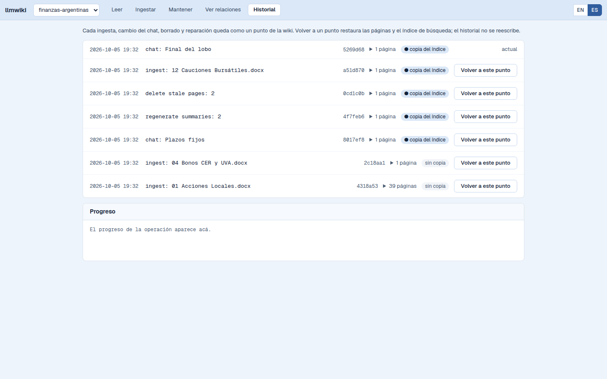

# LLM Wiki

[](https://github.com/Clod/llmwiki-marimo/actions/workflows/test.yml)


[](https://github.com/astral-sh/ruff)
[](https://github.com/Clod/llmwiki-marimo/releases)
[](CHANGELOG.md)

[English](README.md) · **Español**

> Traducción de [`README.md`](README.md), que es la versión canónica. Ante cualquier discrepancia, prevalece el inglés.

Una wiki personal y *local-first* que ingiere tus documentos, construye una base de conocimiento estructurada y te permite leerla y conversar con ella — todo en tu máquina, sin necesidad de la nube.

Inspirada en [la idea de la «LLM Wiki» de Karpathy](https://x.com/karpathy/status/2039805659525644595).
La extracción de PDF y algunas piezas de bajo nivel de la ingesta están adaptadas de [la LLM Wiki de código abierto de Lucas Astorian](https://github.com/lucasastorian/llmwiki)
(Apache-2.0); el resto es una construcción *local-first* independiente sobre FastAPI, HTMX y SQLite. Ver [`NOTICE`](NOTICE).


*La pestaña **Leer** sobre el ejemplo de finanzas. El índice de páginas está a la izquierda y la página abierta en el centro. La conversación está a la derecha: bajo cada respuesta, una línea nombra el modo de respuesta y las páginas que la respuesta cita. El selector de modo, bajo el campo de la pregunta, tiene tres valores: **Recuperación previa** (el código recupera primero y se abstiene antes de llamar al modelo), **Estricto** (la respuesta se reemplaza por un rechazo cuando el modelo no consultó la wiki) y **Sin verificación** (la respuesta se transmite y no se comprueba) ([cuál elegir, y por qué](docs/query_walkthrough.md)). El botón **Guardar** convierte la conversación en una página de la wiki solo después de que revisas el borrador: el agente no tiene herramienta de escritura.*



*La pestaña **Historial**. Cada ingesta, conversación guardada, borrado y reparación es un punto de la wiki. Un punto marcado "copia del índice" tiene una copia del índice de búsqueda, así que volver a él es inmediato; en los demás, el índice se reconstruye sin llamar al modelo. Esta captura se tomó sobre el ejemplo de finanzas, con siete puntos agregados por el script de captura.*

▶ **[Mirá la demo de 1 minuto](https://youtu.be/VLX5kLczQbk)** — recorrer una wiki generada, después una respuesta que cruza dos documentos citando una página por cada afirmación (9 s), y después la misma clase de pregunta rechazada **en 1,2 s porque nunca se llamó al modelo**.

---

## Aspectos destacados

**Una LLM-wiki agéntica y autónoma.** La mayoría de las versiones de la idea de
Karpathy apuntan un agente *externo* — Claude Desktop, Cursor, un cliente MCP — a
un *vault* de Obsidian. Esta trae su propio agente integrado: la ingesta, la
recuperación agéntica (el asistente de chat decide cuándo leer una página vs.
buscar), el auto-mantenimiento y una interfaz web son una sola app, sin
ningún agente externo ni *host* de plugins que cablear. El compromiso es honesto
— no es un plugin de Obsidian, así que no hay ecosistema de plugins (ver
[Limitaciones](#limitaciones-y-objetivos-excluidos)). Sí tiene su propio grafo de
relaciones, en la pestaña **Ver relaciones**.

**Conocimiento que además sabe los números — más que una enciclopedia.** La
mayoría de las herramientas de "conversá con tus documentos" — RAG clásico,
NotebookLM, incluso la LLM-wiki original — manejan solo *prosa duradera*:
responden "qué **es** X?" pero quedan desactualizadas y no pueden decirte los
números actuales, mucho menos calcular sobre ellos. Esto agrega un **segundo
tipo de conocimiento de primera clase**: junto a las páginas de concepto
destiladas, una wiki puede llevar **datos estructurados y vivos** (tasas,
precios, estadísticas) que se refrescan, se consultan con exactitud y se
**calculan de forma determinista** — y el mismo agente con fundamento razona
sobre *ambos*, citando fuente **y fecha** para cada cifra y negándose a inventar
o estimar lo que no se puede. El ejemplo incluido es un **asesor de finanzas
personales argentino** (`finance_argentina`): preguntá *"tengo $X que no voy a
necesitar por Y meses — ¿qué alternativas tengo y cuánto ganaría?"* y ordena
alternativas reales con cifras citadas y fechadas, calcula las ganancias en
**código determinista (nunca el LLM)** y marca los instrumentos de renta
variable (acciones, ligados a inflación o tipo de cambio) como *no estimables*
en vez de adivinar. El motor de datos es **agnóstico del dominio** (`datasets`,
no "tasas") — finanzas es solo el primer overlay. *Una síntesis original: una
wiki de conocimiento local-first, totalmente citada, que además mantiene datos
vivos y calcula asesoramiento con fundamento sobre ellos.*

**Ingeniería de IA / LLM**

- **Datos dinámicos, no solo prosa** — un motor `datasets` agnóstico del dominio ingiere tablas estructuradas que se refrescan periódicamente (tasas/precios/estadísticas) como un carril separado de las páginas de concepto duraderas, expuesto al agente como una herramienta `query_dataset`; los valores se citan textualmente con su fecha `as_of`, nunca de memoria.
- **Asesoría determinista y con fundamento** — el overlay de ejemplo `finance_argentina` calcula "cuánto ganaría" sobre esos datasets en Python puro (matemática de tasa efectiva, elegibilidad), lista cada opción ordenada y citada, y se niega a estimar lo no determinista (acciones, inflación, tipo de cambio) en lugar de fabricar un número.
- **Fundamento exigible (citar o no responder)** — una verificación determinista posterior: si una respuesta no está respaldada por el resultado de una herramienta, se reemplaza por un rechazo honesto, así el modelo no recurre en silencio al conocimiento general. Un selector de modo en el chat alterna entre recuperación previa, estricto (con buffer + filtrado) y sin verificación (en streaming).
- **RAG con prioridad a la wiki** — lee primero una enciclopedia curada e interconectada (`index.md` → FTS5 de la wiki → fragmentos de las fuentes en bruto como último recurso), de modo que el conocimiento se compila una vez y se acumula, en lugar de re-recuperarse en cada consulta.
- **Idioma por wiki (en/es, extensible)** — define `[wiki] language` en `wiki_config.toml` y toda la wiki — páginas generadas, encabezados de sección *y* respuestas del chat — se produce en ese idioma, **sin importar el idioma de los documentos de origen**. Ejecuta una wiki en inglés y otra en español en paralelo; agregar un tercer idioma es una sola entrada `Locale`.
- **Paquete de evaluación con LLM-como-juez** — un comando reúne las preguntas, las propias respuestas del modelo, la evidencia citada y los pares página-fuente vs. página-generada contra una rúbrica *congelada* de 1–5, para puntuar la calidad del chat **y** de la ingesta (y comparar modelos).
- **Comprobación de idoneidad del modelo** — un PASS/FAIL de un solo comando sobre si un modelo dado supera el umbral de rechazo fuera del corpus, citas y síntesis citada.
- **Prompting basado en evidencia** — el prompt de sistema por defecto incluye un ejemplo resuelto y completamente citado, porque las pruebas demostraron que eso es lo que hizo falta para una citación fiable entre documentos.
- **Wiki que se auto-mantiene** — diez comprobaciones de lint (contradicciones, páginas obsoletas, huérfanas, conceptos faltantes, referencias cruzadas faltantes, vacíos de datos, vacíos ya cubiertos, deriva de vocabulario, páginas flacas, fuentes que no produjeron página) con auto-reparación de las seguras.
- **Agnóstica del proveedor, con modelo dividido** — cualquier endpoint compatible con OpenAI; usa un modelo local barato para el chat y uno más potente para la ingesta, solo con `.env`.

**Calidad de ingeniería**

- **Pruebas en tres capas, ≈1:1 prueba-a-código** (núcleo agnóstico del framework en `base/`, ejercitado sin navegador) — pruebas unitarias deterministas con LLM falso (sin claves, sin red); una regresión de *caracterización* sobre un corpus dorado congelado que vuelve a comprobar la columna vertebral de la ingesta real sin volver a llamar al modelo; y pruebas con Playwright de la interfaz web que se ejecutan en CI.
- **Núcleo agnóstico del framework** — toda la lógica vive en `base/domain/{ingestion,chat,eval,lint,repair,tools}`; la interfaz web (`web/`) es solo la UI en los bordes y llama a `base/services/`, así que el motor se ejercita con pruebas unitarias sin navegador.
- **Interfaz web renderizada en el servidor** — FastAPI y Jinja2 generan el HTML, HTMX actualiza la página y los Server-Sent Events transmiten las respuestas del chat y el progreso de las operaciones largas. No hay paso de compilación de JavaScript: los pocos scripts y las hojas de estilo son archivos simples en `web/static/`.
- **Consciente de la seguridad** — un guardia contra *path-traversal* en el lector de páginas invocable por el LLM, un modelo de amenazas explícito de inyección de prompts y un [`SECURITY.md`](SECURITY.md) documentado.
- **Local-first y privada** — corre íntegramente en el dispositivo; cada wiki es su propio repositorio git solo-local (historial de versiones gratis); los archivos de origen nunca se modifican y nada se sube a ningún lado.
- **Consciente de la escala** — la re-ingesta omite archivos sin cambios por hash de contenido, el lint compara solo pares de páginas que comparten una fuente (no N²), y la síntesis del *overview* es incremental.
- **Reproducible y limpia** — `uv.lock` fijado para instalaciones deterministas, cero advertencias de `ruff` y sin deuda de `TODO`/`FIXME` en el código.

**Transparencia y documentación**

- **Grafo de citas en SQLite** — cada arista página→fuente y página→página se registra y se reconstruye de forma determinista, así que la procedencia es consultable.
- **Trazado opcional** (`WIKI_TRACE=1`) — emite un span de OpenTelemetry por nodo del diagrama, en cada turno de chat y en cada ingesta, escrito en `spans.jsonl` y renderizado por `scripts/render_trace.py`.
- **Documentada de punta a punta** — un manual del programador con su referencia de apps / flujos / internos, un diccionario de datos de SQLite, un plan UAT de tres partes y una matriz honesta de alineación con Karpathy que califica lo hecho, lo parcial y lo diferido.

---

## ¿En qué se diferencia de RAG / NotebookLM?

El RAG clásico (y herramientas como NotebookLM o la subida de archivos a ChatGPT)  
re-descubre el conocimiento desde cero en cada pregunta: recupera fragmentos en  
tiempo de consulta y sintetiza una respuesta que se desvanece en el historial del  
chat. Nada se acumula.

LLM Wiki **compila el conocimiento una vez y lo mantiene actualizado**. Cada fuente  
ingerida se lee, se resume y se integra en un conjunto persistente e interconectado  
de páginas markdown — las referencias cruzadas, las contradicciones y la síntesis ya  
están escritas antes de que preguntes nada. La wiki es un artefacto que se acumula y  
se enriquece con cada documento; el agente de chat lee primero esas páginas curadas y  
solo recurre a los fragmentos en bruto cuando hace falta.

> Archivador (SQLite + FTS5) vs. enciclopedia (markdown legible por humanos) —  
> este proyecto mantiene ambos, y la enciclopedia es el punto.

---

## Qué hace

1. **Ingerir** — en la pestaña **Ingestar**, elige archivos PDF, de office (`.docx`, `.doc`, `.odt`, `.rtf`), Markdown (`.md`) o de texto plano (`.txt`) y haz clic en **Ingestar**, o copia archivos a `sources/` y haz clic en **Escanear sources/**. El pipeline extrae el texto página por página, lo fragmenta con solapamiento, ejecuta extracción estructurada de conceptos y crea / actualiza páginas de resumen + concepto más el catálogo, el *overview* y la cronología — luego toma una instantánea del resultado en el propio repositorio git de la wiki (opcional; ver [Qué queda en disco](#qué-queda-en-disco)). La misma pestaña lista las fuentes y borra una fuente después de una confirmación.
2. **Leer** — en la pestaña **Leer**, navega las páginas generadas con el índice de páginas, lee la página abierta, edítala en un editor de Markdown con vista previa en vivo o bórrala después de una confirmación. Los enlaces entre páginas y los enlaces a los documentos fuente funcionan como enlaces.
3. **Conversar** — en la misma pestaña, haz preguntas sobre tus documentos. Un agente PydanticAI lee primero las páginas curadas de la wiki, consulta datasets vivos cuando pides cifras actuales, y recurre al FTS5 de las fuentes en bruto solo cuando hace falta — citando cada hecho. Un selector de modo elige entre respuestas con recuperación previa, estrictas (citar o no responder) y sin verificación (en streaming). La conversación sobrevive a la navegación, al editor y a una recarga en la misma pestaña del navegador. **Guardar** convierte la conversación entera en una página de la wiki: el modelo prepara un borrador, tú lo revisas y lo editas en un diálogo, y la página se escribe solo cuando haces clic en **Guardar en la wiki**.
4. **Mantener** — en la pestaña **Mantener**, regenera las páginas de resumen, ejecuta el lint y la reparación (los arreglos seguros), borra las páginas obsoletas y reconstruye el índice de búsqueda a partir de los archivos en disco sin llamar al modelo.
5. **Explorar** — en la pestaña **Ver relaciones**, mira el grafo de páginas y fuentes, busca una página y abre el grafo de una página y sus vecinas.
6. **Volver atrás** — en la pestaña **Historial**, devuelve toda la wiki a un punto anterior y lee o compara versiones anteriores de una página. El historial no se reescribe: un retorno es un punto nuevo.

La interfaz está en inglés y en español: el selector **EN | ES** a la derecha del encabezado elige el idioma (una cookie; sin ella, el idioma del navegador; sin eso, inglés). Es solo el idioma de las etiquetas y los mensajes. El idioma del contenido de la wiki se define por wiki y es otra configuración (ver [Idioma de contenido de la wiki](#idioma-de-contenido-de-la-wiki)): una wiki en español puede leerse con la interfaz en inglés, y al revés.

> **De marimo a una interfaz web.** Hasta la [v0.4.0](https://github.com/Clod/llmwiki-marimo/releases/tag/v0.4.0) la interfaz de este proyecto fue un conjunto de notebooks de [marimo](https://marimo.io); esa versión es la que hay que instalar para usarlos. marimo vuelve a ejecutar una celda entera cada vez que cambia uno de sus widgets, lo que le sirve a un notebook. La aplicación pasó a necesitar una conversación que sobreviva al pasar de una página a otra, el progreso transmitido mientras corre una ingesta, y una dirección para cada página y cada pantalla, así que pasó a una interfaz web generada en el servidor (FastAPI y HTMX). Las apps de marimo siguen en `marimo/` hasta que un cambio aparte las elimine; esta documentación describe solo la interfaz web.

> **Para desarrolladores:** la referencia canónica es  
> [`docs/manual/programmer_manual.md`](docs/manual/programmer_manual.md) — flujos de trabajo, prompts,  
> puntos de entrada, brechas y la hoja de ruta de trabajo pendiente. Las notas de diseño  
> anteriores están en [`docs/archive/`](docs/archive/).
>
> **¿Preferís la visión de conjunto primero?** El  
> [Ingestion Walkthrough](docs/ingestion_walkthrough.md) (en inglés) sigue a un  
> corpus pequeño a lo largo de todo su ciclo de vida — primer documento, segundo  
> documento, una re-ingesta sin cambios, una fuente editada, un borrado —  
> mostrando exactamente qué páginas del wiki, filas en la BD, aristas del grafo de  
> citas y entradas de vocabulario produce cada paso. Sus números no están escritos  
> a mano: salen de una corrida real, y  
> `scripts/capture_ingestion_walkthrough.py` los regenera cuando haga falta. Su
> contraparte, el [Query Walkthrough](docs/query_walkthrough.md) (en inglés),
> hace lo mismo del lado de la lectura: siete preguntas y el ruteo que recibió
> cada una — incluidas las dos que el sistema rechaza sin llamar al modelo.

---

## Qué queda en disco

```
YOUR_WIKI_PATH/
├── sources/                 # Archivos subidos (creado por la pestaña Ingestar)
│   ├── paper.pdf
│   └── report.docx
├── wiki/                    # Generado por el LLM — tú lo lees, la wiki lo escribe
│   ├── index.md             # Catálogo de todas las páginas
│   ├── overview.md          # Síntesis narrativa (reescrita en cada ingesta)
│   ├── log.md               # Cronología de solo-anexado
│   ├── summaries/           # Una por documento de origen
│   │   ├── paper.md
│   │   └── report.md
│   └── concepts/            # Centradas en temas, multi-fuente
│       └── interest-rates.md
├── wiki_config.toml         # Opcional: personaliza el comportamiento del asistente
└── .llmwiki/
    ├── index.db             # SQLite: documentos, fragmentos, índice FTS5, grafo de citas
    └── cache/               # Caché de extracción (reconstruible)
```

Los archivos de origen nunca se modifican. Borra `.llmwiki/` cuando quieras — la re-ingesta lo reconstruye.

Tu **espacio de trabajo `WIKI_PATH` es su propio repositorio git** (un repo separado del de
este proyecto). Cada ingesta hace *commit* del `wiki/` generado como una instantánea
etiquetada (`ingest: paper.pdf`), dándote historial de versiones de la base de
conocimiento gratis. Solo añade al *stage* `wiki/` y el `.gitignore` que crea — nunca tus
`sources/` ni la base de datos — y usa una identidad git local
`LLM Wiki <llmwiki@local>`, así que tu configuración git global queda intacta.
Define `WIKI_AUTOCOMMIT=0` en `.env` para desactivar esto y gestionar tú mismo el git de
la wiki (entonces LLM Wiki no ejecuta ningún `git init` ni *commit*).

**El repo de la wiki es solo-local — nada se sube a ningún lado.** No tiene remoto y se
queda íntegramente en tu máquina; LLM Wiki solo hace *commit* localmente, nunca hace
*push*. Eso es deliberado: tus fuentes y el conocimiento derivado de ellas son privados
por defecto. Si *quieres* respaldar la wiki o sincronizarla entre máquinas, agrega tu
propio remoto — y usa un repositorio **privado**, ya que contiene tu conocimiento
personal:

```bash
cd "$WIKI_PATH"                                       # tu carpeta de wiki
git remote add origin git@github.com:you/my-wiki.git # un repo PRIVADO que te pertenece
git push -u origin HEAD
```

A partir de ahí, el *push* queda en tus manos (`git push` cuando quieras, o monta tu
propia automatización) — el trabajo de la app termina en el *commit* local.

> Cada wiki es un repositorio **separado** de este proyecto y de tus otras wikis.
> Así que una wiki que respaldes en GitHub es su propio repo privado — no una carpeta
> dentro de `llmwiki-marimo`, y nada sobre tus documentos llega jamás al repo público
> del proyecto.

---

## Estructura del proyecto

```
base/                   # Pipeline de ingesta + agente de chat (Python autocontenido)
├── config.py              # pydantic-settings — lee .env
└── domain/
    ├── ingestion/         # PDF/office/md/txt → texto → fragmentos → páginas de resumen + concepto
    ├── datasets/          # Motor genérico para datos vivos y estructurados (tasas/precios/estadísticas)
    ├── finance_argentina/ # Overlay de dominio de ejemplo: asesoría de inversión determinista y citada
    ├── chat/              # Agente PydanticAI + herramientas de wiki/fuente/guardado/dataset + guardia de fundamento
    ├── eval/              # UAT semi-automatizado: arma un paquete de evaluación listo para el juez
    ├── lint/              # Comprobaciones de salud de la wiki
    ├── repair/            # Auto-arreglos para problemas de lint seguros
    ├── tools/             # CRUD nativo: wiki_fs, search, references, deletion, git_ops, db
    └── wiki_registry.py   # Selector multi-wiki: descubrimiento + lista de recientes + higiene de rutas

web/                    # La interfaz web: FastAPI + Jinja2 + HTMX (ver web/README.md)
├── app.py                 # Fábrica de la aplicación; `web.app:app` es lo que carga uvicorn
├── routes/                # picker, pages, chat, ingest, history, relations
├── templates/             # Plantillas Jinja2 (ids de mensaje en inglés; el catálogo en español está en locale/)
├── i18n.py                # Idioma de la interfaz: catálogos, elección del idioma, _() y ngettext()
├── locale/                # Catálogos gettext, uno por idioma salvo el inglés
└── static/                # CSS, JavaScript, htmx, force-graph

base/services/          # Las llamadas que hacen las rutas web: wiki.py, chat.py, ingest.py


marimo/                 # Apps de marimo — en retirada, se conservan hasta su eliminación
├── ingest_app.py
├── read_app_tabs.py
└── read_app.py

database/
└── sqlite_schema.sql      # Esquema canónico de la BD

docs/
├── manual/                # Referencia canónica, con una numeración de § compartida
│   ├── programmer_manual.md          # §1 §2 §3 §10 §11 §13 — orientación, capas, glosario
│   ├── workflows.md                  # §6 — índice: tabla de estado y matriz de escritura
│   ├── workflows/                    # §6.1–§6.10, un archivo por flujo de trabajo
│   ├── internals.md                  # §4 §5 §14 — esquema, capa de herramientas, trazas
│   └── apps.md                       # §7 §8 §9 §15 — apps, configuración, pruebas, datasets
├── ingestion_walkthrough.md          # Un corpus de punta a punta — la visión narrativa
├── ingestion_walkthrough_appendix.md # Su inventario de artefactos (generado, regenerable)
├── query_walkthrough.md              # Siete preguntas y cómo se ruteó cada una
├── query_walkthrough_appendix.md     # Su captura de ruteo (generada, regenerable)
└── archive/               # Documentos de diseño superados (históricos)

examples/               # Wikis de demostración pre-ingeridas (usadas por quickstart.py)
├── fairy-tales/           # Navegable sin LLM; el chat necesita un modelo
├── cuentos-de-hadas/      # La misma demo como wiki en español
└── finanzas-argentinas/   # Wiki de finanzas en español con datasets; las capturas de arriba la usan

tests/
├── unit/                  # Pruebas unitarias deterministas (FakeLLM, sin red)
├── regression/            # Pruebas congeladas de corpus dorado (ingesta real, sin modelo en vivo)
├── web/                   # Interfaz web: rutas, renderizado, diseño, flujos con Playwright (en CI)
│   └── e2e/               # Flujos con Playwright sobre una copia del ejemplo de finanzas
├── e2e/                   # E2E con Playwright sobre las apps de marimo (modelo en vivo; no en CI)
└── fixtures/              # PDFs de prueba + config de wiki + corpus dorado

quickstart.py           # Instalador de consola de un comando (solo Python; ver Inicio rápido)
requirements.txt        # Dependencias fijadas por hash exportadas de uv.lock (para el pip del instalador)
```

---

## Requisitos previos

- **Python 3.12+** y **[uv](https://docs.astral.sh/uv/)**
- Una **API de LLM compatible con OpenAI** (OpenRouter, Ollama, LM Studio, etc.)
- **Un runtime de Java** — necesario para ingerir **PDF y archivos de office**
  (`.docx`, `.doc`, `.odt`, `.rtf`): el extractor de texto (`opendataloader-pdf`)
  ejecuta un `.jar` incluido a través del comando `java`, y un archivo de office
  se convierte a PDF antes de que ese mismo extractor lo lea. Los archivos `.md`
  y `.txt` no necesitan Java. Leer una wiki ya construida y conversar con la wiki no
  requieren runtime de Java, y por eso los demos incluidos abren sin uno:
    - macOS: `brew install --cask temurin`
    - Debian/Ubuntu: `sudo apt install default-jre` (Fedora: `sudo dnf install java-21-openjdk`)
    - Windows: `winget install EclipseAdoptium.Temurin.21.JRE`
- **LibreOffice** — solo necesario para archivos de office (`.docx`, `.doc`, `.odt`, `.rtf`); no para PDF, `.md` ni `.txt`:
    - macOS: `brew install --cask libreoffice`
    - Debian/Ubuntu: `sudo apt install libreoffice` (Fedora: `sudo dnf install libreoffice`)
    - Windows: `winget install TheDocumentFoundation.LibreOffice`
- **git** — necesario para clonar el repo (el primer paso del Inicio rápido; la mayoría de los sistemas ya lo tienen). También impulsa el auto-commit del historial de versiones de la wiki, y *esa* parte sí es opcional: si git falta en tiempo de ejecución, las instantáneas se omiten (con una advertencia) y la ingesta sigue funcionando — o define `WIKI_AUTOCOMMIT=0` para no usarlo.

---

## Inicio rápido

La forma más rápida de verlo funcionar — todo lo que necesitás es **Python 3.12+
y git** (sin `uv`, sin `.env` manual; la wiki de demostración viene ya
ingerida, así que leerla no requiere runtime de Java):

```bash
git clone --depth 1 https://github.com/Clod/llmwiki-marimo.git
cd llmwiki-marimo
python3 quickstart.py
```

`quickstart.py` es un instalador de consola sin dependencias. Verifica tu
versión de Python, instala una **wiki de demostración pre-ingerida** (navegable
al instante — no hace falta un LLM solo para leer), corre un breve asistente de
proveedor (**Ollama local por defecto**, o cualquier endpoint compatible con
OpenAI como LM Studio u OpenRouter), crea un
entorno virtual aislado a partir de un `requirements.txt` fijado por lock, corre
un **chequeo de grounding** advisory sobre tu modelo (`--no-eval` lo salta), y
lanza la interfaz web con `uvicorn` en el puerto 2720 (`--port` lo cambia). El navegador se abre en el selector de wikis. El `requirements.txt` incluye las dependencias de la interfaz web. No sobrescribe un `.env` ni una demo existentes sin
preguntar, y los flags lo hacen automatizable:

```bash
python3 quickstart.py --demo fairy-tales --provider ollama --yes --no-launch
```

> La demo vive en [`examples/`](examples/); navegar sus páginas generadas no
> requiere ningún modelo configurado — solo el asistente de chat llama al LLM.

¿Preferís configurarlo a mano? La instalación manual con `uv` está debajo.

### Instalación manual (uv)

#### 1. Clonar e instalar

```bash
git clone https://github.com/Clod/llmwiki-marimo.git
cd llmwiki-marimo
uv sync --group web
```

#### 2. Configurar

Copia `.env.example` a `.env` y complétalo:

```env
WIKI_PATH=/ruta/a/tu/wiki             # la wiki que se abre al iniciar (la predeterminada)

# Funciona cualquier endpoint compatible con OpenAI. Ejemplo: Ollama (local, gratis).
LLM_BASE_URL=http://localhost:11434/v1
LLM_API_KEY=ollama                    # cualquier cadena no vacía para Ollama
LLM_MODEL=llama3.2
```

`WIKI_PATH` es solo la opción **predeterminada** — la interfaz web arranca en un selector de wikis, y el selector de wiki del encabezado cambia entre varias wikis en tiempo de ejecución  
sin editar `.env`. El selector lista las wikis descubiertas junto a `WIKI_PATH` más las  
recientes, y abre cualquier otra carpeta por su ruta. Define  
`WIKI_HOME=/ruta/a/wikis` para apuntar el descubrimiento a una carpeta específica en  
lugar del directorio padre de `WIKI_PATH`.

Ver [Proveedores de LLM](#proveedores-de-llm) para la configuración de Ollama y LM Studio.

#### 3. Lanzar la interfaz web

```bash
uv run --group web uvicorn web.app:app --port 8765
```

Abre [http://localhost:8765](http://localhost:8765). La página lista las wikis; abre una. El servidor escucha en `localhost` y no tiene autenticación: es para un solo usuario en una sola máquina. Sin `uv`, usa `python -m uvicorn web.app:app --port 8765` en un entorno que tenga instalado el grupo `web`.

El encabezado de cada wiki tiene seis pestañas:

| Pestaña | Qué hace |
| --- | --- |
| **Leer** | El índice de páginas, la página abierta (editar, relaciones, historial, borrar) y la conversación. Aquí no se agregan documentos. |
| **Ingestar** | Agregar documentos (**Ingestar**), ingerir los archivos nuevos o cambiados de `sources/` (**Escanear sources/**), listar las fuentes y borrar una. |
| **Mantener** | Regenerar las páginas de resumen, **Revisar y reparar la wiki** (lint y reparación), borrar páginas obsoletas, reconstruir el índice sin el modelo. |
| **Ver relaciones** | El grafo de páginas y fuentes, con búsqueda de páginas, botones de zoom y el entorno de una página. |
| **Vocabulario** | Los nombres que la wiki cubre (solo lectura, con un campo de búsqueda), sus alias, los alias descartados y la lista negra; agregar, quitar o descartar una entrada. Cada cambio es un punto del historial. |
| **Historial** | Los puntos de la wiki y el retorno a un punto anterior. |

Agrega primero documentos en **Ingestar**: una wiki sin fuentes no tiene nada que leer. Las wikis de ejemplo de `examples/` ya están ingeridas.

Las variables de entorno están listadas en [`web/README.md`](web/README.md).

---

## Proveedores de LLM

El stack usa la API compatible con OpenAI en todas partes. Cambia de proveedor modificando solo `.env` — sin cambios de código.

**Ollama (local, gratis):**

```env
LLM_BASE_URL=http://localhost:11434/v1
LLM_API_KEY=ollama
LLM_MODEL=llama3.2
```

**LM Studio (local, gratis):**

```env
LLM_BASE_URL=http://localhost:1234/v1
LLM_API_KEY=lm-studio
LLM_MODEL=local-model-name
```

**OpenRouter (nube, modelos alojados):**

```env
LLM_BASE_URL=https://openrouter.ai/api/v1
LLM_API_KEY=sk-or-...
LLM_MODEL=anthropic/claude-haiku-4-5
```

**Configuración dividida** — usa un modelo barato/local para el chat pero uno más potente para la generación de la wiki:

```env
LLM_BASE_URL=http://localhost:11434/v1   # el chat usa esto
LLM_API_KEY=ollama
LLM_MODEL=llama3.2

WIKI_LLM_BASE_URL=https://openrouter.ai/api/v1   # la ingesta usa esto
WIKI_LLM_API_KEY=sk-or-...
WIKI_LLM_MODEL=anthropic/claude-haiku-4-5
```

Si `WIKI_LLM_*` están vacíos, la ingesta recurre a `LLM_*`.

> **No uses un modelo demasiado pequeño para la ingesta.** El resumen, la extracción
> de conceptos y la comprobación de contradicciones se apoyan en el razonamiento del
> modelo, así que un modelo de poca potencia para *tus* documentos produce resúmenes
> pobres, citas débiles o páginas alucinadas. Qué cuenta como «demasiado pequeño»
> depende de tu corpus y tus estándares — júzgalo por las páginas que realmente produce.
> Si la calidad de la wiki decepciona, sube el modelo de `WIKI_LLM_*` (ingesta) antes de
> culpar al pipeline; la configuración dividida de arriba te permite hacerlo manteniendo
> el chat en un modelo local más pequeño.

> **El fundamento y las citas del chat también escalan con el modelo de chat.** El prompt
> por defecto del agente de chat es estricto — *responde solo desde tu wiki, y cita cada
> hecho* — pero un prompt es solo una petición; el modelo tiene que ser capaz de honrarla.
> Un ejemplo concreto de las pruebas en OpenRouter, mismo proveedor, misma wiki, con el
> prompt estricto por defecto:
>
> | Pregunta | `openai/gpt-4o-mini` | `openai/gpt-4o` |
> | --- | --- | --- |
> | «¿Cuál es la capital de Francia?» (fuera del corpus) | a veces responde «París» | se rehúsa — está fuera de la wiki |
> | «¿Quién es Cenicienta?» (un solo hecho) | responde, pero cita el PDF en bruto o nada | cita la página curada de la wiki |
> | «¿Qué tienen en común Cenicienta y Blancanieves?» (síntesis) | omite las citas | cita cada punto a sus páginas de origen |
>
> La **síntesis** entre documentos es el caso más exigente — un modelo más débil abandona
> primero las citas ahí. Lograr que se cite de forma fiable requirió *tanto* un modelo
> capaz *como* un ejemplo resuelto de una comparación completamente citada, por eso ese
> ejemplo ahora está integrado en el prompt por defecto. Si las respuestas del chat llegan
> sin citas o se salen de tus documentos, sube el modelo de chat (`LLM_MODEL`) antes de
> suponer que el agente está roto. Puedes mantener un modelo barato para la ingesta y uno
> más potente para el chat (o viceversa) con la configuración dividida de arriba.
>
> **¿No estás seguro de si un modelo supera el umbral?** Ejecuta `uv run python scripts/eval_chat_model.py`
> — le hace a la wiki de ejemplo incluida unas preguntas fijas y da un PASS/FAIL sobre
> exactamente estos comportamientos (rechazo fuera del corpus, citas, síntesis citada).
> Verifica que el modelo **realmente llamó a una herramienta de recuperación**, no solo
> que la respuesta *parezca* citada — así, un modelo que fabrica una cita de memoria (cero
> tool calls) falla. Ver [`docs/uat_test_plan.md`](docs/uat_test_plan.md) Parte C.
>
> **Un dato de las pruebas locales** (LM Studio en un M2 Pro, quants Q4_K_M, agente de chat
> fijado en `temperature=0`). El protocolo estricto de recuperar-y-citar es exigente, y los
> modelos locales por debajo de ~12B lo rompieron cada uno a su manera:
>
> | Modelo (local) | `eval_chat_model.py` | Cómo falló |
> | --- | --- | --- |
> | `Qwen2.5-7B-Instruct` | 2/3 | salteó la recuperación cuando «sabía» la respuesta; recuperó pero no citó |
> | `Meta-Llama-3.1-8B-Instruct` | 2/3 | siguió el protocolo, pero *se rindió* en la síntesis — afirmó en falso que el contenido no estaba en la wiki cuando sí estaba |
> | `gemma-4-12b-it-qat` (QAT) | ✗ inconsistente | fabricó citas con **cero tool calls**; filtró un canal de razonamiento en la respuesta |
> | `gemma-4-12b` (no-QAT) | **3/3** | — |
>
> Conclusión: **elige un modelo que pase 3/3**, y para modelos locales esperá que eso
> signifique aproximadamente **12B o más**. Los modelos más chicos rompen el contrato de
> grounding cada uno a su modo — el eval es cómo lo detectás *antes* de confiar en las
> respuestas de la wiki. (La temperatura está fijada en 0 en el agente de chat, así que el
> grounding es determinístico y un PASS es reproducible, no suerte.)

---

## Personalizar el asistente de chat

Crea `wiki_config.toml` en tu `WIKI_PATH`:

```toml
[assistant]
system_prompt = """
Eres un asistente personal de wiki de inversiones.
Responde primero desde la wiki curada: lee wiki/index.md, luego search_wiki_fts;
recurre a search_source_chunks solo cuando las páginas de la wiki carezcan del detalle.
Cita el nombre del documento y la página para hechos específicos.
"""

suggested_prompts = [
    "Resume mi cartera de inversiones",
    "¿Cuáles son los principales riesgos?",
    "¿Qué instrumentos ofrecen los mayores rendimientos?",
]
```

Copia `wiki_config.example.toml` desde la raíz del proyecto como punto de partida (o `wiki_config_es.example.toml` para un wiki en español — la misma estructura con `language = "es"` y prompts en español). Si el archivo está ausente, se usan valores por defecto genéricos.

### Quién va a buscar: el interruptor de pre-retrieval

Por defecto el modelo tiene las herramientas de búsqueda y decide cuáles usar.
Una sección `[pre_retrieval] enabled = true` da vuelta eso: el código recupera
*antes* de consultar al modelo y decide, en Python, si esta wiki cubre la
pregunta — absteniéndose sin gastar un token cuando no.

Es un canje, no una mejora. Ganás la garantía de que la recuperación ocurrió y
una abstención predecible; perdés alcance, porque la cobertura sale de los
nombres de tus páginas de concepto, así que una pregunta que no nombra ninguno
queda afuera aunque una búsqueda hubiera encontrado algo. Dejalo apagado para
una wiki de prosa; encendelo cuando una respuesta equivocada cueste plata, una
dosis o un plazo legal. Los demos que vienen con el proyecto discrepan a
propósito — `examples/cuentos-de-hadas` apagado, `examples/finanzas-argentinas`
encendido — y [`docs/query_walkthrough.md`](docs/query_walkthrough.md) recorre
los dos con salida capturada de cada uno. El template documenta la sección y las
tres listas de alcance que la acompañan.

### Idioma de contenido de la wiki

Agrega una sección `[wiki]` para generar toda la wiki — páginas, encabezados y etiquetas
estructurales, y respuestas del chat — en un idioma dado, **sin importar el idioma de los
documentos de origen**:

```toml
[wiki]
language = "es"   # "en" (predeterminado) | "es"; extensible — agrega un Locale en base/domain/i18n.py
```

El idioma es una propiedad *por wiki*, así que puedes mantener una wiki en inglés y una en
español en paralelo. Defínelo **antes de la primera ingesta**; un valor ausente o
desconocido recae en inglés. Ver [`docs/manual/programmer_manual.md`](docs/manual/programmer_manual.md) §8.

---

## Formatos de documento

| Formato | Parser | Necesita |
| ------- | ------ | -------- |
| PDF | opendataloader-pdf | Un runtime de Java. Los PDFs con mucho texto funcionan bien |
| DOCX | LibreOffice → PDF → opendataloader-pdf | LibreOffice **y** un runtime de Java |
| DOC | LibreOffice → PDF → opendataloader-pdf | LibreOffice **y** un runtime de Java |
| ODT | LibreOffice → PDF → opendataloader-pdf | LibreOffice **y** un runtime de Java |
| RTF | LibreOffice → PDF → opendataloader-pdf | LibreOffice **y** un runtime de Java |
| MD | lectura directa | Nada. Codificación UTF-8, UTF-8 con BOM o cp1252. Páginas cortadas en los encabezados de nivel 1 y 2 (unos 4.000 caracteres por página, sin partir un párrafo); el bloque de front-matter no se guarda |
| TXT | lectura directa | Nada. Mismas codificaciones; páginas cortadas en los límites de párrafo (línea en blanco), unos 4.000 caracteres por página |

La lista de formatos está en un solo lugar del código, `base/domain/ingestion/formats.py`. LibreOffice necesita su componente de procesador de texto (Writer) para convertir; la pestaña **Mantener** muestra si el LibreOffice instalado convierte un documento.

**Solo PDFs basados en texto.** Los PDFs escaneados / solo-imagen aún no pasan por OCR —  
se ingieren como texto vacío o ininteligible. El OCR para PDFs escaneados está en la hoja  
de ruta (ver [`ROADMAP.md`](ROADMAP.md)).

---

## Pruebas

Tres suites automatizadas, la más rápida primero, y una comprobación manual. Las dos primeras son las que ejecuta CI.

**1. Puerta de regresión rápida** — determinista, sin claves de LLM ni servidor en ejecución,
termina en cerca de un minuto. Ejecútala después de cualquier cambio:

```bash
uv run pytest tests/unit tests/regression -q
```

Verifica los invariantes estructurales (integridad de la BD, alineación de FTS, cascada de
borrado, mecánica de guardado, lógica del lint, instantáneas git) sobre pruebas unitarias
con LLM falso más un **«corpus dorado» de ingesta real congelado** — así la columna
vertebral se comprueba contra una ingesta real sin volver a llamar al modelo.

**2. Interfaz web** — rutas, renderizado, comprobaciones de diseño (contraste, tokens) y
flujos con Playwright sobre una copia de `examples/finanzas-argentinas`. Los agentes están
simulados: ninguna prueba llama a un modelo y ninguna necesita Java ni LibreOffice.

```bash
uv run playwright install chromium                    # una vez
uv run --group web pytest -q tests/web                # todo, con los flujos del navegador
uv run --group web pytest -q tests/web --ignore=tests/web/e2e   # sin navegador
```

**3. Extremo a extremo sobre las apps de marimo (modelo en vivo)** — maneja las apps de marimo con
Playwright y necesita un modelo configurado. No está en CI y desaparece con las
apps de marimo:

```bash
HEADLESS=1 uv run pytest tests/e2e/test_ingest_app_v2.py -v -s  # pipeline de ingesta
HEADLESS=1 uv run pytest tests/e2e/test_read_app_tabs.py -v -s  # app de lectura (usa el workspace del paso 1)
```

**Qué ejecuta CI.** `.github/workflows/test.yml` tiene dos trabajos en cada push y pull request hacia `master`:
`unit` ejecuta la suite 1 y `ruff check .`; `web` instala los grupos `web` y `dev` y Chromium, y ejecuta la suite 2.
CI no tiene LibreOffice, así que las pruebas que convierten un documento de office se omiten ahí
(`tests/unit/test_office_conversion.py`).

**4. Aceptación y comprobación del modelo (manual)** — la pasada de juicio humano para lo
que las aserciones no pueden calificar. El plan completo es **[`docs/uat_test_plan.md`](docs/uat_test_plan.md)**,
una prueba de aceptación de usuario en tres partes:

- **Parte A** — la puerta automatizada de arriba.
- **Parte B** — una lista de verificación manual: ¿el chat se mantiene fundamentado y cita
  las fuentes? ¿las páginas generadas se leen como entradas reales? ¿los hallazgos del lint
  tienen sentido?
- **Parte C** — *¿el modelo que elegiste es lo bastante bueno?* Una comprobación de un solo
  comando del modelo de chat (no se necesitan documentos — usa la wiki de ejemplo incluida):

  ```bash
  uv run python scripts/eval_chat_model.py    # PASS/FAIL para el modelo de chat (LLM_MODEL)
  ```

Los PDFs de prueba viven en `tests/fixtures/pdfs/`; el workspace E2E está en .gitignore y se
reconstruye en cada ejecución de ingesta. Usa las skills `/test-ingest`, `/test-read` y
`/test-all` en Claude Code para auto-pruebas.

### Automatizar lo no-testeable: el paquete de evaluación

Algunos comportamientos simplemente no se pueden probar con regresión — no hay una
«respuesta correcta» determinista para *¿está bien fundamentada esta respuesta de chat?* o
*¿es fiel esta página generada a su fuente?* La salida varía con el modelo e incluso entre
ejecuciones. La solución es **mover el juicio a un LLM, pero manteniéndolo barato y
resistente al sesgo**: generar un único **paquete de evaluación** markdown autocontenido y
pegarlo en uno — o varios — modelos de chat capaces (una pestaña gratis de Gemini / ChatGPT
/ Claude) para puntuar contra una rúbrica fija de 1–5.

```bash
uv run python scripts/build_eval_packet.py                 # wiki de ejemplo de referencia
uv run python scripts/build_eval_packet.py --wiki PATH      # una wiki existente
uv run python scripts/build_eval_packet.py --skip-ingestion # solo chat (barato)
```

El paquete reúne todo lo que un juez necesita — las preguntas, las propias respuestas del
modelo, las páginas citadas y (por fuente) el texto original junto a las páginas que generó
el motor — más la rúbrica y una hoja de puntuación en blanco. Cubre la **calidad del chat** y
la **calidad de la ingesta**, registra los dos modelos que midió y un hash del corpus para que
los paquetes sean comparables, y se escribe en un `eval_reports/` en .gitignore. La generación
está automatizada; el juicio se mantiene con humano en el bucle (pégalo a tantos jueces como
quieras y promedia), así que también sirve para comparar los modelos que usa tu motor de wiki.
Detalles en [`docs/manual/programmer_manual.md`](docs/manual/programmer_manual.md) §9.

---

## Rendimiento a escala

Para una wiki de tamaño personal (de decenas a pocos cientos de documentos) el pipeline se
mantiene cómodo — nada aquí crece de forma cuadrática con la cantidad de documentos:

- **La ingesta es incremental.** Los archivos sin cambios se omiten por hash de contenido,
  así que re-escanear una carpeta `sources/` grande solo re-procesa lo que realmente cambió.
- **El lint no compara cada página contra todas las demás.** Las comprobaciones de referencia
  cruzada y de contradicción solo miran *pares de páginas de concepto que citan una fuente
  común*, así que su costo escala con cuán interconectada temáticamente esté tu wiki — no con
  la cantidad bruta de documentos. Las páginas no relacionadas nunca se comparan.
- **La síntesis del overview es incremental.** Cada ingesta integra el nuevo documento en el
  overview existente en vez de releer todo el corpus.

El único costo que *puede* crecer es la comprobación de lint de **contradicción**: hace una
llamada al LLM por cada par de páginas que comparten fuente, así que una sola fuente citada por
muchas páginas de concepto puede volver lenta esa comprobación (opcional). Reporta el progreso y
nunca bloquea la ingesta — todo lo demás se mantiene aproximadamente lineal.

---

## Limitaciones y objetivos excluidos

Esto es una prueba de concepto funcional del patrón LLM-Wiki, no un producto terminado. El bucle  
central — ingerir → construir/mantener la wiki → leer → conversar con citas → lint → reparar —  
está completamente implementado. Algunas ideas del concepto original se **difieren  
deliberadamente** para la PoC:

- **Sin búsqueda web.** El agente de chat responde solo desde *tu* corpus local curado — nunca  
sale a la web, y no hay un bucle automático web→wiki. Para traer una fuente externa, obtenla tú  
mismo (p. ej. guarda el artículo como PDF) y luego **ingiérelo manualmente** — soltar un archivo  
en `sources/` no hace nada por sí solo. Abre la pestaña **Ingestar** y o bien (a) elige el archivo  
en el formulario de subida y haz clic en **Ingestar**, o (b) ponlo en  
`WIKI_PATH/sources/` y haz clic en **Escanear sources/**, que detecta e ingiere lo  
nuevo o modificado. Trata un documento de origen no confiable como tratarías código no confiable:  
su texto llega al agente de chat, que puede escribir páginas de wiki — ver [`SECURITY.md`](SECURITY.md).
- **Sin manejo de imágenes / visión.** Ingesta solo de texto — las imágenes incrustadas en un  
documento se omiten, no se describen ni resumen.
- **Solo PDFs basados en texto.** Aún sin OCR, así que un PDF escaneado / solo-imagen se ingiere  
como texto vacío o ininteligible. Usa un PDF basado en texto o convértelo primero.
- **La salida es solo markdown — sin formatos alternativos.** La wiki registra  
un grafo completo de citas/enlaces en la base de datos (`document_references`: qué página cita qué  
fuente, qué páginas enlazan con cuáles), y la pestaña **Ver relaciones** lo dibuja. No hay  
generadores de presentaciones (**Marp**) ni de diseños espaciales de **canvas**. Lees  
la wiki como páginas markdown enlazadas.
- **La ingesta es automatizada, no una conversación guiada.** El flujo de Karpathy hace que el LLM  
discuta una fuente contigo y escriba páginas bajo tu dirección; aquí sueltas un archivo y el  
pipeline extrae → resume → archiva de una sola vez, sin revisión a mitad de la ingesta. Tú diriges  
la wiki *después*: abre la página resultante en la pestaña **Leer**, conversa sobre el documento y  
luego guarda la conversación como página de wiki con **Guardar**. El agente solo redacta y propone — tú  
revisas el borrador en un diálogo y el guardado es tu clic explícito — así que el paso con humano en el bucle es posterior, no durante la  
ingesta.

El fundamento de cada recorte y el plan para revisitarlos viven en  
[`ROADMAP.md`](ROADMAP.md).

Esas son las omisiones deliberadas. Para lo que viene, y para lo que está
construido pero se sabe imperfecto — medido, no sospechado — ver
[`ROADMAP.md`](ROADMAP.md).

---

## Contribuir y seguridad

- Configuración de contribución, flujo de pruebas y convenciones: [`CONTRIBUTING.md`](CONTRIBUTING.md)
- Modelo de seguridad y cómo reportar problemas: [`SECURITY.md`](SECURITY.md)

---

## Licencia

Apache 2.0
