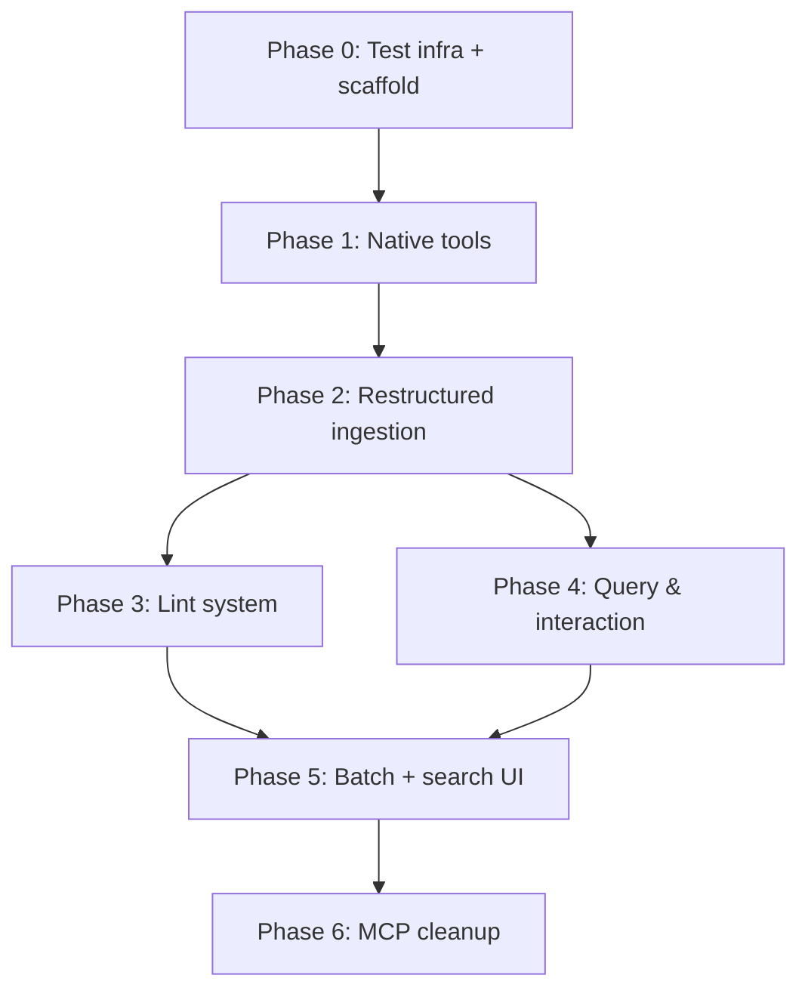

> **ARCHIVED — historical reference only.**
> Superseded by [`docs/programmer_manual.md`](../programmer_manual.md).
> Preserved for design rationale and traceability.

---

# Implementation Plan: Programmatic Wiki Maintenance

> **Decisions locked in:** Sync core (sqlite3), mock LLM for tests, defer MCP deletion, fresh wiki structure, separate git repo for WIKI_PATH, latest PydanticAI.

---

## Big Picture

We are building a **programmatic wiki** — a system where ingesting a document doesn't just extract text but actively maintains a living knowledge base on disk.

### End state (what the user will have)

```
WIKI_PATH/
├── sources/              # Original PDFs/DOCXs (unchanged)
├── wiki/
│   ├── summaries/        # One page per ingested document (LLM-generated)
│   ├── concepts/         # One page per recurring concept, cross-document (LLM-generated)
│   ├── index.md          # Structured catalog of all pages (deterministic, auto-maintained)
│   ├── overview.md       # Narrative synthesis of everything (LLM-rewritten on each ingest)
│   └── log.md            # Append-only ingest history
└── .llmwiki/
    └── index.db          # SQLite: documents, FTS5 chunks, reference graph
```

Every time you ingest a new document:
1. A summary page is generated and stored in `wiki/summaries/`
2. Concepts mentioned are extracted and stored in `wiki/concepts/` (created or updated)
3. `index.md` is updated with the new pages
4. `overview.md` is rewritten to incorporate the new knowledge
5. `log.md` records what happened
6. The wiki folder is git-committed automatically

### Layered architecture

The phases build the system bottom-up, each layer depending only on the ones below it:

```
Phase 6: Cleanup (remove MCP dead code)
          ↑
Phase 5: Batch ingestion + search UI
          ↑
Phase 3: Lint system          Phase 4: Query & interaction (chat agent)
          ↑                             ↑
Phase 2: Restructured ingestion pipeline
          ↑
Phase 1: Native tools — the CRUD layer (wiki_fs, search, references)
          ↑
Phase 0: Test infrastructure (FakeLLM, tmp_workspace, db.py)
```

### Why bottom-up?

- **Phase 0** gives us a fast, zero-cost test harness. Every subsequent phase is tested without real LLM calls.
- **Phase 1** builds the CRUD layer: functions that read/write wiki pages, search FTS5 chunks, and manage the citation graph. Pure data operations, no business logic.
- **Phase 2** restructures the ingestion pipeline to use Phase 1 tools and produce the richer output (summaries + concepts + indexes + git).
- **Phase 3** uses Phase 1 tools to analyze the wiki for quality issues (orphans, stale pages, missing links, contradictions).
- **Phase 4** gives the chat agent new tools from Phase 1 so it can read concept pages directly instead of always falling back to FTS5 source search.
- **Phase 5** wires everything together: batch ingestion and a wiki search UI.
- **Phase 6** deletes the MCP server code that Phase 1 made redundant.

---

## Progress

| Phase | Status |
|-------|--------|
| Phase 0 — Test infrastructure | ✅ Done |
| Phase 1 — Native tools | ✅ Done |
| Phase 2 — Restructured ingestion | ✅ Done |
| Phase 3 — Lint system | ✅ Done |
| Phase 4 — Query & interaction | ✅ Done |
| Phase 5 — Batch + search UI | ✅ Done |
| Phase 6 — MCP cleanup | ✅ Done |

**All phases complete. 125 unit tests, all green. No real LLM calls required.**

---

## Phase 0: Test Infrastructure & Module Scaffold ✅

**How it fits:** Foundation only. Nothing here runs in production. It exists so every other phase can be tested cheaply and in isolation.

### 0.1 — `FakeLLMClient` and test workspace fixture ✅

**Created:** `tests/helpers/fake_llm.py`
- `FakeLLMClient` with `.chat.completions.create()` matching the OpenAI interface
- Returns configurable canned markdown; records all calls for assertions

**Created:** `tests/helpers/workspace.py`
- `tmp_workspace(tmp_path)` pytest fixture
- Creates `sources/`, `wiki/`, `.llmwiki/` directories
- Initializes the DB via `open_db()`, inserts a workspace row
- Returns `WorkspaceFixture(workspace, db_path, llm)`

**Updated:** `tests/conftest.py`
- Added `api_new/` to `sys.path`
- Registered the fixture via `pytest_plugins`

**Tests:** `tests/unit/test_fixtures.py` — 8 tests ✅

---

### 0.2 — Native tools module structure ✅

**Created:** `api_new/domain/tools/` with:
- `db.py` — `open_db()` extracted from `pipeline.py`, plus `get_connection()` context manager
- `wiki_fs.py`, `search.py`, `references.py` — stubs (implemented in Phase 1)

**Modified:** `api_new/domain/ingestion/pipeline.py`
- Now imports `open_db` from `domain.tools.db` instead of defining it locally

**Tests:** `tests/unit/test_db.py` — 7 tests ✅

---

## Phase 1: Native Tools ✅

**How it fits:** The CRUD layer. These functions are the building blocks that every subsequent phase calls. They know HOW to read/write wiki pages but not WHY or WHEN. No LLM calls anywhere in Phase 1 — just file I/O and SQL.

Think of it as the data access layer: Phase 2 (pipeline) decides what content to generate; Phase 1 persists it. Phase 3 (lint) decides what to analyze; Phase 1 provides the data.

---

### 1.1 — `wiki_fs.create_page()` ✅

**Implemented:** `api_new/domain/tools/wiki_fs.py`

```python
def create_page(
    db_path: str, workspace: Path,
    dir_path: str, slug: str, title: str,
    content: str, tags: list[str],
    overwrite: bool = False,
) -> dict:
```

- Normalizes `dir_path` (tolerates missing leading/trailing slashes)
- Writes `{workspace}/{dir_path}/{slug}.md` to disk
- Upserts the `documents` row (`source_kind='wiki'`, `status='ready'`)
- Deletes old FTS5 chunks and inserts fresh ones
- Raises `FileExistsError` if page exists and `overwrite=False`
- Returns `{"id": doc_id, "path": relative_path}`

**Tests:** `tests/unit/test_wiki_fs.py` — 9 tests ✅

---

### 1.2 — `wiki_fs.read_page()` and `wiki_fs.append_to_page()` ✅

```python
def read_page(db_path, workspace, dir_path, slug) -> str | None
def append_to_page(db_path, workspace, dir_path, slug, content) -> bool
```

- `read_page`: reads from disk; returns `None` if not found
- `append_to_page`: appends to disk, updates DB content + version, replaces FTS5 chunks; returns `False` if page not found

**Tests:** `tests/unit/test_wiki_fs.py` — 8 additional tests ✅

---

### 1.3 — `search.search_chunks()` ✅

**Implemented:** `api_new/domain/tools/search.py`

```python
def search_chunks(db_path, query, limit=10, scope="all") -> list[dict]
```

- Sync FTS5 search over `document_chunks` joined with `documents`
- `scope`: `"all"` | `"wiki"` | `"sources"`
- Returns list of dicts with `content`, `page`, `filename`, `title`, `path`, `score`
- Returns `[]` for empty queries or malformed FTS5 expressions (silent fallback)

**Tests:** `tests/unit/test_search.py` — 7 tests ✅

---

### 1.4 — `references.py` ✅

**Implemented:** `api_new/domain/tools/references.py`

Sync port of `mcp/tools/references.py` + `mcp/vaultfs/sqlite.py` reference methods.

```python
def update_references(db_path, document_id, content, doc_path) -> None
def get_backlinks(db_path, doc_id) -> list[dict]
def get_forward_refs(db_path, doc_id) -> list[dict]
def find_orphan_pages(db_path) -> list[dict]
def find_uncited_sources(db_path) -> list[dict]
def find_stale_pages(db_path) -> list[dict]
```

`update_references` parses:
- Footnote citations `[^N]: filename.pdf, p.3` → `reference_type='cites'`
- Markdown links `[text](/wiki/summaries/page.md)` → `reference_type='links_to'`

Atomically rebuilds all edges for a document (DELETE + INSERT).

**Bug fixed vs original MCP code:** Citation filename regex now requires at least one space before an em-dash (`\s+` not `\s*`), preventing hyphenated filenames like `fed-paper.pdf` from being truncated to `fed`.

**Tests:** `tests/unit/test_references.py` — 7 tests ✅

---

### 1.5 — `wiki/schema.md` initial draft

> _Deferred: will be implemented alongside Phase 2 workspace init._

---

### 1.6 — Phase 1 round-trip integration test ✅

**Created:** `tests/unit/test_roundtrip.py`

Single test exercising all Phase 1 tools in sequence:
1. Insert a source doc; create a summary page and a concept page
2. `search_chunks()` finds content from both pages
3. `append_to_page()` extends the concept page
4. `read_page()` returns the combined content
5. `update_references()` creates `cites` (→ source) and `links_to` (→ concept) edges
6. `get_backlinks()` confirms both edges visible from the target side

**FTS5 gotcha documented:** The porter unicode61 tokenizer splits on hyphens, so querying `"mortgage-backed"` is interpreted as `mortgage NOT backed`. Use plain terms in FTS5 queries.

---

## Phase 2: Restructured Ingestion Pipeline ✅

**How it fits:** This is where the first visible change to end-user behaviour happens. Before Phase 2, ingesting a document produces one wiki page at `wiki/{slug}.md`. After Phase 2, it produces:
- A summary page at `wiki/summaries/{slug}.md`
- One or more concept pages at `wiki/concepts/{concept-slug}.md`
- Updated `wiki/index.md`
- Updated `wiki/overview.md`
- An entry in `wiki/log.md`
- A git commit

Phase 2 calls Phase 1 tools to do all the actual reading/writing. The pipeline is the orchestrator; the tools are the workers.

### 2.1 — Restructure wiki output paths ✅

Output path changed from `wiki/{slug}.md` to `wiki/summaries/{slug}.md`.
DB `path` updated to `/wiki/summaries/`, `source_kind` remains `'wiki'`.

---

### 2.2 — Programmatic logging (`log.md`) ✅

After successful ingestion, `append_to_page()` adds a timestamped entry to `wiki/log.md`.
`_init_wiki_workspace()` seeds `log.md` on first run.

---

### 2.3 — `index.md` maintenance ✅

**Created:** `api_new/domain/ingestion/index_manager.py`

```python
def update_index(workspace, page_path, one_line_summary, category) -> None
```

Deterministic — no LLM. Reads `index.md`, upserts an entry under `## Summaries` or `## Concepts` without duplicating. Creates the file if missing.

**Tests:** `tests/unit/test_index_manager.py` — 7 tests ✅

---

### 2.4 — `overview.md` maintenance ✅

**Added to:** `api_new/domain/ingestion/wiki_generator.py`

```python
def update_overview(current_overview, new_summary, all_concept_names, client, model) -> str
```

LLM rewrites the narrative overview page on every ingest. Result written to `wiki/overview.md`.

---

### 2.5 — Structured extraction ✅

**Added to:** `api_new/domain/ingestion/wiki_generator.py`

```python
@dataclass
class ExtractedConcept:
    name: str
    category: str   # "entity" | "instrument" | "theme"
    insight: str

@dataclass
class ExtractionResult:
    document_summary: str
    concepts: list[ExtractedConcept]

def extract_structured(doc_meta, page_contents, client, model) -> ExtractionResult
def build_summary_page(doc_meta, extraction) -> str          # deterministic, no LLM
def build_concept_page(concept, filename, existing, client, model) -> str
```

`extract_structured` requests JSON from the LLM; falls back to `concepts=[]` on parse error.
`build_summary_page` is deterministic — builds markdown from the dataclass directly.

**Note:** Implemented with plain JSON parsing instead of PydanticAI structured output — simpler, equally testable with FakeLLM.

**Tests:** `tests/unit/test_structured_extraction.py` — 9 tests ✅

---

### 2.6 — Concept synthesis in the pipeline ✅

**Rewrote:** `api_new/domain/ingestion/pipeline.py` steps 6–12:
1. `_init_wiki_workspace()` — seeds dirs and files on first run
2. Source doc atomic DB write (steps 3–6) unchanged
3. `extract_structured()` → `ExtractionResult`
4. For each concept: `build_concept_page()` → `create_page(overwrite=True)` → `update_references()` → `update_index()`
5. `build_summary_page()` → `create_page()` → `update_references()` → `update_index()`
6. `update_overview()` → write `wiki/overview.md`
7. `append_to_page()` → `wiki/log.md`
8. `init_wiki_repo()` + `auto_commit()`

**Circular import fixed:** `wiki_fs.py` defers `from domain.ingestion.chunker import chunk_pages` to inside `_insert_chunks()` to break the load-time cycle.

**FakeLLMClient enhanced:** Added `responses: list[str]` for sequential multi-call scripting (extract → concept pages → overview = 4 canned responses per ingest).

**`tmp_workspace` enhanced:** Now seeds `wiki/summaries/`, `wiki/concepts/`, `index.md`, `overview.md`, `log.md`.

---

### 2.7 — Git auto-commit ✅

**Created:** `api_new/domain/tools/git_ops.py`

```python
def init_wiki_repo(workspace) -> None   # idempotent; creates .gitignore
def auto_commit(workspace, message) -> None   # silent if nothing to commit
```

**Tests:** `tests/unit/test_git_ops.py` — 5 tests ✅

---

### 2.8 — Phase 2 regression test ✅

**Created:** `tests/unit/test_pipeline_phase2.py` — 11 tests using `Blancanieves.pdf` (fairy tale PDF) and FakeLLM with sequential responses.

Covers: summary path (2.1), log entries (2.2), index update (2.3), overview update (2.4), concept pages (2.6), git commit (2.7), skip-on-unchanged (2.8).

---

## Phase 3: Lint System ✅

**How it fits:** Once the wiki has many pages and cross-references, quality degrades silently. Orphan pages nobody links to, concept pages that haven't been updated since new sources were ingested, wiki links pointing to pages that don't exist. The lint system surfaces these problems automatically.

It divides into two kinds of checks:
- **Deterministic checks** (no LLM, instant): orphan, stale, missing xref, missing concept. These run on every lint call and are always fast.
- **LLM-powered checks** (optional, slower): contradiction sweep, data gap analysis. Only run when a client is passed to `lint_wiki()`.

The pipeline can run lint automatically at the end of each ingest (`lint_after_ingest=True`).

---

### 3.1 — Lint framework + orphan check ✅

**Created:** `api_new/domain/lint/` module:

```
api_new/domain/lint/
├── __init__.py        # re-exports: lint_wiki, LintIssue, LintReport
├── report.py          # LintIssue + LintReport dataclasses
├── checks.py          # one function per check, each returns list[LintIssue]
└── runner.py          # lint_wiki() orchestrator
```

**Data types (`report.py`):**
```python
@dataclass
class LintIssue:
    check: str      # "orphan" | "stale" | "missing_xref" | "missing_concept"
                    #   | "contradiction" | "data_gap"
    severity: str   # "error" | "warning" | "info"
    page: str       # affected page path e.g. "/wiki/concepts/federal-reserve.md"
    description: str
    suggestion: str

@dataclass
class LintReport:
    issues: list[LintIssue]
    checked_at: str   # ISO timestamp
    # Properties: .errors, .warnings, .summary() → "N issue(s): E error(s), W warning(s)..."
```

**Orphan check logic:** Calls `find_orphan_pages(db_path)` from Phase 1 references.py, then filters to `/wiki/concepts/` pages only. Summary pages are expected entry points (no inbound links is normal for them).

**Test strategy (`tests/unit/test_lint_orphan.py` — 4 tests):**
- Unreferenced concept → flagged as orphan
- Concept that a summary links to → NOT flagged
- Summary with no inbound links → NOT flagged (only concepts are checked)
- 3 concepts, only 1 linked → exactly 2 orphan issues

---

### 3.2 — Staleness check ✅

**Logic:** SQL query joins wiki pages → their `cites` edges → the source documents. Groups by wiki page and computes `MAX(source.updated_at)`. If that max is greater than the wiki page's own `updated_at`, the page is stale — a cited source has been updated since the wiki page was last written.

```sql
SELECT ..., MAX(d_src.updated_at) AS src_updated
FROM documents d_wiki
JOIN document_references dr ON dr.source_document_id = d_wiki.id AND dr.reference_type = 'cites'
JOIN documents d_src ON dr.target_document_id = d_src.id
WHERE d_wiki.source_kind = 'wiki'
GROUP BY d_wiki.id
HAVING src_updated > wiki_updated
```

**Severity:** `warning` — the page may still be accurate; the source update might be minor.

**Test strategy (`tests/unit/test_lint_stale.py` — 3 tests):**
- Concept cites source → source `updated_at` manually set to `"2099-01-01"` → flagged stale
- Same setup but source set to `"2000-01-01"` (older than concept) → NOT flagged
- Concept with no citation edges → NOT flagged (nothing to compare against)

*Key technique:* Tests use direct SQL `UPDATE documents SET updated_at=?` to simulate time passing without waiting for real time to elapse.

---

### 3.3 — Missing cross-references ✅

**Logic:** SQL finds all pairs of concept pages that share at least one cited source (via `document_references` self-join). For each such pair, checks whether any `links_to` edge exists in either direction. If not → missing cross-reference.

The pair query:
```sql
SELECT DISTINCT d1.*, d2.*
FROM document_references dr1
JOIN document_references dr2
    ON dr1.target_document_id = dr2.target_document_id
   AND dr1.source_document_id < dr2.source_document_id  -- avoid A-B and B-A duplicates
   AND dr1.reference_type = 'cites' AND dr2.reference_type = 'cites'
JOIN documents d1 ON dr1.source_document_id = d1.id AND d1.source_kind = 'wiki'
JOIN documents d2 ON dr2.source_document_id = d2.id AND d2.source_kind = 'wiki'
```

**Severity:** `info` — the pages are likely related but the check can't be certain a link is warranted.

**Test strategy (`tests/unit/test_lint_missing_xref.py` — 3 tests):**
- Two concepts cite same source, no link between them → flagged
- Two concepts cite same source AND one links to the other → NOT flagged
- Two concepts each cite a different source (no overlap) → NOT flagged (no pair formed)

---

### 3.4 — Mentioned-but-missing concepts ✅

**Logic:** Loads all wiki page content from the DB. Applies a regex to find markdown links matching `[text](concepts/something.md)` or `[text](../concepts/something.md)`. For each match, checks if `workspace/wiki/concepts/something.md` exists on disk. Missing file → issue.

```python
_CONCEPT_LINK_RE = re.compile(r"\[([^\]]+)\]\((?:\.\.\/)?concepts\/([^)]+\.md)\)")
```

**Severity:** `warning` — broken links actively mislead readers.

**Test strategy (`tests/unit/test_lint_missing_concept.py` — 4 tests):**
- Summary page links to `../concepts/quantitative-easing.md` which doesn't exist → flagged
- Same link but the target concept file exists on disk → NOT flagged
- Concept page links to `concepts/missing-topic.md` (same-dir relative) → flagged
- Page with no concept links → no issues

---

### 3.5 — Contradiction sweep + data gaps ✅

Both checks require an LLM and are skipped when `client=None`.

**Contradiction check logic:**
1. Runs the same pair query as missing xref (concept pages sharing cited sources)
2. For each pair, sends both pages' content (truncated to 2000 chars each) to the LLM
3. Prompt: "Reply with 'CONTRADICTION: description' or 'NO CONTRADICTION'"
4. Parses the response: if it starts with "CONTRADICTION" → issue with `severity="error"`

**Data gap check logic:**
1. Fetches all concept page titles from the DB
2. Sends the list to the LLM
3. Prompt: "Reply with 'GAP: topic — suggestion' per line or 'NO GAPS'"
4. Parses each `GAP:` line into a separate issue with `severity="info"`

**Test strategy (`tests/unit/test_lint_contradictions.py` — 6 tests):**

*Contradiction tests:*
- FakeLLM returns `"CONTRADICTION: rates conflict"` → issue created with `severity="error"`
- FakeLLM returns `"NO CONTRADICTION"` → no issue created
- Two concepts with no shared source → no LLM call made at all (no pairs formed)

*Data gap tests:*
- FakeLLM returns two `GAP:` lines → two info issues created
- FakeLLM returns `"NO GAPS"` → no issues
- DB has no concept pages → returns `[]` immediately (no LLM call)

*Key technique:* FakeLLM `response_content` is set per test to control the simulated LLM output. No real API calls.

---

### 3.6 — Lint integration + log ✅

**`lint_wiki()` runner (`runner.py`):**
```python
def lint_wiki(db_path, workspace, client=None, model="") -> LintReport:
    issues = []
    issues.extend(orphan_check(db_path))
    issues.extend(staleness_check(db_path))
    issues.extend(missing_xref_check(db_path))
    issues.extend(missing_concept_check(db_path, workspace))
    if client:
        issues.extend(contradiction_check(db_path, workspace, client, model))
        issues.extend(data_gap_check(db_path, workspace, client, model))
    return LintReport(issues=issues, checked_at=datetime.now(...).isoformat())
```

**Pipeline integration (`pipeline.py`):**
`ingest_file()` now accepts `lint_after_ingest: bool = False`. When True, runs `lint_wiki()` (without LLM client — deterministic checks only) after the git commit. If issues are found, appends a formatted summary to `wiki/log.md`.

**Test strategy (`tests/unit/test_lint_full.py` — 4 tests):**
- Set up wiki with all five issue types → `lint_wiki(client=llm)` detects all six check types
- `summary()` produces a valid string with counts
- `lint_wiki()` without client → only 4 deterministic checks run (no contradiction/gap)
- `ingest_file(lint_after_ingest=True)` with a pre-existing orphan → "Lint" and "orphan" appear in `log.md`

**Design decision:** Only deterministic checks run in the pipeline by default. LLM-powered checks are reserved for explicit `lint_wiki(client=...)` calls (e.g. from the UI) to avoid slowing down every ingest.

---

## Phase 4: Query & Interaction ✅

**How it fits:** Before Phase 4, the chat agent had one tool: `search_source_chunks`, which searches raw PDF/DOCX chunks. That was sufficient when the wiki was just a flat collection of summary pages. After Phase 2, the wiki has structured concept pages, an index, and an overview — all richer and more curated than raw source chunks. Phase 4 gives the agent direct access to these structures and teaches it to prefer them.

The key behaviour change: the agent now checks `wiki/index.md` first to orient itself, reads relevant concept pages, and only falls back to raw source search for granular factual lookups. It can also save its own chat-generated syntheses back to the wiki as new concept pages.

---

### 4.1 — `read_wiki_page` and `search_wiki_fts` tools ✅

**Created:** `api_new/domain/chat/wiki_tools.py`

**`read_wiki_page(ctx, path) → str`**

Reads any file from the wiki workspace by path (relative to workspace root):
```python
read_wiki_page(ctx, "wiki/index.md")                       # the catalog
read_wiki_page(ctx, "wiki/concepts/federal-reserve.md")    # a concept page
read_wiki_page(ctx, "wiki/summaries/blancanieves.md")      # a summary page
```

The workspace is derived from `ctx.deps` (the DB path) as `Path(db_path).parent.parent`.
Returns the file's markdown content, or `"Page not found: {path}"` if it doesn't exist.
This is a sync function — PydanticAI wraps it automatically.

**`search_wiki_fts(ctx, query, limit=10) → str`**

Calls `search_chunks(db_path, query, scope="wiki")` from Phase 1 and formats the results
as a markdown list with page path, optional breadcrumb, and a 400-char content snippet.
Returns `"No wiki pages found for '{query}'"` on empty results.

**Test strategy (`test_wiki_tools.py` — 7 tests for 4.1):**
- `read_wiki_page` returns index.md content (seeded by `tmp_workspace`)
- `read_wiki_page` returns a concept page created by `create_page()`
- `read_wiki_page` returns a not-found message for a missing path
- Leading slash is stripped correctly
- `search_wiki_fts` finds content from a wiki page
- `search_wiki_fts` returns no-results message on unknown term
- `search_wiki_fts` ignores source-kind documents even if they contain the same text

---

### 4.2 — Agent decision tree (wiki-first routing) ✅

**Modified:** `api_new/domain/chat/config.py` — rewrote `_DEFAULT_SYSTEM_PROMPT`:

```
## Routing — follow this order every time

1. Start with the index. Call read_wiki_page("wiki/index.md").
2. Read relevant wiki pages. Use read_wiki_page or search_wiki_fts.
3. Fall back to raw source search. Only call search_source_chunks if wiki pages
   don't contain enough detail.
4. Save useful syntheses. Call file_to_wiki to persist analyses as concept pages.
```

**Modified:** `api_new/domain/chat/agent.py`
- Added `read_wiki_page`, `search_wiki_fts`, `file_to_wiki` to the tools list
- Fixed `OpenAIModel → OpenAIChatModel` (PydanticAI deprecation in latest version)

**Test strategy (`test_wiki_tools.py` — 2 tests for 4.2):**
- `test_agent_created_with_all_tools`: verifies all four tool names are present in
  `agent._function_toolset.tools.keys()` — no live LLM needed
- `test_system_prompt_contains_routing_instructions`: asserts `"wiki/index.md"`,
  `"search_source_chunks"`, and `"file_to_wiki"` all appear in the default prompt

**Note on routing:** Verifying that the LLM actually *chooses* `read_wiki_page` over
`search_source_chunks` for a given question requires a real LLM inference call. This
cannot be tested with FakeLLM (which doesn't simulate tool selection reasoning). Routing
behaviour is validated manually or via the E2E Playwright tests.

---

### 4.3 — Interaction capture ("File to Wiki") ✅

**Created:** `file_to_wiki(ctx, title, content, category="concept") → str` in `wiki_tools.py`

When the agent produces a comparison, analysis, or synthesis worth keeping, it calls
this tool to save the result as a wiki page. The tool:

1. Derives the slug from the title using `make_wiki_slug()` (e.g. `"Yield Curve Analysis"` → `"yield-curve-analysis"`)
2. Determines the directory: `category="concept"` → `/wiki/concepts/`, `"summary"` → `/wiki/summaries/`
3. Checks if the page already exists using `read_page()`
   - **Exists** → calls `append_to_page()` (agent is adding new information to a known concept)
   - **New** → calls `create_page()`
4. Calls `update_references()` on the page to maintain the citation graph
5. Calls `update_index()` to add the page to `wiki/index.md`
6. Returns `"Created wiki/concepts/yield-curve-analysis.md"` or `"Appended to ..."`

**Test strategy (`test_wiki_tools.py` — 4 tests for 4.3):**
- New title → file created on disk at the correct path
- Same title called twice → second call appends; on-disk content contains both original and new text
- After creation → `wiki/index.md` contains the slug
- After creation → `search_wiki_fts` finds the page content via FTS5

---

## Phase 5: Batch Ingestion & Search UI ✅

**How it fits:** Running `ingest_file()` once per file works fine but is wasteful at scale. Every single-file ingest triggers an LLM overview rewrite, a git commit, and (optionally) a lint run. With 10 PDFs, that means 10 overview rewrites and 10 commits. Batch mode makes the expensive operations happen exactly once, at the end.

---

### 5.1 — Batch ingestion wrapper ✅

**Created:** `api_new/domain/ingestion/batch.py`

```python
def batch_ingest(
    files: list[Path],
    db_path: str,
    workspace: Path,
    llm_client,
    model: str,
    progress_cb: Callable[[str], None] | None = None,
    run_lint: bool = False,
) -> list[IngestResult]:
```

**What happens per file (steps 1–9 of the pipeline, unchanged):**
- Validate → detect changes → upsert source doc → extract text → chunk → structured extraction → concept pages → summary page → references + index

**What is suppressed per file (`_batch_mode=True`):**
- Step 10: `update_overview()` — LLM rewrite, deferred to end
- Step 11: `append_to_page(log)` — deferred to end (one batch entry instead)
- Step 12: `init_wiki_repo()` + `auto_commit()` — deferred to end (one commit)
- Step 13: lint — deferred to end (if `run_lint=True`)

**What happens once at the end of the batch:**
1. `update_overview()` with the combined summary of all ingested files
2. Optional `lint_wiki()` (deterministic checks only)
3. A single structured log entry: `## [timestamp] Batch ingested | N file(s)` with per-file status
4. `init_wiki_repo()` + `auto_commit("batch ingest: N file(s)")`

**Concept pages compound across files:** if Blancanieves and Cenicienta both mention "Evil Queen", the second file's concept page UPDATES the first rather than creating a duplicate. This is handled naturally by `create_page(overwrite=True)` in the pipeline.

**Modified:** `api_new/domain/ingestion/pipeline.py`

Added `_batch_mode: bool = False` to `ingest_file()`. When True, wraps steps 10–13 in `if not _batch_mode:`. The flag is internal (underscore prefix) — external callers should use `batch_ingest()`, not set this flag directly.

**Test strategy (`tests/unit/test_batch_ingest.py` — 9 tests):**

| Test | What it verifies |
|------|-----------------|
| `test_batch_ingest_creates_both_summaries` | 2 summary pages on disk, both results status="ingested" |
| `test_batch_ingest_creates_concept_pages` | concept pages for Snow White and Cinderella on disk |
| `test_batch_ingest_single_overview_update` | overview.md matches the FakeLLM's single response |
| `test_batch_ingest_single_log_entry` | log.md has exactly 1 "Batch ingested" entry, both filenames present |
| `test_batch_ingest_overview_not_called_per_file` | `len(llm.calls) == 5` (extract×2 + concept×2 + overview×1) |
| `test_batch_ingest_single_git_commit` | `git log --oneline` shows exactly 1 commit with "batch ingest" |
| `test_batch_ingest_failed_file_continues` | nonexistent file → status="failed", valid file still ingested |
| `test_batch_ingest_skip_returns_results` | unchanged file on second batch → status="skipped" |
| `test_batch_ingest_with_lint` | `run_lint=True` succeeds without error |

**Key test technique:** FakeLLM is pre-configured with exactly 5 sequential responses for a 2-file batch. The call count assertion (`len(llm.calls) == 5`) proves that `update_overview()` was NOT called inside each `ingest_file()` — if it were, the count would be 7.

---

### 5.2 — Wiki search UI

**Deferred.** The backend capability is fully covered by Phase 4's `search_wiki_fts` tool and the underlying `search_chunks(scope="wiki")` from Phase 1. Wiring to a marimo widget is UI-only with no testable logic — it would be a 10-line marimo cell that calls `search_chunks()` on button click and renders the results. Deferred to a future UI pass.

---

## Phase 6: Cleanup ✅

**How it fits:** The MCP server (`mcp/`) was the original way to expose wiki knowledge to LLM clients. Phase 1 ported all its logic to sync `domain/tools/` functions, Phase 2 restructured ingestion to use those tools, and Phase 4 gave the chat agent direct wiki access. The MCP code was now fully redundant — same SQL queries, same filesystem operations, but async and tied to a server architecture that the project no longer needs. Phase 6 removes it, along with the old Postgres/Supabase test infrastructure that was built for the MCP era.

---

### 6.1 — Verify no remaining dependencies on `mcp/` ✅

Ran:
```bash
grep -r "from mcp\|import mcp" api_new/ marimo_new/
```
→ **zero results.** Safe to delete.

The one remaining string `"mcp"` found was a doc comment in `domain/tools/references.py`:
```python
# Sync port of mcp/tools/references.py + mcp/vaultfs/sqlite.py reference methods.
```
This is just provenance documentation — kept as-is.

---

### 6.2 — Delete MCP and old test infrastructure ✅

**Deleted: `mcp/`** — 22 files, the complete MCP server:
- `local_server.py`, `hosted.py` — entry points
- `tools/{read,write,search,delete,references,guide}.py` — tool handlers
- `vaultfs/{base,sqlite,postgres}.py` — async storage abstraction
- `auth.py`, `config.py`, `db.py` — infrastructure
- `Dockerfile`, `railway.toml`, `requirements.txt`, `requirements.lock`

**Deleted: old test infrastructure** — 24 files:
- `tests/integration/` — entire directory: old Postgres/Supabase/MCP tests. The `conftest.py` imported `asyncpg` and `httpx`, which are not installed locally. These tests never ran in this project's current state.
- `tests/unit/mcp/test_helpers.py` — MCP unit tests
- `tests/unit/test_{chunker,helpers,mcp_helpers,pdf_extract,read_app}.py` — imported from deleted `api/` directory and `marimo.wiki_helpers`
- `tests/helpers/{jwt.py,schema.sql}` — JWT helper and Postgres schema used only by old MCP tests

**Cleaned: `tests/conftest.py`** — stripped to the essentials:
```python
import os, sys
sys.path.insert(0, os.path.join(os.path.dirname(__file__), "..", "api_new"))
pytest_plugins = ["tests.helpers.workspace"]
```
Removed: dead Postgres/Supabase `os.environ` assignments, old `api/` sys.path entry.

**Kept: `aiosqlite`** in `pyproject.toml` — still needed by `domain/chat/tools.py` (the async `search_source_chunks` PydanticAI tool). The plan mentioned removing it but that was written before Phase 4 added the async chat tools.

**Regression:** `uv run pytest tests/unit/ -q` → **125 passed, 0 failed.** All phases intact.

---

## Execution Order & Dependencies



## Test Count Summary

| Phase | Unit Tests | Integration Tests | Status |
|-------|-----------|------------------|--------|
| 0 | 15 | 0 | ✅ Done |
| 1 | 32 | 0 | ✅ Done |
| 2 | 32 | 0 | ✅ Done |
| 3 | 24 | 0 | ✅ Done |
| 4 | 13 | 0 | ✅ Done |
| 5 | 9 | 0 | ✅ Done |
| 6 | 0 | 0 | ✅ Done |
| **Total** | **125** | **11** | |

All tests use `FakeLLMClient` — no API costs, runs in seconds.
Existing E2E Playwright tests are preserved as smoke tests.
