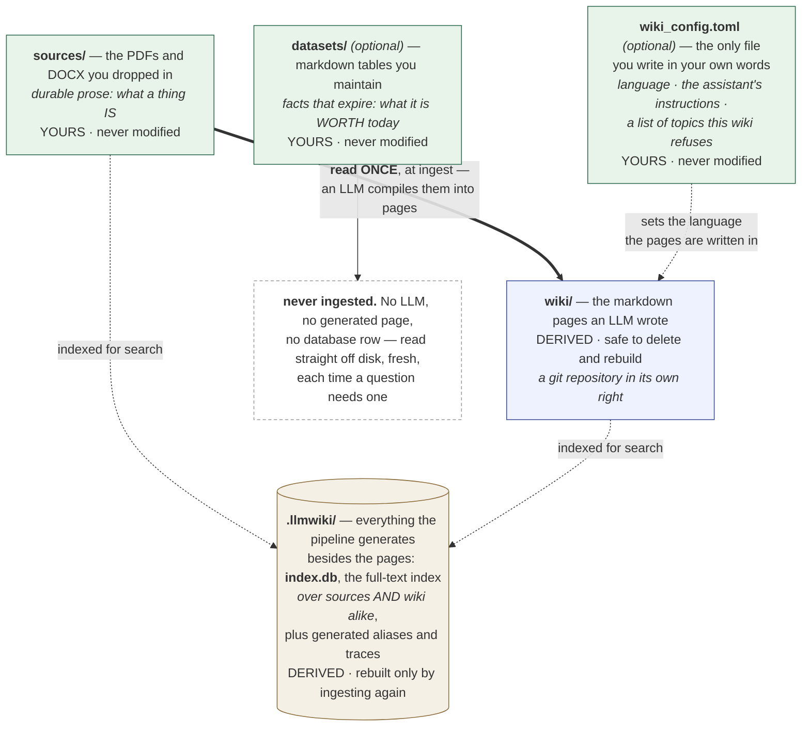
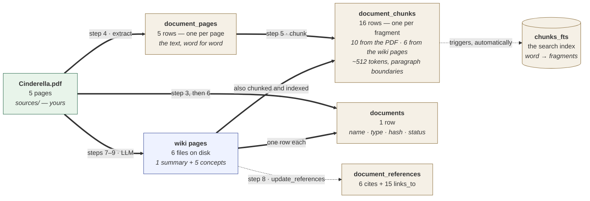
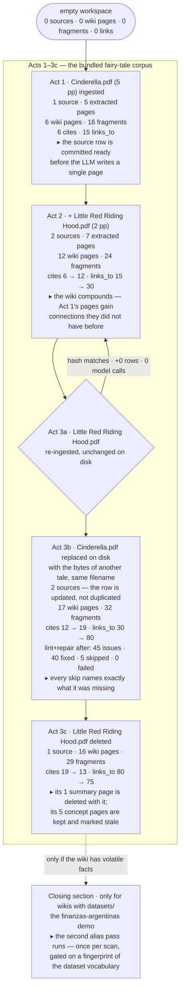
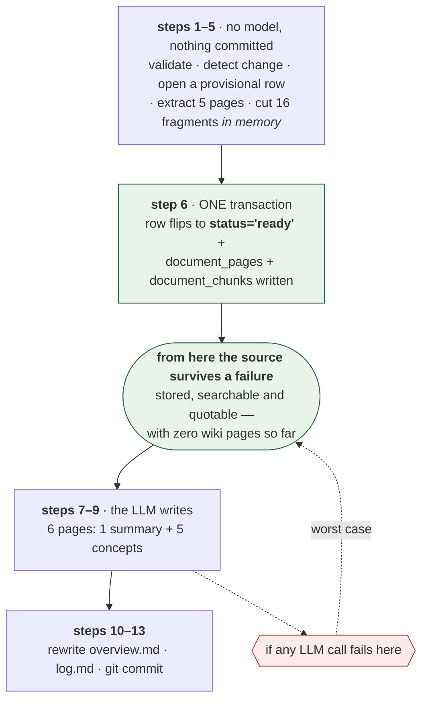
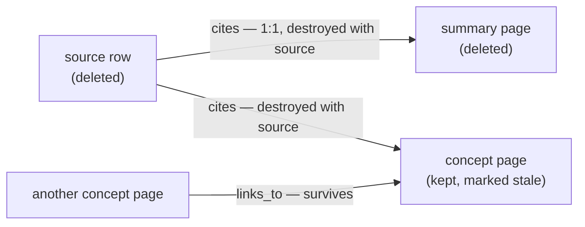

# Ingestion Walkthrough

**Start here.** This is the first of two companion documents. This one follows
what the system **builds** when you give it a document; its sibling,
[`query_walkthrough.md`](query_walkthrough.md), follows what happens when you
**ask it something**. Read them in that order and you will have the whole
system.

**Audience.** Someone who writes software but has never seen this project. You
can read SQL and Python; nothing else is assumed. Terms from the world of LLMs
and search — *token*, *embedding*, *RAG*, *chunk* — are defined where they first
appear, and so is every term this project made up. What this document adds over
the reference material is the *reasoning*: why each step exists, not just that
it ran.

**How it is arranged.** First the vocabulary and the pieces, so the rest makes
sense. Then the core of the document: **five acts** that follow one small
collection of documents through its whole life — a first document arrives, a
second one joins it, one is re-ingested unchanged, one is edited, one is deleted.
The acts are numbered 1, 2, 3a, 3b and 3c, and later sections refer back to them
by those names.

**It is also in two parts.** Everything up to [Wikis whose facts
change](#wikis-whose-facts-change) is about any wiki at all, and a reader
building the ordinary kind can stop at that heading having missed nothing. The
sections after it are for wikis that also hold facts with an expiry date —
exchange rates, prices, anything true only as of a given day — and switch to a
different example collection to say so.

**The numbers are real.** Every figure quoted below — row counts, link counts,
log lines — was captured by actually running the pipeline, not written by hand.
The full inventory lives in the generated
[appendix](ingestion_walkthrough_appendix.md); regenerate it any time with:

```bash
uv run python scripts/capture_ingestion_walkthrough.py
```

Because the appendix is machine-generated and this document is hand-written
prose around it, a change to the pipeline's behavior shows up in the appendix on
the next run. Which figures carry that signal is worth stating, because not all
of them do. Row counts, fragment counts and link counts are produced by code and
do not move unless the pipeline moves, so a disagreement between one of those and
the prose here means the pipeline changed and is not a typo to quietly fix. Page
names and generated prose are a different matter: they come from a model running
at a temperature above zero, and they differ between two runs over an unchanged
corpus. The [next section](#the-pieces-before-anything-moves) works out what that
costs.

## Where the idea comes from

Andrej Karpathy sketched the pattern this project implements in a [short public
note](https://x.com/karpathy/status/2039805659525644595): instead of
re-discovering knowledge from raw text on every question, let an LLM
**incrementally build and maintain a persistent encyclopedia** of markdown
pages, and answer from that.

The contrast is with the standard approach, usually called **RAG** —
*retrieval-augmented generation*. In RAG you keep your documents chopped into
fragments; when a question arrives you fetch the fragments that look most
relevant and paste them into the model's prompt, so the answer is "augmented"
by material "retrieved" at that moment. Nothing is remembered between
questions: the same document is re-read, re-interpreted and re-paid-for every
single time someone asks about it, and the answer is only ever as good as
whatever fragments happened to surface.

Karpathy's move is to do the interpreting **once**, up front, and write the
result down as pages a human could also read. The three layers he describes map
onto this project like this:

| Karpathy's layer | Here |
|---|---|
| Raw sources, never modified | `workspace/sources/` — the PDFs and DOCX files you dropped in |
| The wiki, written by the LLM | `workspace/wiki/` — generated markdown pages |
| The schema — the conventions the LLM writes to | the system prompt, plus an optional per-wiki `wiki_config.toml` |

That note proposes fifteen things in total. §1 of the [Programmer
Manual](programmer_manual.md#1-philosophy--karpathy-alignment) goes through them
one by one and marks each as done, partly done, or deliberately skipped. If what
you want is the scorecard, read that instead of this.

**This document does something different: it shows how the first row of that
table turns into the second one.** How a PDF or DOCX becomes those wiki pages, what gets
stored along the way, and why each step happens in the order it does. The
comparison with Karpathy's note comes back at the [end of the query
walkthrough](query_walkthrough.md#what-this-adds-to-the-original-idea), once you
have seen both halves and can judge it for yourself.

## The pieces, before anything moves

A **workspace** is one wiki: a single folder holding everything about one
subject. Point the app at it and that is the wiki you are working on. Nothing is
global — you can have as many workspaces as you have subjects, and they share
nothing.

Inside one, five things matter:



The three green boxes are **yours**, and the
pipeline never writes to them. The blue and brown ones are **derived**: they can
be thrown away and rebuilt from the green ones at any time.

**`wiki_config.toml` deserves a closer look**, because it is the one place where
you tell the system something it could not work out on its own. Every key in it
is optional, and so is the file — a wiki with no config runs on defaults. What
you can put there:

| Section | What it does |
|---|---|
| `[wiki] language` | `"en"` or `"es"`. Governs the language of every generated page **and** of the chat's answers, independently of what language the sources are in. It is read from each wiki's own `wiki_config.toml`, so two wikis on the same machine can be in different languages |
| `[assistant]` | the system prompt sent at the start of every conversation, and the suggested questions shown as buttons in the chat |
| `[fuera_de_alcance]` | *out of scope* — a **blacklist**: topics you know this wiki does not cover and never should answer about. The finance demo lists `cedear`, `cripto`, `bitcoin` |
| `[alias_datos]`, `[falsos_sinonimos]` | other names for things you do cover, and pairs of words that must **not** be treated as the same thing |
| `[pre_retrieval]` | whether questions are routed through code before the model sees them — the subject of the [query walkthrough](query_walkthrough.md) |

**Those last three lists only do anything when `[pre_retrieval]` is on.** That is
worth knowing before you write one: they are read by the code that decides, ahead
of the model, whether a question is answerable — and if that code never runs,
nothing reads them. Write `bitcoin` into the blacklist of a wiki running the
default configuration (pre_retrieval is off) and the assistant will still answer about bitcoin, because
in that configuration the model does its own searching and no scope check stands
in front of it. `wiki_config.example.toml` carries the same warning as a comment
above the three sections — *"The three lists below only matter when
pre_retrieval is on"* — so you may have read it there first. The linter is the
exception — it checks these lists for staleness and contradictions regardless of
the setting.

The blacklist — `[fuera_de_alcance]` — is worth pausing on. Everything else the
system uses to judge "do I cover this?" is read back out of the wiki's own
contents — page titles,
dataset categories. The blacklist is derived from nothing: it is you saying, in
advance, *people will ask about this, we have nothing real to say, do not try.*
On the query side it is checked **first**, before any search runs, so a question
mentioning a blacklisted term is refused without the wiki ever being touched.

What the list holds is **terms**, and a *question*
becomes blacklisted by mentioning one. You have to list the variants yourself,
because this is the one place in the system where matching is literal.
Measured against the finance demo's own list, `["cedear", "cedears", "cripto",
"bitcoin"]`:

```text
BLOCKED   ¿qué es una cripto?
passes    ¿conviene invertir en criptomonedas?
passes    ¿qué son las criptos?
```

The blacklist matches whole words, and a multi-word entry as a contiguous phrase
in that order — `dollar blue` blocks *¿cuánto está el dollar blue?* but not
*blue dollar*. The search index, by contrast, **stems** — `slippers` and
`slipper` land on the same entry, as the
[FTS section](#what-is-truth-and-what-is-disposable) below explains. The
blacklist does not, so write out every form you mean: `cripto`, `criptos`,
`criptomoneda`, `criptomonedas`.

**Alternate names come from two places, and both count.** During ingestion an
LLM reads each document and proposes other names for the concepts it found,
writing them to `.llmwiki/aliases.generated.toml`. That file learns the names
*the documents* use. `[alias_datos]` in `wiki_config.toml` is the other list —
the same section name, in the file you write yourself — for the names the
documents never mention: the finance demo records
`dolar = ["billete verde", "divisa"]`, everyday Argentine slang for the US
dollar that appears in no table of exchange rates. The two files are merged when the config
is read (`vocabulary.merge_aliases`), and the lists are added together rather
than one replacing the other. In the demo they do not overlap, so the example
below is invented. Where they do, the entries collapse into one under **your**
spelling of the name. The two count as one key because the names are compared
after being lowercased and stripped of accents, with `_` read as a space —
`Dólar`, `dolar` and `DOLAR` are the same entry. Had the pipeline also written a
`Dólar` entry:

```toml
# .llmwiki/aliases.generated.toml - written by the pipeline at ingest
[alias_datos]
"Dólar" = ["dólar oficial"]
```

```toml
# wiki_config.toml - written by you
[alias_datos]
dolar = ["billete verde", "divisa"]
```

the merge would give a single entry,
`dolar = ["dólar oficial", "billete verde", "divisa"]`. The generated file says
so in its own opening comment: *do not edit by hand; hand overrides live in
wiki_config.toml `[alias_datos]`*.

**`[falsos_sinonimos]` is the opposite instruction: two words that must never be
treated as the same thing.** The finance demo records one, `cedear =
["accion", "acciones"]` — a CEDEAR is a certificate representing a *foreign*
company's share, so answering a question about one with material about the other
is wrong in a way that reads as fluent and correct. The list acts as a delete
filter when the two alias sources are merged: any alias a canonical must never
have is removed from the result, so a generated alias that wrongly bridges the
two never reaches the query path at all. Alias lists widen what the wiki will
match; this one narrows it back where widening would do damage. The lint pass
also uses it as its suggested remedy — when it finds an alias that is really
another concept's name, what it tells you to do is add the pair here.

**The blacklist and this list answer different questions.** The question is
matched against the blacklist: if a listed term appears in it, the question is
turned away at the first check, before anything is searched.

`[falsos_sinonimos]` is never matched against the question. It works on the
alias map — not the generated file on disk, which is written once at ingest, but
the map assembled from that file every time the wiki is opened. The assembly
reads `wiki_config.toml`: the pipeline's aliases first, your `[alias_datos]`
added on top, then every pair listed in `[falsos_sinonimos]` deleted from the
result. So if the pipeline had recorded *acciones* as another name for *cedear*,
the finished map has no such entry — not overruled at question time, simply
never in the list the roster consults. A question admitted only because that
alias existed is refused instead. Adding a pair therefore takes effect the next
time the wiki is opened: the file on disk is untouched, and there is nothing to
re-ingest.

### All four lists, on one real wiki

Everything above is easier to hold together seen at once. These are verbatim
excerpts from the shipped `examples/finanzas-argentinas` demo.

**What the pipeline wrote** — `.llmwiki/aliases.generated.toml`, first lines:

```toml
# Generated at ingest — do not edit by hand.
# Hand overrides live in wiki_config.toml [alias_datos]; this file is merged UNDER them.

[alias_datos]
"Bolsas y Mercados Argentinos" = ["BCBA"]
"Bonos CER/UVA" = ["Bonos ajustables por inflación", "Bonos CER", "Bonos UVA"]
"Bonos Dólar Linked" = ["Dólar Linked"]
```

Every one of those was read out of the documents in `sources/`. The pass that
decides which concepts a document deserves also returns, for each concept, the
other names that document uses for it. `BCBA` is in `aliases.generated.toml`
because a source says it, not because anyone wrote it into a configuration
file.

Each key on the left is a concept page. `Bolsas y Mercados Argentinos` is
`wiki/concepts/bolsas-y-mercados-argentinos.md`, and the other twelve keys in
this wiki's `aliases.generated.toml` are concept pages as well. A concept page
carries its own name but not the other names for it, so
`aliases.generated.toml` is the only place those are stored.

`aliases.generated.toml` accumulates rather than being rewritten from nothing:
each ingest reads it, adds the concepts from the document just processed,
re-checks the whole map and writes it back. Ingesting the same document twice
therefore adds the same alias once.

That re-check enforces one rule: **an alias may not be the name of something
else this wiki already covers.** An alias that breaks it is dropped instead of
written, and the pipeline prints `⚠️ N alias collision(s) dropped`. The section
[Wikis whose facts change](#wikis-whose-facts-change), further down, works
through a real case: a document about CEDEARs whose proposed alias was already
another concept page's name.

What that re-check does **not** do is remove an entry whose page is gone. It
checks the aliases, never the key, so if a concept page is deleted — or simply
named differently by the next regeneration, which happens, since the model
chooses those names — its entry stays. Nothing re-adds it and nothing removes
it either. The lint pass reports each one as `vocab_stale`, naming the
canonical that no longer has a page, and there it stops: **removing the entry
is manual today**, done by editing `.llmwiki/aliases.generated.toml`, and
automating it is on the project's backlog. Until then a stale entry keeps its
alias working: a question that names only that alias is still let through the
coverage gate, and then finds nothing.

**What you wrote** — `wiki_config.toml`:

```toml
# Lista NEGRA: términos que sabemos que NO cubrimos -> abstención inmediata,
# antes de tocar los documentos.
[fuera_de_alcance]
terminos = ["cedear", "cedears", "cripto", "bitcoin"]

# Lista BLANCA: otros nombres de datos que SÍ tenemos (canónico -> alias).
[alias_datos]
dolar = ["billete verde", "divisa"]

# FALSOS sinónimos: pares que NO son lo mismo -> no cruzar en el paso de sinónimos.
[falsos_sinonimos]
cedear = ["accion", "acciones"]
```

The three hand-written lists, three different jobs, and each one exists because the machine could
not have worked it out:

- **`billete verde`** — street slang for the US dollar. It appears in no table of
  exchange rates, so no amount of reading the documents would find it.
- **`cripto`, `bitcoin`** — subjects this wiki has nothing to say about. Nothing
  in the corpus announces its own absence.
- **`cedear` ≠ `accion`** — a judgement. A CEDEAR is a certificate over a
  *foreign* company's share; treating the two as the same reads perfectly fluent
  and is wrong.

**What the system ends up with.** Loading the config combines the two alias
files into one map (`vocabulary.merge_aliases`). The hand-written list does not
replace the generated one — the two sets of aliases are added together, and
duplicates collapse. Two things settle what happens where they meet:

- **Same subject, two spellings.** Keys are matched after normalizing, so a
  generated `Dólar` and a hand-written `dolar` are one entry, not two. The
  human's spelling is the one kept, on the reasoning that a person who typed a
  key meant that form.
- **`[falsos_sinonimos]` is applied last, as a deletion.** For each canonical it
  names, the aliases listed under it are struck from the merged result no matter
  which file supplied them. A canonical left with nothing drops out of the map.

Loading the shipped demo's own configuration and printing the result gives:

```text
"dolar"          = ['billete verde', 'divisa']       ← hand-written
"Bonos CER/UVA"  = ['Bonos ajustables por inflación', 'Bonos CER', 'Bonos UVA']
                                                      ← generated
off_limits       = ['cedear', 'cedears', 'cripto', 'bitcoin']
false_synonyms   = {'cedear': ['accion', 'acciones']}
```

**And what that does to four questions**, assuming this wiki has pre-retrieval
turned on (it ships that way; a wiki without it consults none of these lists):

| Question | What happens | Which list decided |
|---|---|---|
| *"¿a cuánto está el **billete verde**?"* | reaches the dollar data | your `[alias_datos]` — the phrase is not in any document |
| *"¿qué son los **Bonos CER**?"* | reaches the CER/UVA page | the generated file — the pipeline found that short form itself |
| *"¿conviene comprar **cedears**?"* | refused before any search runs | `[fuera_de_alcance]` — the term is listed verbatim |
| *"¿qué es una **criptomoneda**?"* | refused — but **not by the blacklist** (`[fuera_de_alcance]`) | the coverage roster, which happens to catch it |

The last row is the one worth studying, and it is the reason this section shows
the lists together rather than one at a time. Measured on the shipped demo:

```text
"¿conviene comprar cedears?"    off_limits=True   in_roster=False
"¿qué es una criptomoneda?"     off_limits=False  in_roster=False
```

The blacklist **missed** the second one — `cripto` is listed, matching is
whole-word, and `criptomoneda` is a longer word. The question is turned away
anyway, because nothing in it names a subject this wiki covers, so the roster
refuses it one branch later.

Which means the blacklist's failure is **invisible here**. It only becomes
visible on a wiki whose roster contains the term — as a concept page title, a
dataset entry, or an alias of either — and that wants to decline questions about
it anyway, which is exactly the case the blacklist exists for. A page that
merely mentions crypto in its text changes nothing: the roster is a list of
names, and page bodies are not in it. Two gates that usually agree can hide each
other's gaps: to know which one turned a question away, you have to read the two
values separately, the way the block above prints them.

Back to the diagram at the top of this section, and to the division it drew: the
three green boxes are yours, everything else is derived from them. The rest of
this document depends on that division over and over. It is why "just delete the
page and generate it again" is a safe thing to say, and why nothing described
here can lose your data.

**But safe is not the same as repeatable, and the difference matters.** Generating
a page is an LLM call, and those calls run at a temperature between 0.2 and 0.4 —
deliberately, so the prose reads naturally rather than mechanically. A temperature
above zero means the model does not make the same choices twice. Regenerate the
same wiki from the same untouched sources and you get:

- **the same knowledge**, because it all came from sources that did not move;
- **different wording**, because the sentences are written fresh;
- and often **different concept pages**, because the model decides for itself
  which topics deserve one.

The last of those three — different concept pages — is the one that surprises.
While this document was being written its appendix was regenerated several times
from an identical corpus, and each run named the concepts differently: one run
pulled a page called *Transformation* out of Cinderella, the next chose *Prince*
instead. Neither is wrong. They are two readings of the same tale.

Three practical consequences follow. **Anything you edited by hand is gone** when
the page is regenerated, because nothing distinguishes your sentence from the
model's. **Any figure you quoted from the wiki elsewhere may move** — page
names, page counts, link counts. That is not a bug being described; it is what
"derived" means when the deriving is done by a language model rather than a
compiler.

And the third one is easy to miss. The titles of those concept pages are not
only titles: taken together they are the **coverage roster** — the list of
subjects this wiki considers itself to cover. Nothing stores that list; it is
read back out of the page titles whenever it is needed. So a run that names a
page *Prince* instead of *Transformation* has not merely renamed a file, it has
edited that list.

Concretely. Suppose the first run of the fairy-tale corpus produces these five
concept pages from Cinderella, and a second run — same PDF, nothing edited —
produces these:

| run 1 | run 2 |
|---|---|
| Cinderella | Cinderella |
| Fairy Godmother | Fairy Godmother |
| Glass Slipper | Glass Slipper |
| Royal Ball | Royal Ball |
| **Transformation** | **Prince** |

Nothing was lost: the prince is discussed inside run 1's *Transformation* page,
and the transformation inside run 2's *Prince* page. But the roster — the list of
subjects the wiki will admit to covering — changed. Ask *"what does the
transformation mean in Cinderella?"* and run 1 recognises the subject while run 2
does not, even though both wikis contain the same sentences about it.

In practice this matters less than it sounds, because concepts overlap: a
question about Cinderella still finds the *Cinderella* page whatever the sibling
pages ended up called. It affects only a question that names **just** the renamed
concept and nothing else. But the direction is worth knowing, and it only
applies to wikis that opt into the coverage gate at all. Why a wiki would want
such a list, what it does with it, and where the idea shows its limits are the
[query walkthrough](query_walkthrough.md)'s subject.

`datasets/` is the odd one out and gets its own [closing
section](#wikis-whose-facts-change); ignore it until then if your wiki has none.

**A closing note on who can write these lists well.** They get easier to write
the more specialized the wiki's subject is, and the reason is not that
specialists are more diligent. Each list is bounded by something different. The
alias list is bounded by what the wiki covers: a finite set of subjects has a
finite set of other names, and someone who knows the field can write them down.
The blacklist is bounded by what the wiki does *not* cover, which in general is
everything else — a set nobody can enumerate. A single-domain wiki escapes
that, because the questions it receives come from its own field: the subjects
worth blocking are the neighbours of the ones it covers, a short and knowable
list. Curated that way by someone who knows which confusions actually arise,
these lists turn away a whole class of wrong answers before any search runs.

### Three files in `wiki/` are not pages

Most of what the pipeline writes into `wiki/` is a page about a topic. Three
files are not, and the acts below refer to all three by name, so it is worth
knowing what they are before you meet them:

- **`index.md`** — the catalogue. One line per page, grouped into *Summaries* and
  *Concepts*, each with a one-sentence description. It is how a reader — or a
  model — finds out what exists without opening anything.
- **`overview.md`** — the narrative. Several paragraphs describing the collection
  as a whole and how its subjects relate. Unlike the catalogue, this one is
  written by the LLM, and it is **rewritten from scratch on every ingest**, which
  is why Act 2 can point at it as evidence that the wiki compounds.
- **`log.md`** — the diary. An append-only, dated record of what was ingested
  when. Nothing reads it; it exists so a human can answer "when did this arrive?"

One structural fact about all three is easy to miss and explains a lot later:
**none of them has a row in the database.** The demo has 17 wiki pages recorded
in `documents`, and these three are not among them — they exist only as files on
disk. That means they are not cut into fragments and not in the search index, so
no search will ever return them. Anything that wants to use them has to read the
file directly, which is exactly what the [query
walkthrough](query_walkthrough.md#what-ticking-the-box-would-cost-here) describes
happening for questions about the collection as a whole.

### The two applications

Everything described so far is driven from one of two applications, both built
with [marimo](https://marimo.io) (a Python notebook framework whose cells re-run
automatically when their inputs change):

- **the ingest app** (`marimo/ingest_app.py`) — put documents in, watch pages
  come out. Everything in this document happens here.
- **the read app** (`marimo/read_app_tabs.py`) — browse the wiki and chat with
  it. Everything in the [query walkthrough](query_walkthrough.md) happens there.

You never have to touch SQLite or git yourself. This document explains them
anyway, because to judge whether the system can be trusted you have to see what
it writes down.

## The mental model

### What a source is, and what the pipeline does with it

A **source** (`workspace/sources/`) is one of the documents you put in: a PDF or
a DOCX file. Sources hold text that stays true — how Cinderella's story goes,
what a glass slipper is for. The tale will not be different next week.

That is what makes the central decision safe. A source is read **once**, when you
ingest it, and *compiled*: its text is extracted, cut into search-sized fragments
(*chunks* — the subject of most of the next section), and an LLM turns it into
two kinds of wiki page:

- a **summary page** — exactly one per document, saying what that file
  contains, in order;
- **concept pages** — usually several per document, one for each topic the
  model finds worth its own page. This is the interesting kind, because a
  concept page belongs to the topic and not to any one document. Several
  sources can add to the same concept page, so it grows as you add documents.

Answering a question later means reading the page that was built from the source.
The source stays in place underneath, as the evidence a citation can point to.
Nobody re-reads the sources, and nobody pays an LLM twice for the same work.

That statement has one exception, and it is worth being precise about it, because
it is the only place the promise bends: the sources **are** read again when the
pages fall short. The reading side keeps a
fallback that searches the raw documents for a covered subject no generated page
answers, and the chat agent can be given a raw-source search tool outright. What
never happens twice is the *compiling* — extraction, concept-finding, page
writing. A fallback puts a raw paragraph in front of the model; it does not pay
to turn that paragraph into a page again.

This only works because the answer will not have changed by the time somebody
reads it. A fact that goes out of date needs the opposite treatment, and that is
a different kind of wiki with a different mechanism — the [closing
section](#wikis-whose-facts-change) covers those. Everything before it is true of
any wiki.

### What ingesting one file actually does

The acts below refer to these steps by number, so here they are once, in full.
`ingestion/pipeline.py:ingest_file` runs thirteen of them. Grouped, they form
four stages:

| | Steps | What happens | LLM involved |
|---|---|---|---|
| **Take it in** | 1–5 | validate the file · check whether it changed · open a provisional `documents` row marked `status='processing'` · extract the text page by page · cut it into fragments **in memory** | no |
| **Publish the source** | **6** | one transaction: flip that row to `status='ready'` *and* write `document_pages` and `document_chunks`. From here the source exists and is searchable | no |
| **Write the wiki** | 7–10 | pull out a summary and a list of concepts · write a page per concept · record the alternate names found (8b) · build the summary page (9) · rewrite `overview.md` | **yes** at 7, 8 and 10; no call at 8b or 9 |
| **Close the books** | 11–13 | append to `log.md` · make a git commit · optional lint pass | no |

That last column answers *does this step call the model*, which is a question
about cost and about which steps repeat identically. It is not the same as
*was this written by the model*. Step 9 makes no call because the prose it lays
out already exists. `build_summary_page` concatenates strings around the
document summary and the concept names, both of which step 7 obtained from the
model. What step 9 itself contributes is the structure — headings, labels, the
file's name and page count, the date, the links to the concept pages. The same
holds for 8b, which files away alternate names step 7 already returned.

**Where these numbers come from.** `ingestion/pipeline.py:ingest_file` marks each
step with a comment banner — `# ── Step 6: Atomic source document DB write ──` —
and every later reference in this document, and in §6.3 of
[Workflows](manual/workflows.md#63-single-document-ingestion-), uses that
numbering. Here it is in full, so you never have to leave this page to decode a
step number:

| # | What it does | Where |
|---|---|---|
| 1 | Validate the file — it exists, and its extension is supported | `pipeline.py` |
| 2 | Detect changes — mtime first, then hash | `detector.py:needs_ingestion` |
| 3 | Open a provisional `documents` row, `status='processing'` | `pipeline.py` |
| 4 | Extract text as `(page number, markdown)` pairs | `extractor.py:extract` |
| 5 | Cut the pages into fragments, in memory | `chunker.py:chunk_pages` |
| **6** | **One transaction:** flip the row to `status='ready'` **and** write `document_pages` + `document_chunks` | `pipeline.py` |
| 7 | **LLM** — read the document, return a summary and a list of concepts | `wiki_generator.py:extract_structured` |
| 8 | **LLM** — write a page per concept, then update its links and the catalogue | `wiki_generator.py:build_concept_page` |
| 8b | Record the alternate names found, into `aliases.generated.toml` | `alias_generation.py:update_generated_aliases` |
| 9 | Build the summary page — plain code, no model | `wiki_generator.py:build_summary_page` |
| 10 | **LLM** — rewrite `overview.md` from scratch | `wiki_generator.py:update_overview` |
| 11 | Append a dated line to `log.md` | `wiki_fs.py:append_to_page` |
| 12 | Make a git commit | `git_ops.py:auto_commit` |
| 13 | Optional lint pass | `lint/runner.py:lint_wiki` |

Step 8b earns its odd number by being an afterthought that turned out to matter:
it is deterministic and best-effort, so it sits inside step 8's loop without
being an LLM step of its own.

Two pieces of vocabulary before the numbers. *Changed* is decided by comparing
the file's **mtime** (the modification timestamp the filesystem keeps) and then
its **hash** (a short fingerprint computed from the file's bytes, so any edit
produces a different one, stored in `documents.content_hash`) against what was
recorded last time. And a
**transaction** is a group of database writes that either all take effect or none
do — there is no state in which half of them landed.

Two things to remember from this table.

**Step 6 is the one moment where the source becomes visible to the rest of the
system.** Everything before it is either held in memory or written to a row still
marked `status='processing'`, which every query filters out. Note that the row
from step 3 is already persisted, so *persistent* is the wrong word for what step
6 changes: what changes is that readers start trusting it. Act 1 explains why
that moment sits exactly there, before any LLM has run.

**The model is used in one stage only.** The other nine steps are ordinary code,
which is why re-ingesting an unchanged file costs nothing (Act 3a).

§6.3 of [Workflows](manual/workflows.md#63-single-document-ingestion-) lists the
same steps function by function, and is the version to trust if the two ever
disagree. The table above is only the outline this story needs.

### What runs after ingestion: lint and repair

Ingestion tries to leave the wiki consistent, but it cannot always manage it. A
page can end up citing a source that changed underneath it. Two concept pages
that share a source can end up without a link between them.

So the pipeline finishes with two more passes. A **lint** pass looks for those
problems and reports them. A **repair** pass fixes the ones it can fix without
guessing. (*Lint* is a word borrowed from programming, where a linter is a tool
that reads your code and points at suspicious things without changing anything.
Same idea here, applied to a wiki instead of a codebase.) Lint never writes
anything; repair only writes what lint found.

Three words from these passes are used throughout the acts:

- **stale** — a page whose source has changed since the page was written from it.
  Flagged, never deleted, because the text may still be perfectly fine; only a
  human or a model can tell.
- **missing xref** — *xref* is short for **cross-reference**. Two pages that
  ought to link to each other and don't: typically two concepts that were drawn
  from the same source document and so are almost certainly related.
- **skipped** — a repair the pass decided not to perform, always with a stated
  reason. A repair that would need the model to rewrite prose is skipped when no
  model was supplied, rather than guessed at. Act 3b examines what those reasons
  actually were on a real run.

  *Supplied* is literal: `repair_wiki(..., llm_client=None)` is a legal call, and
  it is the call the post-ingest pass makes by default. It is not that the model
  failed or was unavailable — it was deliberately not handed over, so the
  pipeline cannot spend tokens you did not ask it to spend. Asking is one tick:
  the ingest form carries a checkbox, *"Also run full LLM lint & repair after
  ingest (slower, uses tokens)"*, and with it ticked that same post-ingest pass
  runs with a model. Two repairs need one (`stale` and `missing_concept`); the
  rest are plain code and run either way. Act 3b shows what the default looks
  like in the log, and covers the other way to supply a model — the wiki-wide
  **Run Wiki Lint & Repair** button, which sweeps every page rather than the
  ones this ingest touched.

§6.1 lists every check lint runs; §6.2 lists every repair and says which of them
need a model.

### What is truth and what is disposable

Sources are the truth. Everything else in the workspace is built from them. The
wiki under `workspace/wiki/` is **derived**: every page was generated by the
pipeline, and it is safe to delete, regenerate or repair, because it holds no
information the sources do not already have.

`.llmwiki/index.db` is the index over both. It is a **SQLite** database: a
complete relational database that lives in one ordinary file, with no server to
install or run. That is why a workspace can be copied, zipped or put under
version control like any other folder. The database holds no knowledge of its
own — every value in it was copied out of a source file, or derived from a wiki
page that exists on disk — but it is what turns a folder of files into something
you can ask questions of.

**How you would rebuild it, and what that costs.** Since the database holds
nothing of its own, losing it should be an inconvenience rather than a loss, and
in principle it is. In practice there is only one way to repopulate it today:
ingest the sources again. That is a fresh compile, not a rebuild, and it differs
from one in three ways worth knowing before you need it.

It calls the model again, so the pages come out differently worded and the
concept pages may be named differently — the same variation described earlier,
applied to the whole corpus at once. It overwrites the markdown on disk, so any
sentence you edited by hand is replaced. And a page whose source file is no
longer in `sources/` cannot be produced at all, because there is nothing left to
compile: the page's text survives on disk, but nothing re-registers it.

A mechanical rebuild — one that reads the markdown and the sources back into a
fresh database without calling the model, so the pages you already have stay
exactly as they are — is designed and not built. The
[ROADMAP](../ROADMAP.md) records the five steps it would take, what would be
recovered exactly, and the two things that cannot come from disk at all: the
internal counters, and the creation timestamps.

Until then, the useful precaution is the ordinary one: `wiki/` is a git
repository of its own, and `sources/` is your own folder of files. Those two are
what a rebuild would read. The database is the part you can afford to lose.

The database is made of four tables, plus the search index built over one of
them. The clearest way to tell them apart is to ask **what a single row
means** in each:



Two things the diagram makes visible that prose keeps hiding. **`documents` and
`document_chunks` each receive rows from both directions** — the raw PDF and the
generated pages land in the same two tables, distinguished only by a
`source_kind` column. And **`chunks_fts` is fed by nobody**: no step writes to
it. SQLite triggers keep it in step with `document_chunks`, which is why it
cannot drift.

The numbers above are Act 1's, so you can check every one of them against the
[appendix](ingestion_walkthrough_appendix.md#act-1--first-document).

- `documents` — **one row for every file the system knows about**, whether it is
  a source you provided or a wiki page the pipeline wrote. A column called
  `source_kind` says which of the two it is, which is how one table can hold both
  without confusing them. Each row records what the file is (name, path, type)
  and what state it is in. Rows for sources also store a fingerprint of the file
  as it was on disk when it was ingested, so the pipeline can tell later whether
  the file has changed since.

- `document_pages` — **one row per page of a source document**, holding the text
  the extractor pulled out of that page. This is the document's content in
  machine-readable form, stored word for word and kept permanently. Extraction
  (parsing a PDF, pushing a DOCX through LibreOffice) is the slowest step in the
  pipeline apart from the LLM calls, so storing the result means you pay for it
  exactly once, no matter how often the wiki is rebuilt from it later.

- `document_chunks` — **one row per retrievable fragment.** A page is the wrong
  unit to search against: too long to be a precise answer, too arbitrary to be a
  clean quote. So text is accumulated paragraph by paragraph until adding the
  next one would exceed a size budget of about 512 *estimated* **tokens**.

  A token is the unit language models actually count — roughly a word-piece,
  such that common short words are one token and longer or rarer words split into
  several. It matters because everything an LLM charges for and everything it can
  hold at once is measured in tokens, not characters. This project does not run a
  real tokenizer to count them; it divides the character count by four, which is
  a well-known rough conversion for English and Spanish. So the budget is
  approximate on purpose, and cheap.

  So a fragment always ends where a paragraph ends, never in the middle of a
  sentence. The one exception is a single paragraph too big to be a fragment on
  its own, which does get cut.

  A fragment may also start by repeating the end of the previous one, so that
  a definition given just before a boundary travels along with the text that
  depends on it. The repetition is made of whole paragraphs and has a budget
  of 128 tokens: the code walks backwards from the end of the previous
  fragment, taking paragraphs while they fit, and stops at the first one that
  would exceed it. A paragraph longer than the budget therefore cannot be
  repeated at all, and that turns out to be the common case. In the bundled
  `examples/fairy-tales` **corpus** — the usual word for the whole collection
  of text a system works with — ten of the fourteen boundaries repeat nothing;
  where repetition does happen it runs 92–119 tokens. Those fourteen are the
  internal boundaries of its three source tales, whose fragment counts are 10,
  2 and 5.

  A warning about that name, because two collections of fairy tales appear in
  this document. The one just measured is the demo shipped in
  `examples/fairy-tales`, three tales. The acts further down build a
  **separate, temporary** corpus, two tales, which the capture script discards
  afterwards. The PDFs are the same files in both corpora, so a per-document
  figure holds across them — `Cinderella.pdf` yields 10 fragments wherever it
  is ingested — but a whole-corpus total does not, because the two hold
  different numbers of documents.

  Each fragment records which document and page it came from, plus a
  **breadcrumb**: the path of headings above the point where its text sits,
  joined with ` > ` — `Cinderella > Definition`. Source documents get one as
  well as wiki pages, as far as the extractor found headings in them.

  A page number alone tells you where a fragment sits in a PDF, but nothing
  about what part of the document it belongs to. The breadcrumb is what lets a
  citation name that place, and it survives page breaks: a section opened on
  page 3 and continuing on page 4 stays the same section.

  Both kinds of document are cut into fragments: the raw sources and the
  generated wiki pages alike. Every fragment records which document it belongs
  to, so a search can be limited to one kind or the other. That is what lets the
  curated wiki and the raw sources be searched as two separate layers, rather
  than as one undivided pile of text.

- `chunks_fts` — **not a table of data, but the search index over the fragments
  above.** *FTS* stands for **full-text search**, and `chunks_fts` is built with
  SQLite's FTS5, the fifth and current generation of that feature. Finding which
  fragments mention *slipper* by scanning every row with `LIKE '%slipper%'` would
  mean reading the entire corpus on every question, and would return matches in
  arbitrary order. A full-text index inverts the problem: it is built once, maps
  each word to the fragments containing it, and can therefore answer *and rank*
  in one lookup. That lookup is where the search for evidence begins whenever a
  question gets that far — a question the wiki knows it does not cover is turned
  away before the index is ever consulted.

  It stores the mapping in the direction a question needs: from word to
  fragments, rather than from fragment to words. In the bundled fairy-tale demo,
  whose 34 fragments come from three tales and the pages written from them, two
  entries look like this:

  ```text
  slipper     →  153, 117, 127, 151, 152, 116, 109, 113
  Cinderella  →  138, 152, 153, 151, 146, 127, 117, 112, 111, 115, 109, 116, …
  ```

  Those numbers are `rowid`s — internal row numbers, reassigned whenever the
  corpus is rebuilt. They are shown here best-first, which the index does not
  do on its own: ranking is a second thing you ask for, as the query below
  does. What the index gives you is the set — the `slipper` line above lists
  eight of the corpus's thirty-four fragments, and the other twenty-six, which
  do not contain the word, are never read.

  To turn that into something you can quote, you join the index back to the
  tables. The index says *which* fragments, and scores them when asked; the
  tables supply the text and where it came from:

  ```sql
  SELECT d.filename, c.page, c.header_breadcrumb, c.content
    FROM chunks_fts
    JOIN document_chunks c ON c.rowid = chunks_fts.rowid
    JOIN documents       d ON d.id    = c.document_id
   WHERE chunks_fts MATCH '"slipper"'
   ORDER BY chunks_fts.rank;
  ```

  The top three rows that come back are `glass-slipper.md`, then
  `Cinderella.pdf` itself, then `cinderella.md`: a curated page, a raw source,
  and another curated page, all ranked against each other in a single list.
  The index does not care which layer (source or wiki) a fragment belongs to —
  which is why separating the two layers has to be a deliberate choice made
  elsewhere, as the previous bullet described.

  `rank` is the one column there that doesn't explain itself. FTS5 fills it with
  **BM25**, the standard relevance formula full-text search engines have used
  for decades: given a query, it scores every matching fragment on how
  strongly that fragment is *about* the query rather than merely containing
  it. The wiki uses the score untuned. Its values are negative and the best
  match is the most negative, which is why ordering ascending puts the
  strongest hit first. For *slipper*, the eight fragments score like this:

  | fragment | mentions | tokens | rank |
  |---:|---:|---:|---:|
  | 153 | 5 | 305 | −2.08 |
  | 117 | 7 | 519 | −1.98 |
  | 127 | 3 | 262 | −1.94 |
  | 151 | 2 | 288 | −1.71 |
  | 152 | 2 | 290 | −1.70 |
  | 116 | 3 | 471 | −1.58 |
  | 109 | 1 | 411 | −1.01 |
  | 113 | 1 | 481 | −0.91 |

  That last column shows three behaviours worth knowing about.

  **Repeating a word counts, but less and less.** Among fragments of roughly 500
  tokens, going from one mention to three (113 → 116) improves the rank by 0.67,
  while going from three to seven (116 → 117) improves it by only 0.40. The first
  few mentions establish that a passage is on the subject; later ones add little.

  **Length is taken into account.** Fragments 109 and 113 mention the word exactly
  once each, and the shorter one wins: one mention inside 411 tokens means the
  passage is more likely to be *about* the slipper than one mention spread across
  481. The effect is very fine-grained — fragments 151 and 152 each have two
  mentions and differ by just two tokens of length, and those two tokens change
  their ranks by a hundredth.

  **Rare words count for more.** A word that appears in most fragments does not
  help tell them apart, so BM25 gives it less weight and favours the rarer words
  in the same question. You cannot see this in the table, because the query here
  is a single word.

  What BM25 does **not** do matters just as much. It matches *words*, not
  *meanings*. There are no **embeddings** anywhere in this pipeline. An embedding
  is the usual alternative: a model turns each fragment into a long list of
  numbers, arranged so that texts about similar things end up close together.
  A search then asks for whatever is closest to the question, regardless of which
  words it used. Most RAG systems work this way.

  This one does not, and the effect is severe. A fragment that discusses the same
  idea in completely different words does not just rank low — it **does not
  appear at all**, and no amount of reordering will bring it back. Ask about *the
  central bank* in a corpus that only ever says *the Fed*, and you get nothing.

  That one limitation explains a lot of the rest of the design. The vocabulary and
  the alternate names built during ingestion exist to connect the words a reader
  might use to the words the corpus actually contains. And the curated wiki layer
  exists so that a question can be answered from a page written *about* a
  concept — which will naturally contain the
  ordinary words for it — rather than from whichever raw paragraph happened to
  repeat its name most often. Both are compensations for having no embeddings,
  and both are cheaper and easier to inspect than embeddings would be. Whether
  that is the right trade is a fair thing to argue about, and the project does
  not claim to have settled it: §1 of the [Programmer
  Manual](programmer_manual.md#why-the-wiki-search-engine-is-partial) marks the
  wiki's search as only *partly* built for exactly this reason, and says what it
  would take to finish it.

  Matching is looser than exact string equality, though, and deliberately. Before
  indexing, a **tokenizer** splits text into searchable words and normalises them
  two ways: it **folds case**, so *Slipper* and *slipper* become the same entry,
  and it **stems**, meaning it strips grammatical endings so that a word's
  variants collapse onto one root — *slippers* and *slipper* both index as
  `slipper`. Two fragments in this corpus write only the plural and never the
  bare singular, and a search for `slipper` returns both. (The same tokenizer
  folds accents, so in a corpus that has any, a word typed without its accent
  still finds the fragments that spell it properly — which matters a great deal
  in Spanish.) A `LIKE` scan would have missed those two fragments, which is the
  second thing an index gives you besides speed: the question no longer has to be
  spelled the way the corpus happens to spell it.

  One design choice about it is worth knowing, and it forces a second thing. It
  is declared
  **external-content**, which means it keeps no copy of the text: SQLite is told
  to read the words from `document_chunks.content` itself, so the corpus is
  stored exactly once rather than duplicated into the index. The price of that
  arrangement is that the index no longer notices writes to the table on its
  own — so three triggers, on insert, update and delete, tell it. Together they
  are why the index cannot quietly fall out of agreement with the rows it claims
  to describe: there is no path by which a fragment changes and its index entry
  doesn't.

- `document_references` — **one row per link from one document to another.**
  There are two kinds: `cites` means a wiki page took its content from a source,
  and `links_to` sends the reader from one page on to a neighbouring one.
  Concepts carved out of the same document belong together, and a page read on
  its own is a dead end, so the pipeline cross-links the pages that share a
  source. The clearest way
  to see the difference is that the same page usually has both. These two rows
  come from Act 1 below:

  | `reference_type` | from | to |
  |---|---|---|
  | `cites` | `wiki/concepts/cinderella.md` *(wiki)* | `Cinderella.pdf` *(source)* |
  | `links_to` | `wiki/concepts/cinderella.md` *(wiki)* | `wiki/concepts/fairy-godmother.md` *(wiki)* |

  The first link points *down*, at the evidence the page was written from. The
  second points *sideways*, at a neighbouring page. The rows look the same, but
  they answer different questions — *where did this come from?* versus *what else
  should I read?* — and they behave differently when a document is deleted.

  One column name is worth a warning: `source_document_id` means two different
  things. In `documents` it holds the source a wiki page was written from; in
  `document_references` it holds the document doing the referring. Renaming it
  is not as cheap as it sounds — the schema is applied as written to every
  database when it opens, and there is no migration step, so a rename would
  leave every wiki built before it unreadable, the two shipped demos included.

  These links are stored in a table instead of being worked out by scanning the
  markdown each time they are needed. That is what makes it possible to *ask*
  where a page's content came from, as an ordinary database query.

Two mechanisms keep all of this consistent. Every child table declares `ON DELETE
CASCADE` against its parent document, which means deleting a document deletes its
pages, fragments and links in the same statement. The alternative would be
application code that could stop half-way and leave rows behind pointing at
nothing. The FTS triggers give the search index the same protection. Together
they mean a deletion cannot leave a fragment with no document, or a search hit
for a page that no longer exists.

`wiki/` is a git repository too, and the pipeline commits to it after every
ingest, edit and delete. So the generated pages carry the same history you would
expect from source code: you can see what a page said last week, and diff it
against what it says now. Restoring an old version is a different matter. A
`git checkout` writes the page to disk without going through the pipeline, so
the database still holds the text the pipeline indexed, and search and the link
graph still describe the version you replaced. Lint and repair do not catch
this, because lint and repair read the database. Re-ingesting the source is the
only way to bring the database back into step today, and re-ingesting rewrites
the page rather than restoring it. It is a repository with no remote — nothing is pushed
anywhere — and it is a convenience rather than a mechanism the rest depends on.
If `git` is not installed the commit is skipped with a warning and the ingest
succeeds anyway, and `WIKI_AUTOCOMMIT=0` turns it off entirely, leaving the
history for you to manage.

That division — sources are the truth, the index and the wiki are both derived —
is what lets this walkthrough say things like "just delete the page and generate
it again". Nothing here can lose data, because the sources are never what gets
deleted.

## The sequence, end to end

Each act below states the workspace as it stands when the act ends, and the one
thing that act exists to demonstrate. Every figure is read off the generated
[appendix](ingestion_walkthrough_appendix.md).



The five acts stay inside the bundled fairy-tale corpus on purpose — no domain
knowledge is needed, so the machinery is the only thing to follow. The dotted
arrow at the bottom is dotted on purpose: the closing section applies only to
wikis that keep facts which expire, and it switches to the bundled
`examples/finanzas-argentinas` demo, because the fairy tales have nothing of the
kind.

The one arrow that loops backwards is the point of Act 3a: a re-ingest with
nothing changed on disk returns the workspace to the state it was already in,
which is why the arrow goes back rather than forward.

## Act 1 — one document lands in an empty wiki

Ingesting `Cinderella.pdf` (5 pages) produces **6 wiki pages** (1 summary plus 5
concepts: cinderella, fairy-godmother, glass-slipper, royal-ball,
prince), **16 `document_chunks`**, **6 `cites` links** and **15
`links_to` links** in `document_references`, plus `index.md`, `overview.md`,
`log.md`, and one git commit (`6f84793`). See the [appendix, Act
1](ingestion_walkthrough_appendix.md#act-1--first-document) for the full table.



The important detail here is the order of the steps, not the row counts. The
source row is committed as `status='ready'` at **step 6** — before the LLM has
written a single wiki page in steps 7–9.

(The full numbering is the table in [What ingesting one file actually
does](#what-ingesting-one-file-actually-does), taken from the step banners in
`pipeline.py` itself.)

That order matters because of what happens when something fails. Step 7 is one
model call, the one that reads the document and returns its summary and concept
list; step 8 is one further call per concept, each writing that concept's page.
If step 7 fails, or any of step 8's calls, the worst possible result is a source
sitting in the database, fully searchable, with no wiki pages yet. The opposite
can never happen: a wiki page cannot point at a source that was never stored.

Leaving that state is a manual operation, and lint reports it so that it does
not go unnoticed. `unpaged_source_check` lists every source stored as
`status='ready'` that no wiki page cites. It is advisory: recovering means
deleting the source and ingesting it again, which is a decision rather than a
repair. A re-scan on its own does nothing, because change detection compares
the file's modification time and its hash, never whether the document has
pages, so the source counts as up to date; touching the file does not help
either, because the hash still matches.

This is also why calling the wiki "derived and disposable" is more than a slogan.
Both regenerate (§6.6) and repair (§6.2) assume the source rows are the permanent
truth and the wiki rows can be rebuilt from them. Step 6 is what makes that
assumption safe.

The same act writes the alternate-names file. Step 8b
(`ingestion/alias_generation.py:update_generated_aliases`) produces
`.llmwiki/aliases.generated.toml`, whose entries are alternate names the model
found in the tale's own text rather than names anybody typed. Act 1 writes two
([appendix, Act 1](ingestion_walkthrough_appendix.md#act-1--first-document)):

```toml
[alias_datos]
"Cinderella" = ["Cinderwench"]
"Prince" = ["King's son"]
```

The bundled demo (`examples/fairy-tales/.llmwiki/aliases.generated.toml`) also
holds two, built from three tales rather than one, and they are not the same
two: `Cinderwench` again, and `"The Wicked Queen" = ["The Queen"]` from Snow
White. `King's son` is absent, although that demo contains Cinderella as well.
Which names the model records is a model decision taken at a temperature above
zero, so it varies between runs over the same text — the same variation the
page names show.

What makes those entries worth writing is *when* they are written. A question
about "Cinderwench" has to reach the Cinderella page, and the only text
connecting the two words is the tale itself. Without
`aliases.generated.toml`, the search layer or the model would have to make that
connection from the question alone, and make it again on every later question
using the name. With `aliases.generated.toml`, ingestion made the connection
once, while the tale was open, and it holds for every question afterwards.

`aliases.generated.toml` records only names the documents themselves use. A
name no document contains — a term your readers use for something the corpus
calls something else — is written by hand in `wiki_config.toml`, in the
`[alias_datos]` section, and the two lists are merged at question time.
*Alternate names come from two places, and both count*, under
[The pieces, before anything moves](#the-pieces-before-anything-moves), sets
out both lists and what happens when they disagree.

## Act 2 — a second document meets a non-empty wiki

Ingesting `Little Red Riding Hood.pdf` adds **+6 wiki pages** (12 total),
**+8 `document_chunks`** (24 total), and moves `cites` **6 → 12** and
`links_to` **15 → 30** ([appendix, Act
2](ingestion_walkthrough_appendix.md#act-2--second-document)). Three things
happen in this act that had no chance to happen in Act 1:

**None of the five new concepts clash with the five existing ones.** When a
clash does happen, the generator updates the existing page instead of creating a
new one (`wiki_generator.py` switches from its create template to its update
template, listed in §6.3). Act 3b shows that happening.

**The lint pass finds `missing_xref` problems and fixes them, in code.** After
ingestion finishes, `repair_missing_xref` adds `## See also` links between
concepts that cite the same source. Neither half involves the model:
`missing_xref_check` is a SQL join over `document_references` that pairs wiki
pages citing the same source, and `repair_missing_xref` inserts a markdown link
into a section — its signature takes no client, unlike the repairs that do call
one. Ten of this act's fifteen new `links_to` rows come from there rather than
from anything the model wrote while generating pages, which is why they are
reproducible run to run where the page names are not.

**`overview.md` is rewritten from scratch** (step 10), so it describes *both*
documents together, rather than being two separate one-document summaries joined
end to end.

Stated plainly: the wiki **compounds**. It is not a pile of independent
per-document summaries. `overview.md` is rewritten around both documents, so an
artifact the first ingest produced is revisited by the second.

The cross-links are a narrower case, and this act marks its boundary rather than
its reach. All ten links the repair pass added join the five new Red Riding Hood
pages to each other; not one reaches a Cinderella page. `missing_xref_check`
pairs pages that cite the *same* source, and two unrelated tales share none. A
concept page is linked across documents only when a later document also covers
that concept, so the page is updated and ends up citing both sources — which is
what Act 3b shows.

That is still the argument for building an LLM-wiki instead of doing plain RAG,
with its scope stated. Add a tenth document to a RAG system and you have ten
documents' worth of fragments: the first nine are exactly as they were, because
nothing ever revisits them. Add a tenth document here and `overview.md` is
rewritten around all ten, and every concept the tenth document also covers is
rewritten to account for both. The knowledge base gets **more useful** as sources
are added, not merely bigger. That is Karpathy's central claim, and Act 2
demonstrates the first half of it.

**What step 10 actually sends.** `wiki_generator.update_overview` builds its
prompt from exactly three things:

| What | Grows with the wiki? | Measured on the shipped demos |
|---|---|---|
| the **current** `overview.md`, front-matter stripped | slowly — it is 3–5 paragraphs by instruction, however many documents there are | ~630 tokens (fairy tales) · ~850 (finance) |
| the **new document's summary** | no — one document's worth, always | constant |
| the **names** of every concept page | linearly | ~56 tokens for 14 concepts · ~168 for 29 |

The thing that is *not* sent is the one that would hurt: **the pages themselves.**
The model gets a list of names — `Cinderella, Fairy Godmother, Glass Slipper, …` —
and the previous narrative, and is asked to fold one new summary into it.

The answer to "does this grow quadratically?" is: **each ingest costs
slightly more than the last, and the total over N documents is quadratic in the
mild sense** — but the term that grows is a comma-separated list of titles. A
wiki with 500 concept pages would send roughly 3,000 tokens of names. The
overview prose does not grow with N at all, because the prompt asks for a fixed
length no matter how much it is summarising.

That is a deliberate trade, and it has a cost worth naming: the model rewrites
the narrative knowing only what the other pages are *called*, not what they say.

## Act 3a — re-ingesting an unchanged document

Re-running ingestion against `Little Red Riding Hood.pdf` with no changes on
disk logs exactly one line —
`⏭ Little Red Riding Hood.pdf — already up to date` — and every counter in
the [appendix](ingestion_walkthrough_appendix.md#act-3a--re-ingest-unchanged)
moves by **+0**: source rows, wiki pages, fragments, both kinds of link, files.

Change detection (`ingestion/detector.py:needs_ingestion`, cited in §6.3 and
§6.5) checks the modification timestamp first, then the hash, before anything
expensive runs. The point of giving this a section at all is that *nothing
happens* — ingestion is **idempotent**: running it twice leaves the workspace in
exactly the state running it once did, so a repeat costs zero model calls.

That property is what makes §6.5's Scan sources workflow safe to run repeatedly
against a folder someone is actively dropping files into: re-scanning a folder
with nine unchanged files and one new one does one document's worth of LLM work,
not ten. Without it, the natural operating habit — add a file, run scan —
would re-pay for the entire corpus every time.

## Act 3b — the source changed on disk

This act simulates an edited source without shortcuts: the capture script swaps
`Cinderella.pdf`'s bytes for a different tale entirely (`The Sleeping Beauty in
the Wood.pdf`, renamed to the same filename) rather than hand-editing a sentence,
because the detector never looks at *what* changed, only that the hash did. From
the pipeline's point of view, this is indistinguishable from someone replacing a
source PDF with a revised edition — and swapping the whole file makes the effect
visible in the page list instead of hiding in one altered paragraph.

The result: `documents (source)` stays at **2 rows, +0** — the existing row is
*updated*, not duplicated — while `document_pages` and `document_chunks` are
rebuilt by deleting the old rows and inserting fresh ones rather than trying to
reconcile them one by one (§6's table-write matrix abbreviates this `D+I`, for
delete-and-insert). And **+5** new wiki pages appear, for the concepts the new
content introduces: Sleeping Beauty, Fairy Godmothers, Ogress Queen, Spindle
Curse and Seven-League Boots. Full numbers in the [appendix, Act
3b](ingestion_walkthrough_appendix.md#act-3b--edited-source-re-ingested).

Both kinds of link rise here, and Act 3c reads from where they land, so the
figures are worth carrying forward: `cites` **12 → 19** and `links_to` **30 →
80**. The pages Act 1 wrote from the old `Cinderella.pdf` keep citing it —
nothing rewrote them, since the replacement file yielded five *different*
concepts — and the five new pages add citations of their own on top. This is why
Act 3c opens at 19 rather than at Act 2's 12.

The part worth studying is what lint and repair did afterwards: **45 issues, 40
fixed, 5 skipped, 0 failed**.

All five skips carry the same message:

```text
⏭️ [stale] skipped: 'stale' repair needs a model, and none was supplied. To fix
   these: tick "Also run full LLM lint & repair after ingest" before ingesting,
   or press "Run Wiki Lint & Repair" to sweep the whole wiki now.
```

Repairing a stale page means rewriting prose, and rewriting prose needs a model —
but the pass that runs after ingestion is deliberately given no model. `stale`
and `missing_concept` are the only two repairs that need one (§6.2 lists them).

This is the most revealing moment in the whole walkthrough, and it is about what
the system does *not* do. Forty of these issues were fixed automatically, because
fixing them required no judgement. The remaining five were left alone, each one
saying exactly why. The pass did not guess at the prose. It did not quietly reach
for a model it had not been handed. **Nothing was spent that was not asked for**,
and nothing was invented to avoid reporting a gap.

The wording matters as much as the count, and it took two passes to get right.
A generic *"skipped: could not repair"* would tell you nothing — you would have
no way to know whether the work was impossible or merely unauthorised. The first
attempt fixed that by naming what was missing: *"LLM client required for 'stale'
repair — pass llm_client"*. Accurate, and still not much use, because the only
person who ever reads it is looking at a log inside an app, where there is no
argument to pass and two buttons that do the job. A skip has to name what is
missing **in the reader's own terms**, which is why the message now names those
buttons.

**There are two ways to get those five repaired** — the message names both, and
here is what each one does:

- **Afterwards, for the whole wiki.** The **Run Wiki Lint & Repair** button runs
  the same two passes over every page, this time *with* a model. The five stale
  pages get regenerated from their sources, and the two model-only repairs
  (`stale` and `missing_concept`) become available.
- **Up front, for this ingest only.** The ingest form has a checkbox, *"Also run
  full LLM lint & repair after ingest (slower, uses tokens)"*. Ticked, the
  post-ingest pass is the full one rather than the deterministic one, and those
  five skips never happen — the pages are regenerated as part of the ingest.
  Unticked is the default, which is why Act 3b looks the way it does.

The parenthetical in the checkbox label is the whole trade, stated by the app
itself: *slower, uses tokens*. The default is not a limitation someone forgot to
lift — it is the pipeline declining to spend your money without being asked. One
click says otherwise.

The scope of the two differs, and it is worth knowing which you want. The
post-ingest pass — either version — is **limited to the pages this ingest
touched**: the summary pages of the documents just ingested, plus every wiki page
that cites them. It never rewrites unrelated pages. The button is the wiki-wide
sweep.

Act 2 asked whether token usage grows quadratically with the wiki, about the
overview rewrite. The same question applies to this pass, and it has a different
answer.

Yes — for this pass specifically. Its scope is a function of the *document* being
ingested, not of the wiki's size: the summary pages of what you just ingested,
plus the pages that cite those sources. Ingest the five-hundredth document into a
large wiki and this pass still only looks at that document's neighbourhood. The
button is the one that sweeps everything, and it is a button precisely so that
the sweep is something you choose rather than something every ingest pays for.

The one part of ingestion that *does* grow with the wiki is step 10, the overview
rewrite — [described above](#act-2--a-second-document-meets-a-non-empty-wiki),
where the growing term turns out to be a list of page titles.

Two other skip reasons exist and did not appear in this particular run. A
`missing_xref` can be skipped as `already linked`, when an earlier fix in the
same run had added the link a later issue was still reporting — a genuine no-op
rather than a refusal. And an advisory check such as `thin_page` is skipped as
*"advisory finding — no automatic repair (resolve by hand)"*, because it reports
something a human has to decide about. Both are listed here for completeness;
neither is narrated as though it had been observed, because in this capture it
was not.

## Act 3c — deleting a source

Deleting `Little Red Riding Hood.pdf` produces this log line verbatim:

```text
Deleted source 'Little Red Riding Hood.pdf'; deleted 1 derived wiki page(s); marked 5 citing page(s) stale
```

Only **1** of its six wiki pages is actually removed — the summary page, the one
written from that document alone. The **5** concept pages that cite it
(`little-red-riding-hood`, `the-wolf`, `the-grandmother`, `the-red-riding-hood`
and `themes-of-little-red-riding-hood`) are *kept*, and marked stale rather than
deleted.

### What happens to a page once it is marked stale

"Marked stale" is a flag on the page (`stale_since`) that means one thing: *a
source this page was written from is gone, and the page needs review.* It is
not a verdict. The page may still rest on two other sources and be perfectly
good; the pipeline has no way to judge that, so it refuses to guess and says so
instead.

Three things can happen next, and you choose which.

**Ingest something that covers the topic again.** When a later ingest rewrites
that concept page, the page is built fresh from the sources that now exist — and
because rewriting is exactly what the mark was asking for, it is cleared
automatically. Nothing else clears it: appending a See-also link or resolving a
`TODO` marker leaves the page flagged, because neither revisits the prose.

**Delete it.** The ingest app has a **Delete Stale Page(s)** button that lists
every marked page and removes them together. It is disabled when there are none.
Deleting is safe in the same sense as everything else here: the sources are
untouched, so anything still covered comes back by ingesting again.

**Leave it.** A marked page keeps working — it is still searched, still cited,
still answers questions. The flag is a note to a human, not a quarantine.

**You do not need to run lint and repair afterwards if you delete.** Deleting a
page also strips the links other pages carried to it (leaving the link text as
plain words, so the sentence still reads) and removes its entry from `index.md`.
There is no debris to sweep up.

**And running lint and repair will not fix these pages either**, which is worth
being clear about because the word is the same in both places. Lint has a `stale`
check, but it works differently: it compares each page against a source it still
cites, and reports pages whose source was edited more recently. These five have
no such source — it was deleted, and its citations went with it — so the check
cannot see them at all. On top of that, the automatic `stale` repair only
regenerates **summary** pages, the ones written from a single document. A concept
page combines several sources, and there is no mechanical way to rewrite it from
"whatever is left" without deciding what it should now say.

Worked through on this corpus, the two look like this.

**You delete `Little Red Riding Hood.pdf`** — the act you just read. Its summary
page is deleted outright, and five concept pages get the `stale_since` flag:

```text
little-red-riding-hood · the-wolf · the-grandmother
the-red-riding-hood · themes-of-little-red-riding-hood
```

They are flagged because a source they were written from **no longer exists**.
Run lint and repair now and nothing happens to them — not because the repair
failed, but because lint's `stale` check never sees them. That check works by
comparing a page against a source it still cites, and these five have no such
source left: the `cites` rows were deleted with the document.

**Now instead you edit `Cinderella.pdf`** — you replace it with a revised edition
and re-ingest, which is Act 3b. Nothing is deleted and no `stale_since` flag is
set anywhere. But lint's `stale` check now fires, on a different set of pages:
the ones written from Act 1's version of that file and still citing it —

```text
cinderella · fairy-godmother · glass-slipper · royal-ball · prince
```

— because each is older than the source it cites. That is a SQL comparison of
two timestamps (`MAX(source.updated_at) > page.updated_at`), and it can only be
made while the source is still there to compare against.

**Five, not six**, and the missing one is the check working correctly. Act 1
wrote six pages from `Cinderella.pdf`: those five concepts plus a summary page.
Re-ingesting rewrites the summary (step 9 calls `create_page` with
`overwrite=True`), so it comes out newer than the source and is not stale. The
five concept pages are not rewritten — the revised file yielded five *different*
concepts — so they are left behind, still citing a file that has moved on. That
is exactly the five skips Act 3b reports.

So: **delete a source and the pages it fed are flagged but invisible to lint;
edit a source and lint finds the pages it fed, but nothing is flagged.** Same
word, opposite triggers, opposite remedies. Neither run can produce the other's
finding.

Here are the two, side by side, on the same page:

| | **Lint's `stale` check** | **The `stale_since` flag** |
|---|---|---|
| What happened | `Cinderella.pdf` was **edited**. `glass-slipper.md` still cites it, and was written before the edit. | `Little Red Riding Hood.pdf` was **deleted**. `the-wolf.md` used to cite it. |
| How it is found | a SQL comparison of timestamps: source newer than the page that cites it | a column on the page's row, set at deletion time |
| Can it still see the source? | yes — that is how it compares | no — the source row is gone, and the `cites` row went with it |
| Repairable automatically? | yes, for summary pages: regenerate from the source | no — there is no source left to regenerate from |
| What it is telling you | *your source moved on* | *your source is gone* |

The second case is invisible to the first check. `the-wolf.md` has no source to
be newer than it, so a timestamp comparison finds nothing to report — which is
why running lint and repair on those five pages does nothing at all.

**On renaming them.** `stale_lint` / `stale_delete` would work. `orphan` would
not: `orphan` is already a lint check (`lint/checks.py:23`) and means a third
thing — a concept page nothing links to. Three meanings for two names is worse
than the problem. The cheap half of the rename is the lint check, whose name is
just a string; the expensive half is `stale_since`, a database column that
appears in queries, the ingest app and the appendix.

So the two marks share a name and nothing else. Lint's `stale` means *your source
moved on*; this one means *your source is gone*. The first is repairable
automatically; the second is a decision.

`cites` drops **19 → 13**: every link pointing at the now-deleted source row goes
with it. But `links_to` drops only **80 → 75**, because the only ones removed are
the dead links into the deleted summary page. See the [appendix, Act
3c](ingestion_walkthrough_appendix.md#act-3c--source-deleted) for the full table,
including two extra files that appear next to the database as a side effect of
the transaction. Those are SQLite's **write-ahead log** (`.db-wal` and
`.db-shm`): instead of editing the database file in place, SQLite appends pending
changes to a companion file and folds them in afterwards, which is what lets a
transaction be abandoned without leaving the database half-written. They are
bookkeeping, not data.

This is the design decision most people get wrong on a first read, so it is worth
stating directly. The two kinds of link in `document_references` behave
differently when a source is deleted
(`base/domain/tools/deletion.py:delete_source`, §6.9):

- **`cites`** means *this page took its content from that source*. One page, one
  source. It is deleted along with the source, because nothing is left to rebuild
  that page from.
- **`links_to`** means *this page links to that other wiki page*. It connects two
  generated pages, not a page and a source, so it survives — even when one of the
  two pages loses its citation.

Deleting a source destroys the page that was built from that source
alone. It never destroys a concept page that combined **several** sources,
because that page still has its other sources to stand on.

That is what makes deleting a source a safe operation rather than a "delete it
and hope nothing important was attached" operation. The links already record
which pages can be thrown away and which cannot.



## Verify it yourself

Everything above is reproducible, not just re-readable:

- `uv run python scripts/capture_ingestion_walkthrough.py` re-runs the exact
  sequence — ingest, ingest, re-ingest unchanged, edit and re-ingest, delete —
  against a fresh temporary workspace and regenerates
  [`docs/ingestion_walkthrough_appendix.md`](ingestion_walkthrough_appendix.md).
- `tests/e2e/test_ingest_app_v2.py` asserts the same sequence end-to-end by
  driving the real ingest app in a browser (wiki picker, ingest form, Activity
  Log, vocabulary lint lines, scan idempotency, cross-links) rather than by
  calling the pipeline functions directly — so it fails if the machinery works
  but the interface to it does not.

## Wikis whose facts change

**Everything before this heading describes any wiki**, and a reader building
the ordinary kind has already finished. What follows describes a subset: wikis
that also carry facts with an expiry date.

Some subjects do not stay still. An encyclopedia of fairy tales is finished once
it is written; an encyclopedia of a financial market is out of date by the
afternoon.

The whole pipeline rests on turning a source into a wiki page, and that only
works because the answer will not have changed by the time somebody reads it.
Point the same machinery at an exchange rate and two things go wrong at once. The
page is out of date the moment the rate moves. And worse, the number itself gets
absorbed into a sentence, where it can no longer be quoted together with the date
it belongs to — the result is prose saying the dollar is worth 1180, with no
way to know when that was true.

So a wiki that needs facts like these keeps them somewhere else, as a second kind
of input that ingestion never touches.

**Datasets** (`workspace/datasets/`) are tables: markdown files whose
front-matter declares a category, and whose rows hold values each carrying an
`as_of` date. *Front-matter* is the YAML block between two `---` lines at the top
of a markdown file. It holds information **about** the document, while the body
below is the document itself. A program can read it easily, and because it lives
inside the same file it cannot get separated from what it describes.

**Two kinds of content live here, and only one of them expires.** The rows do:
each carries an `as_of`, because the value it holds stops being true. The
front-matter does not — a key such as `metodo_calculo: no_deterministico` states
what kind of instrument a category holds, and that does not change when the
market moves. What the two have in common is not volatility. It is that code
reads them directly, instead of a model compiling them into prose. Expiry is why
this layer was built; being machine-readable is a second use it serves, and the query walkthrough works that second use out in [What
structured sources make
checkable](query_walkthrough.md#what-structured-sources-make-checkable).

Here is the demo's `dolar.md` dataset file.

```text
---
type: dataset
categoria: dolar
formato: largo
clave: tipo
metricas: { compra: "ARS", venta: "ARS" }
as_of: 2026-06-25
fuente: ambito.com
# Advisory attributes (finance overlay) — reference only (no gain formula).
disponibilidad: inmediata
moneda: ARS
---

<!-- Datos ilustrativos de muestra para el demo — no son cotizaciones reales de mercado. -->

| tipo    | compra | venta |
|---------|--------|-------|
| Oficial | 1000   | 1050  |
| Blue    | 1220   | 1240  |
| MEP     | 1180   | 1185  |
| CCL     | 1190   | 1196  |
| Tarjeta | 1300   | 1365  |
```

Datasets hold facts that expire — what the *dólar MEP* (one of the several legal
exchange rates that exist side by side in Argentina, obtained by buying a bond in
pesos and selling it for dollars) was worth on 25 June. Their content is
**supposed** to change. Refreshing one is the normal case, not an edit.

And they are **never ingested at all.** Not "ingested differently" — not
ingested. In the bundled finance demo, `documents` holds exactly six source rows
for its six DOCX files. The `dolar.md` dataset and the others next to it have no
row, no fragments, no search-index entry and no generated page.
`datasets/source.py:LocalMarkdownSource` lists the folder and reads the file **at
question time**, taking out the row that was asked for. No LLM appears
anywhere in that path.

The whole distinction, at a glance:

| | **Sources** (`sources/`) | **Datasets** (`datasets/`) |
|---|---|---|
| What they hold | text that stays true | facts that expire, each with its date |
| When they are read | **once**, at ingest | at question time, every time |
| What happens to them | *compiled*: cut into fragments, indexed, turned into pages by an LLM | *nothing*: the file is listed, opened, and the requested row read out |
| In the database | one row per document (six, in the finance demo) | no rows, no fragments, no pages |
| To refresh one | re-ingest it; the pages built from it go stale | overwrite the file — that is the entire procedure |
| Answers the question | "what **is** X?" | "what is X **worth today**?" |

The two kinds are split according to what kind of claim they make. The wiki
answers "what **is** X?"; the datasets answer "what is X **worth today**?". The
second question is never answered from a model's memory of a document it read
last month. Refreshing a rate is just overwriting a file: nothing to re-ingest,
no page that goes stale, no LLM work to pay for again.

What the two kinds share: both are inputs **you** own, the pipeline never
modifies either, and both feed the wiki's vocabulary — the list of terms it
considers itself to know about, defined properly in the [next
section](#what-a-datasets-folder-adds-at-ingest).

The benefit shows up on the reading side rather than here. In the [query
walkthrough](query_walkthrough.md#4-a-datum-with-its-date), one answer about the
MEP dollar combines both: prose from a curated page explaining what it *is*, plus
a current figure with its `as_of` date. Each gets its own citation — one for the
page, one for where the number came from. That is what the two paths exist for.

### What a `datasets/` folder adds at ingest

Everything in the acts above happens in a corpus with only PDFs. The appendix confirms
that: every act's file list shows `.llmwiki/aliases.generated.toml`, but
**no** `.llmwiki/dataset_aliases.fingerprint` ever appears — that sidecar
file is never written, because there is no `datasets/` folder for it
to fingerprint. The shipped `examples/finanzas-argentinas` demo has both.

Two alias passes exist, and only one of them ran anywhere in Acts 1–3c.
The **concept-alias pass** (`alias_generation.py:update_generated_aliases`,
step 8b of §6.3) runs per file, for any corpus — it is what produced
`"Cinderella" = ["Cinderwench"]`. The **dataset-alias pass**
(`alias_generation.py:regenerate_dataset_aliases`) runs once per *scan*
(§6.5), not per file, and only when `datasets/` exists; it is
fingerprint-gated (`_vocab_fingerprint` / `_read_fingerprint` /
`_write_fingerprint`), so the LLM pass re-runs only when the dataset
vocabulary actually changed since the last scan — a second scan of an
unchanged `datasets/` folder costs no model call, the same idempotence
argument as Act 3a, applied to a different file.

Generated aliases are validated against the wiki's **coverage roster** — the
closed list of terms this wiki considers itself to cover, built from the names of
its own concept pages plus, in a wiki with datasets, the dataset vocabulary. The
roster matters most on the query side, where it
decides which questions get answered at all; here it plays a smaller role, as the
list a proposed alias must not collide with.

Anything that collides with an already-covered term is dropped rather than
written, and the pipeline says so: `⚠️ N alias collision(s) dropped`
(`ingestion/pipeline.py`, both the per-file and per-scan variants). That line is
not hypothetical. During a round of manual acceptance testing on the vocabulary
feature, ingesting a document about CEDEARs — Argentine certificates that
represent shares in foreign companies — into a copy of this demo logged `⚠️ 1
alias collision(s) dropped`: the model had proposed an alias that was already
another covered term's own name, and the generator discarded it before it reached
the file.

The exact pair was not recorded — that run predates this document and its numbers
came from a testing session rather than the regenerable appendix. So here is an
**illustrative** example of the same shape, built from page names the shipped
demo really has. Reading a document about CEDEARs, a model could reasonably
propose:

```toml
# what the model proposed
"CEDEAR" = ["Acciones locales"]
```

It is an understandable mistake: a CEDEAR *is* a way to hold shares, and the
document says so. But `Acciones locales` is already a concept page of its own in
that wiki — local shares, an entirely different instrument. Accepting the alias
would make every question about local shares also match CEDEARs. So the check
refuses it:

```text
⚠️ 1 alias collision(s) dropped
```

and the file is written without it. The rule is narrow and mechanical: **an alias
may not be the name of something else the wiki already covers.** It is the same
confusion that `[falsos_sinonimos]` exists to make permanent — the demo's one
entry, `cedear = ["accion", "acciones"]`, is a human writing down "do not let
this happen again" after seeing it happen once.

The shipped demo has one of these, and the linter reports it.
`examples/finanzas-argentinas/.llmwiki/aliases.generated.toml` currently contains
both

```toml
"Plazo fijo UVA" = ["UVA"]
"Unidad de Valor Adquisitivo" = ["UVA"]
```

— the same alias, `"UVA"`, mapped to two different canonical terms. Lint's
`vocabulary` check (`lint/checks.py:vocabulary_check`, §6.1) reports exactly
this as `vocab_ambiguous`: one alias mapping to two canonicals, a warning
rather than an error because it is informational (§6.2 lists `vocab_ambiguous`
among the advisory findings with no automatic repair — it is surfaced for a
human to resolve, not auto-fixed).

**One rule about datasets belongs here, even though it is enforced on the reading
side: no number in an answer is ever computed by the model.** A tool reads the
value out of the file and returns it unchanged; where a figure has to be
*calculated* rather than looked up, the arithmetic is Python and its result is
appended to the answer verbatim, whether or not the model copied it correctly.
The model's job is to explain figures in words, never to arrive at them. The
[query walkthrough](query_walkthrough.md) shows this happening, with the captured
output.

On where that arithmetic should live: it is in the engine
(`base/domain/finance_argentina/`) and activated per workspace, rather than
living inside the workspace. The activation is decided by the *data* —
`agent_tool.py:activate` returns nothing at all unless the workspace's
`datasets/` folder satisfies a declared manifest — so the engine stays
domain-agnostic without a wiki having to carry code.

That manifest has a consequence on the reading side worth knowing about here:
because these sources declare typed fields rather than prose, statements in an
answer can be checked against them by code. The query walkthrough works out how
far that reaches, and where it stops, in [What structured sources make
checkable](query_walkthrough.md#what-structured-sources-make-checkable).

Moving that engine into `examples/` would change something more important than
tidiness:
today **a workspace is data only** — markdown, a TOML file, a SQLite database.
Nothing in it is executed. If a workspace could carry Python that the engine
imports, then opening a wiki someone sent you would run their code. That is a
different security posture entirely, and it is the reason the split is where it
is rather than an accident of layout.

## Where to go next

**Read [`query_walkthrough.md`](query_walkthrough.md) next.** You now know how
the wiki gets built; that document follows what happens when somebody asks it a
question, on this same corpus, and it is where the comparison with Karpathy's
original note gets settled. The two are meant to be read back to back.

If you would rather go sideways than forward:

- §6 [Workflows](manual/workflows.md) for the per-operation contracts this
  walkthrough deliberately does not restate: step tables, LLM prompt inputs and
  outputs, table-write matrices, today-vs-target status.
- [`sqlite_data_dictionary.md`](sqlite_data_dictionary.md) for every column of
  every table, rather than only the four that carry the argument here.
- [`.trellis/spec/backend/chat-retrieval.md`](../.trellis/spec/backend/chat-retrieval.md)
  — the retrieval **contract**: the specification that code has to satisfy, kept
  in step with it commit by commit, and the document to trust over any prose.
