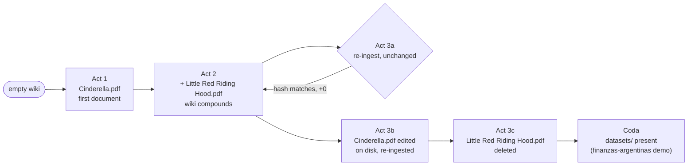
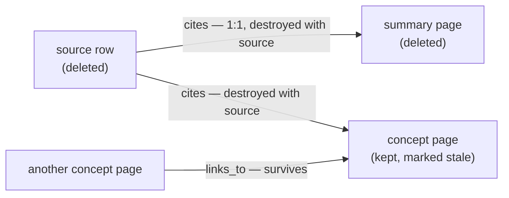

# Ingestion Walkthrough

> Part of the [LLMWiki Programmer Manual](programmer_manual.md). §6
> [Workflows](manual/workflows.md) documents ingestion as **reference** — one
> section per operation, with contract tables. This document is different genre,
> same pipeline: it follows **one small corpus through its whole lifecycle** —
> first document, second document, a no-op re-ingest, an edited source, a
> deletion — so the reader can see the arc that the per-workflow tables can't
> show on their own.

**Audience.** This is written for someone evaluating the engineering, not
learning to operate the app. You can already read a schema and a function
name; what this document adds is the *reasoning* — why each step exists, not
just that it ran. Every act below links into `docs/manual/workflows.md` (§6)
for the authoritative contract (steps, tables, LLM prompts) instead of
restating it.

**The numbers are real.** Every figure quoted below — row counts, edge counts,
log lines — was captured by actually running the pipeline, not written by
hand. The full inventory lives in the generated
[appendix](ingestion_walkthrough_appendix.md); regenerate it any time with:

```bash
uv run python scripts/capture_ingestion_walkthrough.py
```

Because the appendix is machine-generated and this document is hand-written
prose around it, a change to the pipeline's behavior shows up in the appendix
on the next run — and if the prose starts disagreeing with the regenerated
numbers, that disagreement is a signal the pipeline changed, not a typo to
quietly fix.

## The mental model

### Two kinds of input, and why they are not the same thing

A workspace can hold two kinds of input, and the difference between them is
structural, not cosmetic — they travel through completely different paths.

**Sources** (`workspace/sources/`) are documents: PDFs, DOCX. They carry
*durable prose* — what a caución bursátil is, how Cinderella's story goes.
Their content is stable: the tale does not change next week. A source is read
**once**, at ingest, and *compiled*: extracted, chunked into `document_chunks`,
and distilled by an LLM into concept and summary pages. Answering from it later
means reading the wiki page that was compiled from it, with the source kept
underneath as the evidence a citation points at.

**Datasets** (`workspace/datasets/`) are tables: markdown files whose
front-matter declares a category and whose rows carry values with an `as_of`
date. They carry *volatile facts* — what the dollar MEP was worth on 25 June. Their
content is **meant** to change; refreshing one is the normal case, not an edit.

And they are **never ingested at all.** Not "ingested differently" — not
ingested. In the shipped finance demo, `documents` holds exactly six source
rows, its six DOCX files; the `dolar.md` dataset and its siblings have no row, no chunks,
no FTS entry and no generated page. `datasets/source.py:LocalMarkdownSource`
globs the folder and reads the file **at question time**, parsing the row that
was asked for. No LLM stands anywhere in that path.

The whole distinction, at a glance:

| | **Sources** (`sources/`) | **Datasets** (`datasets/`) |
|---|---|---|
| What they carry | durable prose | volatile facts, each with its date |
| When they are read | **once**, at ingest | at question time, every time |
| What happens to them | *compiled*: chunked, FTS-indexed, distilled by an LLM into pages | *nothing*: `glob` + `read_text`, and the requested row is parsed |
| In the database | one row per document (six, in the finance demo) | zero rows, zero chunks, zero pages |
| Refreshing one | re-ingest; the pages derived from it go stale | overwrite the file — that is the whole procedure |
| Answers the question | "what **is** X?" | "what is X **worth today**?" |

That asymmetry is the point, and it follows from what would go wrong otherwise.
Distilling a dataset into a wiki page would break it twice over: the page would
be stale the instant the table is refreshed, and — worse — it would launder an
exact figure into prose, where it can no longer be quoted verbatim with the date
it belongs to. So the split is drawn along the axis of *what kind of claim it
is*: the wiki answers "what **is** X?", the datasets answer "what is X **worth
today**?", and the second question is never answered by a model's recollection
of a document it read last month. Refreshing a rate becomes overwriting a file —
nothing to re-ingest, no page to go stale, no re-distillation to pay for.

What the two share: both are inputs **you** own, the pipeline never modifies
either, and both feed the wiki's vocabulary and coverage roster (the Coda shows
the dataset half of that). This walkthrough's fairy-tale corpus has sources
only, which is why the dataset machinery appears just in the Coda.

The payoff of this split is visible on the read side rather than here: in the
[query walkthrough](query_walkthrough.md#2-a-datum-with-its-date), a single
answer about the MEP dollar carries curated prose explaining what it *is*
alongside a live figure with its `as_of` date — one citation for the page, one
for the datum's external origin. That is what the two paths are for.

### What is truth and what is disposable

Both kinds of input are truth. Everything else in the workspace is derived from
them. The wiki under `workspace/wiki/` is **derived**: every page is something
the pipeline generated, and it is safe to delete, regenerate, or repair because
it carries no information the sources don't already have.

`.llmwiki/index.db` (SQLite) is the index over both. It holds no knowledge of
its own — every value in it was copied out of a source file or derived from a
wiki page that exists on disk — but it is what turns a folder of files into
something you can ask questions of. Four tables carry that, each with a
different grain:

- `documents` — **one row per thing that exists in sources and wiki**: every source file dropped
  into the workspace, and every wiki page the pipeline generated. `source_kind`
  is what tells the two apart, which is how one table can hold both without
  confusing them. A row records what the thing is (name, path, type), what state
  it is in, and — for a source — a fingerprint of the file as it was on disk when
  it was ingested, so the pipeline can later tell whether the file still matches what
  was ingested.

- `document_pages` — **one row per page of a source document**, holding the text
  the extractor pulled out of that page. This is the document's content in
  machine-readable form, kept verbatim and kept for good: extraction (parsing a
  PDF, pushing a DOCX through LibreOffice) is the slowest step in the pipeline
  that isn't an LLM call, and storing its output means it is paid for exactly
  once no matter how often the wiki is rebuilt from it afterwards.

- `document_chunks` — **one row per retrievable fragment.** A page is the wrong
  unit to search against: too long to be a precise answer, too arbitrary to be a
  clean quote. So text is accumulated paragraph by paragraph until adding the
  next one would exceed a size budget of about 512 — *estimated* tokens, since
  the count is a characters-over-four heuristic rather than a real tokenizer.
  Boundaries therefore always fall between paragraphs, never mid-sentence; the
  only text ever cut at a sentence is a single paragraph too large to be a
  fragment on its own. A fragment may also begin by repeating the tail of the
  one before it, so a definition introduced just before a boundary still travels
  with the text that depends on it — though that repetition is capped and
  frequently doesn't happen at all: when the preceding paragraph is itself
  larger than the cap, nothing is repeated (in the shipped demo, eight of twelve
  boundaries carry no overlap). Each fragment records the document, page and
  heading it came from, which is what lets a search hit be traced back to a
  place a citation can name. Both kinds of document are chunked: the raw sources
  and the generated wiki pages alike.

- `chunks_fts` — the full-text index over those fragments. It is an FTS5
  **external-content** table, meaning it stores no second copy of the text: it
  indexes `document_chunks.content` in place and is kept in step by three
  triggers, on insert, update and delete. That is why the search index cannot
  quietly drift out of agreement with the rows it claims to index. And because
  every fragment joins back to its parent document, a search can be scoped by
  that document's `source_kind` — which is what makes it possible to search the
  curated wiki and the raw sources as two separate layers rather than one pile.

- `document_references` — **one row per edge between two documents**, of one of
  two kinds: `cites`, meaning a wiki page draws its content from a source, and
  `links_to`, meaning a wiki page links to another wiki page. Keeping this graph
  in a table, rather than re-deriving it by scanning markdown whenever it is
  needed, is what makes provenance a query.

Two integrity mechanisms hold that structure together. Every child table
declares `ON DELETE CASCADE` against its parent document, so removing a document
takes its pages, fragments and edges with it in a single statement, rather than
in application code that could be interrupted half-way and leave debris. The FTS
triggers extend the same guarantee to the search index. Between them, a deletion
cannot leave an orphaned fragment behind, or a phantom hit for a page that no
longer exists.


And `wiki/` is a git repository: every ingest, edit, and delete is a commit, so
the derived layer has the same undo history a source-controlled codebase does.

That division — source of truth vs. derived index vs. derived, disposable
knowledge base — is what lets the rest of this walkthrough get away with
things like "just delete the page and regenerate it": nothing here can lose
data, because the sources were never the thing being deleted.

## The arc, top to bottom



Five acts and a coda. Acts 1–3c stay inside the bundled fairy-tale corpus on
purpose — no domain knowledge required, so the machinery is the whole story.
The coda switches to the shipped `examples/finanzas-argentinas` demo to show
the half of the vocabulary subsystem that only fires when a wiki has a
`datasets/` folder.

## Act 1 — one document lands in an empty wiki

Ingesting `Cinderella.pdf` (5 pages) produces **6 wiki pages** (1 summary + 5
concepts: cinderella, fairy-godmother, glass-slipper, royal-ball,
stepsisters), **16 `document_chunks`**, **6 `cites` edges** and **15
`links_to` edges** in `document_references`, plus `index.md`, `overview.md`,
`log.md`, and one git commit (`af33577`). See the [appendix, Act
1](ingestion_walkthrough_appendix.md#act-1--first-document) for the full
table.

The step ordering here is the load-bearing detail, not the row counts. §6.3's
step table (`ingestion/pipeline.py:ingest_file`) commits the source row with
`status='ready'` at **step 6** — before the LLM has written a single wiki
page in steps 7–9. That ordering means a failed structured-extraction or
concept-page call never leaves the corpus half-indexed: worst case, a source
sits in the database, fully searchable via `document_chunks`, with no wiki
page yet — never the other way around, a wiki page pointing at a source that
isn't really there. It's also why "the wiki is derived and disposable" isn't
just a slogan: regenerate (§6.6) and repair (§6.2) both assume the source
rows are the durable truth and the wiki rows are reproducible from them, and
step 6 is what makes that assumption safe to rely on.

The alias artifact tells the same story from the vocabulary side. Step 8b
(`ingestion/alias_generation.py:update_generated_aliases`) writes
`.llmwiki/aliases.generated.toml` with one entry:
`"Cinderella" = ["Cinderwench"]` — a real alternate name the LLM lifted out of
the tale's own text. That single line is the cheapest visible output of the
vocabulary subsystem, and it matters because it moves an ambiguity-resolution
problem from *query time* to *ingest time*: without it, a chat question about
"Cinderwench" would need the retrieval layer (or the model) to guess the
alias on every turn; with it, the alias is resolved once, permanently, the
moment the source is read.

## Act 2 — a second document meets a non-empty wiki

Ingesting `Little Red Riding Hood.pdf` adds **+5 wiki pages** (11 total),
**+7 `document_chunks`** (23 total), and moves `cites` **6 → 11** and
`links_to` **15 → 25** ([appendix, Act
2](ingestion_walkthrough_appendix.md#act-2--second-document)). Three things
happen in this act that had no chance to happen in Act 1:

First, none of the four new concepts collide with the five existing ones, but
the *mechanism* that would handle a collision — `wiki_generator.py`'s
`_CONCEPT_UPDATE_TEMPLATE` branch (§6.3's LLM-prompt table) instead of the
create branch — is exercised on the *next* re-ingest of an already-touched
concept, which Act 3b will show directly. Second, `missing_xref` fires during
the post-ingest lint+repair tail, and `repair_missing_xref` appends `## See
also` links between concepts that share a cited source — this is where most
of the new `links_to` edges in this act come from, not from anything the
structured-extraction prompt wrote. Third, `update_overview` (step 10) is
called again, so `overview.md` becomes a narrative about *both* documents,
not two separate one-document summaries stapled together.

The takeaway worth stating plainly: the wiki **compounds**. It is not N
independent per-document summaries — the second document makes the first
one's pages better connected than they were right after Act 1. That is the
argument for building an LLM-wiki instead of doing plain per-chunk RAG: the
knowledge base gets more useful as more sources are added, not just bigger.

## Act 3a — re-ingesting an unchanged document

Re-running ingestion against `Little Red Riding Hood.pdf` with no changes on
disk logs exactly one line —
`⏭ Little Red Riding Hood.pdf — already up to date` — and every counter in
the [appendix](ingestion_walkthrough_appendix.md#act-3a--re-ingest-unchanged)
moves by **+0**: source rows, wiki pages, chunks, both edge types, files.

Change detection (`ingestion/detector.py:needs_ingestion`, cited in §6.3 and
§6.5) checks mtime first, then hash, before anything expensive runs. The
point of giving this a section at all is that *nothing happens* — ingestion
is idempotent, and a no-op costs zero model calls. That property is what
makes §6.5's Scan sources workflow safe to run repeatedly against a folder
someone is actively dropping files into: re-scanning a folder with nine
unchanged files and one new one does one document's worth of LLM work, not
ten.

## Act 3b — the source changed on disk

This act simulates an edited source honestly: the fixture swaps
`Cinderella.pdf`'s bytes for a different tale entirely (`The Sleeping Beauty
in the Wood.pdf`, renamed to the same filename) rather than hand-editing a
sentence, because the detector never looks at *what* changed, only that the
hash did. From the pipeline's point of view, this is indistinguishable from
someone replacing a source PDF with a revised edition.

The result: `documents (source)` stays at **2 rows, +0** — the existing row
is *updated*, not duplicated — while `document_pages` and `document_chunks`
are rebuilt delete-then-insert (§6's table-write matrix marks this `D+I`),
and **+5** new wiki pages appear for concepts the new content introduces
(The Sleeping Beauty, Fairy Godmothers, The Ogress Queen, The Hundred-Year
Sleep, The Prince). Full numbers in the [appendix, Act
3b](ingestion_walkthrough_appendix.md#act-3b--edited-source-re-ingested).

The detail worth dwelling on is the reconciliation tail: **45 issues, 35
fixed, 10 skipped, 0 failed**. Reading the actual repair log (not just the
summary line) shows the 10 skips split into two different reasons, and the
distinction matters. Five are `stale` issues, skipped with the message `LLM
client required for 'stale' repair — pass llm_client` — because the
post-ingest tail runs the deterministic-by-default lint+repair pass (§6.3),
with no LLM client, and `repair_stale` is one of the two repairs (`stale`,
`missing_concept`) that need one (§6.2's dispatch table). The other five are
`missing_xref` issues skipped as `already linked` — those aren't
model-gated at all, they're idempotent no-ops: an earlier fix in the same
run already added the link a later issue was reporting.

For this audience that's the most telling moment in the whole walkthrough:
the repair system doesn't just have a blanket "skip if uncertain" fallback.
It distinguishes *"this fix is free and I already applied it"* from *"this
fix needs a model call I wasn't given permission to make"*, and reports each
skip with the reason, rather than silently doing (or not doing) work. Nothing
here is spent without being asked for.

## Act 3c — deleting a source

Deleting `Little Red Riding Hood.pdf` produces this log line verbatim:

```text
Deleted source 'Little Red Riding Hood.pdf'; deleted 1 derived wiki page(s); marked 4 citing page(s) stale
```

Only **1** of its five wiki pages is actually removed — the 1-to-1 summary
page — while the **4** concept pages that cite it (`little-red-riding-hood`,
`the-wolf`, `grandmothers-house` and `cautionary-tale`) are *kept* and marked
stale, not deleted. `cites` drops **16 → 11** (all five
edges pointing at the now-gone source row are cascade-deleted along with it)
while `links_to` drops only **61 → 57** (dead links into the deleted summary
page are stripped out of the pages that survive). See the [appendix, Act
3c](ingestion_walkthrough_appendix.md#act-3c--source-deleted) for the full
table, including the two SQLite WAL files that appear as a side effect of the
transaction.

This is the schema decision worth making explicit, because it's the one most
readers guess wrong on first read. `document_references` carries two
`reference_type` values with different deletion semantics
(`base/domain/tools/deletion.py:delete_source`, §6.9): `cites` means *this
page draws its content from that source* — 1-to-1, and destroyed along with
the source, because there's nothing left to regenerate it from. `links_to`
means *this page links to that other wiki page* — a relationship between two
derived pages, not between a page and a source, so it survives a source
deletion even when one of the pages it connects loses its citation. Deleting
a source destroys what was mechanically derived from it 1-to-1; it never
destroys synthesis a concept page built by drawing on *several* sources at
once. That's what makes source deletion (§6.9) a safe operation instead of a
"delete and hope nothing important was attached to it" operation — the graph
already knows which pages are disposable and which aren't.



## Coda — what a `datasets/` folder adds

Everything above happens in a corpus with only PDFs. The appendix confirms
that: every act's file list shows `.llmwiki/aliases.generated.toml`, but
**no** `.llmwiki/dataset_aliases.fingerprint` ever appears — that sidecar
file simply never gets written, because there is no `datasets/` folder for it
to fingerprint. The shipped `examples/finanzas-argentinas` demo has both.

Two alias passes exist, and only one of them ran anywhere in Acts 1–3c.
The **concept-alias pass** (`alias_generation.py:update_generated_aliases`,
step 8b of §6.3) runs per file, for any corpus — it's what produced
`"Cinderella" = ["Cinderwench"]`. The **dataset-alias pass**
(`alias_generation.py:regenerate_dataset_aliases`) runs once per *scan*
(§6.5), not per file, and only when `datasets/` exists; it's
fingerprint-gated (`_vocab_fingerprint` / `_read_fingerprint` /
`_write_fingerprint`), so the LLM pass re-runs only when the dataset
vocabulary actually changed since the last scan — a second scan of an
unchanged `datasets/` folder costs no model call, the same idempotence
argument as Act 3a, applied to a different artifact.

Generated aliases are validated against the wiki's coverage roster, and
anything that collides with an existing covered term is dropped rather than
written — the pipeline logs `⚠️ N alias collision(s) dropped`
(`ingestion/pipeline.py`, both the per-file and per-scan variants). That line
is not hypothetical: during the vocabulary UAT, ingesting a CEDEARs document
into a copy of this demo logged `⚠️ 1 alias collision(s) dropped` — the model
had proposed an alias that was already another covered term's name, and the
generator discarded it before it could reach the artifact. Unlike the numbers
in the acts above, this one comes from that UAT session rather than from the
regenerable appendix, whose corpus has no `datasets/`.

It's also worth showing a real warning rather than claiming the shipped demo
is spotless. `examples/finanzas-argentinas/.llmwiki/aliases.generated.toml`
currently contains both

```toml
"Plazo fijo UVA" = ["UVA"]
"Unidad de Valor Adquisitivo" = ["UVA"]
```

— the same alias, `"UVA"`, mapped to two different canonical terms. Lint's
`vocabulary` check (`lint/checks.py:vocabulary_check`, §6.1) reports exactly
this as `vocab_ambiguous`: one alias mapping to two canonicals, a warning
rather than an error because it's informational (§6.2 lists `vocab_ambiguous`
among the advisory findings with no automatic repair — it's surfaced for a
human to resolve, not auto-fixed). Showing that the linter catches a real
ambiguity in the project's own demo data is more credible to this audience
than asserting the demo has none.

## Verify it yourself

Everything above is reproducible, not just re-readable:

- `uv run python scripts/capture_ingestion_walkthrough.py` re-runs the exact
  sequence — ingest, ingest, re-ingest unchanged, edit and re-ingest, delete —
  against a fresh temporary workspace and regenerates
  [`docs/ingestion_walkthrough_appendix.md`](ingestion_walkthrough_appendix.md).
- `tests/e2e/test_ingest_app_v2.py` asserts the same journey through the real
  Marimo UI (wiki picker, ingest form, Activity Log, vocabulary lint lines,
  scan idempotency, cross-links) rather than by calling the pipeline
  functions directly.

## Where to go next

- §6 [Workflows](manual/workflows.md) for the per-operation contracts this
  walkthrough deliberately doesn't restate: step tables, LLM prompt inputs
  and outputs, table-write matrices, today-vs-target status.
- [`.trellis/spec/backend/chat-retrieval.md`](../.trellis/spec/backend/chat-retrieval.md)
  for the retrieval side — what happens to this same wiki once a question is
  asked against it, which is a separate document because it's a separate
  concern from ingestion.
