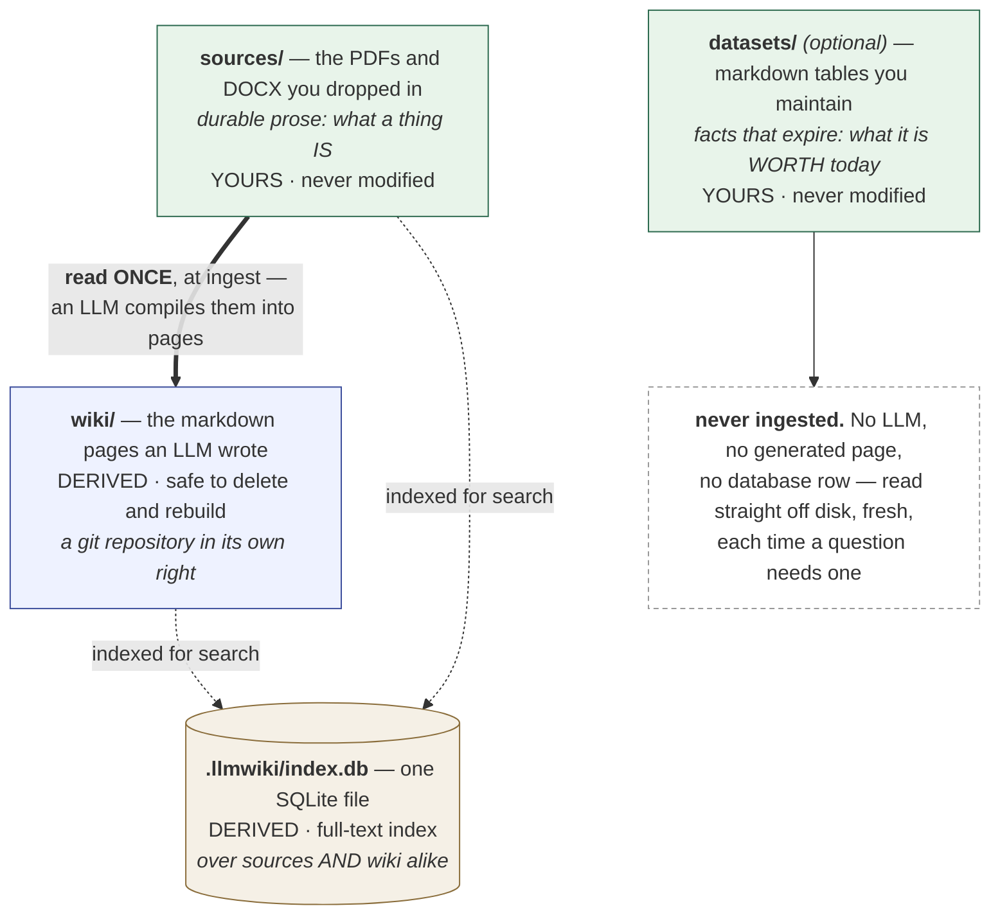
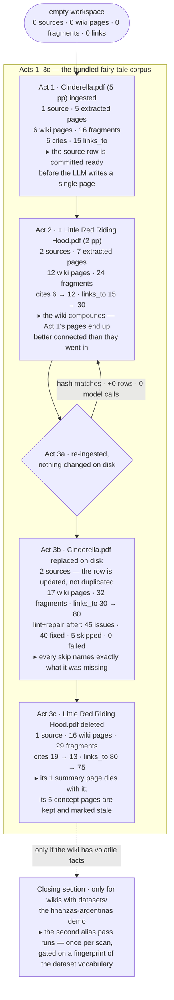
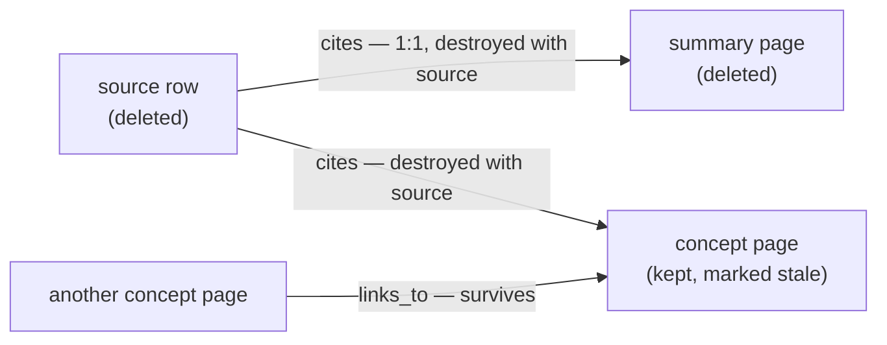

# Ingestion Walkthrough

**Start here.** This is the first of two companion documents. This one follows
what the system **builds** when you give it a document; its sibling,
[`query_walkthrough.md`](query_walkthrough.md), follows what happens when you
**ask it something**. Read them in that order and you will have the whole
system.

**Audience.** Someone who writes software but has never seen this project. You
can read SQL and Python; nothing else is assumed. Terms from the world of LLMs
and search — *token*, *embedding*, *RAG*, *chunk* — are defined where they first
appear, and so is every term this project made up. What this document adds over
the reference material is the *reasoning*: why each step exists, not just that
it ran.

**How it is arranged.** First the vocabulary and the pieces, so the rest makes
sense. Then the core of the document: **five acts** that follow one small
collection of documents through its whole life — a first document arrives, a
second one joins it, one is re-ingested unchanged, one is edited, one is deleted.
The acts are numbered 1, 2, 3a, 3b and 3c, and later sections refer back to them
by those names.

**It is also in two parts.** Everything up to [Wikis whose facts
change](#wikis-whose-facts-change) is about any wiki at all, and a reader
building the ordinary kind can stop at that heading having missed nothing. The
sections after it are for wikis that also hold facts with an expiry date —
exchange rates, prices, anything true only as of a given day — and switch to a
different example collection to say so.

**The numbers are real.** Every figure quoted below — row counts, link counts,
log lines — was captured by actually running the pipeline, not written by hand.
The full inventory lives in the generated
[appendix](ingestion_walkthrough_appendix.md); regenerate it any time with:

```bash
uv run python scripts/capture_ingestion_walkthrough.py
```

Because the appendix is machine-generated and this document is hand-written
prose around it, a change to the pipeline's behavior shows up in the appendix on
the next run — and if the prose starts disagreeing with the regenerated numbers,
that disagreement is a signal the pipeline changed, not a typo to quietly fix.

## Where the idea comes from

Andrej Karpathy sketched the pattern this project implements in a [short public
note](https://x.com/karpathy/status/2039805659525644595): instead of
re-discovering knowledge from raw text on every question, let an LLM
**incrementally build and maintain a persistent encyclopedia** of markdown
pages, and answer from that.

The contrast is with the standard approach, usually called **RAG** —
*retrieval-augmented generation*. In RAG you keep your documents chopped into
fragments; when a question arrives you fetch the fragments that look most
relevant and paste them into the model's prompt, so the answer is "augmented"
by material "retrieved" at that moment. Nothing is remembered between
questions: the same document is re-read, re-interpreted and re-paid-for every
single time someone asks about it, and the answer is only ever as good as
whatever fragments happened to surface.

Karpathy's move is to do the interpreting **once**, up front, and write the
result down as pages a human could also read. The three layers he describes map
onto this project like this:

| Karpathy's layer | Here |
|---|---|
| Raw sources, never modified | `workspace/sources/` — the PDFs and DOCX files you dropped in |
| The wiki, written by the LLM | `workspace/wiki/` — generated markdown pages |
| The schema — the conventions the LLM writes to | the system prompt, plus an optional per-wiki `wiki_config.toml` |

That note proposes fifteen things in total. §1 of the [Programmer
Manual](programmer_manual.md#1-philosophy--karpathy-alignment) goes through them
one by one and marks each as done, partly done, or deliberately skipped. If what
you want is the scorecard, read that instead of this.

**This document does something different: it shows how the first row of that
table turns into the second one.** How a PDF or DOCX becomes those wiki pages, what gets
stored along the way, and why each step happens in the order it does. The
comparison with Karpathy's note comes back at the [end of the query
walkthrough](query_walkthrough.md#what-this-adds-to-the-original-idea), once you
have seen both halves and can judge it for yourself.

## The pieces, before anything moves

A **workspace** is one wiki: a single folder holding everything about one
subject. Point the app at it and that is the wiki you are working on. Nothing is
global — you can have as many workspaces as you have subjects, and they share
nothing.

Inside one, four things matter:



Read the labels, not the shapes. The two green boxes are **yours**, and the
pipeline never writes to them. The blue and brown ones are **derived**: they can
be thrown away and rebuilt from the green ones at any time.

The rest of this document depends on that difference over and over. It is why
"just delete the page and generate it again" is a safe thing to say, and why
nothing described here can lose your data.

**But safe is not the same as repeatable, and the difference matters.** Generating
a page is an LLM call, and those calls run at a temperature between 0.2 and 0.4 —
deliberately, so the prose reads naturally rather than mechanically. A temperature
above zero means the model does not make the same choices twice. Regenerate the
same wiki from the same untouched sources and you get:

- **the same knowledge**, because it all came from sources that did not move;
- **different wording**, because the sentences are written fresh;
- and often **different concept pages**, because the model decides for itself
  which topics deserve one.

That last point surprises people. While this document was being written its
appendix was regenerated three times from an identical corpus, and each run named
the concepts differently — one run pulled a page called *Transformation* out of
Cinderella, the next chose *Prince* instead. Neither is wrong. They are two
readings of the same tale.

Two practical consequences follow. **Anything you edited by hand is gone** when
the page is regenerated, because nothing distinguishes your sentence from the
model's. And **any figure you quoted from the wiki elsewhere may move** — page
names, page counts, link counts. That is not a bug being described; it is what
"derived" means when the deriving is done by a language model rather than a
compiler.

`datasets/` is the odd one out and gets its own [closing
section](#wikis-whose-facts-change); ignore it until then if your wiki has none.

### Three files in `wiki/` are not pages

Most of what the pipeline writes into `wiki/` is a page about a topic. Three
files are not, and the acts below refer to all three by name, so it is worth
knowing what they are before you meet them:

- **`index.md`** — the catalogue. One line per page, grouped into *Summaries* and
  *Concepts*, each with a one-sentence description. It is how a reader — or a
  model — finds out what exists without opening anything.
- **`overview.md`** — the narrative. Several paragraphs describing the collection
  as a whole and how its subjects relate. Unlike the catalogue, this one is
  written by the LLM, and it is **rewritten from scratch on every ingest**, which
  is why Act 2 can point at it as evidence that the wiki compounds.
- **`log.md`** — the diary. An append-only, dated record of what was ingested
  when. Nothing reads it; it exists so a human can answer "when did this arrive?"

One structural fact about all three is easy to miss and explains a lot later:
**none of them has a row in the database.** The demo has 17 wiki pages recorded
in `documents`, and these three are not among them — they exist only as files on
disk. That means they are not cut into fragments and not in the search index, so
no search will ever return them. Anything that wants to use them has to read the
file directly, which is exactly what the [query
walkthrough](query_walkthrough.md#what-ticking-the-box-would-cost-here) describes
happening for questions about the collection as a whole.

Two applications drive it, both built with [marimo](https://marimo.io) (a Python
notebook framework whose cells re-run automatically when their inputs change):

- **the ingest app** (`marimo/ingest_app.py`) — put documents in, watch pages
  come out. Everything in this document happens here.
- **the read app** (`marimo/read_app_tabs.py`) — browse the wiki and chat with
  it. Everything in the [query walkthrough](query_walkthrough.md) happens there.

You never have to touch SQLite or git yourself. This document explains them
anyway, because to judge whether the system can be trusted you have to see what
it writes down.

## The mental model

### What a source is, and what the pipeline does with it

A **source** (`workspace/sources/`) is one of the documents you put in: a PDF or
a DOCX file. Sources hold text that stays true — how Cinderella's story goes,
what a glass slipper is for. The tale will not be different next week.

That is what makes the central decision safe. A source is read **once**, when you
ingest it, and *compiled*: its text is extracted, cut into search-sized fragments
(*chunks* — the subject of most of the next section), and an LLM turns it into
two kinds of wiki page:

- a **summary page** — one per document, saying what that file contains, in
  order;
- a **concept page** — one per topic. This is the interesting kind, because it
  belongs to the topic and not to any one document. Several sources can add to
  the same concept page, so it grows as you add documents.

Answering a question later means reading the page that was built from the source.
The source stays in place underneath, as the evidence a citation can point to.
Nobody re-reads the PDF, and nobody pays an LLM twice for the same work.

This only works because the answer will not have changed by the time somebody
reads it. A fact that goes out of date needs the opposite treatment, and that is
a different kind of wiki with a different mechanism — the [closing
section](#wikis-whose-facts-change) covers those. Everything before it is true of
any wiki.

### What ingesting one file actually does

The acts below refer to these steps by number, so here they are once, in full.
`ingestion/pipeline.py:ingest_file` runs thirteen of them. Grouped, they form
four stages:

| | Steps | What happens | LLM? |
|---|---|---|---|
| **Take it in** | 1–5 | validate the file · check whether it changed · open a provisional `documents` row marked `status='processing'` · extract the text page by page · cut it into fragments **in memory** | no |
| **Publish the source** | **6** | one transaction: flip that row to `status='ready'` *and* write `document_pages` and `document_chunks`. From here the source exists and is searchable | no |
| **Write the wiki** | 7–10 | pull out a summary and a list of concepts · write a page per concept · record the alternate names found (8b) · build the summary page · rewrite `overview.md` | **yes**, except 8b and the summary page |
| **Close the books** | 11–13 | append to `log.md` · make a git commit · optional lint pass | no |

Two pieces of vocabulary before the numbers. *Changed* is decided by comparing
the file's **mtime** (the modification timestamp the filesystem keeps) and then
its **hash** (a short fingerprint computed from the file's bytes, so any edit
produces a different one) against what was recorded last time. And a
**transaction** is a group of database writes that either all take effect or none
do — there is no state in which half of them landed.

Two things to remember from this table.

**Step 6 is the one moment where the source becomes real.** Everything before it
is either held in memory or written to a temporary row that no reader trusts.
Act 1 explains why that moment sits exactly there, before any LLM has run.

**The model is used in one stage only.** The other nine steps are ordinary code,
which is why re-ingesting an unchanged file costs nothing (Act 3a).

§6.3 of [Workflows](manual/workflows.md#63-single-document-ingestion-) lists the
same steps function by function, and is the version to trust if the two ever
disagree. The table above is only the outline this story needs.

### What runs after ingestion: lint and repair

Ingestion tries to leave the wiki consistent, but it cannot always manage it. A
page can end up citing a source that changed underneath it. Two concept pages
that share a source can end up without a link between them.

So the pipeline finishes with two more passes. A **lint** pass looks for those
problems and reports them. A **repair** pass fixes the ones it can fix without
guessing. (*Lint* is a word borrowed from programming, where a linter is a tool
that reads your code and points at suspicious things without changing anything.
Same idea here, applied to a wiki instead of a codebase.) Lint never writes
anything; repair only writes what lint found.

Three words from these passes are used throughout the acts:

- **stale** — a page whose source has changed since the page was written from it.
  Flagged, never deleted, because the text may still be perfectly fine; only a
  human or a model can tell.
- **missing xref** — *xref* is short for **cross-reference**. Two pages that
  ought to link to each other and don't: typically two concepts that were drawn
  from the same source document and so are almost certainly related.
- **skipped** — a repair the pass decided not to perform, always with a stated
  reason. A repair that would need the model to rewrite prose is skipped when no
  model was supplied, rather than guessed at. Act 3b examines what those reasons
  actually were on a real run.

§6.1 lists every check lint runs; §6.2 lists every repair and says which of them
need a model.

### What is truth and what is disposable

Sources are the truth. Everything else in the workspace is built from them. The
wiki under `workspace/wiki/` is **derived**: every page was generated by the
pipeline, and it is safe to delete, regenerate or repair, because it holds no
information the sources do not already have.

`.llmwiki/index.db` is the index over both. It is a **SQLite** database: a
complete relational database that lives in one ordinary file, with no server to
install or run. That is why a workspace can be copied, zipped or put under
version control like any other folder. The database holds no knowledge of its
own — every value in it was copied out of a source file, or derived from a wiki
page that exists on disk — but it is what turns a folder of files into something
you can ask questions of.

Four tables do that work. The clearest way to tell them apart is to ask **what a
single row means** in each one:

- `documents` — **one row for every file the system knows about**, whether it is
  a source you provided or a wiki page the pipeline wrote. A column called
  `source_kind` says which of the two it is, which is how one table can hold both
  without confusing them. Each row records what the file is (name, path, type)
  and what state it is in. Rows for sources also store a fingerprint of the file
  as it was on disk when it was ingested, so the pipeline can tell later whether
  the file has changed since.

- `document_pages` — **one row per page of a source document**, holding the text
  the extractor pulled out of that page. This is the document's content in
  machine-readable form, stored word for word and kept permanently. Extraction
  (parsing a PDF, pushing a DOCX through LibreOffice) is the slowest step in the
  pipeline apart from the LLM calls, so storing the result means you pay for it
  exactly once, no matter how often the wiki is rebuilt from it later.

- `document_chunks` — **one row per retrievable fragment.** A page is the wrong
  unit to search against: too long to be a precise answer, too arbitrary to be a
  clean quote. So text is accumulated paragraph by paragraph until adding the
  next one would exceed a size budget of about 512 *estimated* **tokens**.

  A token is the unit language models actually count — roughly a word-piece,
  such that common short words are one token and longer or rarer words split into
  several. It matters because everything an LLM charges for and everything it can
  hold at once is measured in tokens, not characters. This project does not run a
  real tokenizer to count them; it divides the character count by four, which is
  a well-known rough conversion for English and Spanish. So the budget is
  approximate on purpose, and cheap.

  So a fragment always ends where a paragraph ends, never in the middle of a
  sentence. The one exception is a single paragraph too big to be a fragment on
  its own, which does get cut.

  A fragment may also start by repeating the end of the previous one, so that a
  definition given just before a boundary travels along with the text that
  depends on it. This repetition has a size limit, and often does not happen at
  all: when the previous paragraph is itself bigger than that limit, nothing is
  repeated. In the fairy-tale **corpus** — the usual word for the whole
  collection of text a system works with — ten of the fourteen boundaries repeat
  nothing; where repetition does happen it runs 92–119 tokens.

  Each fragment records which document and page it came from, plus a
  **breadcrumb**: the markdown headings that apply where its text sits, joined
  with ` > ` — `Cinderella > Definition`. A page number alone tells you where a
  fragment sits in a PDF, but nothing about what part of the document it belongs
  to. The breadcrumb is what lets a citation name that place.

  Both kinds of document are cut into fragments: the raw sources and the
  generated wiki pages alike. Every fragment records which document it belongs
  to, so a search can be limited to one kind or the other. That is what lets the
  curated wiki and the raw sources be searched as two separate layers, rather
  than as one undivided pile of text.

- `chunks_fts` — **not a table of data, but the search index over the fragments
  above.** *FTS* stands for **full-text search**, and `chunks_fts` is built with
  SQLite's FTS5, the fifth and current generation of that feature. Finding which
  fragments mention *slipper* by scanning every row with `LIKE '%slipper%'` would
  mean reading the entire corpus on every question, and would return matches in
  arbitrary order. A full-text index inverts the problem: it is built once, maps
  each word to the fragments containing it, and can therefore answer *and rank*
  in one lookup. That lookup is where the search for evidence begins whenever a
  question gets that far — a question the wiki knows it does not cover is turned
  away before the index is ever consulted.

  It stores the mapping in the direction a question needs: from word to
  fragments, rather than from fragment to words. In the bundled fairy-tale demo,
  whose 34 fragments come from three tales and the pages written from them, two
  entries look like this:

  ```text
  slipper     →  153, 117, 127, 151, 152, 116, 109, 113
  Cinderella  →  138, 152, 153, 151, 146, 127, 117, 112, 111, 115, 109, 116, …
  ```

  Those numbers are `rowid`s — internal row numbers, reassigned whenever the
  corpus is rebuilt — and they come out already sorted best-first. They are the
  whole answer the index gives: eight fragments out of thirty-four for the first
  word, and the other twenty-six never even looked at.

  To turn that into something you can quote, you join the index back to the
  tables. The index says *which* fragments and *in what order*; the tables supply
  the text and where it came from:

  ```sql
  SELECT d.filename, c.page, c.header_breadcrumb, c.content
    FROM chunks_fts
    JOIN document_chunks c ON c.rowid = chunks_fts.rowid
    JOIN documents       d ON d.id    = c.document_id
   WHERE chunks_fts MATCH '"slipper"'
   ORDER BY chunks_fts.rank;
  ```

  The top three rows that come back are `glass-slipper.md`, then `Cinderella.pdf`
  itself, then `cinderella.md`: a curated page, a raw source, and another curated
  page, all ranked against each other in a single list. The index does not care
  which layer a fragment belongs to — which is why separating the two layers has
  to be a deliberate choice made elsewhere, as the previous bullet described.

  `rank` is the one column there that doesn't explain itself. FTS5 fills it with
  **BM25**, the standard relevance formula full-text search engines have used for
  decades: given a query, it scores every matching fragment on how strongly that
  fragment is *about* the query rather than merely containing it. The wiki takes
  the score as it comes — there is one indexed column, so there is nothing to
  weight one column against another. Its values are negative and the best match
  is the most negative, which is why ordering ascending puts the strongest hit
  first. For *slipper*, the eight fragments score like this:

  | fragment | mentions | tokens | rank |
  |---:|---:|---:|---:|
  | 153 | 5 | 305 | −2.08 |
  | 117 | 7 | 519 | −1.98 |
  | 127 | 3 | 262 | −1.94 |
  | 151 | 2 | 288 | −1.71 |
  | 152 | 2 | 290 | −1.70 |
  | 116 | 3 | 471 | −1.58 |
  | 109 | 1 | 411 | −1.01 |
  | 113 | 1 | 481 | −0.91 |

  That last column shows three behaviours worth knowing about.

  **Repeating a word counts, but less and less.** Among fragments of roughly 500
  tokens, going from one mention to three (113 → 116) improves the rank by 0.67,
  while going from three to seven (116 → 117) improves it by only 0.40. The first
  few mentions establish that a passage is on the subject; later ones add little.

  **Length is taken into account.** Fragments 109 and 113 mention the word exactly
  once each, and the shorter one wins: one mention inside 411 tokens means the
  passage is more likely to be *about* the slipper than one mention spread across
  481. The effect is very fine-grained — fragments 151 and 152 each have two
  mentions and differ by just two tokens of length, and those two tokens change
  their ranks by a hundredth.

  **Rare words count for more.** A word that appears in most fragments does not
  help tell them apart, so BM25 gives it less weight and favours the rarer words
  in the same question. You cannot see this in the table, because the query here
  is a single word.

  What BM25 does **not** do matters just as much. It matches *words*, not
  *meanings*. There are no **embeddings** anywhere in this pipeline. An embedding
  is the usual alternative: a model turns each fragment into a long list of
  numbers, arranged so that texts about similar things end up close together.
  A search then asks for whatever is closest to the question, regardless of which
  words it used. Most RAG systems work this way.

  This one does not, and the effect is severe. A fragment that discusses the same
  idea in completely different words does not just rank low — it **does not
  appear at all**, and no amount of reordering will bring it back. Ask about *the
  central bank* in a corpus that only ever says *the Fed*, and you get nothing.

  That one limitation explains a lot of the rest of the design. The vocabulary and
  the alternate names built during ingestion exist to connect the words a reader
  might use to the words the corpus actually contains. And the curated wiki layer
  exists so that a question can be answered from a page written *about* a
  concept — which will naturally contain the
  ordinary words for it — rather than from whichever raw paragraph happened to
  repeat its name most often. Both are compensations for having no embeddings,
  and both are cheaper and easier to inspect than embeddings would be. Whether
  that is the right trade is a fair thing to argue about, and the project does
  not claim to have settled it: §1 of the [Programmer
  Manual](programmer_manual.md#why-the-wiki-search-engine-is-partial) marks the
  wiki's search as only *partly* built for exactly this reason, and says what it
  would take to finish it.

  Matching is looser than exact string equality, though, and deliberately. Before
  indexing, a **tokenizer** splits text into searchable words and normalises them
  two ways: it **folds case**, so *Slipper* and *slipper* become the same entry,
  and it **stems**, meaning it strips grammatical endings so that a word's
  variants collapse onto one root — *slippers* and *slipper* both index as
  `slipper`. Two fragments in this corpus write only the plural and never the
  bare singular, and a search for `slipper` returns both. (The same tokenizer
  folds accents, so in a corpus that has any, a word typed without its accent
  still finds the fragments that spell it properly — which matters a great deal
  in Spanish.) A `LIKE` scan would have missed those two fragments, which is the
  second thing an index gives you besides speed: the question no longer has to be
  spelled the way the corpus happens to spell it.

  Two design choices about it are worth knowing. It is declared
  **external-content**, which means it keeps no copy of the text: SQLite is told
  to read the words from `document_chunks.content` itself, so the corpus is
  stored exactly once rather than duplicated into the index. The price of that
  arrangement is that the index no longer notices writes to the table on its
  own — so three triggers, on insert, update and delete, tell it. Together they
  are why the index cannot quietly fall out of agreement with the rows it claims
  to describe: there is no path by which a fragment changes and its index entry
  doesn't.

- `document_references` — **one row per link from one document to another.**
  There are two kinds: `cites` means a wiki page took its content from a source,
  and `links_to` means a wiki page links to another wiki page. The clearest way
  to see the difference is that the same page usually has both. These two rows
  come from Act 1 below:

  | `reference_type` | from | to |
  |---|---|---|
  | `cites` | `wiki/concepts/cinderella.md` *(wiki)* | `Cinderella.pdf` *(source)* |
  | `links_to` | `wiki/concepts/cinderella.md` *(wiki)* | `wiki/concepts/fairy-godmother.md` *(wiki)* |

  The first link points *down*, at the evidence the page was written from. The
  second points *sideways*, at a neighbouring page. The rows look the same, but
  they answer different questions — *where did this come from?* versus *what else
  should I read?* — and they behave differently when a document is deleted.

  One column name is misleading, so be warned: `source_document_id` holds the
  document doing the referring, not the file sitting in `sources/`.

  These links are stored in a table instead of being worked out by scanning the
  markdown each time they are needed. That is what makes it possible to *ask*
  where a page's content came from, as an ordinary database query.

Two mechanisms keep all of this consistent. Every child table declares `ON DELETE
CASCADE` against its parent document, which means deleting a document deletes its
pages, fragments and links in the same statement. The alternative would be
application code that could stop half-way and leave rows behind pointing at
nothing. The FTS triggers give the search index the same protection. Together
they mean a deletion cannot leave a fragment with no document, or a search hit
for a page that no longer exists.

Next to the database, `wiki/` is also a git repository: every ingest, edit and
delete is a commit, so the generated pages have the same history and the same
undo you would expect from source code.

That division — sources are the truth, the index and the wiki are both derived —
is what lets this walkthrough say things like "just delete the page and generate
it again". Nothing here can lose data, because the sources are never what gets
deleted.

## The story, top to bottom

Each act below states the workspace as it stands when the act ends, and the one
thing that act exists to demonstrate. Every figure is read off the generated
[appendix](ingestion_walkthrough_appendix.md).



The five acts stay inside the bundled fairy-tale corpus on purpose — no domain
knowledge is needed, so the machinery is the only thing to follow. The dotted
arrow at the bottom is dotted on purpose: the closing section applies only to
wikis that keep facts which expire, and it switches to the bundled
`examples/finanzas-argentinas` demo, because the fairy tales have nothing of the
kind.

The one arrow that loops backwards is the point of Act 3a: a re-ingest with
nothing changed on disk returns the workspace to the state it was already in,
which is why the arrow goes back rather than forward.

## Act 1 — one document lands in an empty wiki

Ingesting `Cinderella.pdf` (5 pages) produces **6 wiki pages** (1 summary plus 5
concepts: cinderella, fairy-godmother, glass-slipper, royal-ball,
prince), **16 `document_chunks`**, **6 `cites` links** and **15
`links_to` links** in `document_references`, plus `index.md`, `overview.md`,
`log.md`, and one git commit (`6f84793`). See the [appendix, Act
1](ingestion_walkthrough_appendix.md#act-1--first-document) for the full table.

The important detail here is the order of the steps, not the row counts. The
source row is committed as `status='ready'` at **step 6** — before the LLM has
written a single wiki page in steps 7–9.

That order matters because of what happens when something fails. If step 7 (the
LLM call that reads the document and returns its summary and concept list) fails,
or any of the concept-page calls after it, the worst possible result is a source
sitting in the database, fully searchable, with no wiki pages yet. The opposite
can never happen: there is no way to end up with a wiki page pointing at a source
that was never really stored.

This is also why calling the wiki "derived and disposable" is more than a slogan.
Both regenerate (§6.6) and repair (§6.2) assume the source rows are the permanent
truth and the wiki rows can be rebuilt from them. Step 6 is what makes that
assumption safe.

The alternate-names file tells the same story from the vocabulary side. Step 8b
(`ingestion/alias_generation.py:update_generated_aliases`) writes
`.llmwiki/aliases.generated.toml` with one entry:
`"Cinderella" = ["Cinderwench"]` — a real alternate name the LLM found in the
tale's own text.

Clod: there is no .llmwiki/aliases.generated.toml in fairy-tales example.

That one line matters more than its size suggests, because of *when* the work
happens. Without it, somebody asking a question about "Cinderwench" would need
the search layer, or the model, to guess that this is another name for Cinderella
— and to guess it again on every single question. With it, the connection is
worked out once, permanently, at the moment the source is read.

## Act 2 — a second document meets a non-empty wiki

Ingesting `Little Red Riding Hood.pdf` adds **+6 wiki pages** (12 total),
**+8 `document_chunks`** (24 total), and moves `cites` **6 → 12** and
`links_to` **15 → 30** ([appendix, Act
2](ingestion_walkthrough_appendix.md#act-2--second-document)). Three things
happen in this act that had no chance to happen in Act 1:

**None of the five new concepts clash with the five existing ones.** When a
clash does happen, the generator updates the existing page instead of creating a
new one (`wiki_generator.py` switches from its create template to its update
template, listed in §6.3). Act 3b shows that happening.

**The lint pass finds `missing_xref` problems and fixes them.** After ingestion
finishes, `repair_missing_xref` adds `## See also` links between concepts that
cite the same source. Most of the new `links_to` rows in this act come from
there — not from anything the LLM wrote while generating pages.

**`overview.md` is rewritten from scratch** (step 10), so it describes *both*
documents together, rather than being two separate one-document summaries joined
end to end.

Stated plainly: the wiki **compounds**. It is not a pile of independent
per-document summaries. The second document leaves the first document's pages
better connected than they were at the end of Act 1.

This is the whole argument for building an LLM-wiki instead of doing plain RAG,
and it is worth being precise about the difference. Add a tenth document to a RAG
system and you have ten documents' worth of fragments: the first nine are exactly
as they were, because nothing ever revisits them. Add a tenth document here and
the pipeline rewrites `overview.md` around all ten, and the repair pass links the
new concepts to the old ones that share a source. The knowledge base gets **more
useful** as sources are added, not merely bigger. That is Karpathy's central
claim, and Act 2 is the smallest possible demonstration of it.

## Act 3a — re-ingesting an unchanged document

Re-running ingestion against `Little Red Riding Hood.pdf` with no changes on
disk logs exactly one line —
`⏭ Little Red Riding Hood.pdf — already up to date` — and every counter in
the [appendix](ingestion_walkthrough_appendix.md#act-3a--re-ingest-unchanged)
moves by **+0**: source rows, wiki pages, fragments, both kinds of link, files.

Change detection (`ingestion/detector.py:needs_ingestion`, cited in §6.3 and
§6.5) checks the modification timestamp first, then the hash, before anything
expensive runs. The point of giving this a section at all is that *nothing
happens* — ingestion is **idempotent**: running it twice leaves the workspace in
exactly the state running it once did, so a repeat costs zero model calls.

That property is what makes §6.5's Scan sources workflow safe to run repeatedly
against a folder someone is actively dropping files into: re-scanning a folder
with nine unchanged files and one new one does one document's worth of LLM work,
not ten. Without it, the natural operating habit — drop a file in, hit scan —
would re-pay for the entire corpus every time.

## Act 3b — the source changed on disk

This act simulates an edited source honestly: the capture script swaps
`Cinderella.pdf`'s bytes for a different tale entirely (`The Sleeping Beauty in
the Wood.pdf`, renamed to the same filename) rather than hand-editing a sentence,
because the detector never looks at *what* changed, only that the hash did. From
the pipeline's point of view, this is indistinguishable from someone replacing a
source PDF with a revised edition — and swapping the whole file makes the effect
visible in the page list instead of hiding in one altered paragraph.

The result: `documents (source)` stays at **2 rows, +0** — the existing row is
*updated*, not duplicated — while `document_pages` and `document_chunks` are
rebuilt by deleting the old rows and inserting fresh ones rather than trying to
reconcile them one by one (§6's table-write matrix abbreviates this `D+I`, for
delete-and-insert). And **+5** new wiki pages appear, for the concepts the new
content introduces: Sleeping Beauty, Fairy Godmothers, Ogress Queen, Spindle
Curse and Seven-League Boots. Full numbers in the [appendix, Act
3b](ingestion_walkthrough_appendix.md#act-3b--edited-source-re-ingested).

The part worth studying is what lint and repair did afterwards: **45 issues, 40
fixed, 5 skipped, 0 failed**.

All five skips carry the same message: `LLM client required for 'stale' repair —
pass llm_client`. Repairing a stale page means rewriting prose, and rewriting
prose needs a model — but the pass that runs after ingestion is deliberately
given no model. `stale` and `missing_concept` are the only two repairs that need
one (§6.2 lists them).

This is the most revealing moment in the whole walkthrough, and it is about what
the system does *not* do. Forty of these issues were fixed automatically, because
fixing them required no judgement. The remaining five were left alone, each one
saying exactly why. The pass did not guess at the prose. It did not quietly reach
for a model it had not been handed. **Nothing was spent that was not asked for**,
and nothing was invented to avoid reporting a gap.

The wording matters as much as the count. A skip that says *"LLM client required
for 'stale' repair"* tells you precisely what to supply if you want it fixed. A
generic "skipped: could not repair" would tell you nothing, and you would have no
way to know whether the work was impossible or merely unauthorised.

**So how do you actually get those five repaired?** The message names what is
missing — a model — and the ingest app gives you two ways to supply one:

- **Afterwards, for the whole wiki.** The **Run Wiki Lint & Repair** button runs
  the same two passes over every page, this time *with* a model. The five stale
  pages get regenerated from their sources, and the two model-only repairs
  (`stale` and `missing_concept`) become available.
- **Up front, for this ingest only.** The ingest form has a checkbox, *"Also run
  full LLM lint & repair after ingest (slower, uses tokens)"*. Ticked, the
  post-ingest pass is the full one rather than the deterministic one, and those
  five skips never happen — the pages are regenerated as part of the ingest.
  Unticked is the default, which is why Act 3b looks the way it does.

The parenthetical in the checkbox label is the whole trade, stated by the app
itself: *slower, uses tokens*. The default is not a limitation someone forgot to
lift — it is the pipeline declining to spend your money without being asked. One
click says otherwise.

The scope of the two differs, and it is worth knowing which you want. The
post-ingest pass — either version — is **limited to the pages this ingest
touched**: the summary pages of the documents just ingested, plus every wiki page
that cites them. It never rewrites unrelated pages. The button is the wiki-wide
sweep.

Two other skip reasons exist and did not appear in this particular run. A
`missing_xref` can be skipped as `already linked`, when an earlier fix in the
same run had added the link a later issue was still reporting — a genuine no-op
rather than a refusal. And an advisory check such as `thin_page` is skipped as
*"advisory finding — no automatic repair (resolve by hand)"*, because it reports
something a human has to decide about. Both are listed here for completeness;
neither is narrated as though it had been observed, because in this capture it
was not.

## Act 3c — deleting a source

Deleting `Little Red Riding Hood.pdf` produces this log line verbatim:

```text
Deleted source 'Little Red Riding Hood.pdf'; deleted 1 derived wiki page(s); marked 5 citing page(s) stale
```

Only **1** of its six wiki pages is actually removed — the summary page, the one
written from that document alone. The **5** concept pages that cite it
(`little-red-riding-hood`, `the-wolf`, `the-grandmother`, `the-red-riding-hood`
and `themes-of-little-red-riding-hood`) are *kept*, and marked stale rather than
deleted.

Clod: what happens with stale pages? Do they stay forever in the wiki? Can we delete them? (I guess we can from the gui). In case of deteltion we should run lint and repair, right? This needs elaboration in the doc.

`cites` drops **19 → 13**: every link pointing at the now-deleted source row goes
with it. But `links_to` drops only **80 → 75**, because the only ones removed are
the dead links into the deleted summary page. See the [appendix, Act
3c](ingestion_walkthrough_appendix.md#act-3c--source-deleted) for the full table,
including two extra files that appear next to the database as a side effect of
the transaction. Those are SQLite's **write-ahead log** (`.db-wal` and
`.db-shm`): instead of editing the database file in place, SQLite appends pending
changes to a companion file and folds them in afterwards, which is what lets a
transaction be abandoned without leaving the database half-written. They are
bookkeeping, not data.

This is the design decision most people get wrong on a first read, so it is worth
stating directly. The two kinds of link in `document_references` behave
differently when a source is deleted
(`base/domain/tools/deletion.py:delete_source`, §6.9):

- **`cites`** means *this page took its content from that source*. One page, one
  source. It is deleted along with the source, because nothing is left to rebuild
  that page from.
- **`links_to`** means *this page links to that other wiki page*. It connects two
  generated pages, not a page and a source, so it survives — even when one of the
  two pages loses its citation.

Put simply: deleting a source destroys the page that was built from that source
alone. It never destroys a concept page that combined **several** sources,
because that page still has its other sources to stand on.

That is what makes deleting a source a safe operation rather than a "delete it
and hope nothing important was attached" operation. The links already record
which pages can be thrown away and which cannot.



## Verify it yourself

Everything above is reproducible, not just re-readable:

- `uv run python scripts/capture_ingestion_walkthrough.py` re-runs the exact
  sequence — ingest, ingest, re-ingest unchanged, edit and re-ingest, delete —
  against a fresh temporary workspace and regenerates
  [`docs/ingestion_walkthrough_appendix.md`](ingestion_walkthrough_appendix.md).
- `tests/e2e/test_ingest_app_v2.py` asserts the same journey end-to-end by
  driving the real ingest app in a browser (wiki picker, ingest form, Activity
  Log, vocabulary lint lines, scan idempotency, cross-links) rather than by
  calling the pipeline functions directly — so it fails if the machinery works
  but the interface to it doesn't.

## Wikis whose facts change

**Everything before this heading describes any wiki**, and a reader building
the ordinary kind has already finished. What follows describes a subset: wikis
that also carry facts with an expiry date.

Some subjects do not stay still. An encyclopedia of fairy tales is finished once
it is written; an encyclopedia of a financial market is out of date by the
afternoon.

The whole pipeline rests on turning a source into a wiki page, and that only
works because the answer will not have changed by the time somebody reads it.
Point the same machinery at an exchange rate and two things go wrong at once. The
page is out of date the moment the rate moves. And worse, the number itself gets
absorbed into a sentence, where it can no longer be quoted together with the date
it belongs to — you end up with prose saying the dollar is worth 1180, with no
way to know when that was true.

So a wiki that needs facts like these keeps them somewhere else, as a second kind
of input that ingestion never touches.

**Datasets** (`workspace/datasets/`) are tables: markdown files whose
front-matter declares a category, and whose rows hold values each carrying an
`as_of` date. *Front-matter* is the YAML block between two `---` lines at the top
of a markdown file. It holds information **about** the document, while the body
below is the document itself. A program can read it easily, and because it lives
inside the same file it cannot get separated from what it describes.

Datasets hold facts that expire — what the *dólar MEP* (one of the several legal
exchange rates that exist side by side in Argentina, obtained by buying a bond in
pesos and selling it for dollars) was worth on 25 June. Their content is
**supposed** to change. Refreshing one is the normal case, not an edit.

And they are **never ingested at all.** Not "ingested differently" — not
ingested. In the bundled finance demo, `documents` holds exactly six source rows
for its six DOCX files. The `dolar.md` dataset and the others next to it have no
row, no fragments, no search-index entry and no generated page.
`datasets/source.py:LocalMarkdownSource` lists the folder and reads the file **at
question time**, taking out the row that was asked for. No LLM appears
anywhere in that path.

The whole distinction, at a glance:

| | **Sources** (`sources/`) | **Datasets** (`datasets/`) |
|---|---|---|
| What they hold | text that stays true | facts that expire, each with its date |
| When they are read | **once**, at ingest | at question time, every time |
| What happens to them | *compiled*: cut into fragments, indexed, turned into pages by an LLM | *nothing*: the file is listed, opened, and the requested row read out |
| In the database | one row per document (six, in the finance demo) | no rows, no fragments, no pages |
| To refresh one | re-ingest it; the pages built from it go stale | overwrite the file — that is the entire procedure |
| Answers the question | "what **is** X?" | "what is X **worth today**?" |

The two kinds are split according to what kind of claim they make. The wiki
answers "what **is** X?"; the datasets answer "what is X **worth today**?". The
second question is never answered from a model's memory of a document it read
last month. Refreshing a rate is just overwriting a file: nothing to re-ingest,
no page that goes stale, no LLM work to pay for again.

What the two kinds share: both are inputs **you** own, the pipeline never
modifies either, and both feed the wiki's vocabulary — the list of terms it
considers itself to know about, defined properly in the [next
section](#what-a-datasets-folder-adds-at-ingest).

The benefit shows up on the reading side rather than here. In the [query
walkthrough](query_walkthrough.md#4-a-datum-with-its-date), one answer about the
MEP dollar combines both: prose from a curated page explaining what it *is*, plus
a current figure with its `as_of` date. Each gets its own citation — one for the
page, one for where the number came from. That is what the two paths exist for.

### What a `datasets/` folder adds at ingest

Everything in the acts above happens in a corpus with only PDFs. The appendix confirms
that: every act's file list shows `.llmwiki/aliases.generated.toml`, but
**no** `.llmwiki/dataset_aliases.fingerprint` ever appears — that sidecar
file simply never gets written, because there is no `datasets/` folder for it
to fingerprint. The shipped `examples/finanzas-argentinas` demo has both.

Two alias passes exist, and only one of them ran anywhere in Acts 1–3c.
The **concept-alias pass** (`alias_generation.py:update_generated_aliases`,
step 8b of §6.3) runs per file, for any corpus — it's what produced
`"Cinderella" = ["Cinderwench"]`. The **dataset-alias pass**
(`alias_generation.py:regenerate_dataset_aliases`) runs once per *scan*
(§6.5), not per file, and only when `datasets/` exists; it's
fingerprint-gated (`_vocab_fingerprint` / `_read_fingerprint` /
`_write_fingerprint`), so the LLM pass re-runs only when the dataset
vocabulary actually changed since the last scan — a second scan of an
unchanged `datasets/` folder costs no model call, the same idempotence
argument as Act 3a, applied to a different file.

Generated aliases are validated against the wiki's **coverage roster** — the
closed list of terms this wiki considers itself to cover, built from the names of
its own concept pages plus, in a wiki with datasets, the dataset vocabulary. The
roster matters most on the query side, where it
decides which questions get answered at all; here it plays a smaller role, as the
list a proposed alias must not collide with.

Anything that collides with an already-covered term is dropped rather than
written, and the pipeline says so: `⚠️ N alias collision(s) dropped`
(`ingestion/pipeline.py`, both the per-file and per-scan variants). That line is
not hypothetical. During a round of manual acceptance testing on the vocabulary
feature, ingesting a document about CEDEARs — Argentine certificates that
represent shares in foreign companies — into a copy of this demo logged `⚠️ 1
alias collision(s) dropped`: the model had proposed an alias that was already
another covered term's own name, and the generator discarded it before it reached
the file. Unlike the numbers in the acts above, this one comes from that
testing session rather than from the regenerable appendix, whose corpus has no
`datasets/` folder at all.

It's also worth showing a real warning rather than claiming the shipped demo
is spotless. `examples/finanzas-argentinas/.llmwiki/aliases.generated.toml`
currently contains both

```toml
"Plazo fijo UVA" = ["UVA"]
"Unidad de Valor Adquisitivo" = ["UVA"]
```

— the same alias, `"UVA"`, mapped to two different canonical terms. Lint's
`vocabulary` check (`lint/checks.py:vocabulary_check`, §6.1) reports exactly
this as `vocab_ambiguous`: one alias mapping to two canonicals, a warning
rather than an error because it's informational (§6.2 lists `vocab_ambiguous`
among the advisory findings with no automatic repair — it's surfaced for a
human to resolve, not auto-fixed). Showing that the linter catches a real
ambiguity in the project's own demo data is more credible to this audience
than asserting the demo has none.

## Where to go next

**Read [`query_walkthrough.md`](query_walkthrough.md) next.** You now know how
the wiki gets built; that document follows what happens when somebody asks it a
question, on this same corpus, and it is where the comparison with Karpathy's
original note gets settled. The two are meant to be read back to back.

If you would rather go sideways than forward:

- §6 [Workflows](manual/workflows.md) for the per-operation contracts this
  walkthrough deliberately doesn't restate: step tables, LLM prompt inputs and
  outputs, table-write matrices, today-vs-target status.
- [`sqlite_data_dictionary.md`](sqlite_data_dictionary.md) for every column of
  the four tables described above, rather than the four that carry the argument.
- [`.trellis/spec/backend/chat-retrieval.md`](../.trellis/spec/backend/chat-retrieval.md)
  for the authoritative retrieval contract the next document narrates.
