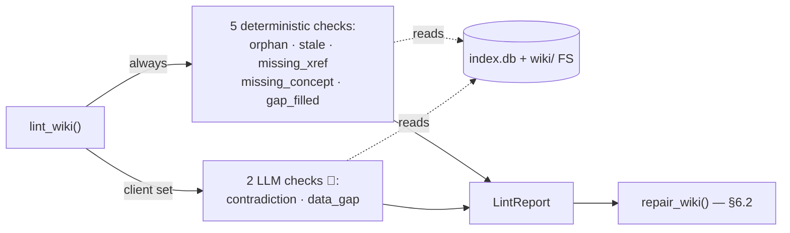
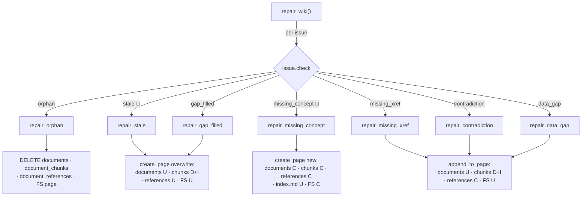
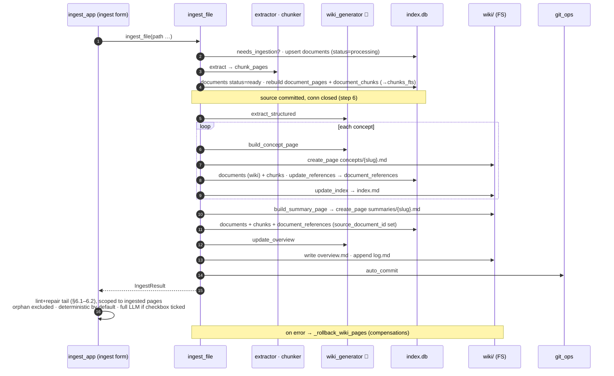
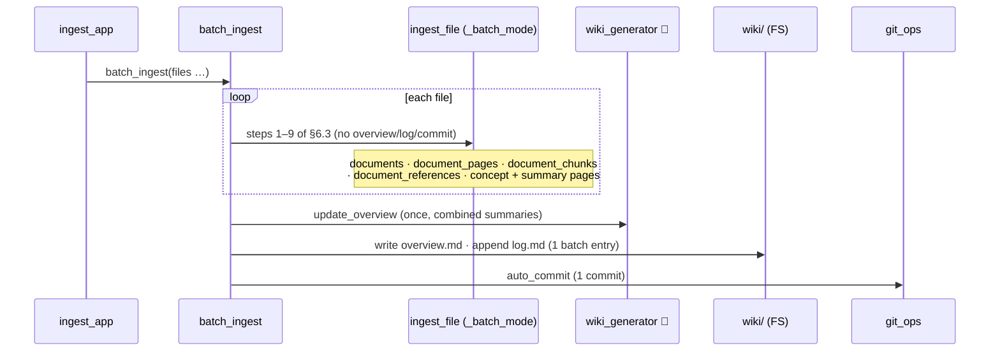
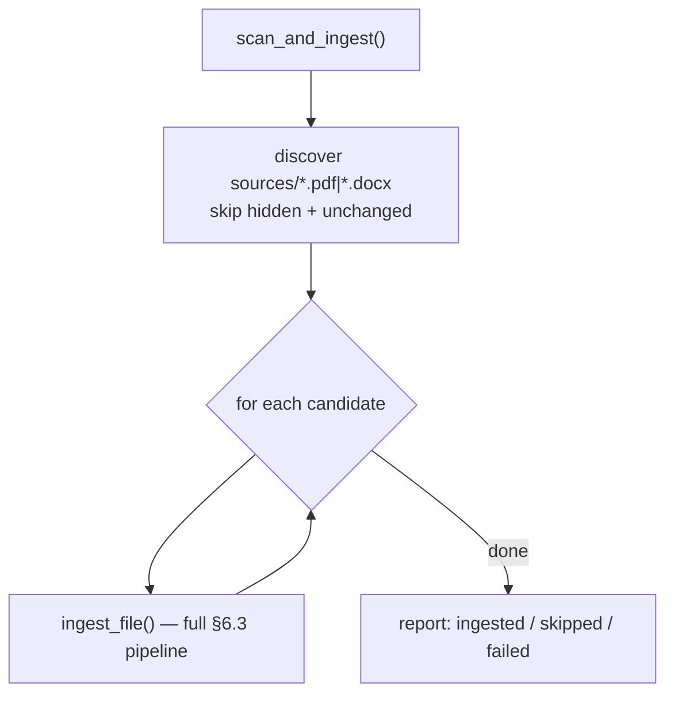
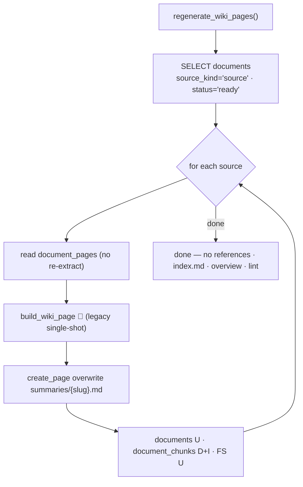
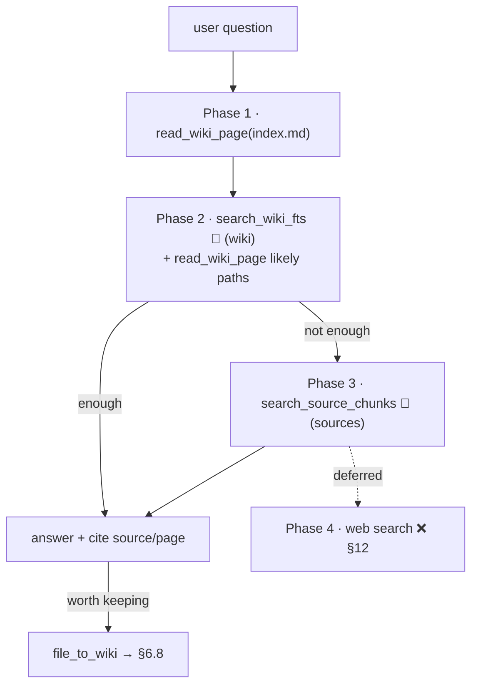
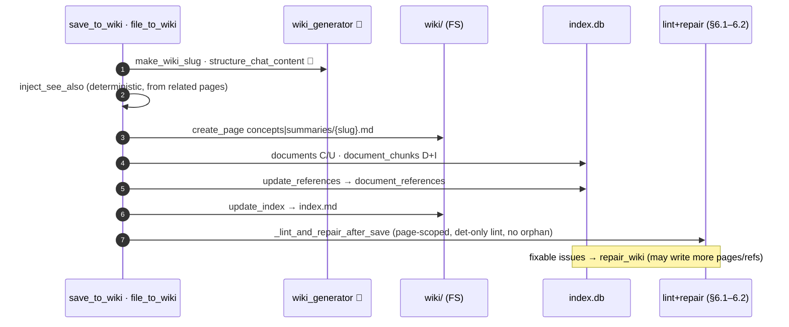
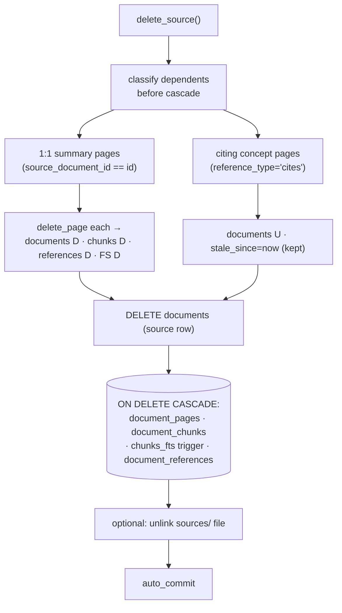
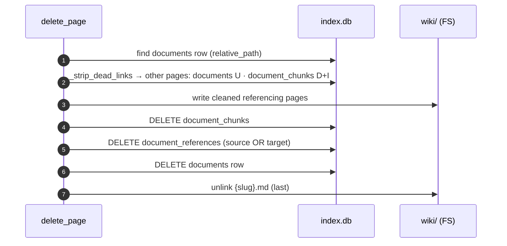

# LLMWiki Workflows (§6)

> Part of the [LLMWiki Programmer Manual](../programmer_manual.md) — this file
> is **§6 Workflows**. Sections §1–§5 and §7–§14 live in `../programmer_manual.md`.
> Section numbers are global and unchanged: a bare `§6.x` is in this file, any
> other `§N` is in the main manual.

## 6. Workflows

Each workflow below follows the same template:

> **Status · Entry · Steps · LLM prompts (inline) · Triggers · Today vs Target · Verification**

### Quick-status table

| #    | Workflow           | Status | Entry                                                                | Pending                                                |
| ---- | ------------------ | ------ | -------------------------------------------------------------------- | ------------------------------------------------------ |
| 6.1  | Lint               | ✅      | `lint/runner.py:17`                                                  | `data_gap` shallow; `gap_filled_check` runs always; not auto-triggered yet (§11.11) |
| 6.2  | Repair             | ✅      | `repair/runner.py:30`                                                | All five deterministic repairs implemented             |
| 6.3  | Single ingest      | ✅      | `ingestion/pipeline.py:88`                                           | Lint+repair tail opt-in today (§11.11)                 |
| 6.4  | Batch ingest       | ✅      | `ingestion/batch.py:batch_ingest`                                   | Lint+repair tail opt-in today (§11.11)                 |
| 6.5  | Scan sources       | ✅      | `ingestion/pipeline.py:340`                                          | Should chain into lint+repair (§11.11)                 |
| 6.6  | Regenerate         | ✅      | `ingestion/pipeline.py:379`                                          | Should chain into lint+repair (§11.8)                  |
| 6.7  | Chat / RAG         | ✅      | `chat/agent.py:create_agent` + `chat/config.py:_DEFAULT_SYSTEM_PROMPT` | Phases 1–3 (wiki + sources) complete; web search (Phase 4) is a future enhancement (§12) |
| 6.8  | Chat → Wiki        | ✅      | `chat/wiki_tools.py:file_to_wiki` and `:save_to_wiki`               | Post-save lint+repair + cross-linking ✅; LLM-gated checks & bidirectional links deferred (§12) |
| 6.9  | Source deletion    | ✅      | `tools/deletion.py:11`                                               | —                                                      |
| 6.10 | Wiki page deletion | ✅      | `tools/wiki_fs.py:delete_page`                               | —                                                     |

Every ingestion and save workflow shares one goal: **leave the wiki in an
internally consistent state.** The mechanism is the **lint → repair reconciliation
cycle**, documented first (§6.1–§6.2) because §6.3–§6.6 and §6.8 all converge on it.

**Mental model.** Ingestion does the reconciliation *inline* — it creates/updates
the concept and summary pages, rewrites `overview.md`, and updates the citation
graph and `index.md`. **Lint is the verification gate**: if ingestion did its job,
a follow-up lint should report *"no actions needed."* **Repair is the safety net**
for whatever lint still flags. The steady-state success criterion for any ingest
is therefore *"lint comes back clean."*

**Two-column convention.** Each workflow below is described as **Today** (what the
code does now) and **Target** (the intended end state, tracked in §11). The status
legend (✅ implemented · 🟡 partial · ❌ missing) still applies per workflow.

**Plan note (§11.11).** Today lint runs after ingest only when
`lint_after_ingest=True` (single) / `run_lint=True` (batch) — both default to
`False` — and repair has no UI trigger at all. The Target is for lint+repair to
**always** close every ingest, scan, and regenerate, with explicit "Run Lint" /
"Run Repair" buttons in `ingest_app.py`.

**Entry duality.** Single (§6.3) and batch (§6.4) ingestion can start either from
the GUI (upload widget) **or** by dropping files into `workspace/sources/` and
running Scan sources (§6.5).

### Table-write matrix

What each workflow does to the four DB tables and the wiki filesystem.
**C**reate · **R**ead · **U**pdate · **D**elete · `D+I` = rebuilt (delete-then-insert) · – = untouched.
`chunks_fts` mirrors `document_chunks` via triggers, so it tracks that column.

| Workflow | `documents` | `document_pages` | `document_chunks` | `document_references` | `wiki/` FS |
| --- | --- | --- | --- | --- | --- |
| 6.1 Lint | R | R | R | R | R |
| 6.2 Repair | C/U/D | – | C/U/D | C/U/D | C/U/D |
| 6.3 Single ingest | C/U | D+I | D+I | C/U | C/U |
| 6.4 Batch ingest | C/U | D+I | D+I | C/U | C/U |
| 6.5 Scan sources | C/U | D+I | D+I | C/U | C/U |
| 6.6 Regenerate | U | R | D+I | – | U |
| 6.7 Chat / RAG | R | – | R | R | R |
| 6.8 Chat → Wiki | C/U | – | D+I | C/U | C/U |
| 6.9 Source delete | U/D | D | D | D | D |
| 6.10 Page delete | D | – | D | D | U/D |

6.3 (via the `ingest_app` runner) closes with a 6.1/6.2 reconciliation pass —
deterministic by default, full LLM if the form checkbox is ticked, scoped to the
pages the ingest touched — so the 6.2-row writes can also fire as the tail of an
ingest (without touching unrelated pages). 6.4/6.5 reuse 6.3 per file (6.4 defers
overview/log/commit to once per batch). 6.6 touches **summary pages only** — no
`document_references`, `index.md`, `overview.md`, or lint. 6.7 is read-only unless the agent calls `file_to_wiki` (→ 6.8). 6.9/6.10
deletions cascade via `ON DELETE CASCADE` + the `chunks_fts` triggers; 6.10 also
**U**pdates *other* pages when stripping dead links to the deleted page.

The per-workflow diagram at the top of each §6.x section below shows the routines
and stores involved; 🧠 marks a step that calls the LLM.

---

### 6.1 Lint ✅



Lint is **read-only**: it never writes a table or file, it only produces a `LintReport`.

**Entry:** `lint_wiki()` — `base/domain/lint/runner.py:17`

Lint is the **verification gate** of the reconciliation cycle: it inspects the
wiki for internal-consistency defects and reports them, but changes nothing. In
the steady state — right after a successful ingest — lint should return *"no
actions needed."* A non-empty report means ingestion (or a manual edit, or a
deleted/modified source) left the wiki out of sync, which §6.2 Repair then fixes.

```python
report = lint_wiki(
    db_path,
    workspace,
    client=None,        # pass an LLM client to enable the LLM checks
    model="",
    progress_cb=None,   # optional callable(str) — reports progress per check
)
print(report.summary())             # "3 issue(s): 1 error(s), 2 warning(s), 0 info"
for issue in report.issues: ...
```

`progress_cb` is called before each check and, crucially, **before each pair in the
pairwise `contradiction_check`** — the one slow (per-pair LLM) check. The ingest
runner and the manual "Run Wiki Lint & Repair" button pass the timed Activity-Log
callback here so the long LLM lint reports progress instead of going silent (a user
watching the log would otherwise think the run had hung). Deterministic-only lint is
fast, so the callback mostly matters in full-LLM mode.

**Seven checks (`base/domain/lint/checks.py`):**

| Check             | Function           | Type                            | Severity       | What it finds                                                                                  |
| ----------------- | ------------------ | ------------------------------- | -------------- | ---------------------------------------------------------------------------------------------- |
| `orphan`          | `orphan_check`     | deterministic                   | warning        | Concept pages with no inbound `links_to` edge                                                  |
| `stale`           | `staleness_check`  | deterministic                   | warning        | Wiki pages older than any of their cited sources (SQL `MAX(src.updated_at) > wiki.updated_at`) |
| `missing_xref`    | `missing_xref_check` | deterministic                 | info           | Concept pairs that share a cited source but don't link to each other                           |
| `missing_concept` | `missing_concept_check` | deterministic              | warning        | `[text](concepts/foo.md)` links to non-existent files (regex `_CONCEPT_LINK_RE`)               |
| `gap_filled`      | `gap_filled_check` | deterministic (always runs)     | info           | `<!-- DATA_GAP: slug -->` TODO markers whose topic is now covered by a source                  |
| `contradiction`   | `contradiction_check` | **LLM** (skip if `client=None`) | error       | Pair-wise LLM comparison of concepts sharing a source                                          |
| `data_gap`        | `data_gap_check`   | **LLM** (skip if `client=None`) | info           | LLM scan of all concept titles for missing/underdeveloped topics                               |

The runner calls the five deterministic checks unconditionally and the two LLM
checks only when a `client` is passed (`lint/runner.py:lint_wiki`).

**LLM prompts (in `checks.py`):**

| Prompt                | Template                                                         | Input                                              | Output                                                  | Temperature |
| --------------------- | ---------------------------------------------------------------- | -------------------------------------------------- | ------------------------------------------------------- | ----------- |
| `contradiction_check` | `_CONTRADICTION_SYSTEM` (L155), `_CONTRADICTION_TEMPLATE` (L159) | path_a, content_a≤2000ch, path_b, content_b≤2000ch | `"CONTRADICTION: <desc>"` or `"NO CONTRADICTION"`       | 0.1         |
| `data_gap_check`      | `_GAP_TEMPLATE` (L232)                                           | bullet list of all concept titles                  | `"GAP: <topic> — <suggestion>"` per line or `"NO GAPS"` | 0.3         |

**Report shape (`lint/report.py`):**

```python
@dataclass
class LintIssue:
    check: str                # "orphan" | "stale" | "missing_xref" | "missing_concept" | "contradiction" | "data_gap" | "gap_filled"
    severity: str             # "error" | "warning" | "info"
    page: str                 # e.g. "/wiki/concepts/federal-reserve.md"
    description: str
    suggestion: str
    related_page: str = ""    # the "other" page (path_b) for xref/contradiction
    topic: str = ""           # gap topic slug for data_gap / gap_filled

@dataclass
class LintReport:
    issues: list[LintIssue] = field(default_factory=list)
    checked_at: str = ""      # ISO timestamp
    # Properties: .errors, .warnings; method .summary()
    #   summary() → "N issue(s): E error(s), W warning(s), X info"
```

**Today:**

- `ingest_file(..., lint_after_ingest=True)` runs deterministic checks only (no
  LLM) and appends a one-line summary to `wiki/log.md`. Default is `False`.
- `batch_ingest(..., run_lint=True)` — same, once per batch. Default is `False`.
- Manual function call from a notebook cell.
- No "Run Lint" button in `ingest_app.py`.
- `data_gap_check` is intentionally shallow — it only sees titles (§11.7).

**Target:** lint runs automatically at the end of every ingest, scan, and
regenerate (not opt-in), plus an explicit "Run Lint" button. Deepen `data_gap`
beyond titles (§11.7). Tracked in §11.11.

---

### 6.2 Repair ✅



🧠 = needs an LLM client; skipped when `llm_client=None` (`stale`, `missing_concept`).

**Entry:** `repair_wiki()` — `base/domain/repair/runner.py:30`

Repair is the **safety net** of the cycle: it consumes a `LintReport` and applies
automatic fixes where it is safe to do so, skipping anything that needs human
judgement.

```python
lint_report = lint_wiki(db_path, workspace, client=llm_client, model=model)
repair_report = repair_wiki(
    lint_report, db_path, workspace,
    llm_client=llm_client, model=model, progress_cb=print,
)
print(repair_report.summary())   # "4 issue(s): 2 fixed, 1 skipped, 1 failed"
```

**Repair dispatch (`repair/actions.py`):**

| Issue type        | Function (line)                 | Action                                                                                                                                                             | Needs LLM                                                 | Status    |
| ----------------- | ------------------------------- | ------------------------------------------------------------------------------------------------------------------------------------------------------------------ | --------------------------------------------------------- | --------- |
| `orphan`          | `repair_orphan` (L30)           | Delete the orphan concept page (file + DB row + chunks + references)                                                                                               | No                                                        | ✅         |
| `stale`           | `repair_stale` (L55)            | Reload page text from `document_pages` → re-run `extract_structured` + `build_summary_page` → `create_page(overwrite=True)` → `update_references`                  | Yes                                                       | ✅         |
| `missing_xref`    | `repair_missing_xref`           | Append `## See also` bullet linking A→B; call `update_references` to record the `links_to` edge. Idempotent.                                                        | No                                                        | ✅         |
| `missing_concept` | `repair_missing_concept`        | Parse filename out of the issue description; gather context via `search_chunks`; LLM writes new concept page; `create_page` + `update_references` + `update_index` | Yes (inline f-string prompt, temperature 0.3)             | ✅         |
| `contradiction`   | `repair_contradiction`          | Append idempotent `<!-- CONTRADICTION: path_b -->` + `⚠️` callout to page A; call `update_references`. Needs a human to resolve; repair only flags.                | No                                                        | ✅         |
| `data_gap`        | `repair_data_gap`               | Insert `<!-- DATA_GAP: slug -->` TODO note into the most-related wiki page (FTS host selection). Skips if topic already covered by a source.                        | No                                                        | ✅         |
| `gap_filled`      | `repair_gap_filled`             | Replace DATA_GAP block with `> ℹ️ See [Title](rel).` link; `create_page(overwrite=True)` + `update_references`. Fires when a topic's source is ingested.           | No                                                        | ✅         |

LLM-dependent repairs (`stale`, `missing_concept`) are automatically skipped when
`llm_client=None`.

**Report shape (`repair/report.py`):**

```python
@dataclass
class RepairResult:
    check: str            # original lint check
    action: str           # "deleted_orphan" | "regenerated" | "created" | "skipped"
    page: str
    success: bool
    message: str

@dataclass
class RepairReport:
    results: list[RepairResult]
    repaired_at: str
    # Properties: .fixed, .skipped, .failed, .summary()
```

**Today:** manual function call only; no "Run Repair" button. All five
deterministic repair types are implemented. Already auto-runs after chat→wiki
save (§6.8).

**Target:** repair runs automatically after lint at the end of every ingest,
scan, and regenerate, with an explicit "Run Repair" button. Tracked in §11.11.

**Verification:** `tests/unit/test_repair_*.py`.

---

### 6.3 Single-document ingestion ✅



**Entry:** `ingest_file()` — `base/domain/ingestion/pipeline.py:88`

```python
result = ingest_file(
    file_path,          # Path to PDF or DOCX
    db_path,            # str path to index.db
    workspace,          # Path to workspace root
    llm_client,         # OpenAI-compatible client
    model,              # e.g. "anthropic/claude-haiku-4-5"
    progress_cb=None,        # optional callable(str)
    lint_after_ingest=False, # run deterministic lint after step 12
    _batch_mode=False,       # internal — suppresses steps 10-13
)
# IngestResult(file_path, status="ingested"|"skipped"|"failed", message, doc_id)
```

**Pipeline steps:**

| #     | Step                                                                                                      | Where                                               |
| ----- | --------------------------------------------------------------------------------------------------------- | --------------------------------------------------- |
| 1     | Validate file (exists, supported extension)                                                               | `pipeline.py`                                       |
| 2     | Hash + mtime change detection                                                                             | `detector.py:needs_ingestion`                       |
| 3     | Extract `(page_number, markdown)` pairs                                                                   | `extractor.py:extract` (PDF / DOCX-via-LibreOffice) |
| 4     | Chunk pages into FTS5 units                                                                               | `chunker.py:chunk_pages`                            |
| 5     | Atomic DB write: `documents` + `document_pages` + `document_chunks`                                       | `pipeline.py`                                       |
| **6** | **Commit `status='ready'**` — readers can now see the source                                              | `pipeline.py`                                       |
| 7     | LLM: structured extraction → `ExtractionResult(document_summary, concepts[])`                             | `wiki_generator.py:extract_structured` (line 189)   |
| 8     | For each concept: build page (LLM) → `create_page(overwrite=True)` → `update_references` → `update_index` | `wiki_generator.build_concept_page` (270)           |
| 9     | Build summary page (deterministic) → `create_page` with `source_document_id`                              | `wiki_generator.build_summary_page` (238)           |
| 10    | LLM: rewrite `wiki/overview.md`                                                                           | `wiki_generator.update_overview` (304)              |
| 11    | Append `## [date] Ingested | filename` to `wiki/log.md`                                                   | `wiki_fs.append_to_page`                            |
| 12    | `auto_commit("ingest: ...")`                                                                              | `git_ops.auto_commit`                               |
| 13    | Optional deterministic lint pass (if `lint_after_ingest=True`)                                            | `lint/runner.lint_wiki`                             |

**LLM prompts used (all in `base/domain/ingestion/wiki_generator.py`):**

| Prompt               | Template constants                                                                             | Inputs                                                             | Output                                                               | Temperature |
| -------------------- | ---------------------------------------------------------------------------------------------- | ------------------------------------------------------------------ | -------------------------------------------------------------------- | ----------- |
| `extract_structured` | `_EXTRACT_SYSTEM` (L78), `_EXTRACT_USER_TEMPLATE` (L85)                                        | filename, file_type, page_count, content ≤80 KB                    | JSON `{document_summary, concepts:[{name,category,insight}]}`        | 0.2         |
| `build_concept_page` | `_CONCEPT_SYSTEM` (L109) + `_CONCEPT_NEW_TEMPLATE` (L114) OR `_CONCEPT_UPDATE_TEMPLATE` (L143) | concept name/category/insight, filename, existing content (if any) | Markdown w/ frontmatter + Definition/Characteristics/Context/Sources | 0.3         |
| `update_overview`    | `_OVERVIEW_SYSTEM` (L156), `_OVERVIEW_TEMPLATE` (L160)                                         | current overview, new summary, all concept names                   | 3–5 paragraph narrative                                              | 0.4         |

> The legacy single-shot `build_wiki_page` (L331) is kept for backward  
> compatibility but is no longer on the ingest path.

**Triggers:**

- Marimo **ingest form** in `ingest_app.py` (`ingest_form_cell`): the "⚙️ Ingest
  uploaded file(s)" submit button bundled with an "also run full LLM lint & repair"
  checkbox. `mo.ui.form` emits its value only on submit, so the checkbox is read
  atomically (no reset race); `on_change` snapshots the files + flag into the trigger.
- Directly callable as a Python function (`ingest_file`).

**Today vs Target:**

- **Coverage.** A single ingest already creates *both* concept pages (step 8) and
  the 1-to-1 summary page (step 9) — not just the summary.
- **Reconciliation tail.** The `ingest_file` library function itself only rewrites
  `overview.md` (step 10) and, when `lint_after_ingest=True` (default `False`), runs a
  deterministic lint it appends to the log — it never repairs. The **`ingest_app`
  runner** closes that gap: after every ingest it runs a lint **and** repair pass
  (`ingest_runner`), **deterministic by default** (no LLM) or **full LLM** when the
  form checkbox is ticked, so new concept/summary pages get cross-linked and lint
  comes back clean. The pass is **scoped to the pages this ingest touched** — the
  summary pages of the ingested sources plus every wiki page that cites them — so an
  ingest reconciles only its own document and never rewrites unrelated pages (the
  manual "Run Wiki Lint & Repair" button does the wiki-wide sweep). The `orphan`
  check is excluded so pages created by *this* run aren't deleted for lacking inbound
  links yet. Remaining: extend the same auto-close to scan and regenerate (§11.11).
- **Duplicate handling.** Today an unchanged file returns `status="skipped"`
  silently (`detector.needs_ingestion`). **Target:** the GUI warns "already
  ingested" rather than skipping quietly (§11.13).

`status='ready'` is set at step 6 (before the LLM work in steps 7–9), see §10.

**Partial-failure rollback.** Steps 8–9 are not transactional (the source connection
is closed at step 6 so the wiki tools open their own). To keep a failed ingest from
leaving orphaned/half-merged derived pages, the pipeline records a *compensation* for
every page it creates or overwrites in steps 8–9 (`wiki_compensations`): pages this run
**newly created** are deleted (and their `index.md` entry removed via
`index_manager.remove_index_entry`); pages it **overwrote** are restored to their prior
content (snapshotted by `_snapshot_wiki_page` before the overwrite). On any exception the
`except` handler runs `_rollback_wiki_pages` before marking the source `status='failed'`.
Rollback is best-effort — a rollback error is logged, never raised, so it cannot mask the
original failure.

**Verification:**

```bash
HEADLESS=1 uv run pytest tests/e2e/test_ingest_app.py -v -s
uv run pytest tests/unit/test_pipeline_phase2.py -v
```

---

### 6.4 Batch / multi-document ingestion ✅



The per-file work is the §6.3 pipeline in batch mode (the boxed `loop` step); only
the overview/log/commit tail is collapsed to once per batch.

**Entry:** `batch_ingest()` — `base/domain/ingestion/batch.py`

```python
results = batch_ingest(
    files=[Path("sources/doc1.pdf"), Path("sources/doc2.pdf")],
    db_path=db_path,
    workspace=workspace,
    llm_client=client,
    model=model,
    progress_cb=None,
    run_lint=False,     # run deterministic lint once at the end
)
```

**Difference from 6.3:** each file goes through steps 1–9 of `ingest_file`  
with `_batch_mode=True` (set at `batch.py:63`), which suppresses steps 10–13.  
Then at the end of the batch the wrapper does **once**:

1. `update_overview()` with all new summaries combined.
2. Single `wiki/log.md` entry: `## [date] Batch ingested | N file(s)`.
3. Single `auto_commit("batch ingest: N file(s)")`.
4. Optional `lint_wiki()` deterministic pass.

**LLM call count for N files, K concepts/file:**

- `batch_ingest`: `N × (1 extract + K concepts) + 1 overview`
- `ingest_file` × N: `N × (1 extract + K concepts + 1 overview)`

Concept pages compound naturally across the batch — the second file's mention  
of an existing concept hits the `_CONCEPT_UPDATE_TEMPLATE` branch in step 8.

**Today vs Target:**

- **Reconciliation tail.** Today the batch ends with one `overview.md` rewrite and
  one optional deterministic lint pass (`run_lint=True`, default `False`); repair
  never runs. **Target:** the batch closes with a single lint **and** repair pass
  over the whole wiki — *including the pages just created in this batch* — so newly
  related concepts get cross-linked and lint comes back clean (§11.11).
- **Duplicate handling.** Like §6.3, unchanged files are skipped silently today;
  **Target** warns when any uploaded file is already ingested (§11.13).

**Triggers:** currently invoked through `ingest_app.py` "Ingest" button when  
multiple files are uploaded (the underlying widget supports multi-select).

**Verification:** `tests/unit/test_batch_ingest.py` — 9 tests, including a key  
assertion `len(llm.calls) == 5` for a 2-file batch (extract×2 + concept×2 +  
overview×1) which proves the overview is *not* called per file.

---

### 6.5 Scan sources folder ✅



The boxed `ingest_file()` step is the entire §6.3 pipeline (run sequentially, not in
batch mode). One trace run wraps the whole scan (no-op unless `WIKI_TRACE=1`).

**Entry:** `scan_and_ingest()` — `base/domain/ingestion/pipeline.py:340`

Walks `workspace/sources/` recursively, collects `.pdf` / `.docx` files  
(case-insensitive, skipping hidden entries), and calls `ingest_file()` for each.  
Unchanged files (detected by `detector.needs_ingestion` — mtime then hash)  
return `status="skipped"` without re-running the LLM.

**Why it exists:** lets you drop several files into `sources/` from outside the  
UI (Finder, `cp`, `obsidian-clipper`, etc.) and then re-ingest only the new or  
modified ones in one click. The pipeline does NOT run as a daemon — it scans  
on demand.

**Distinction from 6.4:** `scan_and_ingest` discovers files automatically,  
`batch_ingest` takes an explicit list. Internally `scan_and_ingest` calls  
`ingest_file` *sequentially* (not in batch mode) — so each scanned file still  
triggers an overview rewrite and a git commit. If you scan many files, prefer  
calling `batch_ingest(files=list(...))` directly.

**Triggers:** Marimo button "🔄 Scan sources" in `ingest_app.py:194`  
(`scan_btn`).

**Scan vs lint+repair (important).** Scanning is *source→wiki freshness*: it
detects new or modified **source files** and ingests them. Lint+repair is
*wiki→wiki consistency* (orphans, stale pages, missing cross-refs) — the two are
orthogonal (see the architecture diagram in §2). They meet at one point: a
*modified* source makes its dependent wiki pages **stale**, which the `stale`
lint check (§6.1) flags and `repair_stale` (§6.2) regenerates. So "scan sources
and update the wiki accordingly" = **scan to ingest the changed sources, then run
lint+repair to bring the wiki back into a consistent state.**

**Today vs Target:**

- **Today:** scan only ingests new/modified sources (each via `ingest_file`); it
  does **not** run lint+repair afterwards, so stale dependents are detected but
  not fixed in the same pass. The per-file overview rewrite is also wasteful for
  large scans — treat scan as "pick up the one or two files I dropped"; for bulk
  imports call `batch_ingest` directly (§11.9).
- **Target:** scan closes with a single lint **and** repair pass so a modified
  source's stale pages are regenerated automatically and lint comes back clean
  (§11.11).

---

### 6.6 Regenerate wiki pages ✅



Unlike §6.3, regenerate refreshes **summary pages only** via the legacy
`build_wiki_page`, and skips references, index, overview, and lint (see Today vs
Target below).

**Entry:** `regenerate_wiki_pages()` — `base/domain/ingestion/pipeline.py:379`

Iterates over every `documents` row with `source_kind='source'` and  
`status='ready'`, reloads the cached page text from `document_pages` (no PDF  
re-extraction), and re-runs:

1. `extract_structured()` (LLM)
2. `build_summary_page()` (deterministic)
3. `create_page(..., overwrite=True)` → `update_references` → `update_index`

**Use cases:**

- LLM model changed.
- Prompt templates in `wiki_generator.py` were refined.
- A wiki page was accidentally deleted from disk.

**Triggers:** Marimo button "🤖 Regenerate wiki" in `ingest_app.py:198`  
(`regen_btn`).

**Today vs Target:**

- **Today:** regenerate refreshes **only the summary pages** — it does NOT rebuild
  concept pages, NOR `overview.md`, NOR run lint/repair afterwards. Failed/processing
  sources are skipped silently.
- **Target:** regenerate rebuilds concept pages and overview too, then closes with
  a lint **and** repair pass so a regenerate never leaves stale concept/overview
  pages behind and lint comes back clean (§11.8, §11.11).

---

### 6.7 Query / Chat (multi-phase RAG) ✅



Routing is prompt-driven, not code-driven. Phases 1–3 are **read-only** over
`index.db` + `wiki/`; only the capture branch (`file_to_wiki`, §6.8) writes.

**Entry:** `create_agent()` — `base/domain/chat/agent.py`, paired with  
the system prompt in `base/domain/chat/config.py` (`_DEFAULT_SYSTEM_PROMPT`).

This is the most important section for understanding *how answers are*  
*generated*. The routing is **prompt-driven, not code-driven** — there is no  
Python `if`/`else` deciding which tool to call. The LLM reads the system  
prompt and picks tools accordingly. The code just provides the toolbox.

**Core principle — wiki-first.** The agent answers from the **curated wiki pages**
(the Encyclopedia) wherever possible, and only drops to the raw `document_chunks`
(the Filing Cabinet, via `search_source_chunks`) when the wiki pages don't contain
enough detail. The wiki is the default context; the DB is the fallback. This is
the whole point of the LLM-Wiki pattern (§1) — re-reading curated pages is cheaper
and higher-signal than re-deriving knowledge from raw chunks on every query.

#### Tool inventory

| Tool                                     | Module:fn                  | Scope                  | When the agent calls it                   |
| ---------------------------------------- | -------------------------- | ---------------------- | ----------------------------------------- |
| `read_wiki_page(path)`                   | `chat/wiki_tools.py:read_wiki_page`       | single file            | Direct page lookup by known path          |
| `search_wiki_fts(query, limit=10)`       | `chat/wiki_tools.py:search_wiki_fts`      | `source_kind='wiki'`   | Topic discovery across all wiki pages     |
| `file_to_wiki(title, content, category)` | `chat/wiki_tools.py:file_to_wiki`         | write                  | Persist a synthesis (see §6.8)            |
| `search_source_chunks(query, limit=10)`  | `chat/tools.py:search_source_chunks` (async) | `source_kind='source'` | Last-resort lookup into raw PDFs/DOCXs    |
| Web search                               | —                          | —                      | ❌ **NOT YET IMPLEMENTED** (Pending §11.5) |

The agent receives `db_path` as `deps_type=str`. Every tool derives the  
workspace from it via `workspace = Path(db_path).parent.parent` (because the  
DB is always at `workspace/.llmwiki/index.db`).

The registered set is exactly `chat/agent.py:create_agent` →
`tools=[read_wiki_page, search_wiki_fts, file_to_wiki, search_source_chunks]`.
`save_to_wiki` is **not** an agent tool — it's the read-app save form's path
(§6.8); the agent's write tool is `file_to_wiki`.

#### Routing rules (from `_DEFAULT_SYSTEM_PROMPT`)

The intended retrieval flow is staged — *wiki first, raw sources second, web*  
*search last*:

1. **Phase 1 — Try the index.** Call `read_wiki_page("wiki/index.md")`. If
  missing or empty, do not conclude the wiki is empty; continue.
2. **Phase 2 — Search the wiki.** Call `search_wiki_fts` with the question's
  key terms. Optionally `read_wiki_page` on likely paths  
   (`wiki/concepts/xyz.md`, `wiki/summaries/xyz.md`). This step always runs.
3. **Phase 3 — Fall back to raw sources.** Only call `search_source_chunks`
  when the wiki results don't contain enough detail.
4. **Phase 4 — Web search.** Only when phases 1–3 returned nothing useful.
  **Not implemented yet** — track in §11.5 and §11.6.
5. **Capture.** When the agent produces a comparison/analysis/summary worth
  keeping, call `file_to_wiki` (§6.8).

**Output guidelines (also in the prompt):** cite source + page for facts; use  
tables for comparisons, bullets for enumerations; "no information found" is  
only allowed after both `search_wiki_fts` and `search_source_chunks` were  
tried.

#### Customising per workspace

`workspace/wiki_config.toml`:

```toml
[assistant]
system_prompt = """
You are a specialist in mortgage-backed securities.
# ...keep the wiki-first routing block here — see wiki_config.example.toml
"""
suggested_prompts = [
    "What is a CDO?",
    "Compare MBS and ABS",
]
```

Loaded by `chat/config.py:load_config()` at agent creation time
(`read_app.py:wiki_context` calls it). Defaults apply at three levels, all in
`chat/config.py`:

1. **File absent** → `load_config` hits `if not config_file.exists(): return
   WikiAssistantConfig()` — the dataclass with its default fields.
2. **`[assistant]` section missing** → `data.get("assistant", {})` yields `{}`.
3. **A key missing** → per-key fallback:
   `assistant.get("system_prompt", _DEFAULT_SYSTEM_PROMPT)` and
   `assistant.get("suggested_prompts", _DEFAULT_PROMPTS)`.

The defaults themselves are `_DEFAULT_SYSTEM_PROMPT` and `_DEFAULT_PROMPTS` in the
same module (and the `WikiAssistantConfig` field defaults reference them). So a
*partial* `wiki_config.toml` — e.g. only `suggested_prompts` — still keeps the
default `system_prompt`. The repo ships a fully-commented template at
`wiki_config.example.toml` (project root) — copy it into the workspace as
`wiki_config.toml`. Both keys are optional; omit either to keep the defaults.

> ⚠️ **A custom `system_prompt` must preserve the wiki-first routing**  
> (index → `search_wiki_fts` → `search_source_chunks` *fallback*). Because routing  
> is prompt-driven (above), a prompt that tells the agent to "always use  
> `search_source_chunks`" silently degrades the system to plain RAG and defeats the  
> whole LLM-Wiki design. The shipped example keeps the routing intact and only  
> specialises the domain line.

**Triggers:** the right-panel chat in `marimo/read_app.py` (`chat_panel` cell).  
The agent streams responses via `wiki_agent.run_stream(...)` →  
`result.stream_text(delta=True)`. The agent, system prompt, and `db_path` are  
rebuilt by the `wiki_context` cell whenever the active wiki changes (§7.1).

**Gaps:**

- **Web search (Phase 4) is intentionally deferred** — see §12 for the
  rationale. Phases 1–3 (wiki index → wiki FTS → raw source chunks) are fully
  implemented and cover the project's core thesis: answer from your own curated
  corpus. Phase 4 is the only workflow that reaches outside it.
- The "always check index first" rule is advisory — there's no programmatic  
guarantee the LLM does it. Track regressions via the E2E suite.
- Phases are not numbered explicitly in the prompt today; tightening them to
  "Phase 1 / Phase 2 / Phase 3" labels would only matter once Phase 4 lands (§12).

---

### 6.8 Chat → Wiki (`file_to_wiki`) ✅



**Entry:**

- Agent tool: `file_to_wiki()` — `base/domain/chat/wiki_tools.py:file_to_wiki`
- UI-direct (no `RunContext`): `save_to_wiki()` — `base/domain/chat/wiki_tools.py:save_to_wiki`

```python
# Agent tool — called by PydanticAI via RunContext
file_to_wiki(ctx, title="Yield Curve Analysis", content="...", category="concept")

# UI helper — called directly from read_app.py:save_action
save_to_wiki(
    db_path, workspace, title, content, category,
    client=llm_client,   # OpenAI-compatible client; if None, built from config
    model=settings.LLM_MODEL,
)
```

Both share identical logic:

1. Slugify the title with `wiki_generator.make_wiki_slug` (NFKD-normalised — diacritics stripped, so "Política Común" → `politica-comun`).
2. Pick directory by category: `concept` → `/wiki/concepts/`, `summary` → `/wiki/summaries/`.
3. Read existing page content (if any) via `wiki_fs.read_page`.
4. **LLM structuring pass** — call `wiki_generator.structure_chat_content(title, category, raw_content, existing, client, model)`. Returns properly structured markdown (YAML frontmatter + Definition / Key Characteristics / Context / Sources).
5. **Deterministic See-also injection** — gather the existing wiki pages via `_related_pages_for(workspace, exclude_slug, current_dir)` and call `wiki_generator.inject_see_also(structured, related)`. It scans the structured markdown for **whole-word** mentions (`\b…\b`) of known page slugs and inserts a `## See also` section (before `## Sources`) linking each mentioned page that isn't already linked. Runs in both `file_to_wiki` and `save_to_wiki`. This is why chat-sourced pages get cross-links even though the LLM is told never to invent links.
6. Write with `create_page(overwrite=True)` if the page existed (LLM merge); `create_page(overwrite=False)` if new.
7. Look up the doc id and call `references.update_references` to keep the citation graph in sync.
8. Derive a one-line summary from the first heading and call `index_manager.update_index`.
9. Return `"Updated wiki page: wiki/concepts/foo.md"` or `"Created wiki page: ..."`.

**LLM prompts used (all in `wiki_generator.py`):**

| Prompt                              | Template constants                                         | Inputs                            | Output                                                               | Temperature |
| ----------------------------------- | ---------------------------------------------------------- | --------------------------------- | -------------------------------------------------------------------- | ----------- |
| `structure_chat_content` (new page) | `_CONCEPT_SYSTEM` (L109) + `_CHAT_CONCEPT_NEW_TEMPLATE`    | title, category, raw content      | Markdown w/ frontmatter + Definition/Characteristics/Context/Sources | 0.3         |
| `structure_chat_content` (update)   | `_CONCEPT_SYSTEM` (L109) + `_CHAT_CONCEPT_UPDATE_TEMPLATE` | title, raw content, existing page | Merged markdown, no duplication                                      | 0.3         |

`**file_to_wiki` — client injection:** builds `openai.OpenAI` lazily from  
`config.settings` (`WIKI_LLM_*` falling back to `LLM_*`). Keeps `deps_type=str`  
(db path) unchanged so existing RunContext mocks in tests remain unaffected.

`**save_to_wiki` — client injection:** optional keyword-only `client=None, model=None`; builds from settings when omitted, allowing tests to inject  
`FakeLLMClient` directly.

**Triggers:**

- Agent-decided when the chat produces something worth keeping (governed by  
the system prompt's "Capture" rule).
- Manual save form in `read_app.py:209` (`save_form` cell) → `save_action`  
cell at ~L235 calls `save_to_wiki` with an explicit client built from  
`settings.LLM_*`.

**Today:**

This is the **reference implementation of the reconciliation cycle** the ingest
workflows are moving toward — it already closes with lint+repair. When the user
saves a chat reply, the LLM structures it into a proper page (step 4),
`create_page` adds it to the wiki, and then:

- ✅ **Post-save lint+repair**. `_lint_and_repair_after_save` in
  `chat/wiki_tools.py` runs a deterministic lint scoped to the saved page and
  feeds fixable issues to `repair_wiki`. The `orphan` check is excluded so the
  just-created page is never auto-deleted; a `🔧 Post-save repair: …` line is
  appended to the save confirmation.
- ✅ **Cross-linking on save**. Since the three formerly-skipped repairs are now
  implemented (§6.2), a saved page that shares a cited source with an existing
  page is automatically cross-linked (`repair_missing_xref` adds a `## See also`
  link and records the `links_to` edge). Verified end-to-end by
  `tests/unit/test_lint_repair_after_save.py::test_save_to_wiki_auto_cross_links_shared_source`.

**Two known limitations (both deferred to §12, acceptable for a PoC):**

1. *Cross-linking is directional.* `missing_xref_check` emits one issue per pair,
   keyed on `path_a` (the page whose id sorts lower). The post-save filter only
   acts when the saved page is `path_a`; otherwise the link is added on the next
   full lint+repair, not on save.
2. *LLM-gated checks don't run on save.* The post-save lint is intentionally
   called **without** an LLM client, so `contradiction` and `data_gap` (both
   LLM-powered checks) never fire on save — only the deterministic checks
   (`missing_xref`, `missing_concept`, `stale`, `gap_filled`) do. This keeps save
   latency and cost low.

---

### 6.9 Source deletion ✅



**Entry:** `delete_source()` — `base/domain/tools/deletion.py:11`

```python
delete_source(db_path, workspace, doc_id, *, also_delete_file=False)
# -> RepairResult(action="deleted" | "failed", ...)
```

Removes the source `documents` row; FK `ON DELETE CASCADE` automatically cleans  
up `document_pages`, `document_chunks`, `chunks_fts` (via triggers), and  
`document_references`. Dependent wiki pages are handled by relationship:  

- **1-to-1 summary pages** (`source_document_id == doc_id`) are **deleted** — there  
  is no source left to regenerate them from.  
- Pages that merely **cite** the source (e.g. multi-source **concept** pages) are  
  **kept and marked `stale_since = datetime('now')`**, since they may still draw on  
  other surviving sources; deleting them would destroy that synthesis. They are  
  surfaced by `find_stale_pages` for review/regeneration. *(Note: the lint runner's  
  `staleness_check` is timestamp-based and does not yet consume `stale_since`; wiring  
  `find_stale_pages` into the runner is follow-up work.)*  

File removal is opt-in (`also_delete_file=True`). Calls  
`auto_commit(workspace, "delete source: {filename}")` on success.

UI: "🗑 Delete Source" section at the bottom of `marimo/ingest_app.py` —  
dropdown of indexed sources, a confirmation checkbox, and an optional  
"also remove file from sources/" checkbox. The `delete_runner` cell mirrors the  
`ingest_runner` / `scan_runner` trigger pattern.

---

### 6.10 Wiki page deletion ✅



**Entry:** `delete_page()` — `base/domain/tools/wiki_fs.py:delete_page`

```python
delete_page(db_path, workspace, dir_path="/wiki/concepts/", slug="snow-white")
# True if page existed; removes file, DB row, chunks, references,
# and strips dead links from all pages that referenced it.
```

What `delete_page` cleans up atomically:

| Layer                 | What is removed                                                                       |
| --------------------- | ------------------------------------------------------------------------------------- |
| Disk                  | The `.md` file                                                                        |
| `documents`           | The row for this page                                                                 |
| `document_chunks`     | All FTS5 units (and via trigger, `chunks_fts`)                                        |
| `document_references` | All edges where this page is source **or** target                                     |
| Other wiki pages      | Inline markdown links to this page are rewritten to plain text by `_strip_dead_links` |

**Triggers:**

- `repair_orphan` (§6.2) — automatic repair path.
- `read_app.py` — `delete_widget_cell` + `delete_event_cell` (see §7).

**Gaps:** none.
