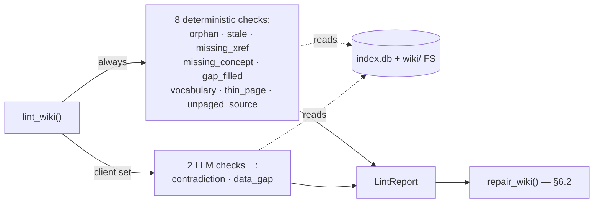

# 6.1 Lint ✅

> §6.1 of the [LLMWiki Programmer Manual](../programmer_manual.md). The index
> for §6, with the quick-status table, the table-write matrix and the template
> every workflow file follows, is [§6 Workflows](../workflows.md).



Lint is **read-only**: it never writes a table or file, it only produces a `LintReport`.

**Entry:** `lint_wiki()` — `base/domain/lint/runner.py:lint_wiki`

Lint is the **verification gate** of the reconciliation cycle: it inspects the
wiki for internal-consistency defects and reports them, but changes nothing. In
the steady state — right after a successful ingest — lint should return *"no
actions needed."* A non-empty report means ingestion (or a manual edit, or a
deleted/modified source) left the wiki out of sync, which §6.2 Repair then fixes.

```python
report = lint_wiki(
    db_path,
    workspace,
    client=None,        # pass an LLM client to enable the LLM checks
    model="",
    progress_cb=None,   # optional callable(str) — reports progress per check
)
print(report.summary())             # "3 issue(s): 1 error(s), 2 warning(s), 0 info"
for issue in report.issues: ...
```

`progress_cb` is called before each check and, crucially, **before each pair in the
pairwise `contradiction_check`** — the one slow (per-pair LLM) check. The ingest
runner and the manual "Run Wiki Lint & Repair" button pass the timed Activity-Log
callback here so the long LLM lint reports progress instead of going silent (a user
watching the log would otherwise think the run had hung). Deterministic-only lint is
fast, so the callback mostly matters in full-LLM mode.

**Nine checks (`base/domain/lint/checks.py`):**

| Check             | Function           | Type                            | Severity       | What it finds                                                                                  |
| ----------------- | ------------------ | ------------------------------- | -------------- | ---------------------------------------------------------------------------------------------- |
| `orphan`          | `orphan_check`     | deterministic                   | warning        | Concept pages with no inbound `links_to` edge                                                  |
| `stale`           | `staleness_check`  | deterministic                   | warning        | Wiki pages older than any of their cited sources (SQL `MAX(src.updated_at) > wiki.updated_at`) |
| `missing_xref`    | `missing_xref_check` | deterministic                 | info           | Concept pairs that share a cited source but don't link to each other                           |
| `missing_concept` | `missing_concept_check` | deterministic              | warning        | `[text](concepts/foo.md)` links to non-existent files (regex `_CONCEPT_LINK_RE`)               |
| `gap_filled`      | `gap_filled_check` | deterministic (always runs)     | info           | `<!-- DATA_GAP: slug -->` TODO markers whose topic is now covered by a source                  |
| `vocabulary`      | `vocabulary_check` | deterministic                   | error/warning/info | Alias-map drift vs the live coverage roster — see the four findings below                  |
| `thin_page`       | `thin_page_check`  | deterministic                   | warning        | Source docs whose wiki pages leave ≥50% of the source's chunks *orphaned*                      |
| `unpaged_source`  | `unpaged_source_check` | deterministic               | warning        | Sources stored as `status='ready'` that no wiki page cites — a model failure after step 6      |
| `contradiction`   | `contradiction_check` | **LLM** (skip if `client=None`) | error       | Pair-wise LLM comparison of concepts sharing a source                                          |
| `data_gap`        | `data_gap_check`   | **LLM** (skip if `client=None`) | info           | LLM scan of all concept titles for missing/underdeveloped topics                               |

`vocabulary_check` emits four distinct findings, each with its own severity:

- `vocab_collision` (**error**) — an alias that is really another covered term's name
- `vocab_stale` (**warning**) — aliases for a canonical the wiki no longer covers
- `vocab_ambiguous` (**warning**) — one alias mapping to two canonicals
- `vocab_covered` (**info**) — a `[fuera_de_alcance]` term that now has a page/dataset

## Maintaining the vocabulary lists

There is **no GUI for this and no plan for one**, and the reason is a design
rule worth stating outright: *the pipeline never rewrites a file a human wrote.*
The two vocabulary files have different owners and the boundary is enforced in
code, not by convention.

| File | Owner | Written by | Editable by hand |
|---|---|---|---|
| `.llmwiki/aliases.generated.toml` | the machine | ingestion step 8b, and `repair_vocab_collision` | no — its own header says so |
| `wiki_config.toml` `[alias_datos]`, `[falsos_sinonimos]`, `[fuera_de_alcance]` | you | nothing, ever | yes — this is the only way |

Nothing in `base/` or `marimo/` writes `wiki_config.toml`. `load_config` and
`load_wiki_language` read it; there is no writer. So maintenance is a text
editor, and the loop is:

1. **Ingest, or press "Run Wiki Lint & Repair".** `vocabulary_check` compares
   both alias sources against the live coverage roster.
2. **Read the findings.** Each carries a `suggestion` naming the fix — e.g.
   *"List 'X' under 'Y' in `[falsos_sinonimos]`, or remove it"*, or *"Remove it
   from the blacklist — it's covered now"*.
3. **One of them repairs itself, conditionally.** `vocab_collision` is the only
   vocabulary finding in `repair/runner.py:_DISPATCH`. It drops the offending
   alias — **but only if it lives in the generated artifact**. When the collision
   comes from your `[alias_datos]`, the repair refuses and says so: *"is a hand
   override in wiki_config.toml … resolve it by hand"*. The other three
   (`vocab_stale`, `vocab_ambiguous`, `vocab_covered`) are in `_ADVISORY_CHECKS`:
   reported, never touched.
4. **Edit `wiki_config.toml`** for everything left.
5. **Re-run lint** to confirm the finding is gone.

**These lists go stale on their own as the wiki grows**, which is why the loop
is not a one-time setup. `vocab_covered` exists precisely for that: it fires
when a term you blacklisted *now has a page*, which can only happen after you
ingest something new. `vocab_stale` is the mirror image — aliases still pointing
at a concept whose page no longer exists, which regeneration alone can cause,
since concept page names are model-chosen and vary between runs. Reading the
lint output after an ingest is the only mechanism that surfaces either.

Also worth knowing before you invest effort in these lists: **they are read only
by the pre-retrieval path.** With `[pre_retrieval] enabled = false` — the
default — nothing consults them; the model does its own searching and no scope
check runs in front of it. `vocabulary_check` still lints them either way.

`thin_page_check`'s ruler is **orphan chunks, not page size** (a good summary is
deliberately short) — it reuses the same `chat/overlap.py:coverage` that verifies
Tier-2 chat answers. Coverage = the pages that **cite** the source plus the
concept pages those summaries **link to**. Constants in `checks.py`:
`_THIN_MIN_CHUNKS = 3` (skip tiny docs), `_THIN_ORPHAN_COVERAGE = 0.2` (a chunk
counts as covered when ≥20% of its words appear in the pages), `_THIN_ORPHAN_RATIO
= 0.5` (flag at half orphaned).

The runner calls the seven deterministic checks unconditionally and the two LLM
checks only when a `client` is passed (`lint/runner.py:lint_wiki`).

**LLM prompts (in `checks.py`):**

| Prompt                | Template                                                         | Input                                              | Output                                                  | Temperature |
| --------------------- | ---------------------------------------------------------------- | -------------------------------------------------- | ------------------------------------------------------- | ----------- |
| `contradiction_check` | `_CONTRADICTION_SYSTEM`, `_CONTRADICTION_TEMPLATE` | path_a, content_a≤2000ch, path_b, content_b≤2000ch | `"CONTRADICTION: <desc>"` or `"NO CONTRADICTION"`       | 0.1         |
| `data_gap_check`      | `_GAP_TEMPLATE`                                           | bullet list of all concept titles                  | `"GAP: <topic> — <suggestion>"` per line or `"NO GAPS"` | 0.3         |

**Report shape (`lint/report.py`):**

```python
@dataclass
class LintIssue:
    check: str                # "orphan" | "stale" | "missing_xref" | "missing_concept" | "contradiction" | "data_gap" | "gap_filled"
    severity: str             # "error" | "warning" | "info"
    page: str                 # e.g. "/wiki/concepts/federal-reserve.md"
    description: str
    suggestion: str
    related_page: str = ""    # the "other" page (path_b) for xref/contradiction
    topic: str = ""           # gap topic slug for data_gap / gap_filled

@dataclass
class LintReport:
    issues: list[LintIssue] = field(default_factory=list)
    checked_at: str = ""      # ISO timestamp
    # Properties: .errors, .warnings; method .summary()
    #   summary() → "N issue(s): E error(s), W warning(s), X info"
```

**Today:**

- `ingest_file(..., lint_after_ingest=True)` runs deterministic checks only (no
  LLM) and appends a one-line summary to `wiki/log.md`. Default is `False`.
- `batch_ingest(..., run_lint=True)` — same, once per batch. Default is `False`.
- Manual function call from a notebook cell.
- No standalone "Run Lint" button — the combined wiki-wide "Run Wiki Lint & Repair" button covers it.
- `data_gap_check` is intentionally shallow — it only sees titles — deepening it is on the [ROADMAP](../../../ROADMAP.md).

**Target:** lint runs automatically at the end of every ingest, scan, and
regenerate (not opt-in), plus an explicit "Run Lint" button. Deepen `data_gap`
beyond titles. Both are on the [ROADMAP](../../../ROADMAP.md).
