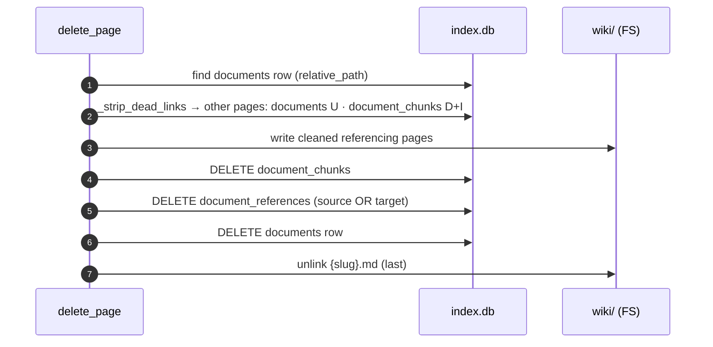

# 6.10 Wiki page deletion ✅

> §6.10 of the [LLMWiki Programmer Manual](../programmer_manual.md). The index
> for §6, with the quick-status table, the table-write matrix and the template
> every workflow file follows, is [§6 Workflows](../workflows.md).



**Entry:** `delete_page()` — `base/domain/tools/wiki_fs.py:delete_page`

```python
delete_page(db_path, workspace, dir_path="/wiki/concepts/", slug="snow-white")
# True if page existed; removes file, DB row, chunks, references,
# and strips dead links from all pages that referenced it.
```

What `delete_page` cleans up atomically:

| Layer                 | What is removed                                                                       |
| --------------------- | ------------------------------------------------------------------------------------- |
| Disk                  | The `.md` file                                                                        |
| `documents`           | The row for this page                                                                 |
| `document_chunks`     | All FTS5 units (and via trigger, `chunks_fts`)                                        |
| `document_references` | All edges where this page is source **or** target                                     |
| Other wiki pages      | Inline markdown links to this page are rewritten to plain text by `_strip_dead_links` |

**Triggers:**

- `repair_orphan` (§6.2) — automatic repair path.
- `read_app.py` — `delete_widget_cell` + `delete_event_cell` (see §7).

**Gaps:** none.
