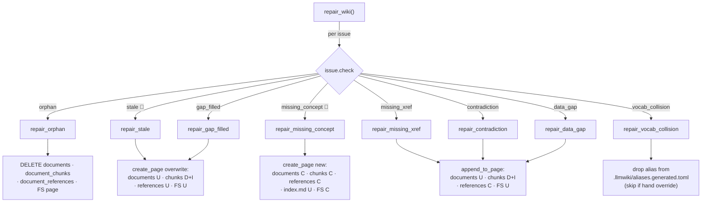

# 6.2 Repair ✅

> §6.2 of the [LLMWiki Programmer Manual](../programmer_manual.md). The index
> for §6, with the quick-status table, the table-write matrix and the template
> every workflow file follows, is [§6 Workflows](../workflows.md).



🧠 = needs an LLM client; skipped when `llm_client=None` (`stale`, `missing_concept`).

**Entry:** `repair_wiki()` — `base/domain/repair/runner.py:repair_wiki`

Repair is the **safety net** of the cycle: it consumes a `LintReport` and applies
automatic fixes where it is safe to do so, skipping anything that needs human
judgement.

```python
lint_report = lint_wiki(db_path, workspace, client=llm_client, model=model)
repair_report = repair_wiki(
    lint_report, db_path, workspace,
    llm_client=llm_client, model=model, progress_cb=print,
)
print(repair_report.summary())   # "4 issue(s): 2 fixed, 1 skipped, 1 failed"
```

**Repair dispatch (`repair/actions.py`):**

| Issue type        | Function (line)                 | Action                                                                                                                                                             | Needs LLM                                                 | Status    |
| ----------------- | ------------------------------- | ------------------------------------------------------------------------------------------------------------------------------------------------------------------ | --------------------------------------------------------- | --------- |
| `orphan`          | `repair_orphan`           | Delete the orphan concept page (file + DB row + chunks + references)                                                                                               | No                                                        | ✅         |
| `stale`           | `repair_stale`            | Reload page text from `document_pages` → re-run `extract_structured` + `build_summary_page` → `create_page(overwrite=True)` → `update_references`                  | Yes                                                       | ✅         |
| `missing_xref`    | `repair_missing_xref`           | Append `## See also` bullet linking A→B; call `update_references` to record the `links_to` edge. Idempotent.                                                        | No                                                        | ✅         |
| `missing_concept` | `repair_missing_concept`        | Parse filename out of the issue description; gather context via `search_chunks`; LLM writes new concept page; `create_page` + `update_references` + `update_index` | Yes (inline f-string prompt, temperature 0.3)             | ✅         |
| `contradiction`   | `repair_contradiction`          | Append idempotent `<!-- CONTRADICTION: path_b -->` + `⚠️` callout to page A; call `update_references`. Needs a human to resolve; repair only flags.                | No                                                        | ✅         |
| `data_gap`        | `repair_data_gap`               | Insert `<!-- DATA_GAP: slug -->` TODO note into the most-related wiki page (FTS host selection). Skips if topic already covered by a source.                        | No                                                        | ✅         |
| `gap_filled`      | `repair_gap_filled`             | Replace DATA_GAP block with `> ℹ️ See [Title](rel).` link; `create_page(overwrite=True)` + `update_references`. Fires when a topic's source is ingested.           | No                                                        | ✅         |
| `vocab_collision` | `repair_vocab_collision`        | Drop the colliding alias from the **generated artifact** (`.llmwiki/aliases.generated.toml`). If the alias is not in the artifact it came from a hand override in `wiki_config.toml`, so it is **skipped** with a message rather than editing the human's file | No                                                        | ✅         |

LLM-dependent repairs (`stale`, `missing_concept`) are automatically skipped when
`llm_client=None`. Three more checks are known but intentionally have **no**
dispatch entry — `vocab_stale`, `vocab_covered`, `vocab_ambiguous`
(`_ADVISORY_CHECKS` in `repair/runner.py`) are informational findings with no safe
automatic fix; they are skipped with `"advisory finding — no automatic repair
(resolve by hand)"` rather than reported as an unknown check type.

**Report shape (`repair/report.py`):**

```python
@dataclass
class RepairResult:
    check: str            # original lint check
    action: str           # "deleted_orphan" | "regenerated" | "created" | "skipped"
    page: str
    success: bool
    message: str

@dataclass
class RepairReport:
    results: list[RepairResult]
    repaired_at: str
    # Properties: .fixed, .skipped, .failed, .summary()
```

**Today:** All eight deterministic repair types are implemented. A wiki-wide
"Run Wiki Lint & Repair" button covers on-demand repair; repair also auto-runs
in the post-ingest tail (§6.3) and after chat→wiki save (§6.8).

**Target:** repair runs automatically after lint at the end of every ingest,
scan, and regenerate, with an explicit "Run Repair" button — on the [ROADMAP](../../../ROADMAP.md).

**Verification:** `tests/unit/test_repair_*.py`.
