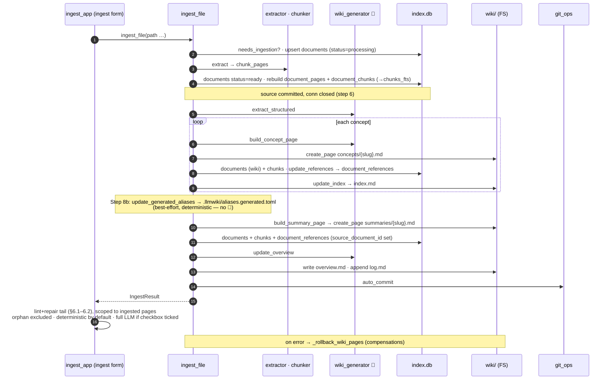

# 6.3 Single-document ingestion ✅

> §6.3 of the [LLMWiki Programmer Manual](../programmer_manual.md). The index
> for §6, with the quick-status table, the table-write matrix and the template
> every workflow file follows, is [§6 Workflows](../workflows.md).



**Entry:** `ingest_file()` — `base/domain/ingestion/pipeline.py:ingest_file`

```python
result = ingest_file(
    file_path,          # Path to PDF or DOCX
    db_path,            # str path to index.db
    workspace,          # Path to workspace root
    llm_client,         # OpenAI-compatible client
    model,              # e.g. "anthropic/claude-haiku-4-5"
    progress_cb=None,        # optional callable(str)
    lint_after_ingest=False, # run deterministic lint after step 12
    _batch_mode=False,       # internal — suppresses steps 10-13
)
# IngestResult(file_path, status="ingested"|"skipped"|"failed", message, doc_id)
```

**Pipeline steps:**

| #     | Step                                                                                                      | Where                                               |
| ----- | --------------------------------------------------------------------------------------------------------- | --------------------------------------------------- |
| 1     | Validate file (exists, supported extension)                                                               | `pipeline.py`                                       |
| 2     | Hash + mtime change detection                                                                             | `detector.py:needs_ingestion`                       |
| 3     | Upsert the source `documents` row, `status='processing'` — provisional, filtered out of every read        | `pipeline.py`                                       |
| 4     | Extract `(page_number, markdown)` pairs                                                                   | `extractor.py:extract` (PDF / DOCX-via-LibreOffice; both need a Java runtime) |
| 5     | Chunk pages into FTS5 units **in memory**                                                                 | `chunker.py:chunk_pages`                            |
| **6** | **One transaction:** flip the row to `status='ready'` **and** write `document_pages` + `document_chunks` — from here the source is visible to every reader | `pipeline.py`                                       |
| 7     | LLM: structured extraction → `ExtractionResult(document_summary, concepts[])`                             | `wiki_generator.py:extract_structured`              |
| 8     | For each concept: build page (LLM) → `create_page(overwrite=True)` → `update_references` → `update_index` | `wiki_generator.py:build_concept_page`              |
| **8b** | Update the generated alias artifact (best-effort, deterministic)                                          | `alias_generation.py:update_generated_aliases`      |
| 9     | Build summary page (deterministic) → `create_page` with `source_document_id`                              | `wiki_generator.py:build_summary_page`              |
| 10    | LLM: rewrite `wiki/overview.md`                                                                           | `wiki_generator.py:update_overview`                 |
| 11    | Append `## [date] Ingested | filename` to `wiki/log.md`                                                   | `wiki_fs.append_to_page`                            |
| 12    | `auto_commit("ingest: ...")`                                                                              | `git_ops.auto_commit`                               |
| 13    | Optional deterministic lint pass (if `lint_after_ingest=True`)                                            | `lint/runner.lint_wiki`                             |

**LLM prompts used (all in `base/domain/ingestion/wiki_generator.py`):**

| Prompt               | Template constants                                                                             | Inputs                                                             | Output                                                               | Temperature |
| -------------------- | ---------------------------------------------------------------------------------------------- | ------------------------------------------------------------------ | -------------------------------------------------------------------- | ----------- |
| `extract_structured` | `_EXTRACT_SYSTEM`, `_EXTRACT_USER_TEMPLATE`                                        | filename, file_type, page_count, content ≤80 KB                    | JSON `{document_summary, concepts:[{name,category,insight}]}`        | 0.2         |
| `build_concept_page` | `_CONCEPT_SYSTEM` + `_CONCEPT_NEW_TEMPLATE` OR `_CONCEPT_UPDATE_TEMPLATE` | concept name/category/insight, filename, existing content (if any) | Markdown **body only** — Definition/Characteristics/Context/Sources. The YAML front-matter is written by `create_page`, not by the model | 0.3         |
| `update_overview`    | `_OVERVIEW_SYSTEM`, `_OVERVIEW_TEMPLATE`                                         | current overview, new summary, all concept names                   | 3–5 paragraph narrative                                              | 0.4         |

> The legacy single-shot `build_wiki_page` is kept for backward  
> compatibility but is no longer on the ingest path.

**Triggers:**

- Marimo **ingest form** in `ingest_app.py` (`ingest_form_cell`): the "⚙️ Ingest
  uploaded file(s)" submit button bundled with an "also run full LLM lint & repair"
  checkbox. `mo.ui.form` emits its value only on submit, so the checkbox is read
  atomically (no reset race); `on_change` snapshots the files + flag into the trigger.
- Directly callable as a Python function (`ingest_file`).

**Today vs Target:**

- **Coverage.** A single ingest already creates *both* concept pages (step 8) and
  the 1-to-1 summary page (step 9) — not just the summary.
- **Reconciliation tail.** The `ingest_file` library function itself only rewrites
  `overview.md` (step 10) and, when `lint_after_ingest=True` (default `False`), runs a
  deterministic lint it appends to the log — it never repairs. The **`ingest_app`
  runner** closes that gap: after every ingest it runs a lint **and** repair pass
  (`ingest_runner`), **deterministic by default** (no LLM) or **full LLM** when the
  form checkbox is ticked, so new concept/summary pages get cross-linked and lint
  comes back clean. The pass is **scoped to the pages this ingest touched** — the
  summary pages of the ingested sources plus every wiki page that cites them — so an
  ingest reconciles only its own document and never rewrites unrelated pages (the
  manual "Run Wiki Lint & Repair" button does the wiki-wide sweep). The `orphan`
  check is excluded so pages created by *this* run aren't deleted for lacking inbound
  links yet. Remaining: extend the same auto-close to scan and regenerate — on the [ROADMAP](../../../ROADMAP.md).
- **Duplicate handling.** Today an unchanged file returns `status="skipped"`
  silently (`detector.needs_ingestion`). **Target:** the GUI warns "already
  ingested" rather than skipping quietly — on the [ROADMAP](../../../ROADMAP.md).

`status='ready'` is set at step 6 (before the LLM work in steps 7–9), see §10.

**Partial-failure rollback.** Steps 8–9 are not transactional (the source connection
is closed at step 6 so the wiki tools open their own). To keep a failed ingest from
leaving orphaned/half-merged derived pages, the pipeline records a *compensation* for
every page it creates or overwrites in steps 8–9 (`wiki_compensations`): pages this run
**newly created** are deleted (and their `index.md` entry removed via
`index_manager.remove_index_entry`); pages it **overwrote** are restored to their prior
content (snapshotted by `_snapshot_wiki_page` before the overwrite). On any exception the
`except` handler runs `_rollback_wiki_pages` before marking the source `status='failed'`.
Rollback is best-effort — a rollback error is logged, never raised, so it cannot mask the
original failure.

**Verification:**

```bash
HEADLESS=1 uv run pytest tests/e2e/test_ingest_app_v2.py -v -s
uv run pytest tests/unit/test_pipeline_phase2.py -v
```

`tests/e2e/test_ingest_app_v2.py` is the current E2E suite (wiki picker, ingest
form, Activity Log, vocabulary lint lines, scan idempotency, cross-links; opt-in
`E2E_FULL=1` / `E2E_DESTRUCTIVE=1` for the slower/destructive cases).
It replaced the older suite, which predated the picker/form/vocabulary work.
