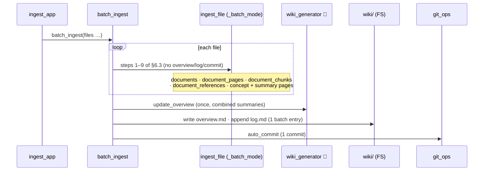

# 6.4 Batch / multi-document ingestion ✅

> §6.4 of the [LLMWiki Programmer Manual](../programmer_manual.md). The index
> for §6, with the quick-status table, the table-write matrix and the template
> every workflow file follows, is [§6 Workflows](../workflows.md).



The per-file work is the §6.3 pipeline in batch mode (the boxed `loop` step); only
the overview/log/commit tail is collapsed to once per batch.

**Entry:** `batch_ingest()` — `base/domain/ingestion/batch.py`

```python
results = batch_ingest(
    files=[Path("sources/doc1.pdf"), Path("sources/doc2.pdf")],
    db_path=db_path,
    workspace=workspace,
    llm_client=client,
    model=model,
    progress_cb=None,
    run_lint=False,     # run deterministic lint once at the end
)
```

**Difference from 6.3:** each file goes through steps 1–9 of `ingest_file`  
with `_batch_mode=True` (set in `batch.py:batch_ingest`), which suppresses steps 10–13.  
Then at the end of the batch the wrapper does **once**:

1. `update_overview()` with all new summaries combined.
2. Single `wiki/log.md` entry: `## [date] Batch ingested | N file(s)`.
3. Single `auto_commit("batch ingest: N file(s)")`.
4. Optional `lint_wiki()` deterministic pass.

**Alias passes: per-file, but not per-batch.** Since each file still runs the
full §6.3 pipeline internally, Step 8b's per-concept alias update
(`alias_generation.update_generated_aliases`) *does* run for every file in the
batch. But `batch.py` has no call to `regenerate_dataset_aliases` or
`crosslink_wiki_pages` — those two passes are **scan-only** (§6.5). So: concept
aliases are generated per file, while the dataset-alias pass and the cross-link
pass only happen when the same files are ingested via `scan_and_ingest` instead
of `batch_ingest` directly.

**LLM call count for N files, K concepts/file:**

- `batch_ingest`: `N × (1 extract + K concepts) + 1 overview`
- `ingest_file` × N: `N × (1 extract + K concepts + 1 overview)`

Concept pages compound naturally across the batch — the second file's mention  
of an existing concept hits the `_CONCEPT_UPDATE_TEMPLATE` branch in step 8.

**Today vs Target:**

- **Reconciliation tail.** Today the batch ends with one `overview.md` rewrite and
  one optional deterministic lint pass (`run_lint=True`, default `False`); repair
  never runs. **Target:** the batch closes with a single lint **and** repair pass
  over the whole wiki — *including the pages just created in this batch* — so newly
  related concepts get cross-linked and lint comes back clean.
- **Duplicate handling.** Like §6.3, unchanged files are skipped silently today;
  **Target** warns when any uploaded file is already ingested — on the [ROADMAP](../../../ROADMAP.md).

**Triggers:** currently invoked through `ingest_app.py` "Ingest" button when  
multiple files are uploaded (the underlying widget supports multi-select).

**Verification:** `tests/unit/test_batch_ingest.py` — 9 tests, including a key  
assertion `len(llm.calls) == 5` for a 2-file batch (extract×2 + concept×2 +  
overview×1) which proves the overview is *not* called per file.
