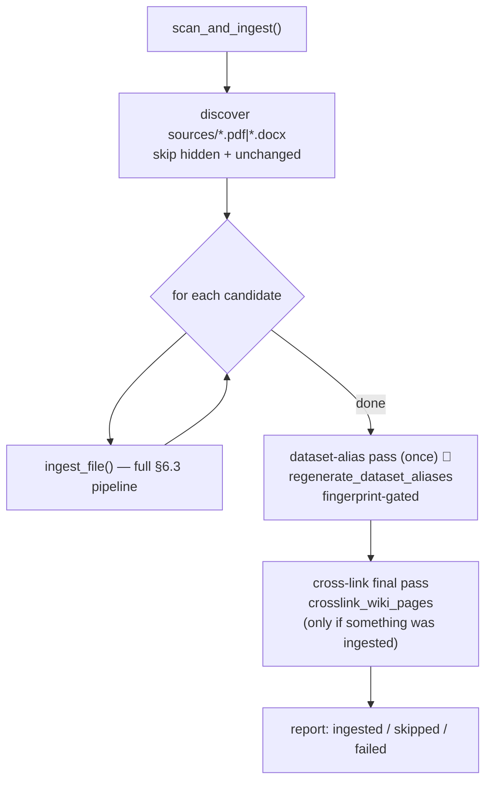

# 6.5 Scan sources folder ✅

> §6.5 of the [LLMWiki Programmer Manual](../programmer_manual.md). The index
> for §6, with the quick-status table, the table-write matrix and the template
> every workflow file follows, is [§6 Workflows](../workflows.md).

The boxed `ingest_file()` step is the entire §6.3 pipeline (run sequentially, not in
batch mode). One trace run wraps the whole scan (no-op unless `WIKI_TRACE=1`).
After the per-file loop, `scan_and_ingest` runs two extra passes, once per scan
(not once per file):

1. **Dataset-alias pass** (`regenerate_dataset_aliases`) — the dataset
   vocabulary doesn't change per document, so this runs once for the whole scan
   rather than inside `ingest_file`. It is **fingerprint-gated**: a sidecar
   `.llmwiki/dataset_aliases.fingerprint` means the LLM pass re-runs only when
   `datasets/` actually changed. Logs `🔤 Generated aliases for N data term(s)`
   and, on collisions, `⚠️ N dataset-alias collision(s) dropped`. Best-effort —
   an alias failure never fails the scan.
2. **Cross-link final pass** (`crosslink_wiki_pages`) — runs only when something
   was ingested this scan; injects "See also" links so a page created early in
   the scan can link to a concept extracted from a later document. Deterministic
   (no LLM). Logs `🔗 Cross-linked N page(s)`.

   **Scope.** `scan_and_ingest` passes a `touched` set, built by
   `pages_touched_by()` from the sources just ingested: the summary pages written
   from those sources plus every page that cites them. The pass then rewrites
   those pages plus the pages whose text mentions one of them, found with one
   substring scan per page, instead of comparing every page with every other
   one. Calling `crosslink_wiki_pages` without `touched` keeps the full sweep,
   which is what the **Run Wiki Lint & Repair** button and regeneration use.

**Entry:** `scan_and_ingest()` — `base/domain/ingestion/pipeline.py:scan_and_ingest`

Walks `workspace/sources/` recursively, collects `.pdf` / `.docx` files  
(case-insensitive, skipping hidden entries), and calls `ingest_file()` for each.  
Unchanged files (detected by `detector.needs_ingestion` — mtime then hash)  
return `status="skipped"` without re-running the LLM.

**Why it exists:** lets you drop several files into `sources/` from outside the  
UI (Finder, `cp`, `obsidian-clipper`, etc.) and then re-ingest only the new or  
modified ones in one click. The pipeline does NOT run as a daemon — it scans  
on demand.

**Distinction from 6.4:** `scan_and_ingest` discovers files automatically,  
`batch_ingest` takes an explicit list. Internally `scan_and_ingest` calls  
`ingest_file` *sequentially* (not in batch mode) — so each scanned file still  
triggers an overview rewrite and a git commit. If you scan many files, prefer  
calling `batch_ingest(files=list(...))` directly.

**Triggers:** Marimo button "🔄 Scan sources/ for changes" in `ingest_app.py` (`action_buttons` cell)  
(`scan_btn`).

**Scan vs lint+repair (important).** Scanning is *source→wiki freshness*: it
detects new or modified **source files** and ingests them. Lint+repair is
*wiki→wiki consistency* (orphans, stale pages, missing cross-refs) — the two are
orthogonal (see the architecture diagram in §2). They meet at one point: a
*modified* source makes its dependent wiki pages **stale**, which the `stale`
lint check (§6.1) flags and `repair_stale` (§6.2) regenerates. So "scan sources
and update the wiki accordingly" = **scan to ingest the changed sources, then run
lint+repair to bring the wiki back into a consistent state.**

**Today vs Target:**

- **Today:** scan only ingests new/modified sources (each via `ingest_file`); it
  does **not** run lint+repair afterwards, so stale dependents are detected but
  not fixed in the same pass. The per-file overview rewrite is also wasteful for
  large scans — treat scan as "pick up the one or two files I dropped"; for bulk
  imports call `batch_ingest` directly.
- **Target:** scan closes with a single lint **and** repair pass so a modified
  source's stale pages are regenerated automatically and lint comes back clean
  (on the [ROADMAP](../../../ROADMAP.md)).
