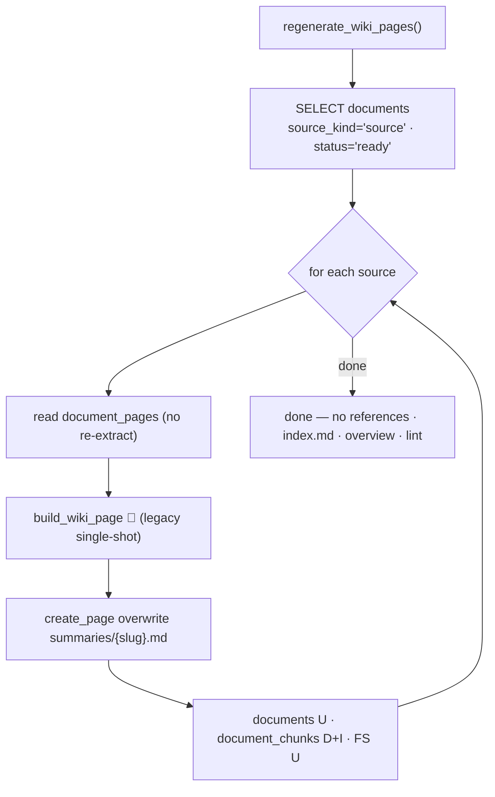

# 6.6 Regenerate wiki pages ✅

> §6.6 of the [LLMWiki Programmer Manual](../programmer_manual.md). The index
> for §6, with the quick-status table, the table-write matrix and the template
> every workflow file follows, is [§6 Workflows](../workflows.md).

Unlike §6.3, regenerate refreshes **summary pages only** via the legacy
`build_wiki_page`, and skips references, index, overview, and lint (see Today vs
Target below).

**Entry:** `regenerate_wiki_pages()` — `base/domain/ingestion/pipeline.py:regenerate_wiki_pages`

Iterates over every `documents` row with `source_kind='source'` and  
`status='ready'`, reloads the cached page text from `document_pages` (no PDF  
re-extraction), and re-runs:

1. `build_wiki_page()` (LLM, legacy single-shot — see the note in §6.3)
2. `create_page(..., overwrite=True, source_document_id=…)` — summary page only

**Use cases:**

- LLM model changed.
- Prompt templates in `wiki_generator.py` were refined.
- A wiki page was accidentally deleted from disk.

**Triggers:** Marimo button "🤖 Regenerate all wiki pages" in `ingest_app.py` (`action_buttons` cell)  
(`regen_btn`).

**Today vs Target:**

- **Today:** regenerate refreshes **only the summary pages** — it does NOT rebuild
  concept pages, NOR `overview.md`, NOR run lint/repair afterwards. Failed/processing
  sources are skipped silently.
- **Target:** regenerate rebuilds concept pages and overview too, then closes with
  a lint **and** repair pass so a regenerate never leaves stale concept/overview
  pages behind and lint comes back clean — on the [ROADMAP](../../../ROADMAP.md).
