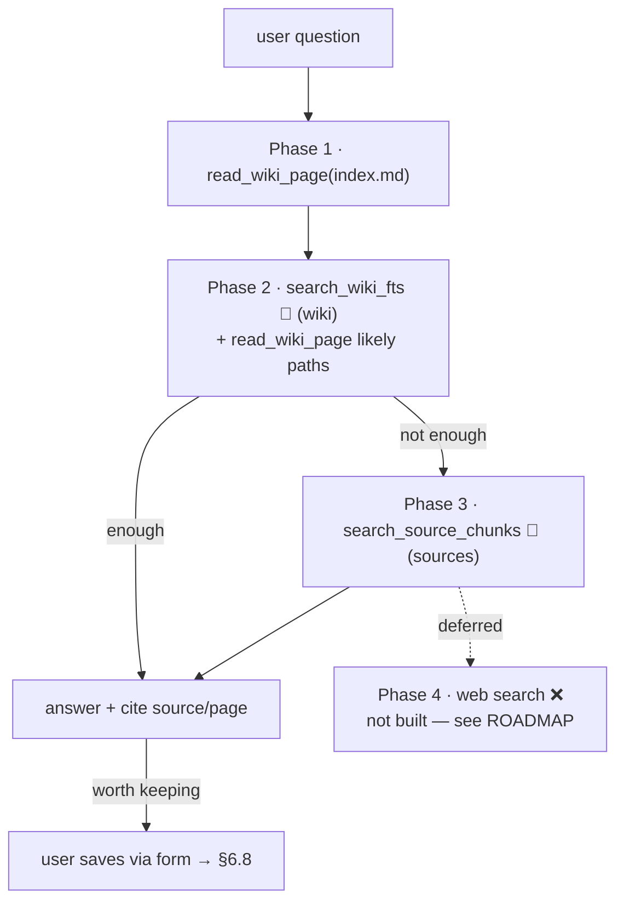

# 6.7 Query / Chat (multi-phase RAG) ✅

> §6.7 of the [LLMWiki Programmer Manual](../programmer_manual.md). The index
> for §6, with the quick-status table, the table-write matrix and the template
> every workflow file follows, is [§6 Workflows](../workflows.md).

> **This section documents the default mode**, in which the agent holds the
> search tools and decides for itself when to use them. A wiki can instead opt
> into **pre-retrieval**, where code retrieves before the model is consulted and
> may refuse without consulting it at all — see [Pre-retrieval: the other
> mode](#pre-retrieval-the-other-mode) at the end of this section. Both ship;
> neither supersedes the other. The narrative comparison, with captured output
> from both, is [`docs/query_walkthrough.md`](../../query_walkthrough.md).



Routing in this mode is prompt-driven, not code-driven. All phases are **read-only** over
`index.db` + `wiki/`; the agent never writes — saving (§6.8) is a separate
user action via the read-app Save form (`save_to_wiki`).

**Entry:** `create_agent()` — `base/domain/chat/agent.py`, paired with  
the system prompt in `base/domain/chat/config.py` (`_DEFAULT_SYSTEM_PROMPT`).

This is the most important section for understanding *how answers are*  
*generated*. In this mode the routing is **prompt-driven, not code-driven** — there is no  
Python `if`/`else` deciding which tool to call. The LLM reads the system  
prompt and picks tools accordingly. The code just provides the toolbox.

**Core principle — wiki-first.** The agent answers from the **curated wiki pages**
(the Encyclopedia) wherever possible, and only drops to the raw `document_chunks`
(the Filing Cabinet, via `search_source_chunks`) when the wiki pages don't contain
enough detail. The wiki is the default context; the DB is the fallback. This is
the whole point of the LLM-Wiki pattern (§1) — re-reading curated pages is cheaper
and higher-signal than re-deriving knowledge from raw chunks on every query.

## Tool inventory

| Tool                                     | Module:fn                  | Scope                  | When the agent calls it                   |
| ---------------------------------------- | -------------------------- | ---------------------- | ----------------------------------------- |
| `read_wiki_page(path)`                   | `chat/wiki_tools.py:read_wiki_page`       | single file            | Direct page lookup by known path          |
| `search_wiki_fts(query, limit=10)`       | `chat/wiki_tools.py:search_wiki_fts`      | `source_kind='wiki'`   | Topic discovery across all wiki pages     |
| `search_source_chunks(query, limit=10)`  | `chat/tools.py:search_source_chunks` (async) | `source_kind='source'` | Last-resort lookup into raw PDFs/DOCXs    |
| `query_dataset(...)`                     | `chat/dataset_tools.py`    | `workspace/datasets/`  | Only registered when the workspace has datasets — a current value with its `as_of` date |
| *domain overlay* (e.g. `estimar_alternativas`) | passed in as `extra_tools` | overlay-defined   | Only when an overlay activates for this workspace (§6.11) |
| Web search                               | —                          | —                      | ❌ **NOT BUILT** — deliberately; see the ROADMAP |

The agent receives `db_path` as `deps_type=str`. Every tool derives the  
workspace from it via `workspace = Path(db_path).parent.parent` (because the  
DB is always at `workspace/.llmwiki/index.db`).

Those three are the retrieval tools, but they are not the whole registered set.
`chat/agent.py:create_agent` builds it in three steps:

```python
tools = [read_wiki_page, search_wiki_fts, search_source_chunks] if include_wiki_tools else []
if <workspace/datasets/ holds at least one valid dataset file>:
    tools.append(query_dataset)
if extra_tools:                       # domain overlay, e.g. estimar_alternativas
    tools.extend(extra_tools)
```

So a workspace with a `datasets/` folder gets `query_dataset` **in this mode
too** — it is not part of the pre-retrieval opt-in — and a domain overlay adds
whatever it registers. `include_wiki_tools` is what the other mode turns off;
with it left on, the three above are present as described.

All of them are read-only. The agent has **no write tool**: saving a chat answer
as a wiki page is the user's action via the read-app Save form
(`save_to_wiki`, §6.8).

## Routing rules (from `_DEFAULT_SYSTEM_PROMPT`)

The intended retrieval flow is staged — *wiki first, raw sources second, web*  
*search last*:

1. **Phase 1 — Try the index.** Call `read_wiki_page("wiki/index.md")`. If
  missing or empty, do not conclude the wiki is empty; continue.
2. **Phase 2 — Search the wiki.** Call `search_wiki_fts` with the question's
  key terms. Optionally `read_wiki_page` on likely paths  
   (`wiki/concepts/xyz.md`, `wiki/summaries/xyz.md`). This step always runs.
3. **Phase 3 — Fall back to raw sources.** Only call `search_source_chunks`
  when the wiki results don't contain enough detail.
4. **Phase 4 — Web search.** Only when phases 1–3 returned nothing useful.
  **Not built**, deliberately — see [`ROADMAP.md`](../../../ROADMAP.md).
5. **Capture.** When the agent produces a comparison/analysis/summary worth
  keeping, it proposes a title + category and directs the user to the Save form;
  the user saves it (`save_to_wiki`, §6.8). The agent does not write.

**Output guidelines (also in the prompt):** cite source + page for facts; use  
tables for comparisons, bullets for enumerations; "no information found" is  
only allowed after both `search_wiki_fts` and `search_source_chunks` were  
tried.

## Customising per workspace

`workspace/wiki_config.toml`:

```toml
[assistant]
system_prompt = """
You are a specialist in mortgage-backed securities.
# ...keep the wiki-first routing block here — see wiki_config.example.toml
"""
suggested_prompts = [
    "What is a CDO?",
    "Compare MBS and ABS",
]
```

Loaded by `chat/config.py:load_config()` at agent creation time
(`read_app.py:wiki_context` calls it). Defaults apply at three levels, all in
`chat/config.py`:

1. **File absent** → `load_config` hits `if not config_file.exists(): return
   WikiAssistantConfig()` — the dataclass with its default fields.
2. **`[assistant]` section missing** → `data.get("assistant", {})` yields `{}`.
3. **A key missing** → per-key fallback:
   `assistant.get("system_prompt", _DEFAULT_SYSTEM_PROMPT)` and
   `assistant.get("suggested_prompts", _DEFAULT_PROMPTS)`.

The defaults themselves are `_DEFAULT_SYSTEM_PROMPT` and `_DEFAULT_PROMPTS` in the
same module (and the `WikiAssistantConfig` field defaults reference them). So a
*partial* `wiki_config.toml` — e.g. only `suggested_prompts` — still keeps the
default `system_prompt`. The repo ships a fully-commented template at
`wiki_config.example.toml` (project root) — or `wiki_config_es.example.toml` for
a Spanish wiki (`language = "es"`, Spanish prompt and suggested prompts). Copy
either into the workspace as `wiki_config.toml`. Both keys are optional; omit
either to keep the defaults.

> ⚠️ **A custom `system_prompt` must preserve the wiki-first routing**  
> (index → `search_wiki_fts` → `search_source_chunks` *fallback*). Because routing  
> is prompt-driven in this mode (above), a prompt that tells the agent to "always use  
> `search_source_chunks`" silently degrades the system to plain RAG and defeats the  
> whole LLM-Wiki design. The shipped example keeps the routing intact and only  
> specialises the domain line.

**Triggers:** the right-panel chat in `marimo/read_app.py` (`chat_panel` cell).  
The agent streams responses via `wiki_agent.run_stream(...)` →  
`result.stream_text(delta=True)`. The agent, system prompt, and `db_path` are  
rebuilt by the `wiki_context` cell whenever the active wiki changes (§7.1).

**Gaps:**

- **Web search (Phase 4) is intentionally deferred** — see [`ROADMAP.md`](../../../ROADMAP.md) for the
  rationale. Phases 1–3 (wiki index → wiki FTS → raw source chunks) are fully
  implemented and cover the project's core thesis: answer from your own curated
  corpus. Phase 4 is the only workflow that reaches outside it.
- The "always check index first" rule is advisory — there's no programmatic  
guarantee the LLM does it. Track regressions via the E2E suite.
- Phases are not numbered explicitly in the prompt today; tightening them to
  "Phase 1 / Phase 2 / Phase 3" labels would only matter once Phase 4 lands, which is not planned.

## Pre-retrieval: the other mode

Everything above assumes the agent does its own looking. A wiki can opt into the
opposite arrangement, in which **code retrieves first** and the model is handed
the result — or not consulted at all.

**How it is switched.** Per wiki, in `wiki_config.toml`:

```toml
[pre_retrieval]
enabled = true
```

`chat/config.py` reads it into `WikiAssistantConfig.pre_retrieval` (default
`False`, so a workspace that says nothing keeps the mode above). The read app
also exposes it as a live checkbox beside "Strict mode", which picks between
two agents built up front, so toggling takes effect on the next message without
rebuilding the chat.

**What changes.** `create_agent(..., include_wiki_tools=False)` drops
`read_wiki_page`, `search_wiki_fts` and `search_source_chunks` — the model no
longer *has* the tools whose use this section's routing rules request.
`query_dataset` and any overlay tools stay. In their place
`chat/preretrieval.py:pre_retrieval_answer` runs the retrieval itself and
`plan_retrieval` decides, in Python, one of: refuse without a model call; inject
a curated page and answer from it; go to the data tools; or inject a raw chunk,
answer, and verify the answer against it.

| | This section's mode | Pre-retrieval |
|---|---|---|
| Who searches | the model, via tools | code, before the model |
| Who decides it is out of scope | the model, if the prompt persuades it | `plan_retrieval`, deterministically |
| Cost of a refusal | a completion | nothing — the model is never called |
| Reach | any question, including about the collection | only what the coverage roster recognises |

**The lexical query is built per language.** A question is tokenized to word
characters; tokens of 1–2 characters and the wiki language's stop words are
dropped; the rest are quoted and OR-joined into an FTS5 `MATCH`
(`preretrieval.py:_fts_query`). The stop-word sets live in `_STOPWORDS`, keyed
by ISO code, and **a new wiki language needs a new entry there.** Without one it
falls back to English, which filters little in another language.

That is not a tidiness point. The sets were Spanish-only until 2026-08-05, so in
an English wiki `the` — three characters, past the length filter — reached FTS
and matched nearly every chunk. `wiki_hits` was therefore never empty; and since
`doc_hits` is computed only when `wiki_hits` **is** empty, the Tier-2 raw-source
branch could not be reached at all. An off-topic question also got six unrelated
curated chunks injected instead of none. The gate still refused such questions,
because `in_roster` is the coverage authority — but for the right answer by
luck rather than by design.

**Where the authority is.** The order of those branches and the citation format
are contracts, specified in
[`.trellis/spec/backend/chat-retrieval.md`](../../../.trellis/spec/backend/chat-retrieval.md);
prefer it over prose. [`docs/query_walkthrough.md`](../../query_walkthrough.md)
walks both modes with captured output, including why the shipped `fairy-tales`
demo leaves the box unticked and `finanzas-argentinas` ticks it.
