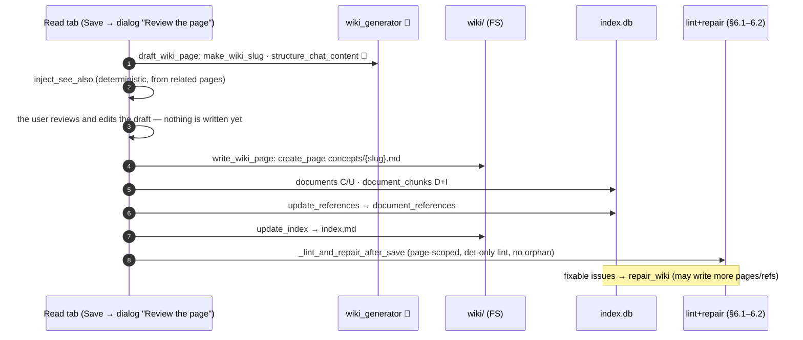

# 6.8 Chat → Wiki (`save_to_wiki`) ✅

> §6.8 of the [LLMWiki Programmer Manual](../programmer_manual.md). The index
> for §6, with the quick-status table, the table-write matrix and the template
> every workflow file follows, is [§6 Workflows](../workflows.md).

Saving a chat answer as a wiki page is **the user's action**, not the agent's:
the agent has no write tool. In the web interface the user saves the **whole
conversation** as one concept page in two steps: the model drafts the page, the user
reviews and edits the draft in a dialog, and the page is written exactly as the user
leaves it. `save_to_wiki` (draft then write, with no review in between) stays as the
library function for callers without a dialog.


```mermaid
sequenceDiagram
    autonumber
    participant U as Read tab (Save → dialog "Review the page")
    participant GEN as wiki_generator 🧠
    participant FS as wiki/ (FS)
    participant DB as index.db
    participant LR as lint+repair (§6.1–6.2)
    U->>GEN: draft_wiki_page: make_wiki_slug · structure_chat_content 🧠
    U->>U: inject_see_also (deterministic, from related pages)
    U->>U: the user reviews and edits the draft — nothing is written yet
    U->>FS: write_wiki_page: create_page concepts/{slug}.md
    U->>DB: documents C/U · document_chunks D+I
    U->>DB: update_references → document_references
    U->>FS: update_index → index.md
    U->>LR: _lint_and_repair_after_save (page-scoped, det-only lint, no orphan)
    Note over LR,DB: fixable issues → repair_wiki (may write more pages/refs)
```

**Entry (web interface):**

1. `POST /w/{wiki_id}/chat/draft` (`web/routes/chat.py:chat_draft`) →
   `services.chat.draft_conversation` → `chat/wiki_tools.py:draft_wiki_page`. The
   exchanges of the conversation become the content (`conversation_markdown`); the
   page is always a concept page. A conversation with no answered exchange is refused
   (`EmptyConversation`). Nothing is written. The route returns the dialog
   "Revisar la página" with the draft in a Markdown editor; **Vista previa**
   (`POST /w/{wiki_id}/chat/preview`) shows how the page will look.
2. **Save to wiki** → `POST /w/{wiki_id}/chat/save` (`chat_save`) →
   `services.chat.save_reviewed_page` → `chat/wiki_tools.py:write_wiki_page`, then one
   git commit `chat: <title>`. The text is not sent to the model again.

**Entry (library):** `save_to_wiki()` — `base/domain/chat/wiki_tools.py:save_to_wiki`
(no `RunContext`). The agent has no write counterpart.

```python
save_to_wiki(
    db_path, workspace, title, content, category,
    client=llm_client,   # OpenAI-compatible client; if None, built from config
    model=settings.LLM_MODEL,
)
```

The save flow (steps 1–5 are `draft_wiki_page`; `write_wiki_page` repeats steps 1–3
to find the page and does steps 6–9):

1. Slugify the title with `wiki_generator.make_wiki_slug` (NFKD-normalised — diacritics stripped, so "Política Común" → `politica-comun`).
2. Pick directory by category: `concept` → `/wiki/concepts/`, `summary` → `/wiki/summaries/`.
3. Read existing page content (if any) via `wiki_fs.read_page`.
4. **LLM structuring pass** — call `wiki_generator.structure_chat_content(title, category, raw_content, existing, client, model)`. Returns the structured markdown **body** (Definition / Key Characteristics / Context / Sources); the YAML front-matter is written by `create_page` from values the code holds, never by the model. The prompts (`_CONCEPT_SYSTEM` + chat templates) **preserve every inline citation verbatim** and build Sources from what was actually cited, and the output is run through `_strip_wrapping_fence` so a whole-page ```​markdown wrapper never reaches disk.
5. **Deterministic See-also injection** — gather the existing wiki pages via `_related_pages_for(workspace, exclude_slug, current_dir)` and call `wiki_generator.inject_see_also(structured, related)`. It scans the structured markdown for **whole-word** mentions (`\b…\b`) of known page slugs and inserts a `## See also` section (before `## Sources`) linking each mentioned page that isn't already linked. This is why chat-sourced pages get cross-links even though the LLM is told never to invent links.
6. Write with `create_page(overwrite=True)` if the page existed (LLM merge); `create_page(overwrite=False)` if new.
7. Look up the doc id and call `references.update_references` to keep the citation graph in sync.
8. Derive a one-line summary from the first heading and call `index_manager.update_index`.
9. Return `"Updated wiki page: wiki/concepts/foo.md"` or `"Created wiki page: ..."`.

**LLM prompts used (all in `wiki_generator.py`):**

| Prompt                              | Template constants                                         | Inputs                            | Output                                                               | Temperature |
| ----------------------------------- | ---------------------------------------------------------- | --------------------------------- | -------------------------------------------------------------------- | ----------- |
| `structure_chat_content` (new page) | `_CONCEPT_SYSTEM` + `_CHAT_CONCEPT_NEW_TEMPLATE`    | title, category, raw content      | Markdown **body only** — front-matter added by `create_page` | 0.3         |
| `structure_chat_content` (update)   | `_CONCEPT_SYSTEM` + `_CHAT_CONCEPT_UPDATE_TEMPLATE` | title, raw content, existing page | Merged markdown, no duplication                                      | 0.3         |

**`save_to_wiki` — client injection:** optional keyword-only `client=None, model=None`; builds `openai.OpenAI` from `config.settings` (`WIKI_LLM_*` falling  
back to `LLM_*`) when omitted, allowing tests to inject `FakeLLMClient` directly.

**Triggers:**

- The **only** save trigger is the button **Save** of the conversation in the **Read**
tab, followed by **Save to wiki** in the dialog (§7.2). The agent cannot save on
its own; the system prompt's "Capture" rule makes it *propose* a title + category and
point the user at the **Save** button.

**Today:**

This is the **reference implementation of the reconciliation cycle** the ingest
workflows are moving toward — it already closes with lint+repair. When the user
saves, the LLM drafts the page (step 4), the user reviews it,
`create_page` adds it to the wiki, and then:

- ✅ **Post-save lint+repair**. `_lint_and_repair_after_save` in
  `chat/wiki_tools.py` runs a deterministic lint scoped to the saved page and
  feeds fixable issues to `repair_wiki`. The `orphan` check is excluded so the
  just-created page is never auto-deleted; a `🔧 Post-save repair: …` line is
  appended to the save confirmation.
- ✅ **Cross-linking on save**. Since the three formerly-skipped repairs are now
  implemented (§6.2), a saved page that shares a cited source with an existing
  page is automatically cross-linked (`repair_missing_xref` adds a `## See also`
  link and records the `links_to` edge). Verified end-to-end by
  `tests/unit/test_lint_repair_after_save.py::test_save_to_wiki_auto_cross_links_shared_source`.

**Two known limitations (both deferred — see [`ROADMAP.md`](../../../ROADMAP.md) — acceptable for a PoC):**

1. *Cross-linking is directional.* `missing_xref_check` emits one issue per pair,
   keyed on `path_a` (the page whose id sorts lower). The post-save filter only
   acts when the saved page is `path_a`; otherwise the link is added on the next
   full lint+repair, not on save.
2. *LLM-gated checks don't run on save.* The post-save lint is intentionally
   called **without** an LLM client, so `contradiction` and `data_gap` (both
   LLM-powered checks) never fire on save — only the deterministic checks
   (`missing_xref`, `missing_concept`, `stale`, `gap_filled`) do. This keeps save
   latency and cost low.
