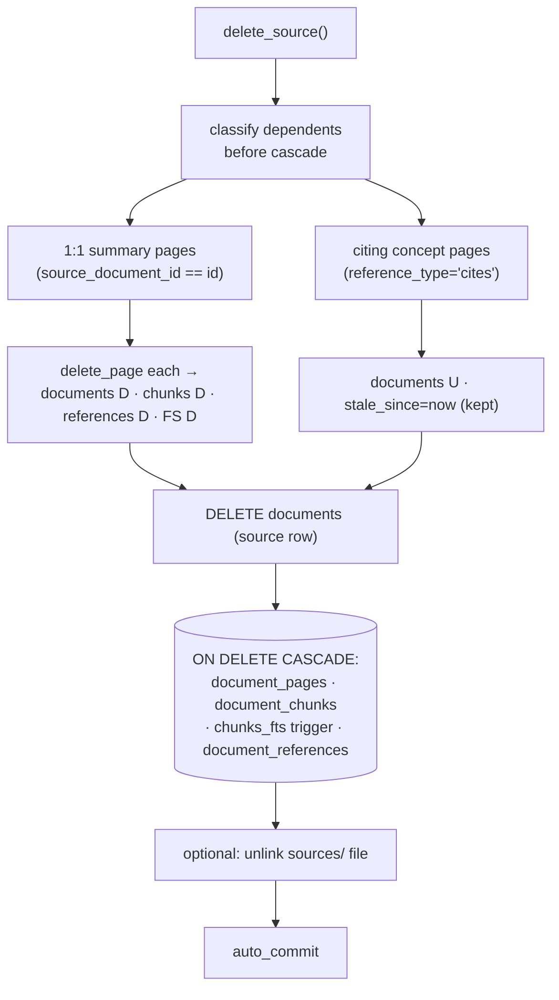

# 6.9 Source deletion ✅

> §6.9 of the [LLMWiki Programmer Manual](../programmer_manual.md). The index
> for §6, with the quick-status table, the table-write matrix and the template
> every workflow file follows, is [§6 Workflows](../workflows.md).



**Entry:** `delete_source()` — `base/domain/tools/deletion.py:delete_source`

```python
delete_source(db_path, workspace, doc_id, *, also_delete_file=False)
# -> RepairResult(action="deleted" | "failed", ...)
```

Removes the source `documents` row; FK `ON DELETE CASCADE` automatically cleans  
up `document_pages`, `document_chunks`, `chunks_fts` (via triggers), and  
`document_references`. Dependent wiki pages are handled by relationship:  

- **1-to-1 summary pages** (`source_document_id == doc_id`) are **deleted** — there  
  is no source left to regenerate them from.  
- Pages that merely **cite** the source (e.g. multi-source **concept** pages) are  
  **kept and marked `stale_since = datetime('now')`**, since they may still draw on  
  other surviving sources; deleting them would destroy that synthesis. They are  
  surfaced by `find_stale_pages` for review/regeneration. *(Note: the lint runner's  
  `staleness_check` is timestamp-based and does not yet consume `stale_since`; wiring  
  `find_stale_pages` into the runner is follow-up work.)*  

File removal is opt-in (`also_delete_file=True`). Calls  
`auto_commit(workspace, "delete source: {filename}")` on success.

UI: "🗑 Delete Source" section at the bottom of `marimo/ingest_app.py` —  
dropdown of indexed sources, a confirmation checkbox, and an optional  
"also remove file from sources/" checkbox. The `delete_runner` cell mirrors the  
`ingest_runner` / `scan_runner` trigger pattern.
