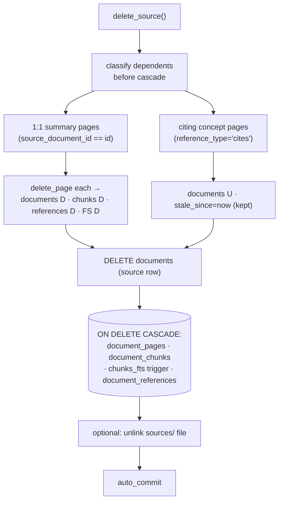

# 6.9 Source deletion ✅

> §6.9 of the [LLMWiki Programmer Manual](../programmer_manual.md). The index
> for §6, with the quick-status table, the table-write matrix and the template
> every workflow file follows, is [§6 Workflows](../workflows.md).


```mermaid
flowchart TD
    DS["delete_source()"] --> CL["classify dependents<br/>before cascade"]
    CL --> SUM["1:1 summary pages<br/>(source_document_id == id)"]
    CL --> CON["citing concept pages<br/>(reference_type='cites')"]
    SUM --> DEL["delete_page each →<br/>documents D · chunks D · references D · FS D"]
    CON --> STALE["documents U · stale_since=now (kept)"]
    DEL --> SRC["DELETE documents (source row)"]
    STALE --> SRC
    SRC --> CAS[("ON DELETE CASCADE:<br/>document_pages · document_chunks<br/>· chunks_fts trigger · document_references")]
    CAS --> OPT["optional: unlink sources/ file"]
    OPT --> GIT["auto_commit"]
```

**Entry:** `delete_source()` — `base/domain/tools/deletion.py:delete_source`

```python
delete_source(db_path, workspace, doc_id, *, also_delete_file=False)
# -> SourceDeletion(action="deleted" | "failed", ..., filename, deleted_pages, stale_pages, file_removed)
```

Removes the source `documents` row; FK `ON DELETE CASCADE` automatically cleans  
up `document_pages`, `document_chunks`, `chunks_fts` (via triggers), and  
`document_references`. Dependent wiki pages are handled by relationship:  

- **1-to-1 summary pages** (`source_document_id == doc_id`) are **deleted** — there  
  is no source left to regenerate them from.  
- Pages that merely **cite** the source (e.g. multi-source **concept** pages) are  
  **kept and marked `stale_since = datetime('now')`**, since they may still draw on  
  other surviving sources; deleting them would destroy that synthesis. They are  
  surfaced by `find_stale_pages` for review/regeneration. *(Note: the lint runner's  
  `staleness_check` is timestamp-based and does not yet consume `stale_since`; wiring  
  `find_stale_pages` into the runner is follow-up work.)*  

File removal is opt-in (`also_delete_file=True`). Calls  
`auto_commit(workspace, "delete source: {filename}")` on success.

UI: the **Delete** button in each row of the table "Sources" of the **Ingest** tab opens a
confirmation: "Delete the source “…”? Its summary page is deleted. The pages that cite it
are kept and marked as stale." It has the optional box "Also remove file from
sources/". The button **Delete the source** calls
`POST /w/{wiki_id}/sources/{doc_id}/delete` (`web/routes/ingest.py:source_delete`) →
`services.ingest.remove_source`, as a streamed operation under the lock of the wiki
(§7.3). The console shows one line per step, worded by the route from the
`SourceDeletion` fields: the start, each summary page deleted, the pages marked stale,
the file removed from `sources/`, and the closing line (or the failure, with the
reason). The sources panel reloads when the operation ends.
