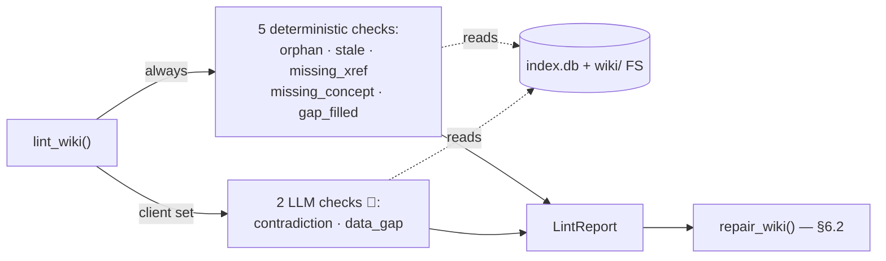
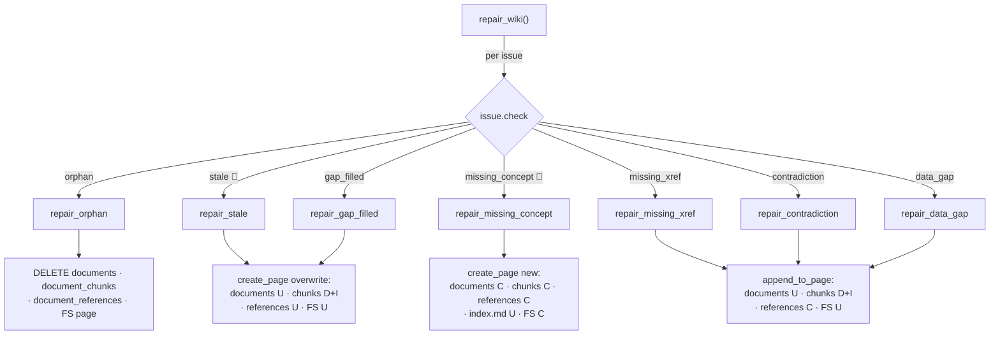
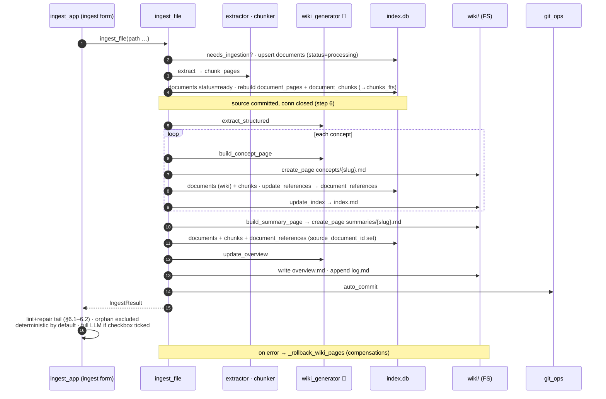
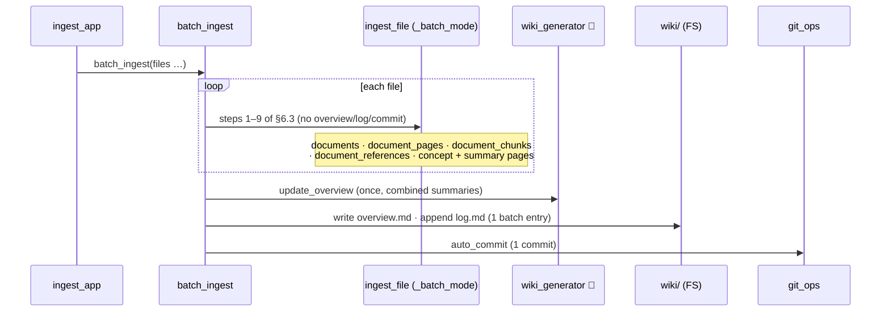
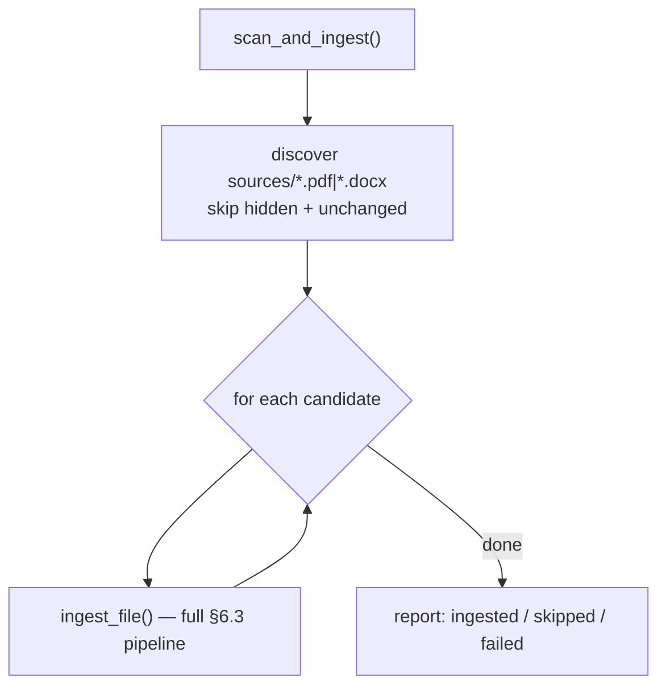
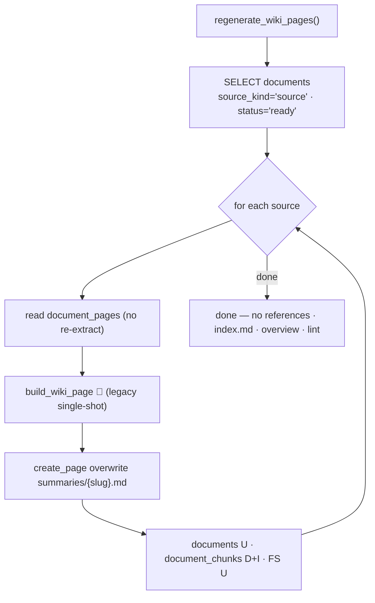
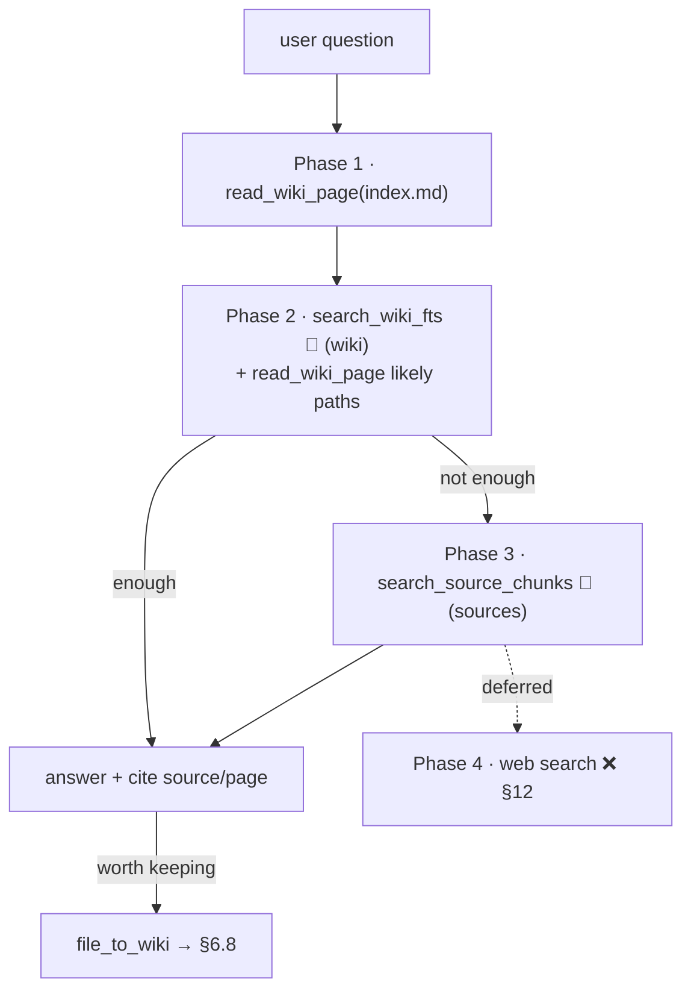
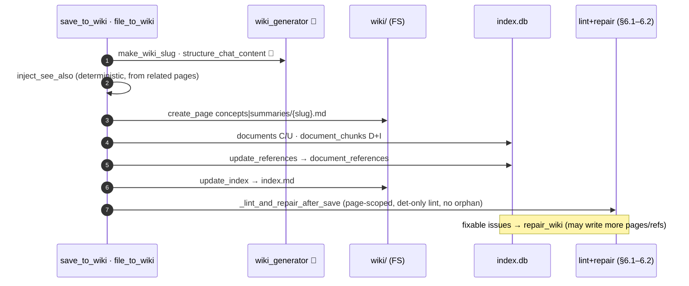
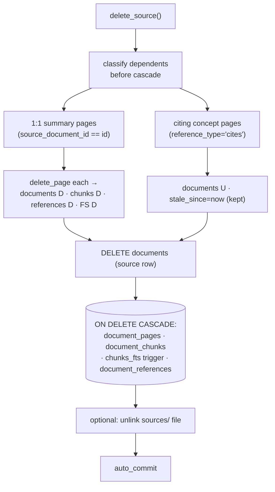
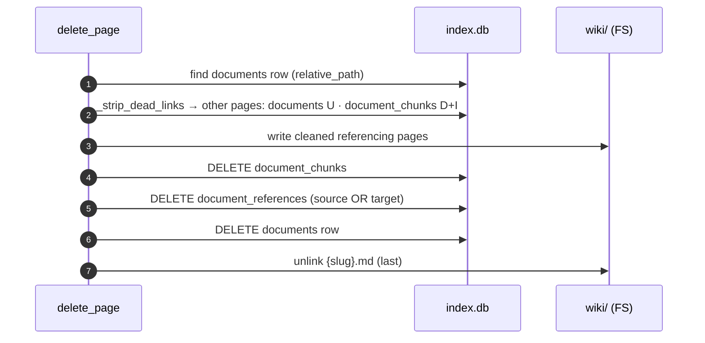

# LLMWiki — Programmer Manual

> **Single source of truth.** This document supersedes `programmatic_dev_plan.md`,  
> `implementation_plan.md`, `ingestion_design.md`, `diagnostic_alignment.md`, and  
> `llmwiki_architecture_rag_roadmap.md` (now under `docs/archive/`). The conceptual  
> reference `Karpathy_concepts.md` remains at the repo root.

## Table of Contents

1. [Philosophy & Karpathy Alignment](#1-philosophy--karpathy-alignment)
2. [Architecture Overview](#2-architecture-overview)
3. [Directory Structure](#3-directory-structure)
4. [Database Schema](#4-database-schema)
5. [Native Tool Layer](#5-native-tool-layer)
6. [Workflows](#6-workflows)
  - [6.1 Lint](#61-lint-)
  - [6.2 Repair](#62-repair-)
  - [6.3 Single-document ingestion](#63-single-document-ingestion-)
  - [6.4 Batch / multi-document ingestion](#64-batch--multi-document-ingestion-)
  - [6.5 Scan sources folder](#65-scan-sources-folder-)
  - [6.6 Regenerate wiki pages](#66-regenerate-wiki-pages-)
  - [6.7 Query / Chat (multi-phase RAG)](#67-query--chat-multi-phase-rag-)
  - [6.8 Chat → Wiki (file_to_wiki)](#68-chat--wiki-file_to_wiki-)
  - [6.9 Source deletion](#69-source-deletion-)
  - [6.10 Wiki page deletion](#610-wiki-page-deletion-)
7. [Marimo Apps](#7-marimo-apps)
8. [Configuration](#8-configuration)
9. [Testing](#9-testing)
10. [Known Constraints & Gotchas](#10-known-constraints--gotchas)
11. [Pending Work / Roadmap](#11-pending-work--roadmap)
12. [Future Enhancements](#12-future-enhancements)
13. [Glossary](#13-glossary)
14. [Tracing & Observability](#14-tracing--observability)

Status legend used throughout: ✅ implemented · 🟡 partial · ❌ missing.

> **On line numbers.** Code is cited as `module.py:symbol` (function/constant name),
> which stays valid as the code moves. Any bare `:NN` or `(L NN)` you still see is an
> approximate snapshot — grep for the named symbol rather than jumping to the line.

---

## 1. Philosophy & Karpathy Alignment

LLMWiki is a Python implementation of the LLM-Wiki pattern described in  
`Karpathy_concepts.md`. The idea: instead of re-discovering knowledge from raw  
chunks on every query (classic RAG), an LLM **incrementally builds and maintains**  
**a persistent encyclopedia** of markdown pages that sits between the user and the  
raw sources.

The project maps onto Karpathy's three-layer model as follows:

| Karpathy layer           | This project                                                                                       |
| ------------------------ | -------------------------------------------------------------------------------------------------- |
| Raw sources (immutable)  | `WIKI_PATH/sources/*.pdf` / `*.docx`                                                               |
| Wiki (LLM-generated)     | `WIKI_PATH/wiki/{summaries,concepts}/*.md` + `index.md`, `overview.md`, `log.md`                   |
| Schema (LLM conventions) | `base/domain/chat/config.py:_DEFAULT_SYSTEM_PROMPT` + optional per-workspace `wiki_config.toml` |

And onto the "Two Layers of Knowledge" framing:

- **Filing Cabinet** → `workspace/.llmwiki/index.db` (SQLite + FTS5)
- **Encyclopedia** → human-readable markdown under `workspace/wiki/`

Two operating principles flow from this:

1. **Ingestion is not just indexing.** Dropping a PDF triggers extraction +
  chunking + structured concept extraction + creation/update of summary and  
   concept pages + overview rewrite + git commit. The wiki *grows* with each  
   source.
2. **Wiki-first retrieval.** The chat agent reads curated wiki pages before
  touching raw chunks; raw-source FTS is a fallback, not the default.

---

## 2. Architecture Overview

```
                    PDFs / DOCXs (sources/)
                            │
                            ▼
              ┌───────────────────────────────┐
              │   Ingestion Pipeline          │ base/domain/ingestion/
              │   extract → chunk → LLM       │
              │   → summary + concept pages   │
              │   → overview rewrite          │
              │   → log entry + git commit    │
              └─────────────┬─────────────────┘
                            ▼
              ┌───────────────────────────────┐
              │   SQLite + Filesystem         │
              │   workspace/.llmwiki/index.db │
              │   workspace/wiki/summaries/   │
              │   workspace/wiki/concepts/    │
              └─────────────┬─────────────────┘
                            ▼
              ┌───────────────────────────────┐
              │   Chat Agent (multi-phase     │ base/domain/chat/
              │   RAG: wiki → sources → web*) │  (*web pending)
              └─────────────┬─────────────────┘
                            ▼
              ┌───────────────────────────────┐
              │   Marimo UIs                  │ marimo/
              │   ingest_app + read_app       │
              └───────────────────────────────┘

              ┌───────────────────────────────┐
              │   Lint + Repair (orthogonal)  │ base/domain/{lint,repair}/
              │   Runs on demand or after     │
              │   ingest; auto-fixes safe     │
              │   issues, flags the rest.     │
              └───────────────────────────────┘
```

**Key design principle:** the wiki is the primary knowledge layer; raw chunks  
are the fallback. Lint and repair keep the wiki internally consistent over time.

---

## 3. Directory Structure

```
llmwiki/
├── base/
│   ├── config.py                       # pydantic-settings (.env)
│   └── domain/
│       ├── chat/
│       │   ├── agent.py                # create_agent() factory
│       │   ├── config.py               # _DEFAULT_SYSTEM_PROMPT + load_config()
│       │   ├── tools.py                # search_source_chunks (async, sources scope)
│       │   └── wiki_tools.py           # read_wiki_page, search_wiki_fts,
│       │                               #   file_to_wiki, save_to_wiki
│       ├── ingestion/
│       │   ├── pipeline.py             # ingest_file, scan_and_ingest,
│       │   │                           #   regenerate_wiki_pages
│       │   ├── batch.py                # batch_ingest
│       │   ├── chunker.py              # chunk_pages (FTS5 units)
│       │   ├── detector.py             # mtime + SHA-256 change detection
│       │   ├── extractor.py            # PDF/DOCX → list[(page, markdown)]
│       │   ├── index_manager.py        # wiki/index.md upsert (deterministic)
│       │   ├── pdf_extract.py          # opendataloader / mistral backends
│       │   ├── trace.py                # opt-in ingestion trace (see §14)
│       │   └── wiki_generator.py       # all LLM prompt builders (see §6)
│       ├── lint/
│       │   ├── checks.py               # 7 check functions (incl. gap_filled)
│       │   ├── markers.py              # DATA_GAP markers + fts_safe (shared w/ repair)
│       │   ├── report.py               # LintIssue, LintReport
│       │   └── runner.py               # lint_wiki()
│       ├── repair/
│       │   ├── actions.py              # 6 repair functions
│       │   ├── report.py               # RepairResult, RepairReport
│       │   └── runner.py               # repair_wiki()
│       └── tools/
│           ├── db.py                   # open_db(), get_connection()
│           ├── git_ops.py              # init_wiki_repo, auto_commit
│           ├── references.py           # citation graph CRUD + queries
│           ├── search.py               # search_chunks() scoped FTS5
│           └── wiki_fs.py              # create/read/append/delete_page
├── marimo/
│   ├── ingest_app.py                   # Upload + ingest + scan + regenerate UI
│   ├── read_app.py                     # 3-pane reader + chat + save_to_wiki
│   ├── trace_report_app.py             # WIKI_TRACE run viewer (see §7, §14)
│   ├── widgets/
│   │   ├── __init__.py
│   │   └── delete_confirm.py           # DeleteConfirmWidget (anywidget) — reusable
│   └── prototypes/                     # Scratch experiments (chat_app.py et al.) — not imported by apps
├── database/
│   └── sqlite_schema.sql               # Canonical schema (applied by open_db)
├── scripts/
│   ├── build_golden_corpus.py          # Build/freeze the golden-corpus snapshot (§9)
│   └── render_trace.py                 # Render a trace.jsonl run to a timeline (§14.7)
├── tests/
│   ├── conftest.py                     # sys.path + fixture registration
│   ├── helpers/{fake_llm.py,workspace.py,golden.py}
│   ├── unit/                           # 210 unit tests (no LLM, no network)
│   ├── regression/                     # golden-corpus invariants (skips until frozen)
│   └── e2e/                            # 7 Playwright tests (live marimo + LLM)
├── docs/
│   ├── programmer_manual.md            # THIS FILE
│   ├── sqlite_data_dictionary.md       # Per-column DB reference
│   ├── CODEMAPS/                       # Auto-generated code maps
│   └── archive/                        # Superseded design docs
├── Karpathy_concepts.md                # Foundational pattern reference
├── README.md                           # End-user quickstart
└── pyproject.toml + uv.lock
```

### Runtime workspace layout

```
workspace/                              # = $WIKI_PATH
├── sources/                            # Drop PDFs / DOCXs here
├── wiki/
│   ├── index.md                        # Auto-maintained catalogue
│   ├── overview.md                     # LLM-rewritten narrative synthesis
│   ├── log.md                          # Append-only timeline
│   ├── summaries/
│   │   └── blancanieves.md             # 1-to-1 per source document
│   └── concepts/
│       └── snow-white.md               # Topic-centric, multi-source
├── wiki_config.toml                    # (optional) per-workspace overrides
└── .llmwiki/
    └── index.db                        # SQLite (documents, chunks, FTS5, refs)
```

The whole `workspace/` directory is a git repo so every ingestion is a trackable  
snapshot. `.gitignore` excludes `.llmwiki/` and the raw `sources/`.

---

## 4. Database Schema

**Location:** `workspace/.llmwiki/index.db`. Opened by `domain/tools/db.py:open_db()`,  
schema applied from `database/sqlite_schema.sql` on first run. Uses  
`PRAGMA journal_mode=WAL` and `PRAGMA foreign_keys=ON`.

### Tables

| Table                 | Purpose                                                                        |
| --------------------- | ------------------------------------------------------------------------------ |
| `workspace`           | Single row: workspace id, name, user_id                                        |
| `documents`           | Every file (`source_kind='source'` or `'wiki'`) with status, paths, hashes     |
| `document_pages`      | Raw page-by-page text extracted from sources (used by `regenerate_wiki_pages`) |
| `document_chunks`     | FTS5 units (~512 tokens, ~128 overlap)                                         |
| `chunks_fts`          | Virtual FTS5 table mirroring `document_chunks` via triggers                    |
| `document_references` | Citation graph edges (`reference_type` ∈ {`cites`, `links_to`})                |

### The citation graph (nodes & edges)

The wiki is not just a folder of markdown files — it is a **directed graph**, stored
in the `document_references` table. Understanding this graph is essential to
understanding how lint, repair, stale-detection, and backlinks all work.

- **Nodes** = documents. *Every* row in the `documents` table is a node — this
  includes both raw sources (`source_kind='source'`, e.g. `Cenicienta.pdf`) and
  generated wiki pages (`source_kind='wiki'`, e.g. `concepts/cinderella.md`).
- **Edges** = rows in `document_references`. Each row is a *directed* link from one
  document to another:

  ```
  source_document_id  →  target_document_id   (reference_type)
  ```

The `reference_type` column says **what kind** of link the edge is. There are exactly
two kinds:

| `reference_type` | Meaning | Parsed from | Example |
| ---------------- | ------- | ----------- | ------- |
| **`cites`**      | "this page was built from / draws on that source" | the `## Sources` section of a page | `cinderella.md` **cites** `Cenicienta.pdf` |
| **`links_to`**   | "this page hyperlinks to that page" | inline `[text](path)` wiki links (e.g. *See also* links) | `cinderella.md` **links_to** `little-red-riding-hood.md` |

So a **"cites edge"** is one row in `document_references` with `reference_type='cites'`.
It records the single fact *"document A cites document B."* When you ingest
`Cenicienta.pdf` and it produces `cinderella.md`, the intended edge is:

```
source = cinderella.md   target = Cenicienta.pdf   reference_type = 'cites'
```

That one row is what powers the two traversal helpers in `references.py`:

- **`get_forward_refs(node)`** — follows edges *out of* a node → "what does this page cite / link to?"
- **`get_backlinks(node)`** — follows edges *into* a node → "what cites / links to this document?"

And it is what the reconciliation checks reason over:

- **`find_uncited_sources`** — a source with **no incoming `cites` edge** is an orphan.
- **`missing_xref`** — relies on `cites` edges to know which page came from which source.
- **stale detection** — follows `cites` edges to mark a page stale when its source changes.

If the `cites` edges are missing, the graph still has all its **nodes** (the documents
exist) but is missing the **arrows** between them — so every check above silently
produces wrong answers. This was a real regression once: the `## Sources` parser
stopped matching the page format, so concept pages generated zero `cites` edges.
The parser now accepts both the footnote (`[^N]: file`) and plain-bullet (`- file`)
Sources forms — see `references.py:update_references` and its regression tests in
`tests/unit/test_references.py`.

#### Edges are rebuilt, never patched

`update_references(db, doc_id, content, path)` does **not** diff against existing rows.
Inside one transaction it deletes the page's current outgoing edges and re-inserts the
full freshly-parsed set:

```python
with conn:
    conn.execute(
        "DELETE FROM document_references WHERE source_document_id=?",
        (document_id,),
    )
    conn.executemany(
        "INSERT INTO document_references "
        "(source_document_id, target_document_id, reference_type, page) "
        "VALUES (?,?,?,?)",
        [(document_id, t, r, p) for t, r, p in unique_edges],
    )
```

Three properties follow:

- **Scope is one node's *outgoing* edges.** The `DELETE` is keyed on
  `source_document_id = doc_id`, so it clears every edge *leaving* this page (both
  `cites` and `links_to`) and nothing else. Edges *into* the page (other pages citing
  it) belong to other source nodes and are rebuilt when *those* pages are reprocessed.
- **Page content is the single source of truth.** After the call, the page's outgoing
  edges are exactly what the current markdown says — no more, no less. The operation is
  idempotent: running it twice on the same content yields the same rows, with no
  accumulation or stale leftovers.
- **Why rebuild instead of patch:** a diff-and-patch approach is more code and every
  diff path is a chance to leave the graph inconsistent (e.g. a removed `## Sources`
  entry whose `cites` edge lingers forever). Wiki pages are small and fully available at
  write time, so "delete-all-then-insert-all" is both cheap and trivially correct — the
  DB can never drift from the markdown.

The practical consequence cuts both ways. **Regenerating or editing a page automatically
heals its edges** — which is why the fix for a Sources-parser regression needs no migration:
correct the parser, reprocess each affected page (or run a regen pass), and every missing
`cites` edge is rebuilt. But the same property makes a parser bug *total*: since edges are
never patched incrementally, there is no historical residue to fall back on. The moment
the parser stops matching the page format, the very next `update_references` call deletes
the old (correct) edges and inserts nothing — one run is enough to zero out a page's
citations.

### Notable `documents` columns

| Column                     | Values                                  | Meaning                                    |
| -------------------------- | --------------------------------------- | ------------------------------------------ |
| `source_kind`              | `'source'` / `'wiki'`                   | Raw PDF/DOCX vs LLM-generated markdown     |
| `status`                   | `'processing'` / `'ready'` / `'failed'` | Pipeline stage (see §10)                   |
| `path`                     | e.g. `/wiki/summaries/`                 | Directory path                             |
| `relative_path`            | UNIQUE                                  | Full path from workspace root — upsert key |
| `source_document_id`       | UUID or NULL                            | Summary pages point back to their source   |
| `content_hash`, `mtime_ns` | —                                       | Used by `detector.needs_ingestion`         |

### FTS5 tokenizer

`chunks_fts` uses `porter unicode61`, which **splits on hyphens**. Querying  
`"mortgage-backed"` is interpreted as `mortgage NOT backed`. Use plain terms in  
queries — `search.search_chunks` returns `[]` silently on malformed expressions.

---

## 5. Native Tool Layer

These functions are the CRUD primitives every other layer depends on. They know  
*how* to read/write the wiki and the DB; they do not know *why* or *when*.

| Module                | Key functions                                                                                                             | What it does                                                                                |
| --------------------- | ------------------------------------------------------------------------------------------------------------------------- | ------------------------------------------------------------------------------------------- |
| `tools/db.py`         | `open_db(path)`, `get_connection(path)`                                                                                   | Opens (and migrates) the SQLite DB; provides a context-manager connection                   |
| `tools/wiki_fs.py`    | `create_page`, `read_page`, `append_to_page`, `delete_page`                                                               | Disk + DB simultaneously (single source of truth — never bypass)                            |
| `tools/search.py`     | `search_chunks(db, query, limit, scope)`                                                                                  | FTS5 search; `scope ∈ {"all", "wiki", "sources"}`                                           |
| `tools/references.py` | `update_references`, `get_backlinks`, `get_forward_refs`, `find_orphan_pages`, `find_uncited_sources`, `find_stale_pages` | Parses `[[wikilinks]]` plus citations in both `[^N]: file.pdf, p.3` footnote and `- file.pdf` Sources-bullet form; maintains `document_references` |
| `tools/git_ops.py`    | `init_wiki_repo`, `auto_commit`                                                                                           | Idempotent git init + silent commits                                                        |

Two structural notes:

- `wiki_fs.py` defers `from domain.ingestion.chunker import chunk_pages` inside  
`_insert_chunks()` to break a load-time circular import with `pipeline.py`.
- The citation parser uses `\s+[-–—]` (one *or more* spaces before the dash) so  
hyphenated filenames like `fed-paper.pdf` are not truncated to `fed`.

---

## 6. Workflows

Each workflow below follows the same template:

> **Status · Entry · Steps · LLM prompts (inline) · Triggers · Today vs Target · Verification**

### Quick-status table

| #    | Workflow           | Status | Entry                                                                | Pending                                                |
| ---- | ------------------ | ------ | -------------------------------------------------------------------- | ------------------------------------------------------ |
| 6.1  | Lint               | ✅      | `lint/runner.py:17`                                                  | `data_gap` shallow; `gap_filled_check` runs always; not auto-triggered yet (§11.11) |
| 6.2  | Repair             | ✅      | `repair/runner.py:30`                                                | All five deterministic repairs implemented             |
| 6.3  | Single ingest      | ✅      | `ingestion/pipeline.py:88`                                           | Lint+repair tail opt-in today (§11.11)                 |
| 6.4  | Batch ingest       | ✅      | `ingestion/batch.py:batch_ingest`                                   | Lint+repair tail opt-in today (§11.11)                 |
| 6.5  | Scan sources       | ✅      | `ingestion/pipeline.py:340`                                          | Should chain into lint+repair (§11.11)                 |
| 6.6  | Regenerate         | ✅      | `ingestion/pipeline.py:379`                                          | Should chain into lint+repair (§11.8)                  |
| 6.7  | Chat / RAG         | ✅      | `chat/agent.py:create_agent` + `chat/config.py:_DEFAULT_SYSTEM_PROMPT` | Phases 1–3 (wiki + sources) complete; web search (Phase 4) is a future enhancement (§12) |
| 6.8  | Chat → Wiki        | ✅      | `chat/wiki_tools.py:file_to_wiki` and `:save_to_wiki`               | Post-save lint+repair + cross-linking ✅; LLM-gated checks & bidirectional links deferred (§12) |
| 6.9  | Source deletion    | ✅      | `tools/deletion.py:11`                                               | —                                                      |
| 6.10 | Wiki page deletion | ✅      | `tools/wiki_fs.py:delete_page`                               | —                                                     |

Every ingestion and save workflow shares one goal: **leave the wiki in an
internally consistent state.** The mechanism is the **lint → repair reconciliation
cycle**, documented first (§6.1–§6.2) because §6.3–§6.6 and §6.8 all converge on it.

**Mental model.** Ingestion does the reconciliation *inline* — it creates/updates
the concept and summary pages, rewrites `overview.md`, and updates the citation
graph and `index.md`. **Lint is the verification gate**: if ingestion did its job,
a follow-up lint should report *"no actions needed."* **Repair is the safety net**
for whatever lint still flags. The steady-state success criterion for any ingest
is therefore *"lint comes back clean."*

**Two-column convention.** Each workflow below is described as **Today** (what the
code does now) and **Target** (the intended end state, tracked in §11). The status
legend (✅ implemented · 🟡 partial · ❌ missing) still applies per workflow.

**Plan note (§11.11).** Today lint runs after ingest only when
`lint_after_ingest=True` (single) / `run_lint=True` (batch) — both default to
`False` — and repair has no UI trigger at all. The Target is for lint+repair to
**always** close every ingest, scan, and regenerate, with explicit "Run Lint" /
"Run Repair" buttons in `ingest_app.py`.

**Entry duality.** Single (§6.3) and batch (§6.4) ingestion can start either from
the GUI (upload widget) **or** by dropping files into `workspace/sources/` and
running Scan sources (§6.5).

### Table-write matrix

What each workflow does to the four DB tables and the wiki filesystem.
**C**reate · **R**ead · **U**pdate · **D**elete · `D+I` = rebuilt (delete-then-insert) · – = untouched.
`chunks_fts` mirrors `document_chunks` via triggers, so it tracks that column.

| Workflow | `documents` | `document_pages` | `document_chunks` | `document_references` | `wiki/` FS |
| --- | --- | --- | --- | --- | --- |
| 6.1 Lint | R | R | R | R | R |
| 6.2 Repair | C/U/D | – | C/U/D | C/U/D | C/U/D |
| 6.3 Single ingest | C/U | D+I | D+I | C/U | C/U |
| 6.4 Batch ingest | C/U | D+I | D+I | C/U | C/U |
| 6.5 Scan sources | C/U | D+I | D+I | C/U | C/U |
| 6.6 Regenerate | U | R | D+I | – | U |
| 6.7 Chat / RAG | R | – | R | R | R |
| 6.8 Chat → Wiki | C/U | – | D+I | C/U | C/U |
| 6.9 Source delete | U/D | D | D | D | D |
| 6.10 Page delete | D | – | D | D | U/D |

6.3 (via the `ingest_app` runner) closes with a 6.1/6.2 reconciliation pass —
deterministic by default, full LLM if the form checkbox is ticked — so the 6.2-row
writes can also fire as the tail of an ingest. 6.4/6.5 reuse 6.3 per file (6.4 defers
overview/log/commit to once per batch). 6.6 touches **summary pages only** — no
`document_references`, `index.md`, `overview.md`, or lint. 6.7 is read-only unless the agent calls `file_to_wiki` (→ 6.8). 6.9/6.10
deletions cascade via `ON DELETE CASCADE` + the `chunks_fts` triggers; 6.10 also
**U**pdates *other* pages when stripping dead links to the deleted page.

The per-workflow diagram at the top of each §6.x section below shows the routines
and stores involved; 🧠 marks a step that calls the LLM.

---

### 6.1 Lint ✅



Lint is **read-only**: it never writes a table or file, it only produces a `LintReport`.

**Entry:** `lint_wiki()` — `base/domain/lint/runner.py:17`

Lint is the **verification gate** of the reconciliation cycle: it inspects the
wiki for internal-consistency defects and reports them, but changes nothing. In
the steady state — right after a successful ingest — lint should return *"no
actions needed."* A non-empty report means ingestion (or a manual edit, or a
deleted/modified source) left the wiki out of sync, which §6.2 Repair then fixes.

```python
report = lint_wiki(
    db_path,
    workspace,
    client=None,    # pass an LLM client to enable the LLM checks
    model="",
)
print(report.summary())             # "3 issue(s): 1 error(s), 2 warning(s), 0 info"
for issue in report.issues: ...
```

**Seven checks (`base/domain/lint/checks.py`):**

| Check             | Function           | Type                            | Severity       | What it finds                                                                                  |
| ----------------- | ------------------ | ------------------------------- | -------------- | ---------------------------------------------------------------------------------------------- |
| `orphan`          | `orphan_check`     | deterministic                   | warning        | Concept pages with no inbound `links_to` edge                                                  |
| `stale`           | `staleness_check`  | deterministic                   | warning        | Wiki pages older than any of their cited sources (SQL `MAX(src.updated_at) > wiki.updated_at`) |
| `missing_xref`    | `missing_xref_check` | deterministic                 | info           | Concept pairs that share a cited source but don't link to each other                           |
| `missing_concept` | `missing_concept_check` | deterministic              | warning        | `[text](concepts/foo.md)` links to non-existent files (regex `_CONCEPT_LINK_RE`)               |
| `gap_filled`      | `gap_filled_check` | deterministic (always runs)     | info           | `<!-- DATA_GAP: slug -->` TODO markers whose topic is now covered by a source                  |
| `contradiction`   | `contradiction_check` | **LLM** (skip if `client=None`) | error       | Pair-wise LLM comparison of concepts sharing a source                                          |
| `data_gap`        | `data_gap_check`   | **LLM** (skip if `client=None`) | info           | LLM scan of all concept titles for missing/underdeveloped topics                               |

The runner calls the five deterministic checks unconditionally and the two LLM
checks only when a `client` is passed (`lint/runner.py:lint_wiki`).

**LLM prompts (in `checks.py`):**

| Prompt                | Template                                                         | Input                                              | Output                                                  | Temperature |
| --------------------- | ---------------------------------------------------------------- | -------------------------------------------------- | ------------------------------------------------------- | ----------- |
| `contradiction_check` | `_CONTRADICTION_SYSTEM` (L155), `_CONTRADICTION_TEMPLATE` (L159) | path_a, content_a≤2000ch, path_b, content_b≤2000ch | `"CONTRADICTION: <desc>"` or `"NO CONTRADICTION"`       | 0.1         |
| `data_gap_check`      | `_GAP_TEMPLATE` (L232)                                           | bullet list of all concept titles                  | `"GAP: <topic> — <suggestion>"` per line or `"NO GAPS"` | 0.3         |

**Report shape (`lint/report.py`):**

```python
@dataclass
class LintIssue:
    check: str                # "orphan" | "stale" | "missing_xref" | "missing_concept" | "contradiction" | "data_gap" | "gap_filled"
    severity: str             # "error" | "warning" | "info"
    page: str                 # e.g. "/wiki/concepts/federal-reserve.md"
    description: str
    suggestion: str
    related_page: str = ""    # the "other" page (path_b) for xref/contradiction
    topic: str = ""           # gap topic slug for data_gap / gap_filled

@dataclass
class LintReport:
    issues: list[LintIssue] = field(default_factory=list)
    checked_at: str = ""      # ISO timestamp
    # Properties: .errors, .warnings; method .summary()
    #   summary() → "N issue(s): E error(s), W warning(s), X info"
```

**Today:**

- `ingest_file(..., lint_after_ingest=True)` runs deterministic checks only (no
  LLM) and appends a one-line summary to `wiki/log.md`. Default is `False`.
- `batch_ingest(..., run_lint=True)` — same, once per batch. Default is `False`.
- Manual function call from a notebook cell.
- No "Run Lint" button in `ingest_app.py`.
- `data_gap_check` is intentionally shallow — it only sees titles (§11.7).

**Target:** lint runs automatically at the end of every ingest, scan, and
regenerate (not opt-in), plus an explicit "Run Lint" button. Deepen `data_gap`
beyond titles (§11.7). Tracked in §11.11.

---

### 6.2 Repair ✅



🧠 = needs an LLM client; skipped when `llm_client=None` (`stale`, `missing_concept`).

**Entry:** `repair_wiki()` — `base/domain/repair/runner.py:30`

Repair is the **safety net** of the cycle: it consumes a `LintReport` and applies
automatic fixes where it is safe to do so, skipping anything that needs human
judgement.

```python
lint_report = lint_wiki(db_path, workspace, client=llm_client, model=model)
repair_report = repair_wiki(
    lint_report, db_path, workspace,
    llm_client=llm_client, model=model, progress_cb=print,
)
print(repair_report.summary())   # "4 issue(s): 2 fixed, 1 skipped, 1 failed"
```

**Repair dispatch (`repair/actions.py`):**

| Issue type        | Function (line)                 | Action                                                                                                                                                             | Needs LLM                                                 | Status    |
| ----------------- | ------------------------------- | ------------------------------------------------------------------------------------------------------------------------------------------------------------------ | --------------------------------------------------------- | --------- |
| `orphan`          | `repair_orphan` (L30)           | Delete the orphan concept page (file + DB row + chunks + references)                                                                                               | No                                                        | ✅         |
| `stale`           | `repair_stale` (L55)            | Reload page text from `document_pages` → re-run `extract_structured` + `build_summary_page` → `create_page(overwrite=True)` → `update_references`                  | Yes                                                       | ✅         |
| `missing_xref`    | `repair_missing_xref`           | Append `## See also` bullet linking A→B; call `update_references` to record the `links_to` edge. Idempotent.                                                        | No                                                        | ✅         |
| `missing_concept` | `repair_missing_concept`        | Parse filename out of the issue description; gather context via `search_chunks`; LLM writes new concept page; `create_page` + `update_references` + `update_index` | Yes (inline f-string prompt, temperature 0.3)             | ✅         |
| `contradiction`   | `repair_contradiction`          | Append idempotent `<!-- CONTRADICTION: path_b -->` + `⚠️` callout to page A; call `update_references`. Needs a human to resolve; repair only flags.                | No                                                        | ✅         |
| `data_gap`        | `repair_data_gap`               | Insert `<!-- DATA_GAP: slug -->` TODO note into the most-related wiki page (FTS host selection). Skips if topic already covered by a source.                        | No                                                        | ✅         |
| `gap_filled`      | `repair_gap_filled`             | Replace DATA_GAP block with `> ℹ️ See [Title](rel).` link; `create_page(overwrite=True)` + `update_references`. Fires when a topic's source is ingested.           | No                                                        | ✅         |

LLM-dependent repairs (`stale`, `missing_concept`) are automatically skipped when
`llm_client=None`.

**Report shape (`repair/report.py`):**

```python
@dataclass
class RepairResult:
    check: str            # original lint check
    action: str           # "deleted_orphan" | "regenerated" | "created" | "skipped"
    page: str
    success: bool
    message: str

@dataclass
class RepairReport:
    results: list[RepairResult]
    repaired_at: str
    # Properties: .fixed, .skipped, .failed, .summary()
```

**Today:** manual function call only; no "Run Repair" button. All five
deterministic repair types are implemented. Already auto-runs after chat→wiki
save (§6.8).

**Target:** repair runs automatically after lint at the end of every ingest,
scan, and regenerate, with an explicit "Run Repair" button. Tracked in §11.11.

**Verification:** `tests/unit/test_repair_*.py`.

---

### 6.3 Single-document ingestion ✅



**Entry:** `ingest_file()` — `base/domain/ingestion/pipeline.py:88`

```python
result = ingest_file(
    file_path,          # Path to PDF or DOCX
    db_path,            # str path to index.db
    workspace,          # Path to workspace root
    llm_client,         # OpenAI-compatible client
    model,              # e.g. "anthropic/claude-haiku-4-5"
    progress_cb=None,        # optional callable(str)
    lint_after_ingest=False, # run deterministic lint after step 12
    _batch_mode=False,       # internal — suppresses steps 10-13
)
# IngestResult(file_path, status="ingested"|"skipped"|"failed", message, doc_id)
```

**Pipeline steps:**

| #     | Step                                                                                                      | Where                                               |
| ----- | --------------------------------------------------------------------------------------------------------- | --------------------------------------------------- |
| 1     | Validate file (exists, supported extension)                                                               | `pipeline.py`                                       |
| 2     | Hash + mtime change detection                                                                             | `detector.py:needs_ingestion`                       |
| 3     | Extract `(page_number, markdown)` pairs                                                                   | `extractor.py:extract` (PDF / DOCX-via-LibreOffice) |
| 4     | Chunk pages into FTS5 units                                                                               | `chunker.py:chunk_pages`                            |
| 5     | Atomic DB write: `documents` + `document_pages` + `document_chunks`                                       | `pipeline.py`                                       |
| **6** | **Commit `status='ready'**` — readers can now see the source                                              | `pipeline.py`                                       |
| 7     | LLM: structured extraction → `ExtractionResult(document_summary, concepts[])`                             | `wiki_generator.py:extract_structured` (line 189)   |
| 8     | For each concept: build page (LLM) → `create_page(overwrite=True)` → `update_references` → `update_index` | `wiki_generator.build_concept_page` (270)           |
| 9     | Build summary page (deterministic) → `create_page` with `source_document_id`                              | `wiki_generator.build_summary_page` (238)           |
| 10    | LLM: rewrite `wiki/overview.md`                                                                           | `wiki_generator.update_overview` (304)              |
| 11    | Append `## [date] Ingested | filename` to `wiki/log.md`                                                   | `wiki_fs.append_to_page`                            |
| 12    | `auto_commit("ingest: ...")`                                                                              | `git_ops.auto_commit`                               |
| 13    | Optional deterministic lint pass (if `lint_after_ingest=True`)                                            | `lint/runner.lint_wiki`                             |

**LLM prompts used (all in `base/domain/ingestion/wiki_generator.py`):**

| Prompt               | Template constants                                                                             | Inputs                                                             | Output                                                               | Temperature |
| -------------------- | ---------------------------------------------------------------------------------------------- | ------------------------------------------------------------------ | -------------------------------------------------------------------- | ----------- |
| `extract_structured` | `_EXTRACT_SYSTEM` (L78), `_EXTRACT_USER_TEMPLATE` (L85)                                        | filename, file_type, page_count, content ≤80 KB                    | JSON `{document_summary, concepts:[{name,category,insight}]}`        | 0.2         |
| `build_concept_page` | `_CONCEPT_SYSTEM` (L109) + `_CONCEPT_NEW_TEMPLATE` (L114) OR `_CONCEPT_UPDATE_TEMPLATE` (L143) | concept name/category/insight, filename, existing content (if any) | Markdown w/ frontmatter + Definition/Characteristics/Context/Sources | 0.3         |
| `update_overview`    | `_OVERVIEW_SYSTEM` (L156), `_OVERVIEW_TEMPLATE` (L160)                                         | current overview, new summary, all concept names                   | 3–5 paragraph narrative                                              | 0.4         |

> The legacy single-shot `build_wiki_page` (L331) is kept for backward  
> compatibility but is no longer on the ingest path.

**Triggers:**

- Marimo **ingest form** in `ingest_app.py` (`ingest_form_cell`): the "⚙️ Ingest
  uploaded file(s)" submit button bundled with an "also run full LLM lint & repair"
  checkbox. `mo.ui.form` emits its value only on submit, so the checkbox is read
  atomically (no reset race); `on_change` snapshots the files + flag into the trigger.
- Directly callable as a Python function (`ingest_file`).

**Today vs Target:**

- **Coverage.** A single ingest already creates *both* concept pages (step 8) and
  the 1-to-1 summary page (step 9) — not just the summary.
- **Reconciliation tail.** The `ingest_file` library function itself only rewrites
  `overview.md` (step 10) and, when `lint_after_ingest=True` (default `False`), runs a
  deterministic lint it appends to the log — it never repairs. The **`ingest_app`
  runner** closes that gap: after every ingest it runs a lint **and** repair pass
  (`ingest_runner`), **deterministic by default** (no LLM) or **full LLM** when the
  form checkbox is ticked, so new concept/summary pages get cross-linked and lint
  comes back clean. The `orphan` check is excluded so pages created by *this* run
  aren't deleted for lacking inbound links yet. Remaining: extend the same auto-close
  to scan and regenerate (§11.11).
- **Duplicate handling.** Today an unchanged file returns `status="skipped"`
  silently (`detector.needs_ingestion`). **Target:** the GUI warns "already
  ingested" rather than skipping quietly (§11.13).

`status='ready'` is set at step 6 (before the LLM work in steps 7–9), see §10.

**Partial-failure rollback.** Steps 8–9 are not transactional (the source connection
is closed at step 6 so the wiki tools open their own). To keep a failed ingest from
leaving orphaned/half-merged derived pages, the pipeline records a *compensation* for
every page it creates or overwrites in steps 8–9 (`wiki_compensations`): pages this run
**newly created** are deleted (and their `index.md` entry removed via
`index_manager.remove_index_entry`); pages it **overwrote** are restored to their prior
content (snapshotted by `_snapshot_wiki_page` before the overwrite). On any exception the
`except` handler runs `_rollback_wiki_pages` before marking the source `status='failed'`.
Rollback is best-effort — a rollback error is logged, never raised, so it cannot mask the
original failure.

**Verification:**

```bash
HEADLESS=1 uv run pytest tests/e2e/test_ingest_app.py -v -s
uv run pytest tests/unit/test_pipeline_phase2.py -v
```

---

### 6.4 Batch / multi-document ingestion ✅



The per-file work is the §6.3 pipeline in batch mode (the boxed `loop` step); only
the overview/log/commit tail is collapsed to once per batch.

**Entry:** `batch_ingest()` — `base/domain/ingestion/batch.py`

```python
results = batch_ingest(
    files=[Path("sources/doc1.pdf"), Path("sources/doc2.pdf")],
    db_path=db_path,
    workspace=workspace,
    llm_client=client,
    model=model,
    progress_cb=None,
    run_lint=False,     # run deterministic lint once at the end
)
```

**Difference from 6.3:** each file goes through steps 1–9 of `ingest_file`  
with `_batch_mode=True` (set at `batch.py:63`), which suppresses steps 10–13.  
Then at the end of the batch the wrapper does **once**:

1. `update_overview()` with all new summaries combined.
2. Single `wiki/log.md` entry: `## [date] Batch ingested | N file(s)`.
3. Single `auto_commit("batch ingest: N file(s)")`.
4. Optional `lint_wiki()` deterministic pass.

**LLM call count for N files, K concepts/file:**

- `batch_ingest`: `N × (1 extract + K concepts) + 1 overview`
- `ingest_file` × N: `N × (1 extract + K concepts + 1 overview)`

Concept pages compound naturally across the batch — the second file's mention  
of an existing concept hits the `_CONCEPT_UPDATE_TEMPLATE` branch in step 8.

**Today vs Target:**

- **Reconciliation tail.** Today the batch ends with one `overview.md` rewrite and
  one optional deterministic lint pass (`run_lint=True`, default `False`); repair
  never runs. **Target:** the batch closes with a single lint **and** repair pass
  over the whole wiki — *including the pages just created in this batch* — so newly
  related concepts get cross-linked and lint comes back clean (§11.11).
- **Duplicate handling.** Like §6.3, unchanged files are skipped silently today;
  **Target** warns when any uploaded file is already ingested (§11.13).

**Triggers:** currently invoked through `ingest_app.py` "Ingest" button when  
multiple files are uploaded (the underlying widget supports multi-select).

**Verification:** `tests/unit/test_batch_ingest.py` — 9 tests, including a key  
assertion `len(llm.calls) == 5` for a 2-file batch (extract×2 + concept×2 +  
overview×1) which proves the overview is *not* called per file.

---

### 6.5 Scan sources folder ✅



The boxed `ingest_file()` step is the entire §6.3 pipeline (run sequentially, not in
batch mode). One trace run wraps the whole scan (no-op unless `WIKI_TRACE=1`).

**Entry:** `scan_and_ingest()` — `base/domain/ingestion/pipeline.py:340`

Walks `workspace/sources/` recursively, collects `.pdf` / `.docx` files  
(case-insensitive, skipping hidden entries), and calls `ingest_file()` for each.  
Unchanged files (detected by `detector.needs_ingestion` — mtime then hash)  
return `status="skipped"` without re-running the LLM.

**Why it exists:** lets you drop several files into `sources/` from outside the  
UI (Finder, `cp`, `obsidian-clipper`, etc.) and then re-ingest only the new or  
modified ones in one click. The pipeline does NOT run as a daemon — it scans  
on demand.

**Distinction from 6.4:** `scan_and_ingest` discovers files automatically,  
`batch_ingest` takes an explicit list. Internally `scan_and_ingest` calls  
`ingest_file` *sequentially* (not in batch mode) — so each scanned file still  
triggers an overview rewrite and a git commit. If you scan many files, prefer  
calling `batch_ingest(files=list(...))` directly.

**Triggers:** Marimo button "🔄 Scan sources" in `ingest_app.py:194`  
(`scan_btn`).

**Scan vs lint+repair (important).** Scanning is *source→wiki freshness*: it
detects new or modified **source files** and ingests them. Lint+repair is
*wiki→wiki consistency* (orphans, stale pages, missing cross-refs) — the two are
orthogonal (see the architecture diagram in §2). They meet at one point: a
*modified* source makes its dependent wiki pages **stale**, which the `stale`
lint check (§6.1) flags and `repair_stale` (§6.2) regenerates. So "scan sources
and update the wiki accordingly" = **scan to ingest the changed sources, then run
lint+repair to bring the wiki back into a consistent state.**

**Today vs Target:**

- **Today:** scan only ingests new/modified sources (each via `ingest_file`); it
  does **not** run lint+repair afterwards, so stale dependents are detected but
  not fixed in the same pass. The per-file overview rewrite is also wasteful for
  large scans — treat scan as "pick up the one or two files I dropped"; for bulk
  imports call `batch_ingest` directly (§11.9).
- **Target:** scan closes with a single lint **and** repair pass so a modified
  source's stale pages are regenerated automatically and lint comes back clean
  (§11.11).

---

### 6.6 Regenerate wiki pages ✅



Unlike §6.3, regenerate refreshes **summary pages only** via the legacy
`build_wiki_page`, and skips references, index, overview, and lint (see Today vs
Target below).

**Entry:** `regenerate_wiki_pages()` — `base/domain/ingestion/pipeline.py:379`

Iterates over every `documents` row with `source_kind='source'` and  
`status='ready'`, reloads the cached page text from `document_pages` (no PDF  
re-extraction), and re-runs:

1. `extract_structured()` (LLM)
2. `build_summary_page()` (deterministic)
3. `create_page(..., overwrite=True)` → `update_references` → `update_index`

**Use cases:**

- LLM model changed.
- Prompt templates in `wiki_generator.py` were refined.
- A wiki page was accidentally deleted from disk.

**Triggers:** Marimo button "🤖 Regenerate wiki" in `ingest_app.py:198`  
(`regen_btn`).

**Today vs Target:**

- **Today:** regenerate refreshes **only the summary pages** — it does NOT rebuild
  concept pages, NOR `overview.md`, NOR run lint/repair afterwards. Failed/processing
  sources are skipped silently.
- **Target:** regenerate rebuilds concept pages and overview too, then closes with
  a lint **and** repair pass so a regenerate never leaves stale concept/overview
  pages behind and lint comes back clean (§11.8, §11.11).

---

### 6.7 Query / Chat (multi-phase RAG) ✅



Routing is prompt-driven, not code-driven. Phases 1–3 are **read-only** over
`index.db` + `wiki/`; only the capture branch (`file_to_wiki`, §6.8) writes.

**Entry:** `create_agent()` — `base/domain/chat/agent.py`, paired with  
the system prompt in `base/domain/chat/config.py` (`_DEFAULT_SYSTEM_PROMPT`).

This is the most important section for understanding *how answers are*  
*generated*. The routing is **prompt-driven, not code-driven** — there is no  
Python `if`/`else` deciding which tool to call. The LLM reads the system  
prompt and picks tools accordingly. The code just provides the toolbox.

**Core principle — wiki-first.** The agent answers from the **curated wiki pages**
(the Encyclopedia) wherever possible, and only drops to the raw `document_chunks`
(the Filing Cabinet, via `search_source_chunks`) when the wiki pages don't contain
enough detail. The wiki is the default context; the DB is the fallback. This is
the whole point of the LLM-Wiki pattern (§1) — re-reading curated pages is cheaper
and higher-signal than re-deriving knowledge from raw chunks on every query.

#### Tool inventory

| Tool                                     | Module:fn                  | Scope                  | When the agent calls it                   |
| ---------------------------------------- | -------------------------- | ---------------------- | ----------------------------------------- |
| `read_wiki_page(path)`                   | `chat/wiki_tools.py:read_wiki_page`       | single file            | Direct page lookup by known path          |
| `search_wiki_fts(query, limit=10)`       | `chat/wiki_tools.py:search_wiki_fts`      | `source_kind='wiki'`   | Topic discovery across all wiki pages     |
| `file_to_wiki(title, content, category)` | `chat/wiki_tools.py:file_to_wiki`         | write                  | Persist a synthesis (see §6.8)            |
| `search_source_chunks(query, limit=10)`  | `chat/tools.py:search_source_chunks` (async) | `source_kind='source'` | Last-resort lookup into raw PDFs/DOCXs    |
| Web search                               | —                          | —                      | ❌ **NOT YET IMPLEMENTED** (Pending §11.5) |

The agent receives `db_path` as `deps_type=str`. Every tool derives the  
workspace from it via `workspace = Path(db_path).parent.parent` (because the  
DB is always at `workspace/.llmwiki/index.db`).

#### Routing rules (from `_DEFAULT_SYSTEM_PROMPT`)

The intended retrieval flow is staged — *wiki first, raw sources second, web*  
*search last*:

1. **Phase 1 — Try the index.** Call `read_wiki_page("wiki/index.md")`. If
  missing or empty, do not conclude the wiki is empty; continue.
2. **Phase 2 — Search the wiki.** Call `search_wiki_fts` with the question's
  key terms. Optionally `read_wiki_page` on likely paths  
   (`wiki/concepts/xyz.md`, `wiki/summaries/xyz.md`). This step always runs.
3. **Phase 3 — Fall back to raw sources.** Only call `search_source_chunks`
  when the wiki results don't contain enough detail.
4. **Phase 4 — Web search.** Only when phases 1–3 returned nothing useful.
  **Not implemented yet** — track in §11.5 and §11.6.
5. **Capture.** When the agent produces a comparison/analysis/summary worth
  keeping, call `file_to_wiki` (§6.8).

**Output guidelines (also in the prompt):** cite source + page for facts; use  
tables for comparisons, bullets for enumerations; "no information found" is  
only allowed after both `search_wiki_fts` and `search_source_chunks` were  
tried.

#### Customising per workspace

`workspace/wiki_config.toml`:

```toml
[assistant]
system_prompt = """
You are a specialist in mortgage-backed securities...
"""
suggested_prompts = [
    "What is a CDO?",
    "Compare MBS and ABS",
]
```

Loaded by `chat/config.py:load_config()` at agent creation time; falls back to  
the defaults if absent.

**Triggers:** the right panel chat in `marimo/read_app.py` (`chat_panel`  
cell at L174). The agent streams responses via `Agent.iter_stream(...)`.

**Gaps:**

- **Web search (Phase 4) is intentionally deferred** — see §12 for the
  rationale. Phases 1–3 (wiki index → wiki FTS → raw source chunks) are fully
  implemented and cover the project's core thesis: answer from your own curated
  corpus. Phase 4 is the only workflow that reaches outside it.
- The "always check index first" rule is advisory — there's no programmatic  
guarantee the LLM does it. Track regressions via the E2E suite.
- Phases are not numbered explicitly in the prompt today; tightening them to
  "Phase 1 / Phase 2 / Phase 3" labels would only matter once Phase 4 lands (§12).

---

### 6.8 Chat → Wiki (`file_to_wiki`) ✅



**Entry:**

- Agent tool: `file_to_wiki()` — `base/domain/chat/wiki_tools.py:file_to_wiki`
- UI-direct (no `RunContext`): `save_to_wiki()` — `base/domain/chat/wiki_tools.py:save_to_wiki`

```python
# Agent tool — called by PydanticAI via RunContext
file_to_wiki(ctx, title="Yield Curve Analysis", content="...", category="concept")

# UI helper — called directly from read_app.py:save_action
save_to_wiki(
    db_path, workspace, title, content, category,
    client=llm_client,   # OpenAI-compatible client; if None, built from config
    model=settings.LLM_MODEL,
)
```

Both share identical logic:

1. Slugify the title with `wiki_generator.make_wiki_slug` (NFKD-normalised — diacritics stripped, so "Política Común" → `politica-comun`).
2. Pick directory by category: `concept` → `/wiki/concepts/`, `summary` → `/wiki/summaries/`.
3. Read existing page content (if any) via `wiki_fs.read_page`.
4. **LLM structuring pass** — call `wiki_generator.structure_chat_content(title, category, raw_content, existing, client, model)`. Returns properly structured markdown (YAML frontmatter + Definition / Key Characteristics / Context / Sources).
5. **Deterministic See-also injection** — gather the existing wiki pages via `_related_pages_for(workspace, exclude_slug, current_dir)` and call `wiki_generator.inject_see_also(structured, related)`. It scans the structured markdown for **whole-word** mentions (`\b…\b`) of known page slugs and inserts a `## See also` section (before `## Sources`) linking each mentioned page that isn't already linked. Runs in both `file_to_wiki` and `save_to_wiki`. This is why chat-sourced pages get cross-links even though the LLM is told never to invent links.
6. Write with `create_page(overwrite=True)` if the page existed (LLM merge); `create_page(overwrite=False)` if new.
7. Look up the doc id and call `references.update_references` to keep the citation graph in sync.
8. Derive a one-line summary from the first heading and call `index_manager.update_index`.
9. Return `"Updated wiki page: wiki/concepts/foo.md"` or `"Created wiki page: ..."`.

**LLM prompts used (all in `wiki_generator.py`):**

| Prompt                              | Template constants                                         | Inputs                            | Output                                                               | Temperature |
| ----------------------------------- | ---------------------------------------------------------- | --------------------------------- | -------------------------------------------------------------------- | ----------- |
| `structure_chat_content` (new page) | `_CONCEPT_SYSTEM` (L109) + `_CHAT_CONCEPT_NEW_TEMPLATE`    | title, category, raw content      | Markdown w/ frontmatter + Definition/Characteristics/Context/Sources | 0.3         |
| `structure_chat_content` (update)   | `_CONCEPT_SYSTEM` (L109) + `_CHAT_CONCEPT_UPDATE_TEMPLATE` | title, raw content, existing page | Merged markdown, no duplication                                      | 0.3         |

`**file_to_wiki` — client injection:** builds `openai.OpenAI` lazily from  
`config.settings` (`WIKI_LLM_*` falling back to `LLM_*`). Keeps `deps_type=str`  
(db path) unchanged so existing RunContext mocks in tests remain unaffected.

`**save_to_wiki` — client injection:** optional keyword-only `client=None, model=None`; builds from settings when omitted, allowing tests to inject  
`FakeLLMClient` directly.

**Triggers:**

- Agent-decided when the chat produces something worth keeping (governed by  
the system prompt's "Capture" rule).
- Manual save form in `read_app.py:209` (`save_form` cell) → `save_action`  
cell at ~L235 calls `save_to_wiki` with an explicit client built from  
`settings.LLM_*`.

**Today:**

This is the **reference implementation of the reconciliation cycle** the ingest
workflows are moving toward — it already closes with lint+repair. When the user
saves a chat reply, the LLM structures it into a proper page (step 4),
`create_page` adds it to the wiki, and then:

- ✅ **Post-save lint+repair**. `_lint_and_repair_after_save` in
  `chat/wiki_tools.py` runs a deterministic lint scoped to the saved page and
  feeds fixable issues to `repair_wiki`. The `orphan` check is excluded so the
  just-created page is never auto-deleted; a `🔧 Post-save repair: …` line is
  appended to the save confirmation.
- ✅ **Cross-linking on save**. Since the three formerly-skipped repairs are now
  implemented (§6.2), a saved page that shares a cited source with an existing
  page is automatically cross-linked (`repair_missing_xref` adds a `## See also`
  link and records the `links_to` edge). Verified end-to-end by
  `tests/unit/test_lint_repair_after_save.py::test_save_to_wiki_auto_cross_links_shared_source`.

**Two known limitations (both deferred to §12, acceptable for a PoC):**

1. *Cross-linking is directional.* `missing_xref_check` emits one issue per pair,
   keyed on `path_a` (the page whose id sorts lower). The post-save filter only
   acts when the saved page is `path_a`; otherwise the link is added on the next
   full lint+repair, not on save.
2. *LLM-gated checks don't run on save.* The post-save lint is intentionally
   called **without** an LLM client, so `contradiction` and `data_gap` (both
   LLM-powered checks) never fire on save — only the deterministic checks
   (`missing_xref`, `missing_concept`, `stale`, `gap_filled`) do. This keeps save
   latency and cost low.

---

### 6.9 Source deletion ✅



**Entry:** `delete_source()` — `base/domain/tools/deletion.py:11`

```python
delete_source(db_path, workspace, doc_id, *, also_delete_file=False)
# -> RepairResult(action="deleted" | "failed", ...)
```

Removes the source `documents` row; FK `ON DELETE CASCADE` automatically cleans  
up `document_pages`, `document_chunks`, `chunks_fts` (via triggers), and  
`document_references`. Dependent wiki pages are handled by relationship:  

- **1-to-1 summary pages** (`source_document_id == doc_id`) are **deleted** — there  
  is no source left to regenerate them from.  
- Pages that merely **cite** the source (e.g. multi-source **concept** pages) are  
  **kept and marked `stale_since = datetime('now')`**, since they may still draw on  
  other surviving sources; deleting them would destroy that synthesis. They are  
  surfaced by `find_stale_pages` for review/regeneration. *(Note: the lint runner's  
  `staleness_check` is timestamp-based and does not yet consume `stale_since`; wiring  
  `find_stale_pages` into the runner is follow-up work.)*  

File removal is opt-in (`also_delete_file=True`). Calls  
`auto_commit(workspace, "delete source: {filename}")` on success.

UI: "🗑 Delete Source" section at the bottom of `marimo/ingest_app.py` —  
dropdown of indexed sources, a confirmation checkbox, and an optional  
"also remove file from sources/" checkbox. The `delete_runner` cell mirrors the  
`ingest_runner` / `scan_runner` trigger pattern.

---

### 6.10 Wiki page deletion ✅



**Entry:** `delete_page()` — `base/domain/tools/wiki_fs.py:delete_page`

```python
delete_page(db_path, workspace, dir_path="/wiki/concepts/", slug="snow-white")
# True if page existed; removes file, DB row, chunks, references,
# and strips dead links from all pages that referenced it.
```

What `delete_page` cleans up atomically:

| Layer                 | What is removed                                                                       |
| --------------------- | ------------------------------------------------------------------------------------- |
| Disk                  | The `.md` file                                                                        |
| `documents`           | The row for this page                                                                 |
| `document_chunks`     | All FTS5 units (and via trigger, `chunks_fts`)                                        |
| `document_references` | All edges where this page is source **or** target                                     |
| Other wiki pages      | Inline markdown links to this page are rewritten to plain text by `_strip_dead_links` |

**Triggers:**

- `repair_orphan` (§6.2) — automatic repair path.
- `read_app.py` — `delete_widget_cell` + `delete_event_cell` (see §7).

**Gaps:** none.

---

## 7. Marimo Apps

Both apps live in `marimo/` and are self-contained `uv` scripts — the  
script header declares their dependencies inline. They share no global state.

### `ingest_app.py`

Cells (selected — see source for the full list):

| Cell                 | Purpose                                                                         |
| -------------------- | ------------------------------------------------------------------------------- |
| `setup`              | `.env` + paths + open SQLite                                                    |
| `llm_setup`          | Build `openai.OpenAI` from `settings.wiki_*`                                    |
| `source_uploader`    | `mo.ui.file(filetypes=[".pdf",".docx"])` → saves to `sources/`                  |
| `ingest_form_cell`   | Form: "⚙️ Ingest uploaded file(s)" submit + "full LLM lint & repair" checkbox → `ingest_file` (or `batch_ingest` for multi-file), then a lint+repair tail |
| `scan_btn`           | "🔄 Scan sources" → `scan_and_ingest`                                           |
| `regen_btn`          | "🤖 Regenerate wiki" → `regenerate_wiki_pages`                                  |
| `clear_btn`          | Resets the live progress log                                                    |
| `progress_display`   | Accumulates `progress_cb(message)` lines                                        |
| `timing_helper`      | Returns `make_timed_logger(set_log_lines, logger, tag)` shared by all runners   |
| `debug_panel` (L330) | Visible when `WIKI_DEBUG=1`                                                     |

**Timed Activity Log.** Each runner (`ingest`, `scan`, `regen`, `lint_repair`) wraps
its `progress_cb` with `make_timed_logger` (the `timing_helper` cell). Every log line
is prefixed with the elapsed time since the previous message (`` `+  8.1s` 🤖 … ``) and
a bold `total: Ns` is appended when the run finishes. Because messages mark the *start*
of each step, the delta on a line is the duration of the step named on the line above —
which makes the slow steps (the LLM calls) jump out for optimization. Timing lives
entirely in the app layer; `pipeline.py` and the domain are untouched.

### `read_app.py`

Three-column grid:

| Pane                  | Cell                       | Role                                                                                                   |
| --------------------- | -------------------------- | ------------------------------------------------------------------------------------------------------ |
| Left                  | `left_panel`               | Page selector with refresh button (`scan_pages()`)                                                     |
| Left (below selector) | `delete_widget_cell`       | Renders `DeleteConfirmWidget` — disabled when no page is selected; resets event counter on page change |
| — (logic only)        | `delete_event_cell`        | Watches `delete_widget.event_id`; fires `set_delete_trigger` on confirm                                |
| — (logic only)        | `delete_runner`            | Calls `wiki_fs.delete_page`, rescans page list, clears selection                                       |
| Middle                | `middle_panel`             | Renders the selected page as markdown + nav links                                                      |
| Right                 | `chat_panel`               | PydanticAI agent stream + suggested prompts                                                            |
| Right (below chat)    | `save_form`, `save_action` | Saves the last assistant reply to the wiki via `save_to_wiki` with LLM structuring pass                |

Two rendering details in this app:

- **`middle_panel` strips citation footnotes at render time.** `## Sources` bullets and
  inline citations carry `[^n]:` markers that marimo's markdown renderer would otherwise
  show as empty bullets; `middle_panel` removes the `- [^n]:` prefix (and inlines link
  text) before display, so the rendered page is clean while the underlying markers stay
  intact for `references.update_references`.
- **`page_links_nav` resolves relative links before matching.** A concept page links to a
  sibling as `cinderella.md` or to a summary as `../summaries/x.md`; the nav resolves each
  against the current page's directory (`posixpath.normpath`) before matching the scanned
  page list (which stores directory-prefixed stems like `concepts/cinderella`), and skips
  `` image embeds. Without this, chat-generated pages showed no nav links.

#### `DeleteConfirmWidget` (`marimo/widgets/delete_confirm.py`)

An `anywidget.AnyWidget` subclass — the delete button and its confirmation  
panel are a single self-contained JS/CSS widget. Show/hide is handled entirely  
in the JS layer so marimo's reactive execution model does not interfere.

| Trait          | Type | Default | Purpose                                                                     |
| -------------- | ---- | ------- | --------------------------------------------------------------------------- |
| `label`        | str  | `""`    | Item name used in default button text and panel message                     |
| `button_label` | str  | `""`    | Override trigger button text (empty → `"Delete {label}"`)                   |
| `message`      | str  | `""`    | Override panel message (empty → `"Delete {label}? This cannot be undone."`) |
| `disabled`     | bool | `False` | Grays out and disables the trigger button                                   |
| `is_open`      | bool | `False` | Whether the confirmation panel is visible (managed by JS)                   |
| `event_id`     | int  | `0`     | Increments on each confirmed deletion — the Python signal                   |

Usage pattern in any marimo app:

```python
# Cell A — render widget
widget = mo.ui.anywidget(DeleteConfirmWidget(label=item_name, disabled=not item_name))
widget
return widget, item_name

# Cell B — react to confirmation (separate state tracks last handled event)
if widget.event_id > last_event() and item_name:
    set_last_event(widget.event_id)
    do_deletion(item_name)
```

`marimo` is added to `sys.path` in `read_app.py`'s setup block so  
`from widgets.delete_confirm import DeleteConfirmWidget` resolves correctly.

`scan_pages()` uses `wiki_dir.rglob("*.md")` and returns paths relative to  
`wiki/` (e.g. `concepts/federal-reserve`, `summaries/my-doc`, `index`), so all  
subdirectory pages appear in the left-panel table. `read_page(rel_path)` reads  
`wiki/{rel_path}.md`. The title display strips the directory prefix with  
`.rsplit("/", 1)[-1]`.

The agent is created once per session via `create_agent(db_path)` and reused  
across messages.

### `trace_report_app.py`

A read-only viewer for ingestion traces (§14). Point it at a directory, it
discovers every `trace.jsonl` run underneath, and renders each run two ways: a
human-readable per-document timeline (same layout as `scripts/render_trace.py`)
and an `mo.tree` of the raw events grouped by document. Payload channels
(`prompts`, `responses`, `extracted_text`, `chunks`, `markdown`) can be inlined
on demand. It only reads traces produced by `WIKI_TRACE=1` runs — it never
ingests or writes anything.

### Running locally

```bash
# Against $WIKI_PATH from .env
uv run marimo run marimo/ingest_app.py --port 2718
uv run marimo run marimo/read_app.py --port 2720

# Against a specific workspace
WIKI_PATH=/path/to/workspace uv run marimo run marimo/read_app.py --port 2720
```

---

## 8. Configuration

### `.env` (loaded by `base/config.py` via `pydantic-settings`)

```ini
WIKI_PATH=/path/to/workspace
LLM_BASE_URL=https://openrouter.ai/api/v1
LLM_API_KEY=sk-or-...
LLM_MODEL=anthropic/claude-haiku-4-5

# Optional override for ingestion-time LLM (falls back to LLM_* if blank)
WIKI_LLM_BASE_URL=
WIKI_LLM_API_KEY=
WIKI_LLM_MODEL=

# PDF backend
PDF_BACKEND=opendataloader     # or "mistral"
MISTRAL_API_KEY=
```

### `workspace/wiki_config.toml` (optional, per-workspace)

Overrides the chat assistant's system prompt and suggested prompts. See §6.7  
for an example. Absent file → defaults from `chat/config.py` are used.

### Environment flags

| Flag                       | Effect                                                                                       |
| -------------------------- | ------------------------------------------------------------------------------------------- |
| `WIKI_DEBUG=1`             | Shows debug panel in `ingest_app.py`                                                         |
| `HEADLESS=1`               | Used by the E2E test suite for non-interactive Playwright runs                               |
| `WIKI_TRACE=1`             | Turns on the opt-in ingestion trace (LLM exchanges + data-flow). See §14.                    |
| `WIKI_TRACE_CAPTURE=…`     | Selects trace payload channels: `all` (default) · `none` · CSV of `extracted_text,chunks,prompts,responses,markdown`. See §14. |

---

## 9. Testing

### Run

```bash
uv run pytest tests/unit/ -v               # 210 unit tests — fast, no LLM
uv run pytest tests/e2e/ -v -s             # 7 E2E tests — live marimo + LLM
```

Slash commands: `/test-ingest`, `/test-read`, `/test-all`.

### Unit infrastructure

`**FakeLLMClient**` (`tests/helpers/fake_llm.py`) duck-types the OpenAI client.  
Configure responses before each test:

```python
llm = FakeLLMClient(response_content="## Fixed response")

# Sequential multi-step pipelines
llm.responses = ["JSON extraction", "Concept page", "Overview text"]
# Call index advances automatically; last response repeats if exhausted.

assert len(llm.calls) == 3
```

`**tmp_workspace**` (`tests/helpers/workspace.py`) yields a fresh disposable  
workspace per test:

```python
def test_something(tmp_workspace: WorkspaceFixture) -> None:
    # .workspace  — Path to temp workspace root
    # .db_path    — str path to index.db (schema applied)
    # .llm        — FakeLLMClient instance
```

**Mock RunContext** for PydanticAI tool tests:

```python
class _Ctx:
    def __init__(self, deps): self.deps = deps

ctx = _Ctx(tmp_workspace.db_path)
result = read_wiki_page(ctx, "wiki/index.md")
```

### Golden-corpus regression

Ingestion is non-deterministic (LLM output varies), so it can't be strict-diffed.
Instead a fixed set of **4 public-domain English fairy-tale PDFs** (Cinderella, Little
Red Riding Hood, The Sleeping Beauty in the Wood — from *The Blue Fairy Book*, Project
Gutenberg #503 — plus Snow White and the Seven Dwarfs, all in `tests/fixtures/pdfs/`) is
ingested **once** (1 individual + 3 batch), human-verified, and frozen into a tracked
snapshot. That "golden corpus" turns every *other* workflow into a deterministic
regression test.

```bash
python scripts/build_golden_corpus.py build    # ingest into _golden_staging/ (needs LLM keys)
# inspect tests/fixtures/_golden_staging/wiki/ — the report flags missing cites edges
python scripts/build_golden_corpus.py freeze    # snapshot -> tests/fixtures/golden_corpus/
git add tests/fixtures/golden_corpus            # sources/ + wiki/ + index.db + index.db.sql
```

- `tests/helpers/golden.py:restore_golden(tmp)` copies the snapshot into a fresh
  workspace and returns `(db_path, workspace)` (the DB stores only relative paths, so
  it is relocatable).
- `tests/regression/test_golden_corpus.py` asserts LLM-variation-robust invariants:
  4 sources `ready`, **every concept page has a `cites` edge** (the citation-graph guard), each
  summary cites its source, lint reports no errors, and the DB rows agree with the
  markdown tree on disk. The whole module **skips** until the corpus is frozen.
- The snapshot ships both `index.db` (binary — the restore source; FTS5 doesn't
  round-trip through a `.dump`) and `index.db.sql` (the human-auditable companion).

### E2E infrastructure

Uses `async_playwright` (the test runner lives inside an asyncio loop — anyio  
4.x). Configured in `pytest.ini`:

```ini
asyncio_mode = auto
asyncio_default_fixture_loop_scope = session
```

**Two-phase wait pattern** (because `status='ready'` fires at step 6, before  
the wiki page is created at step 9):

```python
wait_for_ingestion(filename)             # source status='ready'
src = assert_source_ok(filename)
wait_for_wiki_page(src["id"], filename)  # wiki page actually exists in DB
assert_wiki_ok(src["id"], filename)
```

---

## 10. Known Constraints & Gotchas

- **FTS5 hyphens.** The porter unicode61 tokenizer splits hyphens.  
`"mortgage-backed"` is two tokens. Use plain terms.
- `**status='ready'` fires early.** Set at step 6 (after chunking), before the  
LLM work in steps 7–9. Polling only for `status='ready'` misses the wiki  
page creation. Always add a second poll for the wiki page in tests.
- **Circular import.** `wiki_fs.py` imports `chunker.py` inside  
`_insert_chunks()` (deferred) to prevent a load-time cycle with  
`pipeline.py`.
- **Marimo reactivity.** `ingest_file()` runs synchronously inside a marimo  
cell. Marimo re-runs dependent cells reactively *after* the cell completes,  
not during. Cells are not async unless explicitly written as `async def`.
- `**source_document_id` is set only for summary pages**, not concepts —  
because one concept can be derived from multiple sources.
- **Citation parser dash.** `update_references` requires *one or more* spaces  
before an em-dash (`\s+[-–—]`) so hyphenated filenames like `fed-paper.pdf`  
are not truncated to `fed`.
- **Slug diacritics.** `make_wiki_slug` applies `unicodedata.normalize("NFKD", …)` +  
`encode("ascii","ignore")` before slugifying, so accented characters are  
transliterated rather than silently dropped (`"Política Común"` →  
`politica-comun`, not `poltica-comn`). This is the only safe cross-OS  
behaviour.
- **LibreOffice required for DOCX.** `extractor.check_libreoffice()` raises  
`LibreOfficeNotInstalledError` with install instructions; the pipeline  
surfaces this as `status='failed'`.

---

## 11. Pending Work / Roadmap

All §6 workflows are now ✅. The items below are incremental improvements to
those working workflows (auto-triggering lint+repair, UI buttons, duplicate
warnings, etc.); completed items are marked ✅. Larger out-of-scope features live
in §12.

1. ✅ **LLM structuring pass on chat-to-wiki save** (§6.8). Implemented:
  `wiki_generator.structure_chat_content()` with `_CHAT_CONCEPT_NEW_TEMPLATE`  
   / `_CHAT_CONCEPT_UPDATE_TEMPLATE` (both use `_CONCEPT_SYSTEM`). Applied in  
   `file_to_wiki` and `save_to_wiki`; `create_page(overwrite=True)` replaces  
   blind `append_to_page` for existing pages. `save_to_wiki` accepts optional  
   `client`/`model` keyword args. `make_wiki_slug` now normalises diacritics  
   via NFKD.
2. ✅ **Chat→Wiki post-save lint+repair trigger** (§6.8). Implemented:
  `_lint_and_repair_after_save(db_path, workspace, page_path, client, model)`  
   in `chat/wiki_tools.py`. Runs deterministic `lint_wiki`, filters issues to  
   the saved page, excludes the `orphan` check (would delete the new page), then  
   calls `repair_wiki`. Both `save_to_wiki` and `file_to_wiki` append a  
   `🔧 Post-save repair: …` line to their return message when repairs occur.
3. ✅ **Source deletion** (§6.9). `delete_source(db_path, workspace, doc_id, ...)` in
  `tools/deletion.py`. FK cascade cleans up chunks, references, and FTS; 1-to-1  
   summary pages are deleted while citing concept pages are marked `stale_since`  
   (see §6.9, M2). UI: dropdown + confirm checkbox + `delete_runner` cell in  
   `marimo/ingest_app.py`.
4. ✅ **Wiki page deletion UI button** (§6.10). `DeleteConfirmWidget`
  (`marimo/widgets/delete_confirm.py`) — anywidget-based delete button  
   with inline JS confirmation panel. Wired into `read_app.py` via  
   `delete_widget_cell` + `delete_event_cell`. Dead-link cleanup and full DB  
   teardown happen inside `wiki_fs.delete_page` automatically.
5. **Web search tool for the chat agent** (§6.7). New async tool alongside
  `search_wiki_fts` / `search_source_chunks`, backed by a search API.  
   **Intentionally deferred for the PoC — rationale and revisit plan in §12.**
6. **Explicit multi-phase RAG labels in the agent system prompt**
  (`chat/config.py`). Rename the prompt sections to "Phase 1 / … / Phase 4"  
   for clearer routing. Only meaningful once §11.5 lands — deferred with it (§12).
7. **Deepen & promote `data_gap`** (§6.1–§6.2). The `data_gap` lint check is
  shallow — it only sees concept *titles* — and its repair is a stub. Deepen the
  check to read page bodies, and implement the repair to suggest specific web  
   searches or sub-questions for each gap (`repair/actions.py:254`).
8. `**regenerate_wiki_pages` should auto-run lint+repair** afterwards
  (§6.6) so a regenerate doesn't leave stale concept/overview pages. Subsumed by
   §11.11.
9. ✅ **Grid column for wiki page title** in `read_app.py:left_panel` — the
  sources table shows Title + Directory + Slug + Excerpt.
10. **Document `scan_and_ingest` precisely** for end users (§6.5 — what it
  touches, when to prefer `batch_ingest` instead).
11. 🟡 **Lint+repair always close every ingest, scan, and regenerate** (§6.1–§6.6).
  **Done for ingest:** the `ingest_app` ingest form (`ingest_form_cell` +  
   `ingest_runner`) now auto-runs a lint **and** repair pass after every ingest —  
   **deterministic by default**, or **full LLM** when the form checkbox is ticked —  
   with the `orphan` check excluded so just-created pages survive. The manual "Run  
   Wiki Lint & Repair" button (`lint_repair_widget` + `lint_repair_runner`) remains  
   for an on-demand full sweep. **Remaining:** give **scan** (§6.5) and **regenerate**  
   (§6.6) the same automatic tail (today they still don't reconcile afterwards), and  
   optionally surface the same checkbox on those actions.
12. ✅ **Finish the skipped repairs** (§6.2). Implemented `repair_missing_xref`
  (appends `## See also` + records `links_to` edge), `repair_contradiction`  
   (idempotent `⚠️` callout), and `repair_data_gap` (inserts `<!-- DATA_GAP -->`  
   TODO note), plus a new `gap_filled` check+repair that replaces a resolved TODO  
   note with a link. All deterministic; see `repair/actions.py` and  
   `tests/unit/test_repair_finish.py`.
13. **Warn on duplicate upload** (§6.3–§6.4). When an uploaded or dropped file is
  already ingested and unchanged, surface a GUI warning instead of the current  
   silent `status="skipped"`.

### Open bugs

| ID  | Severity | Where | Problem | Fix |
| --- | -------- | ----- | ------- | --- |
| E1  | 🟠 medium (test) | `marimo/read_app.py:chat_panel` × `tests/e2e/test_read_app.py` | 4 of the 5 read-app E2E tests time out waiting for the static `### Chat with your Wiki` heading (5s) — the `chat_panel` cell errors at runtime, so the heading never renders, while the left/middle panes load fine. Pre-existing (reproduces at commit `e252b2d`, before the 2026-05-28 audit work); unrelated to the chunker/index/link fixes. `pydantic_ai.messages` imports resolve (pydantic_ai 1.97.0), so the break is most likely in the `mo.ui.chat` + `run_stream` wiring against the current marimo/pydantic_ai versions. | Reproduce locally (`HEADLESS=1 uv run pytest tests/e2e/test_read_app.py`), read the marimo server stderr for the `chat_panel` traceback, and align the `mo.ui.chat`/`run_stream` usage with the installed versions. |

---

## 12. Future Enhancements

Aspirational features from `Karpathy_concepts.md` not yet on the roadmap:

- **Two-step HITL ingestion.** Decouple ingestion into `extract_only(file)`  
and `commit_to_wiki(edited_json)` so the user can review and edit the LLM's  
extraction before it's written.
- **Web search → ingest loop.** When lint reveals a gap, a tool can search the  
web, present candidate articles, and on approval ingest the content as a new  
source. (Distinct from §11.5 web search at query time.)
- **Image handling.** Store images from clipped articles in `sources/assets/`;  
optionally pass them to a vision-capable LLM during ingestion.
- **Knowledge graph visualisation.** Render `document_references` as an  
interactive D3.js / Mermaid graph in marimo.
- **Marp slide-deck generation.** `generate_marp_deck(topic, pages)` with a  
template under `wiki/templates/`, integrated with `marp-cli`.
- **Obsidian Canvas output.** Generate `.canvas` JSON for spatial layouts of  
related concepts.
- **Deeper post-save reconciliation** (§6.8). The chat→wiki post-save hook today  
runs only deterministic lint checks, and cross-linking is directional. Two  
optional upgrades, deferred as the project is a proof of concept: (a) pass an  
LLM client to the post-save `lint_wiki` so `contradiction` and `data_gap` also  
fire on save — at the cost of extra LLM calls and latency per save; and (b) make  
post-save cross-linking direction-independent, so the saved page is linked  
regardless of how its id sorts in `missing_xref_check` (e.g. emit both pair  
directions, or match the saved page as either `path_a` or `path_b`).
- **Web search as Phase 4 of chat/RAG** (§6.7). The agent's retrieval cascade  
implements Phases 1–3 (wiki index → wiki FTS → raw source chunks); Phase 4 (web  
search) is intentionally **not** built. Rationale: the project's thesis is  
answering from a *curated, local corpus* — Phases 1–3 fully exercise that.  
Web search is the only workflow that reaches outside your own data and is the  
only one with a recurring external cost (API key + per-query billing) and a  
network dependency that complicates testing. For a PoC that tradeoff isn't  
worth it. If revisited: add an async tool in `chat/tools.py` alongside  
`search_source_chunks`, pick a provider (e.g. Tavily/Brave free tiers, both  
RAG-oriented; DuckDuckGo keyless but weaker), number the prompt phases  
explicitly, and mock the network in tests.

---

## 13. Glossary

| Term                        | Meaning                                                                                                                                                                                                                             |
| --------------------------- | ----------------------------------------------------------------------------------------------------------------------------------------------------------------------------------------------------------------------------------- |
| **Source**                  | A raw, immutable file under `workspace/sources/` (PDF, DOCX). `source_kind='source'` in `documents`.                                                                                                                                |
| **Summary page**            | 1-to-1 LLM-generated markdown reflection of a single source. Lives under `wiki/summaries/`. Carries `source_document_id`.                                                                                                           |
| **Concept page**            | Topic-centric, multi-source markdown page under `wiki/concepts/`. Has YAML frontmatter. Does NOT carry `source_document_id` — derives from many sources.                                                                            |
| `**index.md**`              | Catalogue of every page in the wiki, organised by category. Deterministically updated by `index_manager.update_index`.                                                                                                              |
| `**overview.md**`           | LLM-rewritten narrative synthesis of the wiki's evolving thesis.                                                                                                                                                                    |
| `**log.md**`                | Append-only chronological audit trail. Prefix `## [YYYY-MM-DD]` makes it parseable with `grep "^## \["`.                                                                                                                            |
| **Slug**                    | `make_wiki_slug(name)` — NFKD-normalise → strip combining marks → lowercase → spaces/underscores → hyphens → remove non-`[a-z0-9-]` chars. Used as the filename of every wiki page. Example: `"Política Común"` → `politica-comun`. |
| **Filing Cabinet**          | The SQLite + FTS5 layer (`workspace/.llmwiki/index.db`).                                                                                                                                                                            |
| **Encyclopedia**            | The human-readable markdown layer (`workspace/wiki/`).                                                                                                                                                                              |
| **Phase 1 / 2 / 3 / 4 RAG** | The agent's routing cascade: index → wiki search → raw chunks → web search (Phase 4 pending §11.5).                                                                                                                                 |
| **Trace (ingestion)**       | Opt-in (`WIKI_TRACE=1`) write-only JSONL record of every LLM exchange + the data-flow path of an ingestion run, correlated to DB rows via a `db_join_map` header. For debugging, not replay. See §14.                                |
| **Sidecar**                 | A content-addressed file under a trace's `payloads/<sha256>.<ext>` holding one heavy payload (prompt, response, extracted text, chunks, or a generated page), referenced from the event by `ref` + `sha256` + `bytes`. See §14.4.     |

---

## 14. Tracing & Observability

**Entry point:** `base/domain/ingestion/trace.py`. **Activation:** `WIKI_TRACE=1`.
**Status:** ✅ ingestion only (chat agent, lint, and repair are out of scope for v1).

The trace is a **write-only observability layer** for the ingestion pipeline. With
`WIKI_TRACE=1` set, a run records (a) **every LLM exchange** and (b) **the path each
piece of information takes** through the pipeline — extract → chunk →
structured_extraction → concepts → summary → overview — so a single PDF can be
followed end to end and the result cross-checked against the database.

### 14.1 What it is — and what it is *not*

| | |
| --- | --- |
| ✅ **Is** | A debugging/observability artifact you read after a run (or feed to an LLM to audit). One JSONL event stream per run + content-addressed sidecars for heavy payloads. |
| ❌ **Is not** | A record/replay or regression mechanism. There is **no replay and no assertion** anywhere. |

> **Why not record/replay?** A "cassette" approach (freeze the LLM responses, replay
> them to make ingestion deterministic, strict-diff the output) was considered and
> **deliberately rejected**: the first prompt improvement would invalidate every frozen
> response, turning the suite into a re-freezing chore instead of a bug detector.
> Deterministic regression stays *structural-invariant* via the golden corpus (§9);
> this trace is purely for human/LLM inspection.

### 14.2 Activation & output layout

| Variable | Values | Effect |
| -------- | ------ | ------ |
| `WIKI_TRACE` | `1` to enable (anything but unset/`0`/`false`) | Master switch. Unset → a `NullTracer` no-op; ingestion behaviour and output are byte-identical to an untraced run. |
| `WIKI_TRACE_CAPTURE` | `all` (default when unset) · `none` · CSV of channels | Which payload channels write sidecars (see §14.4). Unknown channel names are ignored with a warning. |

Output goes under the workspace (which is gitignored via `.llmwiki/`):

```
<workspace>/.llmwiki/traces/<run_id>/
├── trace.jsonl              # the event stream; line 1 is the meta header
└── payloads/
    └── <sha256>.<ext>       # one content-addressed sidecar per captured payload
```

`run_id` = `YYYYMMDDTHHMMSSZ-<6hex>` (UTC timestamp + short uuid), e.g.
`20260528T203202Z-bea166`.

### 14.3 The trace file (`trace.jsonl`)

One self-describing JSON object per line. Every event carries `seq` (monotonic),
`ts` (UTC ISO-8601 ms), `event`, and `run_id`; events inside a document/stage scope
also carry `document_id`, `relative_path`, and `stage` so each line stands alone.

| `event` | Emitted when | Key fields (beyond the common ones) |
| ------- | ------------ | ----------------------------------- |
| `meta` | first line | `schema_version`, `workspace`, `db_path`, `capture`, `channels_available`, **`db_join_map`** |
| `run_start` / `run_end` | run open / close | `workspace`, `db_path` |
| `document_start` / `document_end` | per source file | `document_id`, `filename`, `relative_path`; `status` (`ok`/`error`) on end |
| `stage_start` / `stage_end` | per pipeline stage | `stage`; on end: `status`, `elapsed_ms` |
| `llm_call` | every `client.chat.completions.create` | `model`, `params` (kwargs minus `model`/`messages`), `latency_ms`, `usage` (prompt/completion/total tokens), `prompt_sha256`/`prompt_bytes`/`prompt_ref`, `response_sha256`/`response_bytes`/`response_ref` |
| `artifact` | intermediate data produced | `channel`, `name`, `sha256`, `bytes`, `ref`, plus structural meta (`relative_path`, `page_count`, `parser`, `count`, `concept_name`, `category`, `source_document_id`) |

**The `db_join_map` header is the point.** It maps trace fields to the columns they
correspond to, so an LLM (or a script) can join `trace.jsonl` against `index.db`
without guessing:

| Trace field | DB column |
| ----------- | --------- |
| `document_id` | `documents.id` |
| `relative_path` | `documents.relative_path` |
| `filename` | `documents.filename` |
| `status` | `documents.status` |
| `page` | `document_pages.page` |
| `chunk_index` | `document_chunks.chunk_index` |
| `reference.{source,target}_document_id`, `reference.reference_type` | `document_references.*` |

### 14.4 Sidecars & unpluggable channels

Heavy payloads never bloat the event stream — they are written to
`payloads/<sha256>.<ext>` and referenced from the event by `ref` + `sha256` + `bytes`.
Sidecars are **content-addressed**, so identical payloads are stored once (and a
generated concept page's `artifact.sha256` equals the `response_sha256` of the
`llm_call` that produced it — the page *is* the model output).

The five channels are independently **unpluggable** via `WIKI_TRACE_CAPTURE`:

| Channel | Captures |
| ------- | -------- |
| `extracted_text` | the joined per-page source text |
| `chunks` | the FTS5 chunk list (JSON: index, page, token_count, start_char, content) |
| `prompts` | the full request `messages` for each LLM call |
| `responses` | the raw model response text for each LLM call |
| `markdown` | each generated concept / summary / overview page |

**Key invariant:** turning a channel *off* does **not** blind the trace structurally —
the `artifact`/`llm_call` event still records `sha256` + `bytes`; only the sidecar
file is skipped (`ref` is `null`). So `WIKI_TRACE_CAPTURE=none` still lets you verify
*that* content existed and *whether it changed*, just not read it.

### 14.5 How it's wired

- **Transparent client proxy.** `tracer.wrap(client)` returns a `TracingClient` that
  delegates everything to the real client and returns the real response object
  untouched — it only *observes* `chat.completions.create`. This is why none of the
  ~6 call sites in `wiki_generator.py` changed. `wrap()` is idempotent (a client
  already wrapped for this run is returned as-is), which matters on the batch path.
- **Correlation via contextvars.** `tracer.document(...)`/`tracer.stage(...)` set
  `_current_doc`/`_current_stage`, so the proxy can tag each `llm_call` with the
  document and stage that triggered it without threading the tracer through every
  signature.
- **Run ownership.** `trace.run_scope(workspace, db_path)` (used by `batch_ingest`
  and `scan_and_ingest`) opens one run for the whole operation; `ingest_file` calls
  `trace.active_or_start(...)` and **joins** that run if one is active, else creates
  and finalises its own. Net effect: a batch or a scan is **one** `trace.jsonl`; a
  lone `ingest_file` is its own.
- **Disabled = free.** When `WIKI_TRACE` is unset, `active_or_start` returns the
  shared `NULL` tracer: `wrap()` returns the client unchanged, every method is a
  no-op, and no directory is created. Tracing failures are swallowed (logged at
  debug) and can never break an ingest.

### 14.6 What each stage emits

| Stage | `llm_call` | `artifact` |
| ----- | ---------- | ---------- |
| `extract` | — | `extracted_text` (`page_count`, `parser`) |
| `chunk` | — | `chunks` (`count`) |
| `structured_extraction` | 1 (the extraction JSON lands in the `responses` channel) | — |
| `concepts` | 1 per concept | `markdown` `concept:<slug>` per concept (`relative_path`, `concept_name`, `category`) |
| `summary` | — (`build_summary_page` is deterministic) | `markdown` `summary:<slug>` (`relative_path`, `source_document_id`) |
| `overview` | 1 (single-file path, and once per batch at batch level) | `markdown` `overview` (`relative_path`) |

### 14.7 Rendering — `scripts/render_trace.py`

`trace.jsonl` is machine-first; the render script turns a run into a readable
per-document timeline.

```bash
# Timeline (events only)
python scripts/render_trace.py <run_dir-or-trace.jsonl>

# Inline the actual prompts + responses (resolves the sidecars)
python scripts/render_trace.py <run_dir> --show prompts,responses

# One document only
python scripts/render_trace.py <run_dir> --doc <document_id> --show markdown
```

### 14.8 Cross-checking a trace against the DB

The intended audit: every `document_start` should have a matching `documents` row,
and the `chunks` artifact `count` should equal the rows in `document_chunks`. The
`db_join_map` makes this a straightforward join — e.g. for a real 4-PDF run the
trace's `document_id`/`relative_path`/chunk counts matched the DB exactly (10, 2, 13,
5 chunks; all `status='ready'`). Hand the `trace.jsonl` (its header included) to an
LLM and ask it to reconcile against `index.db`, or script it in a few lines of SQL +
`json`.

### 14.9 Guarantees & references

- **No credentials.** Only `messages`, non-secret `params` (the proxy drops `model`
  and `messages` from `params`), and response text are recorded — never the API key
  (it lives on the client, which is never serialised).
- **Crash-safe.** Each line is flushed on write, so a trace is useful even if a long
  run is interrupted.
- **Code:** `base/domain/ingestion/trace.py` — `IngestionTracer`, `NullTracer`/`NULL`,
  `TracingClient`, `active_or_start`, `run_scope`, `CHANNELS`, `DB_JOIN_MAP`,
  `SCHEMA_VERSION`. Instrumentation lives in `pipeline.py` (`ingest_file`,
  `scan_and_ingest`) and `batch.py` (`batch_ingest`).
- **Tests:** `tests/unit/test_trace.py` — channel resolution, disabled no-op, proxy
  transparency, sha/size-always-present, meta header shape, contextvar tagging, and an
  end-to-end ingest whose trace joins against the DB.
