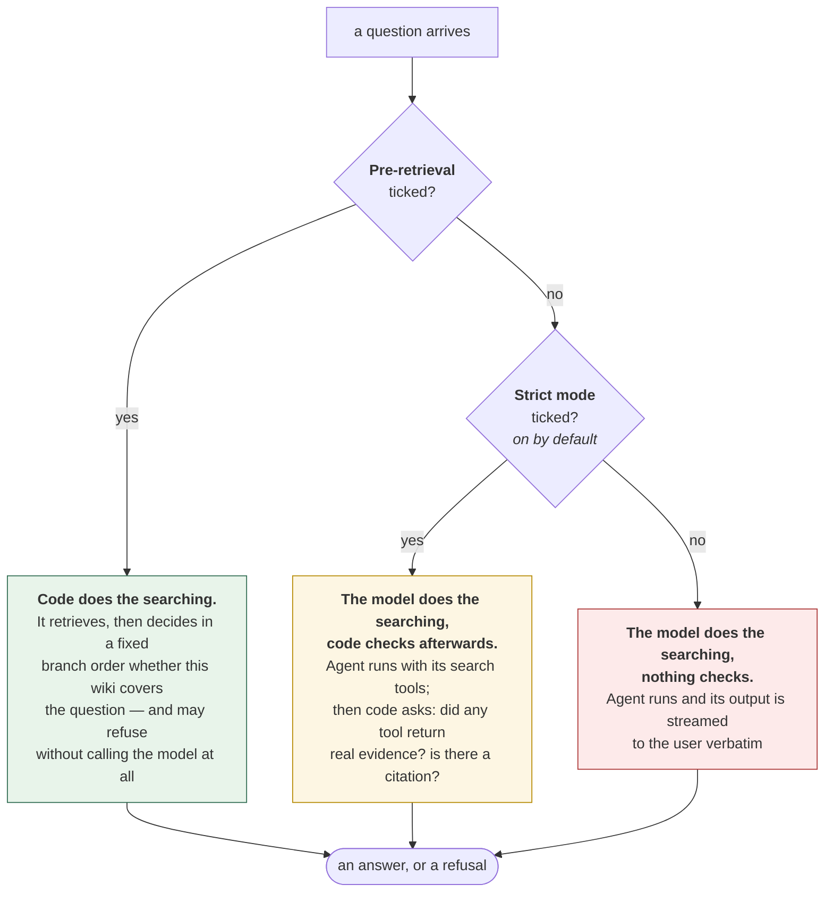
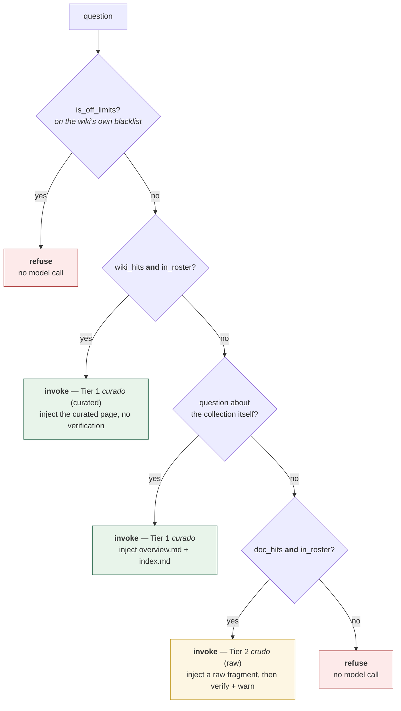
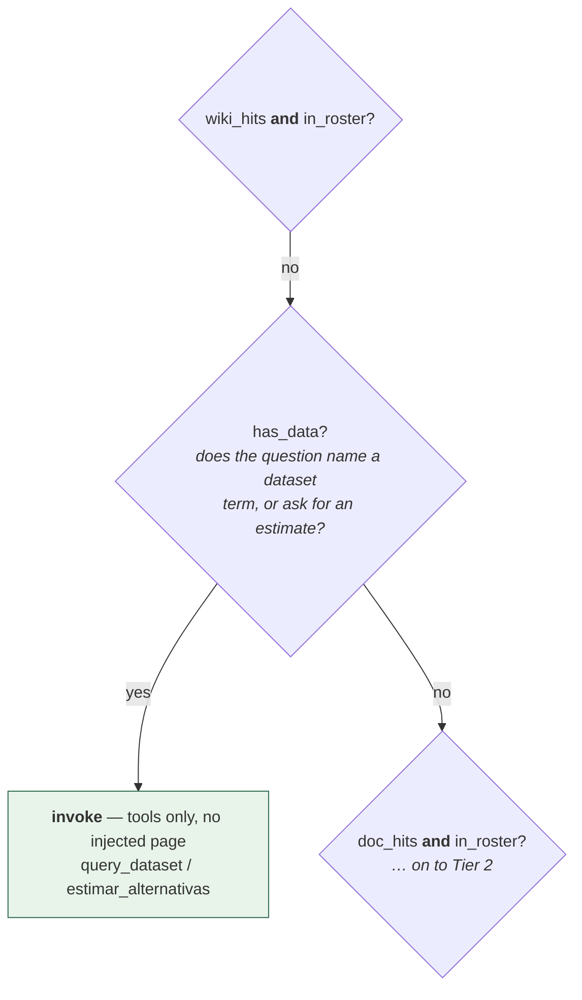
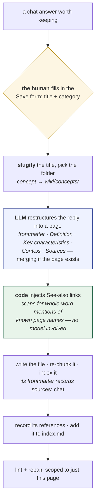

# Query Walkthrough

**Read [`ingestion_walkthrough.md`](ingestion_walkthrough.md) first.** It
explains what a workspace is, how a wiki gets built out of your documents, and
why a fragment of text is stored the way it is. This document assumes you have
read it, and picks up where it stops: the wiki exists — now somebody asks it
something.

**Audience.** Someone who writes software but has never seen this project. You
can read SQL and Python; nothing else is assumed. Terms from the world of LLMs —
*tool*, *system prompt*, *agentic*, *token* — are defined where they first
appear. What this document adds over the reference material is the *reasoning*:
why each decision was made, not just that it was.

**The numbers are real.** Every routing decision and every quoted answer below
was captured from an actual run, not written by hand. The full capture lives in
the generated [appendix](query_walkthrough_appendix.md); regenerate it any time
with:

```bash
uv run python scripts/capture_query_walkthrough.py
```

The authoritative contract for everything below is
[`.trellis/spec/backend/chat-retrieval.md`](../.trellis/spec/backend/chat-retrieval.md)
— prefer it over this document wherever the two seem to disagree.

## The question this document answers

The ingestion walkthrough ended on one idea: every document you add improves the
pages that were already there. The wiki gets more useful as it grows, not just
bigger.

Reading raises a different problem. The wiki is already built, somebody types a
question — and sooner or later they type one the wiki cannot answer. That is not
a defect. No wiki covers everything, and this one only knows what was ingested
into it. So the interesting question is not *can it answer?* but:

> **What do you want to happen when the wiki does not have the answer?**

The obvious answer — "it should say it does not know" — is exactly the thing a
language model is bad at. Asked something outside what it was shown, a model
will usually produce a fluent, confident, wrong answer instead of admitting the
gap. So *the model saying it does not know* cannot be the mechanism. Some code
has to check.

That turns the question into a narrower one: **when does that code get to
intervene?** There are exactly three answers — never, after the model has
finished, or before it is ever called — and this project can be configured for
any of them.

**Never.** Hand the model the search tools and trust it. (A *tool* is simply a
function the model is allowed to call — it asks for a search, the code runs it,
and the results come back into the conversation. [Part 1](#part-1--the-model-does-the-searching)
lists the three this project provides.) The model decides what to look for, when
it has seen enough, and what to say. This handles the widest range of questions
and gives you no guarantees at all.

**Afterwards.** Let the model work exactly as above, then have code examine the
finished conversation before the answer reaches the user. Two things are cheap
to check: did any tool actually return something, and does the answer name a
source? This still handles the same wide range of questions, and it catches the
case that matters most — a model that answered without looking anything up.

What it cannot catch is the answer being wrong. Both checks are about the
*procedure*, not the content: code can confirm that a search ran and that a page
is cited, but not that the cited page says what the answer claims. A model that
searched, got three fragments back, and then wrote a sentence none of them
support passes every check here.

**Before.** Have code do the searching, decide in advance whether this wiki
covers the question at all, and refuse — without ever calling the model — when it
does not. This gives you guarantees, and you pay for them by answering fewer
questions: one that mentions nothing the wiki knows about is turned away, even
when a search would have found something.

None of the three is a broken version of the others. Each is a real choice with a
real cost, and this document is arranged so you can disagree with me about which
one you want.

There is a fourth idea worth naming here, though it is not one of the three:
**numbers are the thing the model is least trusted with.** When a wiki carries
structured data — currency rates, interest rates, prices — a tool reads the
values straight out of the data files and returns them unchanged, and for the
investment advisory the whole comparison table is computed in Python and pasted
below the model's prose whether or not the model copied it correctly. The
model's job is to explain figures in words, not to arrive at them.

Two qualifications, so this is not oversold. First, it does not come free with
any of the three positions above: it applies to wikis that have a `datasets/`
folder, and `fairy-tales` — the wiki behind every transcript in Part 1 — has
none, so nothing of this appears until
[Part 2, Act 6](#6-deterministic-advisory). Second, what the code guarantees is
that the authoritative figures *reach* the user; that the model does not also
write an invented number into its own sentences is asked for in the system
prompt, not enforced.

## The two checkboxes

Those three positions are not an abstraction — they are two checkboxes in the
read app's chat panel, and it is worth seeing them before any transcript, because
almost everything below is a consequence of which one is set.



| | Who retrieves | What code guarantees | Where it is |
|---|---|---|---|
| **Pre-retrieval** ticked | code | the wiki's coverage decides whether the model is called at all | `preretrieval.pre_retrieval_answer` |
| **Strict mode** only *(the default)* | the model | an answer with no tool evidence behind it is replaced by a refusal; a missing citation is appended | `guardrail.enforce_grounding` + `postprocess.ensure_citation` |
| neither | the model | nothing | streamed straight from the agent |

One note on the labels. The checkbox reads, in full, "Strict mode: answer only
from wiki sources". Ticking **Pre-retrieval supersedes it**: its own flow is
already gated, so the after-the-fact check has nothing left to add. The default
is the middle row — `grounding_flag = {"strict": True, "pre_retrieval": False}` in
`marimo/read_app_tabs.py`, with the pre-retrieval box re-seeded per wiki from
that wiki's `wiki_config.toml`.

**The corpus follows the setting.** Part 1 runs on `examples/fairy-tales`, a wiki
of documents and nothing else, which ships with pre-retrieval **unticked**. Part
2 runs on `examples/finanzas-argentinas`, which keeps facts that expire in a
[`datasets/` folder](ingestion_walkthrough.md#wikis-whose-facts-change) and ships
with it **ticked**. That the two demos ship on different settings is the argument
of this document in miniature.

If you are building the ordinary kind of wiki, **Part 1 is the whole document for
you** — Part 2 describes a setting you have no reason to turn on, on a corpus you
do not have.

## How the appendix is generated

The appendix is deliberately generated in two passes, and the split matters
enough to explain before reading either half — because the two halves deserve
very different amounts of trust.

The **routing table** — `off_limits`, `data`, `roster`, the `wiki`/`docs` search
hit counts, and the resulting `plan` — is pure code: `scope.is_off_limits`,
`scope.mentions_known_data`, `scope.advisory_intent` and
`preretrieval.plan_retrieval`. No model runs to produce it. It is deterministic
and identical on every run, which is exactly what makes it the more useful of the
two halves for judging whether the system is correct: you can read it, compare it
across commits, and reproduce it for the cost of a SQLite query.
`scripts/capture_query_walkthrough.py --plan-only` captures *only* this half — no
model client is even constructed.

The **answers** need a live model, and vary in wording from run to run: different
phrasing, different ordering of a table's ties, occasionally a different sentence
structure. Read them for *behaviour* — does it cite? does it refuse? does it call
the tool it should? — never for exact prose. That is also why this document
quotes them rather than describing them from memory: the quotes are the only
honest way to show what a live run produced, short of pasting the whole appendix
or asserting something that might not survive the next regeneration.

There is one hybrid case, and it is flagged where it appears. The table in [What
the default configuration does to those same three
answers](#what-the-default-configuration-does-to-those-same-three-answers)
replays two deterministic functions over an already-captured conversation. It
needs no second model call and cannot drift from the app's behaviour, but it is
derived from one live run rather than being a live run of its own.

## Part 1 — the model does the searching

This is the mode a wiki of plain documents runs in.

First, a definition. An **agent** is a loop: the model is given a set of
functions it is allowed to call, it decides for itself which ones to call and
when, it reads what they return, and it keeps going until it is ready to answer.
The functions are called **tools**. Here the agent gets three of them:

| Tool | What it does |
|---|---|
| `read_wiki_page` | open one generated wiki page by path and return its text |
| `search_wiki_fts` | full-text search restricted to the curated wiki pages |
| `search_source_chunks` | full-text search over the raw ingested documents |

(A wiki with a `datasets/` folder gets a fourth, `query_dataset`; `fairy-tales`
has no such folder, so here it really is three.) Alongside them the model gets a
**system prompt** — standing instructions prepended to every conversation, which
the user never sees — telling it the order to use the tools in: the index first,
the curated wiki second, the raw sources only if the pages fall short. §6.7 of
[Workflows](manual/workflows.md) is the reference for it.

This arrangement is what people usually mean by **agentic**: the plan is not in
the code, it is in the model. Nothing in this project decides which tool gets
called for which question. That is the entire point, and the entire risk.

**What you gain is range.** Nothing has to decide in advance what the wiki
covers, because nothing does. The agent can answer a question about one page, or
about all of them, or about the collection as a whole — because it is holding a
search tool and can go and find out.

The `fairy-tales` demo suggests four questions to new users, and all four are of
that kind: *What tales are in this wiki?* · *Summarize the plot of each tale* ·
*What characters and themes do the tales share?* · *Compare how each story ends*.
Not one of them names a specific topic. All four are normal things to ask an
encyclopedia, and all four need an agent that is free to look around.

**What you lose is any guarantee.** The decision about what to search is made in
the system prompt, and a prompt is a *request*. The model may follow it or not.
The prompt asks, and asks firmly, but asking is all it can do.

### What the raw model does, with nothing checking it

Three of those suggested prompts were put to the live agent with **both boxes
unticked** — the bottom row of the table above, deliberately chosen to isolate
what the model does when no code is watching. The full transcripts are in the
[appendix](query_walkthrough_appendix.md#the-unticked-mode-answering-live-model);
what matters here is what the model chose to do.

**The range, demonstrated.** *What characters and themes do the tales share?* is
a question no single page in the wiki answers, and the agent went and built the
answer itself: three `search_wiki_fts` calls and eight `read_wiki_page` calls —
**eleven tool calls in one turn** — ending in a comparison of the stepmothers in
Cinderella and Snow White, with a citation on each claim. Nothing in the code
planned any of that.

**A citation simply missing.** *What tales are in this wiki?* took a single
`read_wiki_page` and produced a correct, complete inventory of three tales and
their concepts — **carrying no citation at all**, in a wiki whose system prompt
says citations are "mandatory, not optional" and that every factual statement
must carry one. The answer happens to be right; the point is that its being right
is not something the model established.

**And the failure no amount of checking catches, in the open.** *Compare how each
story ends* went seven calls deep, exhausted the curated pages, and fell through
to `search_source_chunks` three times. What came back:

> | Snow White | The wicked Queen is initially happy believing she is the
> fairest, but the Seven Dwarfs find Snow White dead on the floor, suggesting a
> tragic turn. | (Snow White and the Seven Dwarfs.pdf, p. 6) |

That is not how Snow White ends — it is the middle of the tale, before the prince
arrives. The citation is real and the page number is real; the passage it points
at simply is not the ending. This is the whole risk in one sentence: a raw
fragment retrieved for a question it does not answer, narrated confidently, and
**stamped with a citation that makes it look grounded**.

The same answer gets Cinderella right, citing the curated page
`wiki/summaries/cinderella.md`, and declines honestly on Little Red Riding
Hood — *"I couldn't find that in your wiki."* That mixture is what makes the Snow
White row instructive rather than merely wrong. The model is not being reckless,
and it is not incapable of saying no. It found something, and something is not
the same as the answer.

### What the default configuration does to those same three answers

The three transcripts above were captured with nothing checking the model. That
is not how the app ships: `Strict mode` is on by default, and it runs two
deterministic passes over the finished conversation before the user sees
anything. Both are pure functions of the run's own message history, so their
effect on these exact three answers can be worked out without asking the model
anything again — and the capture script now records it alongside each transcript.

**`guardrail.enforce_grounding`** asks one question: did *any* tool in this run
return something substantive — not empty, and not one of the tools' own
"nothing found" messages? If not, the answer is thrown away and replaced
wholesale with the refusal. As its own docstring puts it, a system prompt "can
ASK the model to answer only from the wiki, but it cannot GUARANTEE it."

**`postprocess.ensure_citation`** collects the sources the run *deliberately
used* — the wiki pages actually opened with `read_wiki_page`, the dataset files
actually queried — and appends a `Referencia:` (*reference*) line if the answer
does not already carry that attribution. Pages that merely turned up in a search are
excluded on purpose: searching is not the same as using.

Applied to the three runs above — these are the values the capture measured, not
a hand-derivation:

| | what the raw model produced | what `Strict mode` does to it |
|---|---|---|
| the inventory | correct, **no citation** | a tool returned real content, so the answer stands — and the page it opened is appended: **`Referencia: index.md`**. The failure is repaired. |
| the synthesis | 11 tool calls, cited inline | grounded, and it already names the pages it read. **Leaves it exactly as it is.** |
| Snow White | a mid-tale passage narrated as the ending, **with a real citation** | the searches returned real text, so `has_grounding` is true; the answer already names a page it read, so nothing is appended. **Leaves it exactly as it is.** |

The last row is worth pausing on, because it nearly went the other way. Nothing
is appended only because the model happened to cite
`wiki/summaries/cinderella.md` inline, in the *Cinderella* row of the same table
the wrong Snow White row sits in. Had it not, `ensure_citation` would have
attached a `Referencia:` line to an answer containing a false claim — dressing it
up rather than catching it. The check is about attribution, and attribution is
indifferent to whether the sentence above it is true.

That last row is the point of this whole section, and it is worth being blunt
about it: **the default configuration repairs the missing-citation failure and is
structurally blind to the wrong-answer failure.** This is not an oversight, it is
stated in the guardrail's source — *"this catches answers with NO grounding
evidence… It does not catch an answer that ignored a result it did retrieve; that
needs answer-vs-source verification."*

The two failures are different in kind. A missing citation is a defect in the
*shape* of an answer, and shape is exactly what code can check after the fact. A
passage retrieved for a question it does not answer is a defect in *meaning*, and
no amount of inspecting the run's structure will reveal it — the run looks
perfect. Something has to intervene earlier, or read the answer against its
source. That is Part 2.

For a wiki of fairy tales, this is still a fair trade. Nobody is harmed by a
misremembered ending, and the range of questions it handles is worth having. Part 2 is about what changes
when that stops being true.

### What ticking the box would cost here

The trade is not a matter of opinion, and it does not need a model to measure.
Running the same four suggested prompts through the pre-retrieval gate — pure
code, no LLM, free to reproduce — gives this:

| Question | wiki hits | in roster | collection | plan if ticked |
|---|---:|---|---:|---|
| What tales are in this wiki? | 6 | False | 2 | **invoke** |
| Summarize the plot of each tale | 6 | False | 2 | **invoke** |
| What characters and themes do the tales share? | 6 | False | 2 | **invoke** |
| Compare how each story ends | 6 | False | 2 | **invoke** |

Three of those columns need naming before the table means anything. **wiki hits**
is how many curated pages the full-text index returned for the question. **in
roster** is whether the question named something on the wiki's *coverage
roster* — the closed list of terms this wiki considers itself to cover, built
from the names of its own concept pages. **collection** counts the pages whose
job is to describe the whole wiki rather than one subject (`wiki/overview.md` and
`wiki/index.md`).

Read the `roster` column first: not one of these is covered, and not one ever
will be. A question about the collection names no concept — so no amount of
widening that list reaches them. That was measured before it was believed: adding
summary titles and source filenames leaves all four exactly as uncovered.

What answers them is the last column. `overview.md` and `index.md` exist to
describe the whole collection, and a question shaped like these gets them
injected directly. Until that branch existed, **all four refused** — the four
questions this demo puts in front of every new reader.

That is worth stating as a general lesson rather than a fixed bug: a coverage
gate is only as good as the thing it is built from, and a roster built out of
*subjects* is structurally unable to recognise a question about the *collection*.
The fix was not a wider roster, it was a separate branch. The cost of ticking the
box used to include every question about the collection; it no longer does. What
it still costs is a question about a subject the wiki does not cover — which is
precisely the refusal the setting exists to produce.

The table regenerates with
`uv run python scripts/capture_query_walkthrough.py --plan-only`, which prints
rather than writes.

### What Part 1 does not show

**Three questions is not a sample.** The failures above — a missing citation and
a mid-tale paragraph offered as an ending — are what one run produced, not a
rate. Run it again and the model may cite the inventory and get the ending right;
that is exactly the property being described. A mode whose guarantees come from a
prompt behaves differently from turn to turn, so the honest claim is *this can
happen and here it did*, not *this happens N% of the time*.

**The strict-mode column is derived, not separately captured.** The table in the
previous section replays two pure functions over the recorded run; it is exact
about what those functions return, but it is not a second live conversation. A
run where the model behaved differently would have to be re-measured.

**And nothing here is a verdict on the model.** A stronger one would fail less
often. It would still fail without warning, which is the part that does not go
away by upgrading — and the Snow White row is the shape of failure that survives
both a better model and a stricter checkbox.

## Part 2 — code does the searching

Everything from here on runs on `examples/finanzas-argentinas`, with the
pre-retrieval box **ticked**. The reason that wiki makes the opposite choice is
the subject of the rest of this document.

Start with what changes about the failure Part 1 ended on. A badly sourced
sentence about a glass slipper costs nothing. A badly sourced sentence about what
a financial instrument pays, or whether an investment is safe, costs something
real.

And it is the *same* failure. A loosely related passage, dressed up as a
confident answer with a genuine-looking citation, is exactly what neither the
plain agent nor the after-the-fact check can catch — and exactly what does damage
here. When the consequences change like that, "the prompt asks the model to
search" stops being good enough. The request has to become a rule the code
enforces.

**A note on the language.** This demo is an Argentine finance wiki, so its pages,
its questions and its answers are in Spanish, and they are quoted below exactly
as captured — they are evidence, and translating them would make them something
else. Every Spanish term is glossed in parentheses the first time it appears.

### The routing decision, in shape

`preretrieval.plan_retrieval` is an `if`/`elif` chain checked in a fixed order,
and the order itself is the design decision (§3 of the
[contract](../.trellis/spec/backend/chat-retrieval.md)). In a wiki built out of
documents alone — no `datasets/` folder — it has five branches:



The two tiers are named in Spanish in the code: **Tier 1 *curado*** means
*curated* — answering from a generated wiki page, the trusted layer — and **Tier
2 *crudo*** means *raw* — falling back to a fragment of an original source
document, which is why only that tier gets verified afterwards and carries a
warning.

Two things about this chain are easy to miss when reading the code once.

**Two of the five outcomes never reach the model at all.** A refusal costs
nothing: no prompt, and no **completion** — the model's generated reply, which is
the part you pay for by the token. It is also byte-for-byte identical every time.

**Both tiers depend on `in_roster`, not on the number of search hits.** Keyword
search will happily return a hit for a topic the wiki does not cover, just
because it shares a word with one that it does. The roster, not the search
engine, decides what the wiki covers. The third act below shows this happening
for real, with numbers.

A wiki that also keeps facts that expire adds one more branch to this chain.
Where it goes, and why its position matters, is covered in [the second half of
this document](#wikis-whose-facts-change).

The [appendix's routing
table](query_walkthrough_appendix.md#the-routing-decision-deterministic--no-model-involved)
has one row per question below, with the real `off_limits`/`data`/`roster` values
and search hit counts that this diagram leaves out.

### Three acts every ticked wiki has

#### 1. A curated page answers

*"¿Qué es una **caución bursátil** y por qué se la considera de bajo riesgo?"*
— *what is a* caución bursátil *and why is it considered low-risk?* A **caución
bursátil** is a short-term secured loan made through the stock exchange: the
borrower pledges securities as collateral and the exchange guarantees settlement,
which is exactly why the question calls it low-risk.

The gate finds 6 wiki hits, the question is in the roster, so the plan is
`invoke (curado)` — Tier 1. The model was invoked, made **zero** tool calls, and
the answer closes with `Referencia: 12 Cauciones Bursátiles.docx`.

None of the searching was left to the model. The code had already found the
curated page and put its text into the prompt (`preretrieval.retrieve_wiki` →
`_INJECT_TEMPLATE`). The model's only job was to write prose using the text it
was handed, not to decide what to look for.

That is the whole point. Searching is not a tool the model can choose to skip,
so it cannot skip it by accident. The agent from Part 1 *could* have answered
this question correctly by calling `search_wiki_fts` itself — but "could" is the
weak word there, and this design removes it for the common case.

#### 2. In scope, but not covered

*"¿Qué es un ETF?"* — *what is an ETF?* A perfectly reasonable finance question
about an instrument this particular wiki has no page for.

`off_limits=False`, `data=False`, `roster=False`, and both `wiki` and `docs` hit
counts are **0**. The plan is `refuse`, and the model was **never invoked** — no
completion, no token spent. The `docs=0` is not "the search came back empty";
it's that the raw-source search never ran at all. Looking at
`preretrieval.pre_retrieval_answer`, `retrieve_source_chunks` is only called when
`wiki_hits` is empty **and** `in_roster` is true — and here `in_roster` is false,
so the raw-source lookup is skipped outright. There is no tangential source
fragment sitting around for a leaky prompt to dress up as a general-knowledge
answer, because the code never went looking for one.

This is the fix for what the contract calls the **CEDEARs leak** (§3). CEDEARs
are Argentine certificates representing shares in foreign companies; the wiki has
pages about them, and a question about some *other* instrument would share enough
vocabulary with those pages to score a lexical hit. That tangential match used to
be enough to smuggle the model's general knowledge past the wiki-only
instruction — the answer looked sourced, and was not. Gating Tier 2 on the
roster rather than on the hit count closes that path before the model ever sees
the question.

#### 3. Off topic

*"¿Cuál es la capital de Francia?"* — *what is the capital of France?*

The most instructive row in the whole appendix, and the one that most directly
earns the thesis: `off_limits=False`, `data=False`, `roster=False` — but
`wiki=6`. The full-text query genuinely matched 6 fragments in the curated wiki
(some word shared between the question and unrelated financial prose). If the
plan were driven by the hit count alone, this would be Tier 1: inject those 6
fragments and let the model try to answer a geography question out of financial
context. It isn't, because `wiki_hits and in_roster` requires *both*, and
`in_roster` is false — nothing about *Francia* is on the coverage roster. The
plan falls through every branch to `refuse`, and the model is never invoked. The
answer is the same fixed string as Act 2, `"Eso no está en mi base de
conocimiento."` (*that isn't in my knowledge base*), produced
without a completion call, identical on every run — a property no
prompt-based "please refuse off-topic questions" instruction can offer, because
a prompt is a request the model may or may not honour, while this refusal is a
branch the model never reaches.

### Wikis whose facts change

**Everything above this line applies to any wiki.** What follows needs a
`datasets/` folder, and the sibling document explains why such a wiki keeps its
volatile facts [outside the compiled
pages](ingestion_walkthrough.md#wikis-whose-facts-change) instead of in them.

The consequence for retrieval is one more branch in the chain, inserted between
the two tiers:



Its position is the decision worth arguing about. `has_data` is checked
**before** the raw-document fallback, not after: a question naming a dataset
term should reach `query_dataset` for the live figure, rather than be answered
out of a raw chunk that happens to mention the same term in prose. A stale
sentence about the dollar is not a worse answer than the current rate — it is a
different kind of claim altogether, and the chain refuses to substitute one for
the other.

`has_data` is also what widens the coverage roster: in a wiki with datasets the
roster is the union of the dataset vocabulary and the concept-page names, so the
gate in the first half of this document admits questions the pages alone would
not cover.

#### 4. A datum, with its date

*"¿A cuánto está el **dólar MEP**?"* — *what is the* dólar MEP *trading at?*
Argentina has several legal exchange rates at once; the **MEP** (*Mercado
Electrónico de Pagos*) is the one obtained by buying a bond in pesos and selling
it for dollars, and it moves daily.

Same gate outcome as Act 1 — 6 wiki hits, in roster, `invoke (curado)` — and yet
the model **still called `query_dataset`**. The answer: *"El dólar MEP tiene una
cotización de compra de 1180.0 ARS y una cotización de venta de 1185.0 ARS, según
los datos del 25 de junio de 2026."* (*the MEP dollar has a buy quote of 1180.0
and a sell quote of 1185.0 Argentine pesos, per the data of 25 June 2026*),
followed by `Fuente: ambito.com` (*source* — where the figure originally came
from) and `Referencia: dolar.md` (the file inside the wiki it was read out of).

This act is worth studying closely, because it is easy to assume that injecting a
Tier-1 page *replaces* the tools. It does not. A curated page can explain what
the MEP dollar *is*; it cannot tell you what it is *worth today*,
because that number changes and a wiki page is fixed text written in the past.

So the system prompt keeps `query_dataset` available even when a curated page has
been injected, and the model reaches for it because the question asks for a
current figure. The two combine in a single answer: encyclopedia prose plus a
live number, each with its own citation. The two labels mean different things:

- **`Referencia:`** names the file *inside* this workspace — the curated page, or
  the dataset file the number was read from.
- **`Fuente:`** names where the number came from *outside* — here, `ambito.com`.

See [§2 of the contract](../.trellis/spec/backend/chat-retrieval.md) for the
rule. `postprocess.ensure_citation` is what guarantees the second line appears
even when the model's own text forgets to mention `dolar.md` by name.

This answer is where the decision made on the ingestion side pays off. A dataset
is deliberately **never compiled into a wiki page**; it is read at question time,
exactly so that a figure stays quotable with the date it belongs
to, instead of being absorbed into fixed prose; see [Wikis whose facts
change](ingestion_walkthrough.md#wikis-whose-facts-change) for why that split is
drawn where it is. The cost of that decision is one extra tool call at query time.
This is what it buys.

#### 5. An alias reaches the datum

*"¿A cuánto está el **billete verde**?"* — literally *how much is the green note
worth?*, everyday Argentine slang for the US dollar, the way an English speaker
might say *greenback*. The question never uses the word *dólar* at all.

Here the gate looks different: **zero** wiki hits, but `data=True` because
"billete verde" is a whitelisted alias for the dollar vocabulary
(`scope.mentions_known_data` checks the alias list, not just the raw dataset
terms). With `wiki_hits` empty, `in_roster` true and `has_data` true,
`plan_retrieval` reaches the `has_data` branch before it ever looks at
`doc_hits` — even though the code *did* retrieve 2 raw-document hits behind the
scenes (`retrieve_source_chunks` runs whenever `wiki_hits` is empty and
`in_roster` is true, so that candidates are ready if the later branch needs
them). Those 2 hits are simply never used: reaching the `has_data` branch first
ends the chain, exactly as §3 of the contract specifies, so the question goes to
`query_dataset` instead of being answered out of a raw document fragment.

The model made **three** `query_dataset` calls and returned quotes for the MEP
and the **CCL** (*contado con liquidación*, another of Argentina's parallel
exchange rates, the one used to move money abroad) plus an honest *"No se
encontraron datos para el dólar oficial."* (*no data found for the official
dollar*), all closing with `Referencia: dolar.md`.

The alias itself is not invented at query time — it is looked up. The
vocabulary that makes "billete verde" resolve was built during ingestion, by
the same mechanism that produced `"Cinderella" = ["Cinderwench"]` in the
[ingestion walkthrough, Act 1](ingestion_walkthrough.md#act-1--one-document-lands-in-an-empty-wiki):
a generated-alias pass that runs once, at ingest time, so the retrieval
layer never has to guess a nickname on the fly. This is the same argument as
that document's alternate-name file, seen from the other side of the pipeline:
work done once at ingest time is work the query path never has to redo.

#### 6. Deterministic advisory

*"Tengo $1.000.000 que no necesito por 3 meses, ¿qué alternativas tengo y cuánto
ganaría?"* — *I have one million pesos I don't need for 3 months; what are my
options and how much would I earn?*

No instrument is named, so `mentions_known_data` alone would not route this
anywhere — `scope.advisory_intent` is what recognizes the *shape* of the question
(a cue that advice is being sought, plus an amount or a time horizon) and sets
`has_data=True` with no named term at all. `in_roster` is `False` (nothing in the
question names a covered term), `wiki_hits` is 1, so the plan again lands on
`invoke` with no tier: tools only.

The model called `estimar_alternativas` (*estimate alternatives*) once. Its
return is a ranked markdown table computed entirely in Python — the top row:
`plazo_fijo` (a *fixed-term deposit*, the ordinary bank time deposit), Banco
Credicoop, 90 days, **TEA** 41.84%, estimated gain $90,000, as of 2026-06-25,
source `bcra.gob.ar`. **TEA** is *tasa efectiva anual* — the effective annual
rate, the annualised return once compounding is taken into account, which is the
figure Argentine banks are required to publish so that deposits can be compared
like for like.

The model's job is to narrate that table, not to compute a single number in it.
`postprocess.answer_with_table` appends the tool's verbatim return below the
model's prose regardless of whether the model reproduced it faithfully, so the
numbers a user sees are never trusted to model arithmetic even in the worst case.

**One measurement error worth being honest about.** The appendix records
`carries a citation: False` for this act. The answer *is* cited — every row
of the table ends in a `fuente` column, exactly as the system prompt
specifies — but the trace's `_looks_cited` heuristic
(`chat/trace.py:_looks_cited`) only recognizes a citation by looking for one
of a fixed set of file-extension markers (`.md`, `.docx`, `.doc`, `.pdf`,
`.txt`, `.csv`) anywhere in the text. A source cited as `bcra.gob.ar` in a
table cell matches none of them. That is a gap in what the *trace*
recognizes, not in what the *answer* does — the citation is there, in the
form the system prompt actually specifies (§2 of the contract lists the
`fuente` column explicitly as a valid citation carrier), and this document
would rather show the false negative than quietly drop the flag.

#### 7. The honest limit

*"¿Cuánto ganaría con acciones de YPF?"* — *how much would I earn on YPF shares?*
YPF is Argentina's largest energy company and a heavily traded local stock.

Same `invoke (curado)` plan as Acts 1 and 4 — 6 wiki hits, in roster — and again
**zero** tool calls. The answer: *"No es posible estimar cuánto ganarías con
acciones de YPF, ya que las acciones son un instrumento de renta variable… su
ganancia no es predecible ni estimable de antemano."* (*it is not possible to
estimate what you would earn on YPF shares, since shares are a variable-income
instrument… their gain is neither predictable nor estimable in advance*), closing
with `Referencia: 01 Acciones Locales.docx`.

The useful contrast is with Act 6. Both questions ask for advice, but this one
names one specific instrument whose return varies, instead of asking for a
general ranking. The curated page about shares says plainly that returns cannot
be estimated, and the model passes that limitation on rather than refusing
outright or inventing a number.

So the system can tell the difference between "I can calculate this"
(fixed-income instruments, Act 6) and "this cannot be calculated" (shares, here)
— and it says the second one out loud, instead of quietly declining, or guessing.

### What Part 2 does not show

**Checking a Tier-2 answer against its source.** When the plan is Tier 2 (a raw
document fragment), `plan_retrieval` marks it `verify=True`, and
`pre_retrieval_answer` then calls `overlap.is_supported` on the result before
returning it. That check compares the words of the answer against the words of
the fragment it was given, and substitutes the refusal if the answer does not
actually draw on it.

None of the seven acts above reached that path. Every question here ended in
Tier 1, in tools-only, or in a refusal, before Tier 2 was ever considered. The
mechanism exists and is covered by `test_chat_retrieval_plan.py` and
`test_chat_pre_retrieval_answer.py` (both cited in the
[contract](../.trellis/spec/backend/chat-retrieval.md)) — but this walkthrough is
built from real questions put to a real demo, not from constructed ones, and it
would be dishonest to describe a case that was never actually observed.

## The loop closes: an answer can become a page

There is one more thing, and neither Part shows it because it happens after the
answer. Without it you would leave thinking that ingestion is the only thing that
ever writes to the wiki.

Under the chat there is a **Save** form. When an answer is worth keeping — the
comparison across three tales in Part 1 is exactly the kind, since no single page
contained it — you give it a title, choose `concept` or `summary`, and save it.
The wiki gains a page that no source document ever held.



The most important box is the first one. **The agent has no write tool.** Look
at what it is handed (`agent.py`): `read_wiki_page`, `search_wiki_fts`,
`search_source_chunks`, and in a datasets wiki `query_dataset` — every one of
them read-only. The model can suggest that an answer is worth saving and propose
a title, but it cannot save anything. `save_to_wiki` is called from the marimo
form, by a person who clicked a button, and never from inside a model's turn.

A page saved this way is also marked as such: `create_page` is called with
`sources=["chat"]`, so its front-matter says where it came from. A page derived
from a document names that document; a page that came out of a conversation says
`chat`, and nothing later mistakes one for the other.

That is a deliberate asymmetry, and it is the honest answer to an obvious worry
about a system that writes its own encyclopedia. Ingestion writes autonomously —
you pointed it at a folder, that was the consent. Everything the *chat* adds to
the wiki passes through a human first. The safety property is not "the agent is
read-only" — it isn't, in the ingestion path — it is that the two write paths
have different authorisations, and every page in either is a git commit you can
read and revert.

## What this adds to the original idea

The [ingestion walkthrough
opened](ingestion_walkthrough.md#where-the-idea-comes-from) with the proposal in
Karpathy's note: stop re-deriving knowledge from raw fragments on every question,
and have an LLM maintain a persistent encyclopedia instead. Having now watched
both halves run, here is what this implementation actually contributes — and
where it falls short of what the note asked for.

**What it demonstrates that the idea only asserts.** The claim that a wiki
*compounds* is easy to state and easy to fake. Act 2 of the ingestion walkthrough
measures it: ingesting a second document took the corpus from 15 to 25
`links_to` edges — more than the new pages alone account for, because the repair
pass also went back and connected pages that were already there. Nobody asked it
to. The claim that answering from compiled pages
beats answering from raw fragments is likewise measurable, and Part 1 of this
document shows the failure it is supposed to prevent actually happening — a raw
fragment from the middle of Snow White, narrated as the ending, correctly cited.

**What it adds beyond the note.** Three things, in rough order of how much they
change the character of the system:

1. **A deterministic coverage gate.** Karpathy's wiki answers; it has no notion
   of declining. Pre-retrieval makes "I don't cover this" a branch in Python that
   never reaches the model, so the refusal is identical on every run and costs
   nothing. Whether you *want* that is the argument this document has been
   staging — but the option does not exist in the original.
2. **Automatic repair, not just linting.** The note proposes a lint pass that
   *flags* problems. Here lint flags and repair fixes the ones fixable without
   guessing, reporting every skip with its reason — and refusing to invent prose
   when no model was authorised.
3. **A second input class for facts that expire.** Nothing in the original
   distinguishes a definition from an exchange rate. `datasets/` exists because
   compiling a number into prose destroys the one property that made it useful:
   its date.

**Where it is honestly behind.** The note asks for "proper search" — hybrid
keyword-plus-vector retrieval with LLM re-ranking. This has keyword search only,
no embeddings, and the [ingestion
walkthrough](ingestion_walkthrough.md#what-is-truth-and-what-is-disposable)
spells out what that costs: a page phrased in different words is not merely
ranked low, it is invisible. The vocabulary and alias machinery are compensations
for that gap, not a replacement for it. Ingestion is also automatic rather than
the guided conversation the note describes — you drop a file and pages appear,
where Karpathy imagined discussing a document with the model before it wrote
anything; the save-to-wiki flow above only partly makes up for it. And image
handling, web search and alternate outputs are simply not built.

§1 of the [Programmer Manual](programmer_manual.md#karpathy-coverage-matrix)
takes all fifteen ideas from the note one at a time and marks each one done,
partly done, deferred or not applicable, with a pointer to the reasoning behind
every mark. If you want the scorecard rather than the argument, read that.

**The one-sentence version.** Karpathy's idea is that a knowledge base should
*remember* the work it has already done. What this project adds is that it should
also *know what it does not know* — and be able to prove which of the two it is
doing, on any given question, without asking a model to be honest about it.

## Verify it yourself

- `uv run python scripts/capture_query_walkthrough.py` re-runs all seven
  questions through the real gate and the real model and regenerates
  [`docs/query_walkthrough_appendix.md`](query_walkthrough_appendix.md).
- `uv run python scripts/capture_query_walkthrough.py --plan-only`
  reproduces both deterministic tables — the routing decision for Part 2's
  seven questions, and Part 1's "what ticking the box would cost here" — with
  no LLM client constructed and no cost. It **prints** rather than writing,
  so running it casually cannot overwrite the captured answers. This is the
  cheapest way to check that a routing decision is what this document says.

## Where to go next

You have now seen both halves: how the wiki is built, and what happens when it is
asked something. If you read only one more thing, make it the coverage matrix in
§1 of the [Programmer Manual](programmer_manual.md#karpathy-coverage-matrix) —
it is the honest scorecard behind the previous section.

Otherwise:

- [`.trellis/spec/backend/chat-retrieval.md`](../.trellis/spec/backend/chat-retrieval.md)
  — the current, authoritative contract for the plan order, the roster gate and
  the citation format. Prefer it over this document's prose wherever they seem to
  disagree.
- [Workflows](manual/workflows.md) §6.7 — the per-operation reference for the
  agentic mode of Part 1: the tool inventory, the prompt-driven routing order,
  and what each phase is for.
- [`preguntas_frecuentes.md`](preguntas_frecuentes.md) — the questions people
  actually ask about this project, including "isn't this just RAG?" and "isn't
  this just Karpathy's wiki?", answered at more length than either walkthrough
  has room for.
- [`docs/ingestion_walkthrough.md`](ingestion_walkthrough.md) — the sibling
  document, if you skipped it. Act 5 above is the natural bridge: the alias it
  resolves is built by the same ingest-time mechanism that document's Act 1 shows
  being written.
