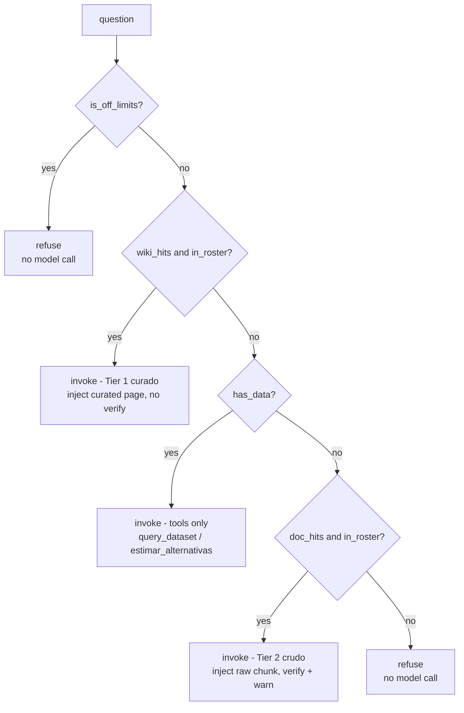

# Query Walkthrough

> Part of the [LLMWiki Programmer Manual](programmer_manual.md). The
> authoritative contract for everything below is
> [`.trellis/spec/backend/chat-retrieval.md`](../.trellis/spec/backend/chat-retrieval.md)
> — prefer it over this document whenever the two seem to disagree. §6.7 of
> [Workflows](manual/workflows.md) documents a *different*, older chat path
> (see [What this does not cover](#what-this-does-not-cover)). This document
> is the sibling of [`ingestion_walkthrough.md`](ingestion_walkthrough.md):
> that one follows what ingestion **builds**; this one follows what a query
> **does**.

**Audience.** Written for someone evaluating the engineering, not learning to
operate the app. You can already read a schema and a function name; what this
document adds is the *reasoning* — why each decision was made, not just that
it was. Every act below links into
[`.trellis/spec/backend/chat-retrieval.md`](../.trellis/spec/backend/chat-retrieval.md)
for the authoritative contract instead of restating it.

**The corpus.** Everything here runs against the pre-ingested
`examples/finanzas-argentinas` demo — the same wiki the
[ingestion walkthrough](ingestion_walkthrough.md)'s coda uses to show the
`datasets/` half of the vocabulary subsystem. The fairy-tale corpus that
carries the rest of that document can't carry this one: five of the seven
acts below (a datum with its date, an alias resolving, a deterministic
advisory table, an "not estimable" refusal, a roster refusal) only exist
because this wiki has a `datasets/` folder and a finance domain overlay.

**The numbers are real.** Every routing decision and every quoted answer
below was captured from an actual run, not written by hand. The full capture
lives in the generated
[appendix](query_walkthrough_appendix.md); regenerate it any time with:

```bash
uv run python scripts/capture_query_walkthrough.py
```

## The thesis

The ingestion walkthrough's thesis was that the wiki compounds. This one is
narrower and, for this audience, more load-bearing:

> **The interesting engineering is in what the system declines to do — and
> the decision is made by code, before the model is consulted, and often
> instead of consulting it.**

Every act below is in service of that claim. Routing is deterministic and
free. Refusals cost nothing — no prompt, no completion, no token. Numbers
that end up in an answer were never produced by the model; they were
computed in Python and only *narrated* by it.

## The two halves

The appendix is deliberately generated in two passes, and the split matters
enough to explain before reading either half.

The **routing table** — `off_limits`, `data`, `roster`, the `wiki`/`docs` FTS
hit counts, and the resulting `plan` — is pure code:
`scope.is_off_limits`, `scope.mentions_known_data`, `scope.advisory_intent`,
and `preretrieval.plan_retrieval`. No LLM runs to produce it. It is
deterministic and identical on every run, which is exactly why it is the
more informative artifact of the two for someone judging correctness: you
can inspect it, diff it across commits, and reproduce it for the cost of a
SQLite query. `scripts/capture_query_walkthrough.py --plan-only` captures
*only* this half — no LLM client is even constructed.

The **answers** need a live model and vary in wording from run to run —
different phrasing, different ordering of a table's ties, occasionally a
different sentence structure. Read them for *behavior* (does it cite? does
it refuse? does it call the tool it should?), never for exact prose. That is
also why this document quotes them rather than describing them from memory:
the quotes are the only honest way to show what a live run produced without
either pasting the whole appendix or asserting something that might not
survive the next regeneration.

## The routing decision, in shape

`preretrieval.plan_retrieval` is a five-branch `if`/`elif` chain, checked in
this fixed order — reproduced here as a diagram because the order itself is
the design decision (§3 of the [contract](../.trellis/spec/backend/chat-retrieval.md)):



Two things about this order are easy to miss reading the code once and worth
stating plainly. First, `has_data` is checked **before** the raw-doc
fallback (Tier 2), not after: a question that names a dataset term should
reach `query_dataset` for the live figure, not get answered from a raw
document chunk that happens to mention the same term in prose. Second, both
Tier 1 and Tier 2 are gated on `in_roster` — the coverage roster built from
the dataset vocabulary *and* the wiki's own concept-page names — not on the
FTS hit count alone. Lexical search can return a hit for an uncovered topic
that merely shares a word with a covered one; the roster, not the search
engine, is the authority on what the wiki actually covers. (Act 7 below
shows this happening for real, with numbers.)

The [appendix's routing table](query_walkthrough_appendix.md#the-routing-decision-deterministic--no-model-involved)
has one row per question below, with the actual `off_limits`/`data`/`roster`
values and FTS hit counts this diagram abstracts away.

## The seven acts

### 1. A curated page answers

*"¿Qué es una caución bursátil y por qué se la considera de bajo riesgo?"*

The gate finds 6 wiki hits, the question is in the roster, so the plan is
`invoke (curado)` — Tier 1. The model was invoked, made **zero** tool calls,
and the answer closes with `Referencia: 12 Cauciones Bursátiles.docx`.

Nothing here is delegated to the model. The code already found the curated
page and injected its text into the prompt (`preretrieval.retrieve_wiki` →
`_INJECT_TEMPLATE`); the model's only job was to write prose over context it
was handed, not to go decide what to search for. That is the point: because
retrieval isn't a tool the model can choose to skip, it can't accidentally
skip it. A prompt-driven agent (§6.7, see below) *could* answer this
correctly by calling `search_wiki_fts` itself — but "could" is doing a lot of
work in that sentence, and this design removes the "could" entirely for the
common case.

### 2. A datum, with its date

*"¿A cuánto está el dólar MEP?"*

Same gate outcome as Act 1 — 6 wiki hits, in roster, `invoke (curado)` — and
yet the model **still called `query_dataset`**. The answer: "El dólar MEP
tiene una cotización de compra de 1180 ARS y una cotización de venta de 1185
ARS, según los datos del 25 de junio de 2026," followed by `Fuente:
ambito.com` and `Referencia: dolar.md`.

This is the act worth dwelling on, because it is easy to assume Tier-1
injection *replaces* the tool layer — it doesn't. Curated prose can explain
what the MEP dollar *is*; it cannot tell you what it is *worth today*,
because that number changes and a wiki page is derived, static text. The
system prompt still leaves `query_dataset` available even on a curated-page
plan, and the model reaches for it because the question asks for a live
figure. The two compose in one answer: encyclopedia prose plus a live
number, each carrying its own citation (`Referencia:` for the internal
artifact — the curated page or the dataset file; `Fuente:` for the datum's
external origin — see the [contract, §2](../.trellis/spec/backend/chat-retrieval.md)).
`postprocess.ensure_citation` is what guarantees the second line survives
even if the model's own prose forgets to mention `dolar.md` by name.

This answer is where the ingestion side's design decision gets paid back. A
dataset is deliberately **never compiled into a wiki page** — it is read at
question time, precisely so a figure stays quotable with the date it belongs
to instead of being laundered into static prose; see [Two kinds of
input](ingestion_walkthrough.md#the-mental-model) for why that split is drawn
where it is. The cost of that decision is one extra tool call at query time.
This is what it buys.

### 3. An alias reaches the datum

*"¿A cuánto está el billete verde?"*

Here the gate looks different: **zero** wiki hits, but `data=True` because
"billete verde" is a whitelisted alias for the dollar vocabulary
(`scope.mentions_known_data` checked against the alias list, not just the
raw dataset terms). With `wiki_hits` empty, `in_roster` true, and `has_data`
true, `plan_retrieval` reaches the `has_data` branch before it ever looks at
`doc_hits` — even though the code *did* retrieve 2 raw-doc hits behind the
scenes (`retrieve_source_chunks` runs whenever `wiki_hits` is empty and
`in_roster` is true, to have candidates ready for the `elif`). Those 2 hits
are simply never used: `has_data` short-circuits the chain first, exactly as
§3 of the contract specifies, so the question reaches `query_dataset`
instead of being answered from a raw document chunk. The model made **three**
`query_dataset` calls and returned MEP and CCL quotes plus an honest "No se
encontraron datos para el dólar oficial en este momento," all closing with
`Referencia: dolar.md`.

The alias itself is not invented at query time — it is looked up. The
vocabulary that makes "billete verde" resolve was built during ingestion, by
the same mechanism that produced `"Cinderella" = ["Cinderwench"]` in the
[ingestion walkthrough, Act 1](ingestion_walkthrough.md#act-1--one-document-lands-in-an-empty-wiki):
a generated-alias pass that runs once, at ingest time, so the retrieval
layer never has to guess a nickname on the fly. This is the same argument as
that document's alias artifact, paid off on the other side of the pipeline:
work done once at ingest time is work the query path never has to redo.

### 4. Deterministic advisory

*"Tengo $1.000.000 que no necesito por 3 meses, ¿qué alternativas tengo y
cuánto ganaría?"*

No instrument is named, so `mentions_known_data` alone would not route this
anywhere — `scope.advisory_intent` is what recognizes the shape (an advisory
cue plus an amount or a horizon) and sets `has_data=True` without a named
term. `in_roster` is `False` (nothing in the question names a covered term),
`wiki_hits` is 1, so the plan again lands on `invoke` with no tier: tools
only. The model called `estimar_alternativas` once; its return is a ranked
markdown table computed entirely in Python — the top row: `plazo_fijo`,
Banco Credicoop, 90 días, TEA 41.84%, ganancia estimada $90,000, al
2026-06-25, fuente `bcra.gob.ar`. The model's job is to narrate that table,
not to compute a single number in it — `postprocess.answer_with_table`
appends the tool's verbatim return below the model's prose regardless of
whether the model reproduced it faithfully, so the numbers a user sees are
never trusted to model arithmetic even in the worst case.

**One measurement artifact worth being honest about.** The appendix records
`carries a citation: False` for this act. The answer *is* cited — every row
of the table ends in a `fuente` column, exactly as the system prompt
specifies — but the trace's `_looks_cited` heuristic
(`chat/trace.py:_looks_cited`) only recognizes a citation by looking for one
of a fixed set of file-extension markers (`.md`, `.docx`, `.doc`, `.pdf`,
`.txt`, `.csv`) anywhere in the text. A source cited as `bcra.gob.ar` in a
table cell matches none of them. That is a gap in what the *trace*
recognizes, not in what the *answer* does — the citation is there, in the
form the system prompt actually specifies (§2 of the contract lists the
`fuente` column explicitly as a valid citation carrier), and this document
would rather show the false negative than quietly drop the flag.

### 5. The honest limit

*"¿Cuánto ganaría con acciones de YPF?"*

Same `invoke (curado)` plan as Acts 1 and 2 — 6 wiki hits, in roster — and
again **zero** tool calls. The answer: "No es posible estimar cuánto
ganarías con acciones de YPF, ya que las acciones son un instrumento de
renta variable... Las ganancias o pérdidas potenciales no son predecibles de
antemano," closing with `Referencia: 01 Acciones Locales.docx`.

The interesting contrast is with Act 4: both are advisory-shaped questions,
but this one names a specific, variable-return instrument instead of asking
for a generic ranking. The curated page for equities states plainly that
returns aren't estimable, and the model reports that limitation instead of
either refusing outright or fabricating a number. The system knows the
difference between "I can compute this" (fixed-income instruments, Act 4)
and "this is not computable" (equities, here) — and says the second one out
loud rather than silently declining to answer or, worse, guessing.

### 6. In scope, but not covered

*"¿Qué es un ETF?"*

`off_limits=False`, `data=False`, `roster=False`, and both `wiki` and `docs`
hit counts are **0**. The plan is `refuse`, and the model was **never
invoked** — no completion, no token spent. The `docs=0` is not "the search
came back empty"; it's that the raw-source search never ran at all. Looking
at `preretrieval.pre_retrieval_answer`, `retrieve_source_chunks` is only
called when `wiki_hits` is empty **and** `in_roster` is true — and here
`in_roster` is false, so the raw-source lookup is skipped outright. There is
no tangential source chunk sitting around for a leaky prompt to dress up as
a general-knowledge answer, because the code never went looking for one.
This is the fix for what the contract calls the CEDEARs leak (§3): a
tangential lexical match on an uncovered topic used to be enough to smuggle
general knowledge past the wiki-only instruction. Gating Tier 2 on the
roster, not the hit count, closes that path before the model ever sees the
question.

### 7. Off topic

*"¿Cuál es la capital de Francia?"*

The most instructive row in the whole appendix, and the one that most
directly earns the thesis: `off_limits=False`, `data=False`,
`roster=False` — but `wiki=6`. The FTS query genuinely matched 6 chunks in
the curated wiki (some shared word between the question and unrelated
financial prose). If the plan were driven by the hit count alone, this would
be Tier 1: inject those 6 chunks and let the model try to answer a geography
question from financial context. It isn't, because `wiki_hits and
in_roster` requires *both*, and `in_roster` is false — nothing about
"Francia" is in the coverage roster. The plan falls through every branch to
`refuse`, and the model is never invoked. The answer is the same fixed
string as Act 6, `"Eso no está en mi base de conocimiento."`, produced
without a completion call, identical on every run — a property no
prompt-based "please refuse off-topic questions" instruction can offer, because
a prompt is a request the model may or may not honour, while this refusal is a
branch the model never reaches.

## What this does not cover

**The agentic mode.** §6.7 of [Workflows](manual/workflows.md) documents a
different chat path, where the agent itself calls `read_wiki_page`,
`search_wiki_fts`, and `search_source_chunks` — "routing is prompt-driven,
not code-driven," in that document's own words. It is reachable today behind
a UI toggle, but it predates the pre-retrieval work described here, and this
document does not treat it as the current design; §6.7 is the place to read
about it, not this one.

**Tier-2 answer-vs-source verification.** `plan_retrieval` marks a Tier-2
(raw-doc) plan with `verify=True`, and `pre_retrieval_answer` calls
`overlap.is_supported` on the result before returning it — a lexical-overlap
check that substitutes the refusal if the answer doesn't actually draw on
the retrieved chunk. None of the seven acts above exercised that path: every
question here resolved to Tier 1, tools-only, or a refusal before Tier 2 was
ever reached. The mechanism exists and is covered by
`test_chat_retrieval_plan.py` and `test_chat_pre_retrieval_answer.py`
(cited in the [contract](../.trellis/spec/backend/chat-retrieval.md)), but
this walkthrough — built from real questions against a real demo, not a
constructed one — never happened to trigger it, and it would be dishonest to
narrate a case that wasn't actually observed.

## Verify it yourself

- `uv run python scripts/capture_query_walkthrough.py` re-runs all seven
  questions through the real gate and the real model and regenerates
  [`docs/query_walkthrough_appendix.md`](query_walkthrough_appendix.md).
- `uv run python scripts/capture_query_walkthrough.py --plan-only`
  reproduces the routing table alone — the deterministic half — with no LLM
  client constructed and no cost. Worth running on its own: it's the
  cheapest possible way to check that the routing decision for a given
  question is what this document claims it is, without spending anything on
  a completion.

## Where to go next

- [`.trellis/spec/backend/chat-retrieval.md`](../.trellis/spec/backend/chat-retrieval.md)
  — the current, authoritative contract for the plan order, the roster
  gate, and the citation format. Prefer it over this document's prose
  wherever they seem to disagree.
- [Workflows](manual/workflows.md) §6.7 — the older, prompt-driven agentic
  chat path, still reachable via a UI toggle but superseded in spirit by the
  pre-retrieval flow this document describes.
- [`docs/ingestion_walkthrough.md`](ingestion_walkthrough.md) — the sibling
  document. Act 3 above is the natural bridge: the alias it resolves is
  built by the same ingest-time mechanism that document's Act 1 shows being
  written.
