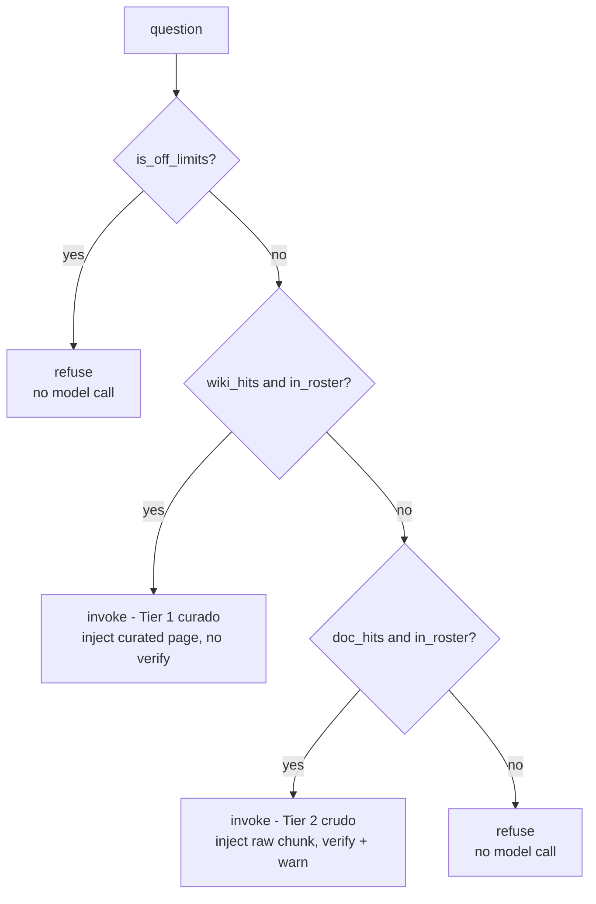
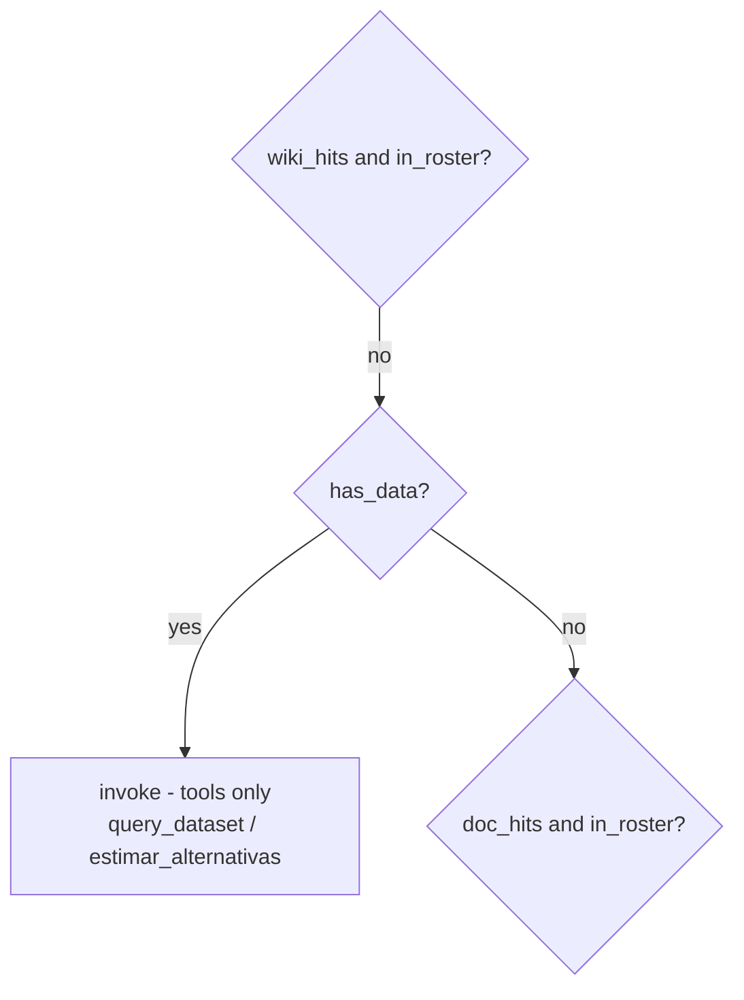

# Query Walkthrough

> Part of the [LLMWiki Programmer Manual](programmer_manual.md). The
> authoritative contract for everything below is
> [`.trellis/spec/backend/chat-retrieval.md`](../.trellis/spec/backend/chat-retrieval.md)
> — prefer it over this document whenever the two seem to disagree. §6.7 of
> [Workflows](manual/workflows.md) is the reference for the mode Part 1
> describes. This document is the sibling of
> [`ingestion_walkthrough.md`](ingestion_walkthrough.md):
> that one follows what ingestion **builds**; this one follows what a query
> **does**.

**Audience.** Written for someone evaluating the engineering, not learning to
operate the app. You can already read a schema and a function name; what this
document adds is the *reasoning* — why each decision was made, not just that
it was. Every act below links into
[`.trellis/spec/backend/chat-retrieval.md`](../.trellis/spec/backend/chat-retrieval.md)
for the authoritative contract instead of restating it.

**Two modes, and a checkbox between them.** The read app carries a
**Pre-retrieval** toggle, and it is not a performance switch — it decides *who
goes looking* for the evidence. Unticked, the model does: it holds search tools
and calls them as it sees fit. Ticked, code does: it retrieves before the model
is consulted, and can decline to consult it at all. Each half of this document
takes one setting, because they are not a basic and an advanced mode. They are
two different answers to the same question, and each pays for what it buys.

**The corpus follows the setting.** Part 1 runs on `examples/fairy-tales`, a wiki
of documents and nothing else, which ships with the box **unticked**. Part 2 runs
on `examples/finanzas-argentinas`, which keeps volatile facts in a
[`datasets/` folder](ingestion_walkthrough.md#wikis-whose-facts-change) and ships
with the box **ticked**. That the two demos ship on different settings is the
argument of this document in miniature.

If you are building the ordinary kind of wiki, **Part 1 is the whole document
for you** — Part 2 describes a setting you have no reason to turn on, on a
corpus you do not have.

**The numbers are real.** Every routing decision and every quoted answer
below was captured from an actual run, not written by hand. The full capture
lives in the generated
[appendix](query_walkthrough_appendix.md); regenerate it any time with:

```bash
uv run python scripts/capture_query_walkthrough.py
```

## The thesis

The ingestion walkthrough's thesis was that the wiki compounds. This one is
narrower, and it is a question rather than a claim:

> **What do you want to be true when the system does not know?**

There are two defensible answers. *Let it try anyway* — search, gather what
there is, and let a well-instructed model judge whether that is enough. Or
*make it stop* — decide in code, before any model is consulted, whether the
question is one this wiki covers, and refuse deterministically when it is not.

The first buys flexibility and pays for it in guarantees: a model that *can*
search can also skip searching, and can dress a tangential match up as an
answer. The second buys guarantees and pays for them in reach: it answers only
what it can recognise as covered, and a question that names nothing it knows is
turned away even when the search would have found something.

Neither is the crippled version of the other, and the walkthrough is arranged to
let you disagree with me about which you want. What is not negotiable in either
mode: a number that reaches an answer was never produced by the model. It was
computed in Python and only *narrated*.

## How the appendix is generated

The appendix is deliberately generated in two passes, and the split matters
enough to explain before reading either half.

The **routing table** — `off_limits`, `data`, `roster`, the `wiki`/`docs` FTS
hit counts, and the resulting `plan` — is pure code:
`scope.is_off_limits`, `scope.mentions_known_data`, `scope.advisory_intent`,
and `preretrieval.plan_retrieval`. No LLM runs to produce it. It is
deterministic and identical on every run, which is exactly why it is the
more informative artifact of the two for someone judging correctness: you
can inspect it, diff it across commits, and reproduce it for the cost of a
SQLite query. `scripts/capture_query_walkthrough.py --plan-only` captures
*only* this half — no LLM client is even constructed.

The **answers** — both modes, the agentic one first — need a live model and vary
in wording from run to run: different phrasing, different ordering of a table's
ties, occasionally a different sentence structure. Read them for *behavior* (does it cite? does
it refuse? does it call the tool it should?), never for exact prose. That is
also why this document quotes them rather than describing them from memory:
the quotes are the only honest way to show what a live run produced without
either pasting the whole appendix or asserting something that might not
survive the next regeneration.

## Part 1 — the box unticked: the model goes looking

This is what a wiki does out of the box, and what `master` does with no
`datasets/` folder anywhere in sight. The agent is handed three tools —
`read_wiki_page`, `search_wiki_fts`, `search_source_chunks` — and a system
prompt telling it the order to use them in: index first, curated wiki second,
raw sources only if the pages fall short. §6.7 of
[Workflows](manual/workflows.md) is the reference for it; this section is about
why you would leave it on.

**What it buys is reach.** Nothing decides in advance what the wiki covers, so
nothing has to. The agent can answer a question about one page, or about all of
them, or about the shape of the collection itself — because it is holding a
search tool and can go find out. The `fairy-tales` demo suggests four questions
to newcomers, and every one of them is that sort: *What tales are in this wiki?*
· *Summarize the plot of each tale* · *What characters and themes do the tales
share?* · *Compare how each story ends*. None names a particular concept. All
four are natural things to ask an encyclopedia, and all four need an agent free
to look around.

**What it costs is a guarantee.** Routing is prompt-driven — the instruction to
search is a *request*, and the model may or may not honour it. Nothing
structural prevents it answering from memory, or building a confident answer on
a paragraph that merely shares a word with the question. The system prompt asks,
and asks firmly, and asking is what it does.

Three of those suggested prompts were put to the live agent, and between them
they show both halves of the bargain. The full transcripts are in the
[appendix](query_walkthrough_appendix.md#the-unticked-mode-answering-live-model);
what matters here is what the model chose to do.

**Reach, demonstrated.** *What characters and themes do the tales share?* is a
question no page in the wiki answers, and the agent went and assembled it: three
`search_wiki_fts` calls and eight `read_wiki_page` calls, **eleven tool calls in
one turn**, ending in a comparison of stepmothers across Cinderella and Snow
White with a citation on each claim. Nothing in the code planned that. Ticking
the box would have refused the question outright.

**The guarantee, absent.** *What tales are in this wiki?* took a single
`read_wiki_page` and produced a correct, complete inventory of three tales and
their concepts — **carrying no citation at all**, in a wiki whose system prompt
says citations are "mandatory, not optional" and that every factual statement
must carry one. The instruction was ignored and nothing noticed. The answer
happens to be right; the point is that its being right is not something the
system established.

**And the failure the second mode exists to prevent, in the open.** *Compare how
each story ends* went seven calls deep, exhausted the curated pages, and fell
through to `search_source_chunks` three times. What came back:

> **Snow White**: The ending involves the Queen consulting her magic mirror,
> which tells her she is the fairest of all. However, the Seven Dwarfs find Snow
> White dead on the floor, suggesting a tragic turn before any resolution
> (Snow White and the Seven Dwarfs.pdf, p. 6).

That is not how Snow White ends — it is the middle of the tale, before the
prince arrives. The citation is real and the page number is real; the passage it
points at simply is not the ending. This is the whole risk in one sentence: a
raw fragment retrieved for a question it does not answer, narrated confidently,
and **stamped with a citation that makes it look grounded**. The same answer
also declines honestly on Little Red Riding Hood — "I couldn't find specific
details" — which is what makes the Snow White paragraph instructive rather than
merely wrong. The model is not being reckless. It found something, and something
is not the same as the answer.

For a wiki of fairy tales, that is still a fair trade. Nobody is harmed by a
misremembered ending, and the reach is worth having. Part 2 is about what
changes when that stops being true.

### What ticking the box would cost here

The trade is not a matter of opinion, and it does not need a model to measure.
Running the same four suggested prompts through the pre-retrieval gate — pure
code, no LLM, free to reproduce — gives this:

| Question | wiki hits | in roster | plan if ticked |
|---|---:|---|---|
| What tales are in this wiki? | 6 | False | **refuse** |
| Summarize the plot of each tale | 6 | False | **refuse** |
| What characters and themes do the tales share? | 6 | False | **refuse** |
| Compare how each story ends | 6 | False | **refuse** |

Four out of four, each with six wiki hits sitting right there. The coverage
roster is built from the wiki's **concept-page names**, so a question that names
no concept is uncovered by construction — and a question *about the collection*
never names one. Ticking the box on this wiki would refuse the four questions it
puts in front of every new reader.

That is why `fairy-tales` ships unticked, and it is the cleanest possible
statement of what the setting is for. The table regenerates with
`uv run python scripts/capture_query_walkthrough.py --plan-only`, which prints
rather than writes.

### What Part 1 does not show

**Three questions is not a sample.** The two failures above — a missing citation
and a mid-tale paragraph offered as an ending — are what one run produced, not a
rate. Run it again and the model may cite the inventory and get the ending
right; that is exactly the property being described. A mode whose guarantees
come from a prompt behaves differently from turn to turn, so the honest claim is
*this can happen and here it did*, not *this happens N% of the time*.

**And nothing here is a verdict on the model.** A stronger one would fail less
often. It would still fail without warning, which is the part that does not go
away by upgrading.

If you stop here, the two things worth following are §6.7 of
[Workflows](manual/workflows.md), which is the per-operation reference for this
mode, and [`ingestion_walkthrough.md`](ingestion_walkthrough.md), which is where
the wiki being queried came from.

## Part 2 — the box ticked: code goes looking

Everything from here on runs on `examples/finanzas-argentinas`, with the box
**ticked**. The reason that wiki makes the opposite choice is the subject of the
rest of this document.

Start with what changes about the failure the first mode accepts. A loosely
sourced sentence about a glass slipper costs nothing. A loosely sourced sentence
about what an instrument yields, or whether an investment is safe, costs
something real — and the specific failure the first mode cannot prevent, a
tangential chunk laundered into a confident answer, is exactly the failure that
does damage here. When the stakes change, "the prompt asks the model to search"
stops being good enough, and the request has to become a branch.

### The routing decision, in shape

`preretrieval.plan_retrieval` is an `if`/`elif` chain checked in a fixed order,
and the order itself is the design decision (§3 of the
[contract](../.trellis/spec/backend/chat-retrieval.md)). In a wiki built out of
documents alone — no `datasets/` folder — it has four branches:



Two things about it are easy to miss reading the code once. First, **two of the
four outcomes never reach the model at all** — a refusal costs no prompt and no
completion, and is byte-identical on every run. Second, both tiers are gated on
`in_roster`, the coverage roster built from the wiki's own concept-page names,
and **not** on the FTS hit count. Lexical search happily returns a hit for an
uncovered topic that merely shares a word with a covered one; the roster, not
the search engine, is the authority on what the wiki covers. The third act below
shows that happening for real, with numbers.

A wiki that also keeps volatile facts inserts a fifth branch into this chain.
Where it goes, and why the position matters, is [the second half of this
document](#wikis-whose-facts-change).

The [appendix's routing table](query_walkthrough_appendix.md#the-routing-decision-deterministic--no-model-involved)
has one row per question below, with the actual `off_limits`/`data`/`roster`
values and FTS hit counts this diagram abstracts away.

### Three acts any ticked wiki has

#### 1. A curated page answers

*"¿Qué es una caución bursátil y por qué se la considera de bajo riesgo?"*

The gate finds 6 wiki hits, the question is in the roster, so the plan is
`invoke (curado)` — Tier 1. The model was invoked, made **zero** tool calls,
and the answer closes with `Referencia: 12 Cauciones Bursátiles.docx`.

Nothing here is delegated to the model. The code already found the curated
page and injected its text into the prompt (`preretrieval.retrieve_wiki` →
`_INJECT_TEMPLATE`); the model's only job was to write prose over context it
was handed, not to go decide what to search for. That is the point: because
retrieval isn't a tool the model can choose to skip, it can't accidentally
skip it. A prompt-driven agent (§6.7, see below) *could* answer this
correctly by calling `search_wiki_fts` itself — but "could" is doing a lot of
work in that sentence, and this design removes the "could" entirely for the
common case.

#### 2. In scope, but not covered

*"¿Qué es un ETF?"*

`off_limits=False`, `data=False`, `roster=False`, and both `wiki` and `docs`
hit counts are **0**. The plan is `refuse`, and the model was **never
invoked** — no completion, no token spent. The `docs=0` is not "the search
came back empty"; it's that the raw-source search never ran at all. Looking
at `preretrieval.pre_retrieval_answer`, `retrieve_source_chunks` is only
called when `wiki_hits` is empty **and** `in_roster` is true — and here
`in_roster` is false, so the raw-source lookup is skipped outright. There is
no tangential source chunk sitting around for a leaky prompt to dress up as
a general-knowledge answer, because the code never went looking for one.
This is the fix for what the contract calls the CEDEARs leak (§3): a
tangential lexical match on an uncovered topic used to be enough to smuggle
general knowledge past the wiki-only instruction. Gating Tier 2 on the
roster, not the hit count, closes that path before the model ever sees the
question.

#### 3. Off topic

*"¿Cuál es la capital de Francia?"*

The most instructive row in the whole appendix, and the one that most
directly earns the thesis: `off_limits=False`, `data=False`,
`roster=False` — but `wiki=6`. The FTS query genuinely matched 6 chunks in
the curated wiki (some shared word between the question and unrelated
financial prose). If the plan were driven by the hit count alone, this would
be Tier 1: inject those 6 chunks and let the model try to answer a geography
question from financial context. It isn't, because `wiki_hits and
in_roster` requires *both*, and `in_roster` is false — nothing about
"Francia" is in the coverage roster. The plan falls through every branch to
`refuse`, and the model is never invoked. The answer is the same fixed
string as Act 2, `"Eso no está en mi base de conocimiento."`, produced
without a completion call, identical on every run — a property no
prompt-based "please refuse off-topic questions" instruction can offer, because
a prompt is a request the model may or may not honour, while this refusal is a
branch the model never reaches.

### Wikis whose facts change

**Everything above this line applies to any wiki.** What follows needs a
`datasets/` folder, and the sibling document explains why such a wiki keeps its
volatile facts [outside the compiled
pages](ingestion_walkthrough.md#wikis-whose-facts-change) instead of in them.

The consequence for retrieval is one more branch in the chain, inserted between
the two tiers:



Its position is the decision worth arguing about. `has_data` is checked
**before** the raw-document fallback, not after: a question naming a dataset
term should reach `query_dataset` for the live figure, rather than be answered
out of a raw chunk that happens to mention the same term in prose. A stale
sentence about the dollar is not a worse answer than the current rate — it is a
different kind of claim altogether, and the chain refuses to substitute one for
the other.

`has_data` is also what widens the coverage roster: in a wiki with datasets the
roster is the union of the dataset vocabulary and the concept-page names, so the
gate in the first half of this document admits questions the pages alone would
not cover.

#### 4. A datum, with its date

*"¿A cuánto está el dólar MEP?"*

Same gate outcome as Act 1 — 6 wiki hits, in roster, `invoke (curado)` — and
yet the model **still called `query_dataset`**. The answer: "El dólar MEP
tiene una cotización de compra de 1180 ARS y una cotización de venta de 1185
ARS, según los datos del 25 de junio de 2026," followed by `Fuente:
ambito.com` and `Referencia: dolar.md`.

This is the act worth dwelling on, because it is easy to assume Tier-1
injection *replaces* the tool layer — it doesn't. Curated prose can explain
what the MEP dollar *is*; it cannot tell you what it is *worth today*,
because that number changes and a wiki page is derived, static text. The
system prompt still leaves `query_dataset` available even on a curated-page
plan, and the model reaches for it because the question asks for a live
figure. The two compose in one answer: encyclopedia prose plus a live
number, each carrying its own citation (`Referencia:` for the internal
artifact — the curated page or the dataset file; `Fuente:` for the datum's
external origin — see the [contract, §2](../.trellis/spec/backend/chat-retrieval.md)).
`postprocess.ensure_citation` is what guarantees the second line survives
even if the model's own prose forgets to mention `dolar.md` by name.

This answer is where the ingestion side's design decision gets paid back. A
dataset is deliberately **never compiled into a wiki page** — it is read at
question time, precisely so a figure stays quotable with the date it belongs
to instead of being laundered into static prose; see [Wikis whose facts
change](ingestion_walkthrough.md#wikis-whose-facts-change) for why that split is
drawn where it is. The cost of that decision is one extra tool call at query time.
This is what it buys.

#### 5. An alias reaches the datum

*"¿A cuánto está el billete verde?"*

Here the gate looks different: **zero** wiki hits, but `data=True` because
"billete verde" is a whitelisted alias for the dollar vocabulary
(`scope.mentions_known_data` checked against the alias list, not just the
raw dataset terms). With `wiki_hits` empty, `in_roster` true, and `has_data`
true, `plan_retrieval` reaches the `has_data` branch before it ever looks at
`doc_hits` — even though the code *did* retrieve 2 raw-doc hits behind the
scenes (`retrieve_source_chunks` runs whenever `wiki_hits` is empty and
`in_roster` is true, to have candidates ready for the `elif`). Those 2 hits
are simply never used: `has_data` short-circuits the chain first, exactly as
§3 of the contract specifies, so the question reaches `query_dataset`
instead of being answered from a raw document chunk. The model made **three**
`query_dataset` calls and returned MEP and CCL quotes plus an honest "No se
encontraron datos para el dólar oficial en este momento," all closing with
`Referencia: dolar.md`.

The alias itself is not invented at query time — it is looked up. The
vocabulary that makes "billete verde" resolve was built during ingestion, by
the same mechanism that produced `"Cinderella" = ["Cinderwench"]` in the
[ingestion walkthrough, Act 1](ingestion_walkthrough.md#act-1--one-document-lands-in-an-empty-wiki):
a generated-alias pass that runs once, at ingest time, so the retrieval
layer never has to guess a nickname on the fly. This is the same argument as
that document's alias artifact, paid off on the other side of the pipeline:
work done once at ingest time is work the query path never has to redo.

#### 6. Deterministic advisory

*"Tengo $1.000.000 que no necesito por 3 meses, ¿qué alternativas tengo y
cuánto ganaría?"*

No instrument is named, so `mentions_known_data` alone would not route this
anywhere — `scope.advisory_intent` is what recognizes the shape (an advisory
cue plus an amount or a horizon) and sets `has_data=True` without a named
term. `in_roster` is `False` (nothing in the question names a covered term),
`wiki_hits` is 1, so the plan again lands on `invoke` with no tier: tools
only. The model called `estimar_alternativas` once; its return is a ranked
markdown table computed entirely in Python — the top row: `plazo_fijo`,
Banco Credicoop, 90 días, TEA 41.84%, ganancia estimada $90,000, al
2026-06-25, fuente `bcra.gob.ar`. The model's job is to narrate that table,
not to compute a single number in it — `postprocess.answer_with_table`
appends the tool's verbatim return below the model's prose regardless of
whether the model reproduced it faithfully, so the numbers a user sees are
never trusted to model arithmetic even in the worst case.

**One measurement artifact worth being honest about.** The appendix records
`carries a citation: False` for this act. The answer *is* cited — every row
of the table ends in a `fuente` column, exactly as the system prompt
specifies — but the trace's `_looks_cited` heuristic
(`chat/trace.py:_looks_cited`) only recognizes a citation by looking for one
of a fixed set of file-extension markers (`.md`, `.docx`, `.doc`, `.pdf`,
`.txt`, `.csv`) anywhere in the text. A source cited as `bcra.gob.ar` in a
table cell matches none of them. That is a gap in what the *trace*
recognizes, not in what the *answer* does — the citation is there, in the
form the system prompt actually specifies (§2 of the contract lists the
`fuente` column explicitly as a valid citation carrier), and this document
would rather show the false negative than quietly drop the flag.

#### 7. The honest limit

*"¿Cuánto ganaría con acciones de YPF?"*

Same `invoke (curado)` plan as Acts 1 and 4 — 6 wiki hits, in roster — and
again **zero** tool calls. The answer: "No es posible estimar cuánto
ganarías con acciones de YPF, ya que las acciones son un instrumento de
renta variable... Las ganancias o pérdidas potenciales no son predecibles de
antemano," closing with `Referencia: 01 Acciones Locales.docx`.

The interesting contrast is with Act 6: both are advisory-shaped questions,
but this one names a specific, variable-return instrument instead of asking
for a generic ranking. The curated page for equities states plainly that
returns aren't estimable, and the model reports that limitation instead of
either refusing outright or fabricating a number. The system knows the
difference between "I can compute this" (fixed-income instruments, Act 6)
and "this is not computable" (equities, here) — and says the second one out
loud rather than silently declining to answer or, worse, guessing.

### What Part 2 does not show

**Tier-2 answer-vs-source verification.** `plan_retrieval` marks a Tier-2
(raw-doc) plan with `verify=True`, and `pre_retrieval_answer` calls
`overlap.is_supported` on the result before returning it — a lexical-overlap
check that substitutes the refusal if the answer doesn't actually draw on
the retrieved chunk. None of the seven acts above exercised that path: every
question here resolved to Tier 1, tools-only, or a refusal before Tier 2 was
ever reached. The mechanism exists and is covered by
`test_chat_retrieval_plan.py` and `test_chat_pre_retrieval_answer.py`
(cited in the [contract](../.trellis/spec/backend/chat-retrieval.md)), but
this walkthrough — built from real questions against a real demo, not a
constructed one — never happened to trigger it, and it would be dishonest to
narrate a case that wasn't actually observed.

## Verify it yourself

- `uv run python scripts/capture_query_walkthrough.py` re-runs all seven
  questions through the real gate and the real model and regenerates
  [`docs/query_walkthrough_appendix.md`](query_walkthrough_appendix.md).
- `uv run python scripts/capture_query_walkthrough.py --plan-only`
  reproduces both deterministic tables — the routing decision for Part 2's
  seven questions, and Part 1's "what ticking the box would cost here" — with
  no LLM client constructed and no cost. It **prints** rather than writing,
  so running it casually cannot overwrite the captured answers. This is the
  cheapest way to check that a routing decision is what this document says.

## Where to go next

- [`.trellis/spec/backend/chat-retrieval.md`](../.trellis/spec/backend/chat-retrieval.md)
  — the current, authoritative contract for the plan order, the roster
  gate, and the citation format. Prefer it over this document's prose
  wherever they seem to disagree.
- [Workflows](manual/workflows.md) §6.7 — the per-operation reference for the
  unticked mode of Part 1: the tool inventory, the prompt-driven routing order,
  and what each phase is for.
- [`docs/ingestion_walkthrough.md`](ingestion_walkthrough.md) — the sibling
  document. Act 5 above is the natural bridge: the alias it resolves is
  built by the same ingest-time mechanism that document's Act 1 shows being
  written.
