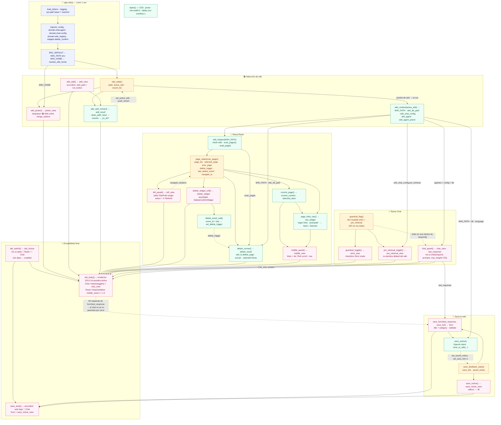

# read_app_tabs.py — diagramas de flujo

Variante **tabs** de la read app (`marimo/read_app_tabs.py`): misma app que
`marimo/read_app.py`, pero las 3 columnas del grid se reorganizan en **dos tabs**:

- **📖 Read** — wiki picker + navegador de páginas + lector (sidebar + reader en un flex row)
- **💬 Chat** — el chat a ancho completo (para que tablas de advisory y respuestas largas respiren)

Es aditiva: `read_app.py` + `layouts/read_app.grid.json` quedan intactos. Si tabs
ganan, esta variante reemplazará a `read_app.py`.

> **Contrato de reactividad (la razón por la que esto es seguro):**
> el selector de tabs usa `mo.ui.radio` (controlado, no `mo.ui.tabs`), así
> `tab_body` renderiza **solo** la pestaña activa. `mo.ui.tabs` construiría ambos
> cuerpos y los reconstruiría en cada re-run, re-parenteando el `mo.ui.chat` e
> invalidando su callback (`Could not find function ... send_prompt`).

Celdas (27) y módulos `domain/` referenciados: `domain.chat.agent`,
`domain.chat.config`, `domain.chat.guardrail`, `domain.chat.preretrieval`,
`domain.chat.postprocess`, `domain.chat.history`, `domain.chat.trace`,
`domain.chat.wiki_tools`, `domain.tools.wiki_fs`, `domain.wiki_registry`,
`domain.finance_argentina.agent_tool`, `widgets.delete_confirm`.

---

## 1. Grafo reactivo de celdas

Quién produce qué y quién se re-ejecuta cuando cambian los `mo.state`.

<!-- __CHUNK2__ -->