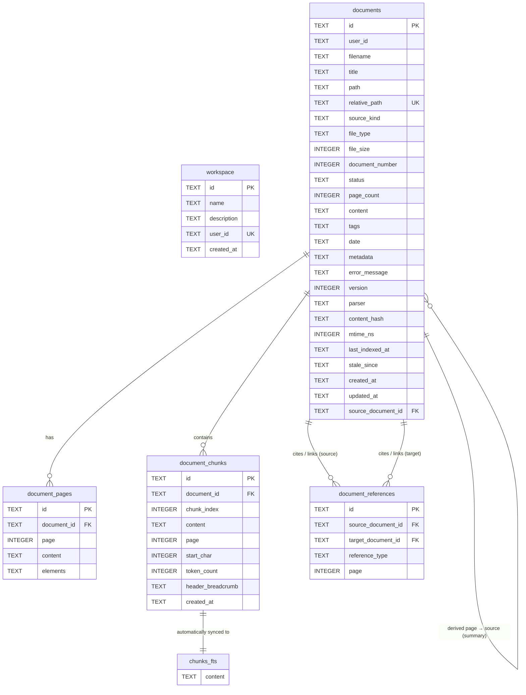

# LLM Wiki SQLite Data Dictionary

This document provides a comprehensive data dictionary for the SQLite schema defined in [sqlite_schema.sql](../database/sqlite_schema.sql).

---

## 1. Architectural Overview & Design Patterns

### Derived State Principle
The LLM Wiki local index is designed around the concept of **derived state**. The database acts as a high-performance local cache and index for workspace files (such as Markdown files, PDFs, and assets).
* **Rebuildable, with caveats:** The database is a derived index, not the system of record — that role belongs to the files in `sources/` and `wiki/`. It can be repopulated by re-running the ingestion pipeline over the files still in `sources/`, but this is **not** a passive filesystem scan: it re-invokes the LLM, so reconstruction is **non-deterministic** — re-ingesting the same source will not reproduce byte-identical wiki pages, IDs, or chunk boundaries. Re-ingestion also **overwrites** the generated wiki markdown, assigns new internal document IDs, and re-derives the citation graph. Data that exists *only* in the database — extracted page text (`document_pages`), chunks (`document_chunks`), and the summary→source link (`source_document_id`, which is never written to disk) — is recoverable solely by re-extracting the original source files. Consequences: wiki pages whose source file has been removed from `sources/`, and any manual edits to generated pages, **cannot** be reconstructed. There is currently no non-LLM "reindex from disk" routine that rebuilds the index purely from existing workspace files — one is designed but unbuilt — see [`ROADMAP.md`](../ROADMAP.md).
* **Sync-Centric Design:** Every table includes mechanisms (e.g. `content_hash`, `mtime_ns`, `stale_since`) to detect skew between physical disk files and database records.

### Database Performance Tuning
The database uses two performance-critical SQLite configurations:
1. **Write-Ahead Logging (`PRAGMA journal_mode=WAL;`):** Enables concurrent reading and writing. Multiple reader processes (e.g., Marimo notebook frontend cells, search queries) can read the database while a backend process is indexing new files.
2. **Foreign Key Enforcement (`PRAGMA foreign_keys=ON;`):** Ensures relational integrity. Cascade deletes (`ON DELETE CASCADE`) are heavily utilized to prevent "orphan" pages, chunks, and citations when a document is deleted.

### Schema Source
The runtime schema is exactly [sqlite_schema.sql](../database/sqlite_schema.sql), applied
verbatim by `open_db()` (`base/domain/tools/db.py`) on first connection — every statement is
`CREATE … IF NOT EXISTS`, so re-opening an existing database is a no-op. There is **no
migration layer**: this is a greenfield project with no deployed databases to upgrade, so the
final schema lives in the DDL from the start. (A self-reference column, `documents.source_document_id`,
was briefly added at runtime during development; it has since been folded into the base DDL and
the runtime `ALTER` removed.) If a post-release schema change ever becomes necessary, the
right tool is a `PRAGMA user_version`-gated migration step, added then — not before.

---

## 2. Entity-Relationship (ER) Diagram



---

## 3. Table Dictionary & Schema Details

### 3.1. `workspace`
Tracks the global state, configuration, and owner details for the active workspace project.

| Column | Data Type | Key / Constraints | Default Value | Description |
| :--- | :--- | :--- | :--- | :--- |
| `id` | `TEXT` | `PRIMARY KEY` | None | Unique identifier (typically a UUID string) representing this workspace instance. |
| `name` | `TEXT` | `NOT NULL` | None | A human-friendly title of the workspace (e.g., `"My Financial Research"`). |
| `description` | `TEXT` | None | `''` | Optional long-form description outlining the workspace's purpose. |
| `user_id` | `TEXT` | `NOT NULL`, `UNIQUE` | None | The owner's user identifier. The `UNIQUE` constraint guarantees that a user can have at most one active workspace mapping in this database. |
| `created_at` | `TEXT` | None | `(datetime('now'))` | UTC timestamp (`YYYY-MM-DD HH:MM:SS`, from `datetime('now')`) of when this workspace database record was initialized. |

---

### 3.2. `documents`
Stores key metadata, raw text content, and extraction/indexing status of files inside the wiki (e.g., Markdown files, PDFs, source articles).

| Column | Data Type | Key / Constraints | Default Value | Description |
| :--- | :--- | :--- | :--- | :--- |
| `id` | `TEXT` | `PRIMARY KEY` | `(lower(hex(randomblob(16))))` | A custom 32-character hexadecimal UUID string generated natively by SQLite. |
| `user_id` | `TEXT` | `NOT NULL` | None | The identifier of the user who owns or imported the document. |
| `filename` | `TEXT` | `NOT NULL` | None | The literal name of the file (e.g., `federal-reserve.md`). |
| `title` | `TEXT` | None | None | A clean, human-readable title. For a wiki page it is what `create_page` was given — the concept name, or a title derived from the filename — and the same value is written into the page's front-matter, so the row and the file agree by construction. For a source it comes from the file metadata. |
| `path` | `TEXT` | `NOT NULL` | `'/'` | Folder path inside the workspace directory (e.g., `/wiki/concepts`). |
| `relative_path` | `TEXT` | `NOT NULL`, `UNIQUE` | None | The unique relative path from the workspace root. Acts as the primary logical key to find the physical file on disk. |
| `source_kind` | `TEXT` | `NOT NULL`, `CHECK(source_kind IN ('wiki', 'source', 'asset'))` | None | Categorizes the file's function: <br>• `'wiki'`: Generated markdown pages under `wiki/` (summaries/, concepts/).<br>• `'source'`: Read-only source references (like PDFs).<br>• `'asset'`: Accompanying attachments or media files. |
| `file_type` | `TEXT` | `NOT NULL` | None | File extension or MIME category (e.g. `md`, `pdf`, `txt`). |
| `file_size` | `INTEGER` | None | `0` | Physical file size on disk in bytes. |
| `document_number`| `INTEGER` | None | None | Internal sequential number assigned during import or processing passes. |
| `status` | `TEXT` | `CHECK(status IN ('pending', 'processing', 'ready', 'failed'))` | `'pending'` | The parsing lifecycle status of the document:<br>• `'pending'`: Discovered but not yet parsed.<br>• `'processing'`: Text parsing/chunking in progress.<br>• `'ready'`: Fully extracted, chunked, and searchable.<br>• `'failed'`: Encountered processing errors. |
| `page_count` | `INTEGER` | None | None | Total count of extracted pages (meaningful for PDFs; typically `1` for Markdown). |
| `content` | `TEXT` | None | None | Full concatenated plain text content of the document. |
| `tags` | `TEXT` | None | `'[]'` | JSON array string storing tag associations (e.g., `'["finance", "policy"]'`). JSON by convention only — the schema does **not** enforce a `CHECK`/`json_valid` constraint. |
| `date` | `TEXT` | None | None | Arbitrary date metadata associated with the file (e.g., publication date). |
| `metadata` | `TEXT` | None | None | Unstructured JSON metadata containing author, publisher, or parsing-specific payloads. JSON by convention only — no `CHECK`/`json_valid` constraint in the schema. |
| `error_message` | `TEXT` | None | None | Stack trace or failure description if the document `status` is `'failed'`. |
| `version` | `INTEGER` | None | `0` | Incremental revision number used to track updates and invalidate cache layers. |
| `parser` | `TEXT` | None | None | Name of the parsing engine that processed the file. Actual values: `"opendataloader"` (PDF) or `"libreoffice+opendataloader"` (DOCX, converted to PDF first). `NULL` for generated wiki pages (`create_page` does not set it). |
| `content_hash` | `TEXT` | None | None | SHA-256 hash of the source file content (`detector.py` uses `hashlib.sha256`), used to detect modification. |
| `mtime_ns` | `INTEGER` | None | None | The source file's last modified timestamp on disk (in nanoseconds) used for incremental updates. |
| `last_indexed_at`| `TEXT` | None | None | UTC timestamp of when this document was successfully written into the database index. |
| `stale_since` | `TEXT` | None | None | Timestamp marking the moment this record was marked as out-of-sync or needing re-ingestion. |
| `created_at` | `TEXT` | None | `(datetime('now'))` | Timestamp of database record insertion. |
| `updated_at` | `TEXT` | None | `(datetime('now'))` | Timestamp of the last update to this database row. |
| `source_document_id` | `TEXT` | `FOREIGN KEY REFERENCES documents(id) ON DELETE SET NULL` | None | Self-reference linking a *derived* wiki page back to the `'source'` document it was generated from — e.g. each `/wiki/summaries/` page points to its origin PDF. Backs the citation graph. `ON DELETE SET NULL` orphans (rather than destroys) the derived page if the source is deleted. Indexed by `idx_documents_source_doc`. |

---

### 3.3. `document_pages`
Stores the raw extracted text of multi-page files (e.g., PDFs) segregated page-by-page.

| Column | Data Type | Key / Constraints | Default Value | Description |
| :--- | :--- | :--- | :--- | :--- |
| `id` | `TEXT` | `PRIMARY KEY` | `(lower(hex(randomblob(16))))` | A custom 32-character hexadecimal UUID string. |
| `document_id` | `TEXT` | `NOT NULL`, `FOREIGN KEY REFERENCES documents(id) ON DELETE CASCADE` | None | Links to the parent document. If the document is deleted, all pages are cascadingly deleted. |
| `page` | `INTEGER` | `NOT NULL`, `UNIQUE(document_id, page)` | None | The 1-indexed page number of the document. |
| `content` | `TEXT` | `NOT NULL` | None | Raw extracted plain text specific to this page. |
| `elements` | `TEXT` | None | None | Rich structural components (e.g., layout coordinates, tables, images, bounding boxes) stored as a JSON payload. Plain `TEXT` — no JSON constraint in the schema. |

---

### 3.4. `document_chunks`
Stores smaller, semantic fragments (chunks) of documents. They back the **FTS5 keyword search** (`chunks_fts`) and are fed to the chat agent as retrieval context. (There is no vector/embedding search — retrieval is lexical BM25 only.)

| Column | Data Type | Key / Constraints | Default Value | Description |
| :--- | :--- | :--- | :--- | :--- |
| `id` | `TEXT` | `PRIMARY KEY` | `(lower(hex(randomblob(16))))` | A custom 32-character hexadecimal UUID string. |
| `document_id` | `TEXT` | `NOT NULL`, `FOREIGN KEY REFERENCES documents(id) ON DELETE CASCADE` | None | Links to the parent document. Cascade deleted if the document is deleted. |
| `chunk_index` | `INTEGER` | `NOT NULL`, `UNIQUE(document_id, chunk_index)` | None | The order index of this chunk within the parent document (starts at `0`). |
| `content` | `TEXT` | `NOT NULL` | None | The textual payload of the chunk. |
| `page` | `INTEGER` | None | None | The page number from which this chunk originated (optional). |
| `start_char` | `INTEGER` | None | None | Character offset from the beginning of the original document where this chunk starts. |
| `token_count` | `INTEGER` | `NOT NULL` | None | Number of words or LLM tokens contained inside this chunk. |
| `header_breadcrumb` | `TEXT` | None | None | Structural navigation context (e.g. `"Section 1 > Subsection A > Introduction"`). |
| `created_at` | `TEXT` | None | `(datetime('now'))` | UTC timestamp of chunk record creation. |

---

### 3.5. `document_references`
Represents the directed graph of linkages and citations between workspace documents.

| Column | Data Type | Key / Constraints | Default Value | Description |
| :--- | :--- | :--- | :--- | :--- |
| `id` | `TEXT` | `PRIMARY KEY` | `(lower(hex(randomblob(16))))` | A custom 32-character hexadecimal UUID string. |
| `source_document_id`| `TEXT` | `NOT NULL`, `FOREIGN KEY REFERENCES documents(id) ON DELETE CASCADE` | None | The document containing the link/citation (the outgoing edge). |
| `target_document_id`| `TEXT` | `NOT NULL`, `FOREIGN KEY REFERENCES documents(id) ON DELETE CASCADE` | None | The document being referenced/cited (the incoming edge). |
| `reference_type` | `TEXT` | `NOT NULL`, `CHECK(reference_type IN ('cites', 'links_to'))`, `UNIQUE(source_document_id, target_document_id, reference_type)` | None | The nature of the citation:<br>• `'cites'`: Standard academic citation or structured source reference.<br>• `'links_to'`: A physical hyperlink inside a Markdown file. |
| `page` | `INTEGER` | None | None | Optional page number in the source document where the citation or hyperlink is located. |

---

## 4. Derived & Virtual Tables (FTS5)

### 4.1. `chunks_fts` (FTS5 Virtual Table)
`chunks_fts` is an **FTS5 Virtual Table**. Unlike regular SQLite tables, a virtual table is managed by an extension module (FTS5 in this case) and is used to provide ultra-fast, Google-like text search over chunk contents.

```sql
CREATE VIRTUAL TABLE IF NOT EXISTS chunks_fts USING fts5(
    content,
    content='document_chunks',
    content_rowid='rowid',
    tokenize='porter unicode61'
);
```

#### Key Virtual Options:
1. **External Content (`content='document_chunks'`):** FTS5 does not duplicate the text data in its own physical storage. Instead, it references the `'content'` column in the standard `document_chunks` table, saving significant database space.
2. **Row Mapping (`content_rowid='rowid'`):** Maps the FTS virtual row IDs directly to the standard auto-incrementing SQLite `rowid` of the `document_chunks` table.
3. **Dual Tokenizer (`tokenize='porter unicode61'`):**
   * **`unicode61`:** Standard multilingual tokenizer that strips punctuation and normalizes accents (e.g. searching `"cliché"` matches `"cliche"`).
   * **`porter`:** Applies the **Porter Stemming Algorithm**, converting words to their common base form. For instance, a search for `"investing"` will seamlessly match occurrences of `"invest"`, `"invests"`, and `"invested"`.

> **Multilingual wikis:** the tokenizer is unchanged for non-English wikis in v1.
> `unicode61` folds diacritics, so accent-insensitive search already works for
> Spanish (`política` matches `politica`), and the English `porter` stemmer is
> largely inert on Spanish text. Because each wiki owns its own `index.db`, a
> per-wiki tokenizer (e.g. `unicode61 remove_diacritics 2`, dropping `porter`)
> chosen at schema-creation time is a possible future refinement — see
> `docs/design_multilingual_content.md` §8.

---

## 5. Active Database Triggers

Because `chunks_fts` uses an external content configuration, SQLite does not automatically keep the FTS index in sync when rows in `document_chunks` are added, updated, or deleted. The schema implements three auto-synchronization database triggers to enforce this instantly:

### 5.1. `chunks_fts_insert`
Fires automatically whenever a new semantic chunk is inserted into `document_chunks`.
```sql
CREATE TRIGGER IF NOT EXISTS chunks_fts_insert AFTER INSERT ON document_chunks BEGIN
    INSERT INTO chunks_fts(rowid, content) VALUES (new.rowid, new.content);
END;
```

### 5.2. `chunks_fts_delete`
Fires automatically when a chunk is deleted (including cascade deletes triggered by deleting a parent document).
```sql
CREATE TRIGGER IF NOT EXISTS chunks_fts_delete AFTER DELETE ON document_chunks BEGIN
    INSERT INTO chunks_fts(chunks_fts, rowid, content) VALUES('delete', old.rowid, old.content);
END;
```

### 5.3. `chunks_fts_update`
Fires automatically when the text content of a chunk is modified. It handles this in two distinct steps within the transaction:
1. Deletes the old index token mapping.
2. Inserts the newly updated content token mapping.
```sql
CREATE TRIGGER IF NOT EXISTS chunks_fts_update AFTER UPDATE ON document_chunks BEGIN
    INSERT INTO chunks_fts(chunks_fts, rowid, content) VALUES('delete', old.rowid, old.content);
    INSERT INTO chunks_fts(rowid, content) VALUES (new.rowid, new.content);
END;
```

---

## 6. Speed & Query Optimization Indexes

Speed indexes allow the SQLite engine to locate records in $O(\log N)$ logarithmic time rather than resorting to expensive $O(N)$ full table scans.

| Index Name | Target Table | Columns Indexed | Optimization Target |
| :--- | :--- | :--- | :--- |
| `idx_documents_relative_path` | `documents` | `relative_path` | Crucial for checking file presence and performing single-file metadata lookups during ingestion runs. |
| `idx_documents_path` | `documents` | `path` | Optimizes workspace folder traversal (e.g., listing all documents in `/wiki`). |
| `idx_documents_source_kind` | `documents` | `source_kind` | Speeds up filtering queries (e.g., fetching only user-authored wiki pages). |
| `idx_documents_status` | `documents` | `status` | Speeds up ingestion worker queues (e.g., locating all `pending` or `failed` documents to process). |
| `idx_chunks_doc` | `document_chunks` | `document_id` | Optimizes joining documents with their constituent chunks and mass deletions. |
| `idx_refs_source` | `document_references`| `source_document_id`| Optimizes graph traversal for finding outbound links (what documents does *this* document cite?). |
| `idx_refs_target` | `document_references`| `target_document_id`| Optimizes graph traversal for finding inbound links/backlinks (what documents cite *this* document?). |
| `idx_documents_source_doc` | `documents` | `source_document_id` | Optimizes backlinks from derived wiki pages to their origin document (e.g. summary → source). |
